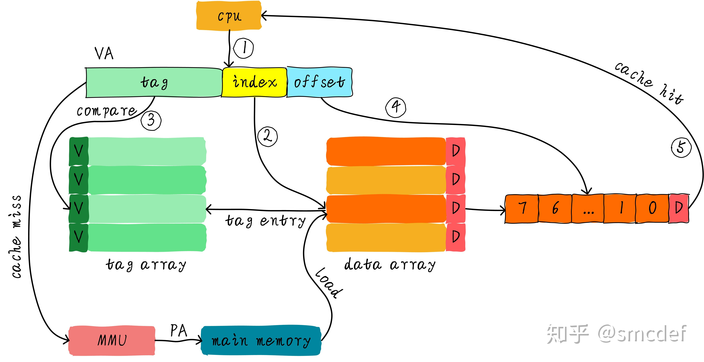
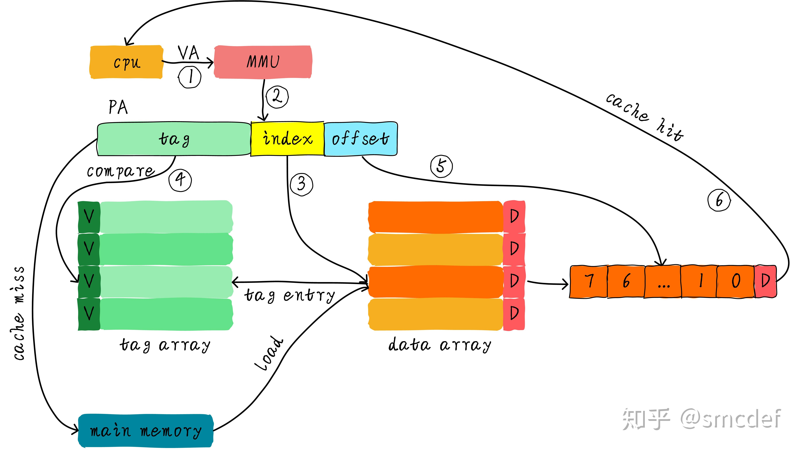

计算跟内存二者不成比例的增长曲线，被迫引入了多级cache的概念。这里不做过多描述，这个小短文简要介绍一下Cache是如何管理的。

> 关于虚拟地址VA到PA的转换后续载介绍。这里姑且假设已经了解其中的原理了。

cache的组织主要的就是怎么根据地址去查找，并做到准确性与功耗的平衡。这里主要涉及cache index、cache tag。

按实际地址转换的步骤来看，一定包含了VA->PA 的转换过程，按照经过MMU的不同，实际来看大概有这么几种方式

# VIVT 
VIVT是设计上最简单的，全部按照虚拟地址做index和Tag。好处是不需要经过MMU、计算速度快、功耗低，但是缺点也很明显，有歧义和别名的问题。

## 歧义
> 歧义是指不同的数据在cache中具有相同的tag和index。

由于内存分页、虚拟地址的存在，不同进程都是运行在自己的进程空间，不同进程的地址（VA）是相同的。那么切换进程的时候很可能虽然发生了命中，但是命中的确是错误的数据。也就是VA相同，PA不同。

## 别名
> 当不同的虚拟地址映射相同的物理地址，而这些虚拟地址的index不同，此时就发生了别名现象(多个虚拟地址被称为别名)。

同样是多进程的场景，但是存在进程通讯需要读写同一块物理地址，由于进程不同，同一个PA在不同进程里面映射的VA大概率是不同的，那么发生进程切换的情况，需要命中却没命中的场景。

# PIPT

既然VIVT不唯一有那么多问题，我全部用PA不久解决了。这就是PIPT的思路了。cache查找前对VA做MMU查找得到PA，再去命中。准确率确实提高了，但是只要cache查找就要走一遍MMU，功耗、时延没有优势了。

# VIPT

VIVT毛病多，PIPT不满意。折中一下的方案来了这就是VIPT。
我们可以使用虚拟地址对应的index位查找cache，与此同时(硬件上同时进行)将虚拟地址发到MMU转换成物理地址。当MMU转换完成，同时cache控制器也查找完成，此时比较cacheline对应的tag和物理地址tag域，以此判断是否命中cache。

## 歧义

在这里重点介绍下为什么VIPT Cache不存在歧义。假设以32位CPU为例，页表映射最小单位是4KB。我们假设虚拟地址<12:4>位(这是一个有别名问题的VIPT Cache)作为index，于此同时将虚拟地址<31:12>发送到MMU转换得到物理地址的<31:12>，这里我们把<31:12>作为tag，并不是<31:13>。这地方很关键，也就是说VIPT的tag取决于物理页大小的剩余位数，而不是去掉index和offset的剩余位数。物理tag是惟一的，所以不存在歧义。

## 别名

我们知道VIPT的优点是查找cache和MMU转换虚拟地址同时进行，所以性能上有所提升。歧义问题虽然不存在了，但是别名问题依旧可能存在，那么什么情况下别名问题不会存在呢？Linux系统中映射最小的单位是页，一页大小是4KB。那么意味着虚拟地址和其映射的物理地址的位<11...0>是一样的。针对直接映射高速缓存，如果cache的size小于等于4KB，是否就意味着无论使用虚拟地址还是物理地址的低位查找cache结果都是一样呢？是的，因为虚拟地址和物理地址对应的index是一样的。这种情况，VIPT实际上相当于PIPT，软件维护上和PIPT一样。如果示例是一个四路组相连高速缓存呢？只要满足一路的cache的大小小于等于4KB，那么也不会出现别名问题。

假设系统使用的是直接映射高速缓存，cache大小是8KB，cacheline大小是256字节。这种情况下的VIPT就存在别名问题。因为index来自虚拟地址位<12...8>，虚拟地址和物理地址的位<11...8>是一样的，但是bit12却不一定相等。 假设虚拟地址0x0000和虚拟地址0x1000都映射相同的物理地址0x4000。那么程序读取0x0000时，系统将会从物理地址0x4000的数据加载到第0x00行cacheline。然后程序读取0x1000数据，再次把物理地址0x4000的数据加载到第0x10行cacheline。这不，别名出现了。相同物理地址的数据被加载到不同cacheline中。

我们接着上面的例子说明。首先出现问题的场景是共享映射，也就是多个虚拟地址映射同一个物理地址才可能出现问题。我们需要想办法避免相同的物理地址数据加载到不同的cacheline中。如何做到呢？那我们就避免上个例子中0x1000映射0x4000的情况发生。我们可以将虚拟地址0x2000映射到物理地址0x4000，而不是用虚拟地址0x1000。0x2000对应第0x00行cacheline，这样就避免了别名现象出现。因此，在建立共享映射的时候，返回的虚拟地址都是按照cache大小对齐的地址，这样就没问题了。如果是多路组相连高速缓存的话，返回的虚拟地址必须是满足一路cache大小对齐。在Linux的实现中，就是通过这种方法解决别名问题。

# PIVT

按照排列组合来说，应该还存在一种PIVT方式的高速缓存。因为PIVT没有任何优点，却包含以上的所有缺点。你想想，PIVT方式首先要通过MMU转换成物理地址，然后才能根据物理地址index域查找cache。这在速度上没有任何优势，而且还存在歧义和别名问题。请忘记它吧。不，应该不算是忘记，因为它从来就没出现过。