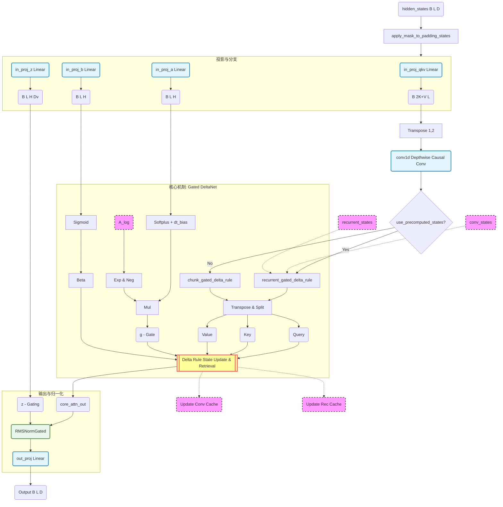

## 概述

Qwen3.5 在线性注意力层中采用了 **Gated DeltaNet** 机制，替代传统的 Softmax Attention。该架构实现了推理时 O(1) 的复杂度，同时通过 Delta Rule 保持长期记忆的精确度。

## 架构全景



## 逐层解析

### 1. 输入与投影

`hidden_states` 进入网络后，通过 **4 个并行线性层** 被映射到不同空间：

| 投影层 | 输出 | 用途 |
|--------|------|------|
| `in_proj_qkv` | QKV 混合体 (B, 2K+V, L) | 注意力核心计算 |
| `in_proj_z` | z (B, L, H, Dv) | 输出门控信号 |
| `in_proj_b` | b → β (B, L, H) | 写入强度控制 |
| `in_proj_a` | a → g (B, L, H) | 遗忘门控 |

这种多分支投影设计让模型能独立控制信息的读写与遗忘。

### 2. 因果卷积 (Causal Conv1d)

QKV 混合体在进入注意力计算前，先经过 **Depthwise Causal Conv1d**。这一层帮助模型捕捉局部上下文信息，增强对相邻 token 的感知能力。

### 3. 缓存与推理/训练分支

这是关键的逻辑分支点。根据 `use_precomputed_states` 判断：

- **推理路径** (`recurrent_gated_delta_rule`)：使用前一时刻的缓存状态（`conv_states` + `recurrent_states`）进行增量更新，实现 **O(1) 推理复杂度**。
- **训练路径** (`chunk_gated_delta_rule`)：并行处理整个序列，适合训练和预填充阶段。

### 4. 核心机制：Gated DeltaNet

这是整个架构的核心。关键参数的生成路径：

- **β (Beta)**：`b → Sigmoid → β`，控制写入强度
- **g (Gate)**：`a → Softplus + dt_bias` 与 `A_log → Exp & Neg` 相乘，控制遗忘门
- **A_log**：可学习的衰减矩阵，存储在模型参数中

**Delta Rule** 是这里的核心创新。与传统线性注意力简单累加 Key-Value 不同，Delta Rule 根据**当前的 Key** 对历史状态进行"修正"更新——类似于残差学习，但应用于状态矩阵。

### 5. 输出门控与 RMSNorm

核心注意力的输出不会直接传递，而是与 z 信号一起进入 **RMSNormGated**：

```
output = out_proj(RMSNormGated(core_attn_out, z))
```

这个设计类似 SwiGLU 机制，通过 z 门控融合实现了更精细的信息流控制。

## 设计哲学

| 设计选择 | 解决的问题 |
|---------|-----------|
| Delta Rule 替代简单累加 | 长期记忆精确度下降 |
| 因果卷积前置 | 局部上下文感知不足 |
| 推理/训练双路径 | 推理效率 O(1) vs 训练并行度 |
| 门控 RMSNorm | 信息流精细控制 |
| 可学习衰减矩阵 A_log | 自适应遗忘速率 |

整个架构的核心思想是：**用卷积增强局部性，用 Delta Rule 增强长期记忆的精确度，通过门控机制控制信息流，同时实现推理时 O(1) 的复杂度**。

这是线性注意力架构在工业级大模型中的又一次成功实践。
