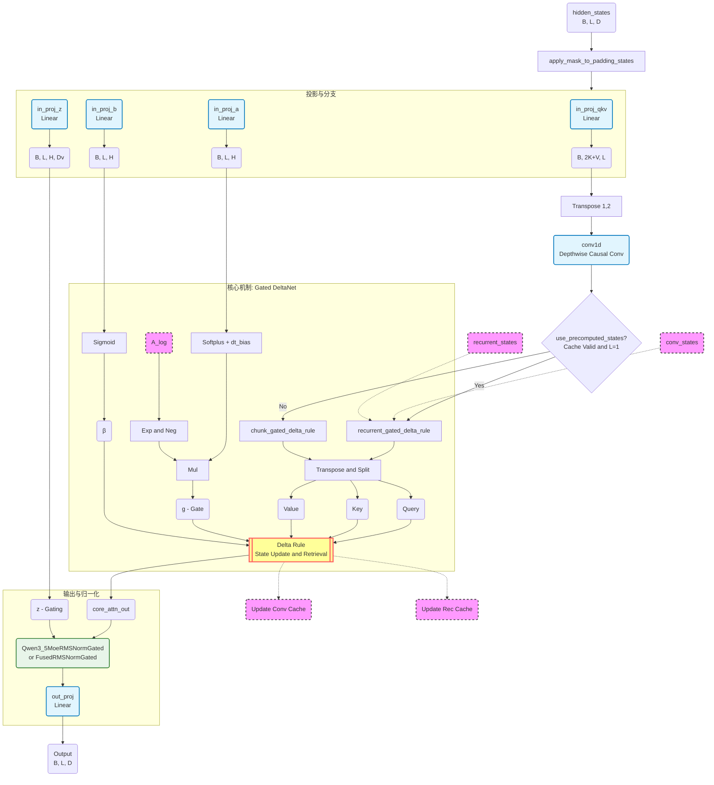

## Gated DeltaNet 架构流程图

## 架构解析

### 输入与投影

hidden_states 进入网络，首先通过 4 个并行的线性层（Projection）被映射到不同的空间：生成原始的 QKV 混合体、用于最后门控的 z、以及控制状态更新的 a 和 b。

### 卷积层

在计算注意力之前，QKV 混合体先经过一个因果卷积层（Causal Conv1d）。这有助于模型捕捉局部上下文信息。

### 缓存与状态切换

这是一个关键的逻辑分支。根据是否使用缓存（推理阶段，序列长度为 1），模型会选择：

- **recurrent_gated_delta_rule（推理路径）**：使用前一时刻的缓存状态进行增量更新
- **chunk_gated_delta_rule（训练路径）**：并行处理整个序列

### 核心机制：Gated DeltaNet

这是代码最核心的部分。它将生成的 Q、K、V 与通过 a 和 b 计算出的门控信号 g（Gate，用于遗忘）和 β（Beta，用于写入强度）结合。

"Delta Rule" 逻辑在这个模块中实现——它不像普通线性注意力那样简单地累加 Key-Value，而是根据当前的 Key 对历史状态进行"修正"更新。

### 输出与门控 RMSNorm

核心注意力的输出 core_attn_out 不会直接输出，而是与最开始分支出的 z 信号一起进入一个特殊的 RMSNorm（Qwen3_5MoeRMSNormGated）。这个 Norm 层不仅做归一化，还使用 z 对结果进行门控融合（类似 SwiGLU 机制），最后通过 out_proj 映射回原始维度。

### 总结

这个架构充分体现了 Qwen3.5 线性注意力层的设计思想：利用卷积增强局部性，利用 Delta Rule 增强长期记忆的精确度，通过门控机制控制信息流，并实现推理时 O(1) 的复杂度。
