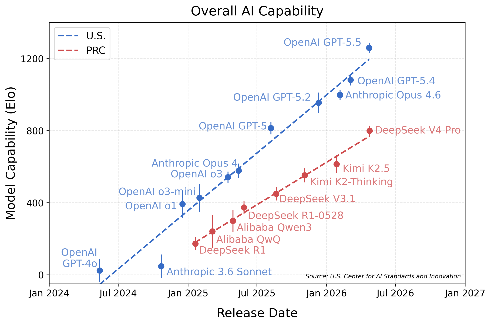
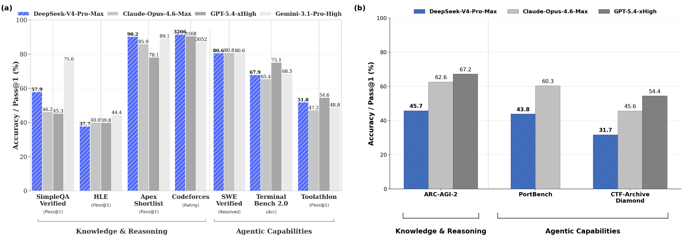
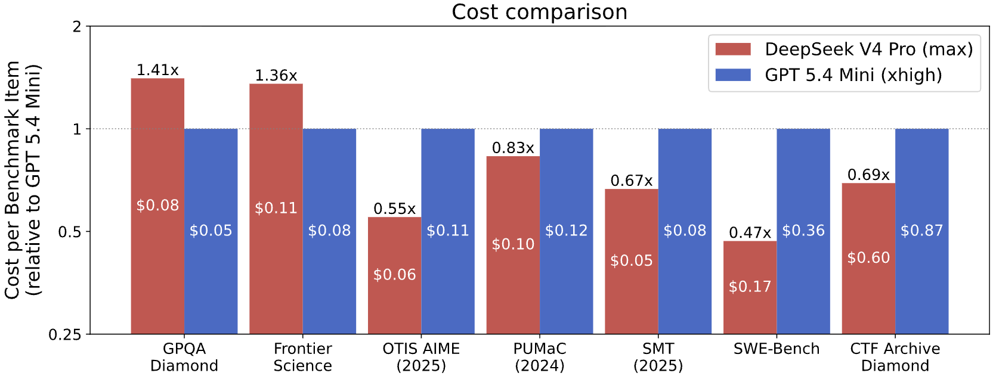

2026年4月，人工智能标准与创新中心（CAISI）对开源权重 AI 模型 DeepSeek V4 Pro（"DeepSeek V4"）进行了评估。CAISI 评估结果表明，DeepSeek V4 的能力落后于前沿水平约 **8个月**（图1）。

> 图1：基于覆盖五个领域的基准测试套件，对美国和中国的最强公开模型进行的能力综合对比。y轴每增加200点，解决给定任务的概率提升3倍。模型能力采用类项目反应理论（IRT）方法拟合，详见附录。使用了16个基准测试和35个模型生成本图。趋势线通过对前沿模型进行最小二乘法回归拟合。误差条表示95%置信区间。

## 核心发现

- **DeepSeek V4 是 CAISI 迄今评估的最强中国 AI 模型**。CAISI 评估涵盖网络空间安全、软件开发、自然科学、抽象推理和数学五个领域（图2）。
- DeepSeek V4 在 DeepSeek 自评中的表现**优于**在 CAISI 评估中的表现。据 DeepSeek 数据显示，DeepSeek V4 的能力与约2个月前发布的 Opus 4.6 和 GPT-5.4 相当。然而，CAISI 的评估（包括非公开基准测试）表明，DeepSeek V4 的表现类似于约8个月前发布的 GPT-5（图3）。
- **DeepSeek V4 比其他同类能力的模型更具成本效益**。与最具成本竞争力的美国参考模型（GPT-5.4 mini）相比，DeepSeek V4 在7项基准测试中的5项上更具成本效益。在7项基准测试中，DeepSeek V4 的成本从比 GPT-5.4 mini 便宜53%到贵41%不等。

## 能力评估结果

- DeepSeek V4 的能力落后于美国领先模型约8个月（图1）。方法论详见附录。
- DeepSeek V4 是 CAISI 评估的五个领域中迄今为止最强的中国模型：网络空间安全、软件开发、自然科学、抽象推理和数学。CAISI 在这五个领域的九个基准测试上评估了模型，其中包含两个留出且未被污染的基准测试：ARC-AGI-2 的半私密数据集，以及 CAISI 内部构建的软件工程评估 PortBench。

### 各基准测试详细结果

| 领域 | 基准测试 | GPT-5.5 (xhigh) | GPT-5.4 mini (xhigh) | Opus 4.6 (max) | DeepSeek V4 Pro (max) |
|------|---------|-----------------|---------------------|----------------|----------------------|
| 网络安全 | CTF-Archive-Diamond | 71% | 32% | 46% | 32%*** |
| 软件工程 | SWE-Bench Verified* | 81% | 73% | 79% | 74% |
| 软件工程 | PortBench | 78% | 41% | 60% | 44% |
| 自然科学 | FrontierScience | 79% | 74% | 72% | 74% |
| 自然科学 | GPQA-Diamond | 96% | 87% | 91% | 90% |
| 抽象推理 | ARC-AGI-2 半私密** | 79% | – | 63% | 46% |
| 数学 | OTIS-AIME-2025 | 100% | 90% | 92% | 97% |
| 数学 | PUMaC 2024 | 96% | 93% | 95% | 96% |
| 数学 | SMT 2025 | 99% | 92% | 94% | 96% |
| **IRT 估计 Elo** | | **1260 ± 28** | **749 ± 46** | **999 ± 27** | **800 ± 28** |

> **图2**：各能力基准测试的模型性能汇总（越高越好）。
> 结果显示每个基准测试的准确率（解决的任务百分比）。每个基准测试中表现最好的模型以粗体高亮。IRT 估计的 Elo 不确定性反映95%置信区间。
> 
> *CAISI 在 SWE-Bench Verified 上的得分往往低于其他评估机构，可能是因为系统提示、支架和 token 预算的差异。
> 
> **CAISI 报告的是任务平均分，这不同于 ARC-AGI-2 官方的分数聚合方法。
> 
> ***通过 IRT 从子样本推断。

## DeepSeek 评估 vs CAISI 评估

(a) DeepSeek 自行选择和报告的基准测试，V4 看起来与美国前沿模型相当。(b) CAISI 套件中的基准测试，DeepSeek V4 在其中落后于美国模型。CAISI 预先承诺了其整体基准测试套件，即没有根据结果选择基准测试。

DeepSeek 的技术报告表明，DeepSeek V4 在一系列基准测试上与美国前沿模型具有竞争力（图3a）。然而，CAISI 对这些模型在未出现在 DeepSeek 报告中的基准测试上的评估显示，在某些推理和基于 agent 的评估上表现更差，如 ARC-AGI-2 半私密数据集、留出的软件工程评估 PortBench 和网络安全基准测试 CTF-Archive-Diamond（图3b）。

## DeepSeek V4 比同类能力的其他模型成本更低

为了进行成本比较，CAISI 通过筛选排除了在公开基准测试上表现明显较差或每个 token 成本明显高于 DeepSeek V4 Pro 的美国模型来选择美国参考模型。唯一满足这些条件的模型是 GPT-5.4 mini，因此被选为参考点。在 CAISI 的能力综合分析中，GPT-5.4 mini 获得 Elo 分数为749，类似于 DeepSeek V4 Pro 的800分。

DeepSeek V4 在7项 CAISI 基准测试中的5项上比 GPT-5.4 mini 成本更低。在这些7项基准测试中，DeepSeek V4 的成本从比 GPT-5.4 mini 便宜53%到贵41%不等。有两项 CAISI 基准测试被排除在成本比较之外：PortBench 因为它采用连续评分，CAISI 的成本比较方法尚不支持；以及 ARC-AGI-2 因为 GPT-5.4 mini 评估运行的技术问题。

> 图4：两个模型在两者都正确解决的基准测试任务上的端到端费用。条形越高表示端到端成本越高。数值大于1.0表示 DeepSeek V4 的成本高于 GPT-5.4 mini。条形内的数字表示模型解决基准测试任务/问题所产生的平均费用（平均值在两个模型都正确解决的基准测试任务/问题集上计算）。

### 开发者报告的 Token 价格

| 模型 | 输入 Token 费用（未缓存） | 输入 Token 费用（含缓存） | 输出 Token 费用 |
|------|-------------------------|------------------------|---------------|
| DeepSeek V4 Pro | $1.74 / 1M tokens | $0.0145 / 1M tokens | $3.48 / 1M tokens |
| GPT-5.4 mini | $0.75 / 1M tokens | $0.075 / 1M tokens | $4.50 / 1M tokens |

## 基准测试说明

本次评估使用了以下基准测试：

- **ARC-AGI-2 半私密**：来自 ARC Prize Foundation 的非公开数据集，用于测量抽象推理。"半私密"意味着这些任务可能已暴露给有限的第三方。
- **CTF-Archive-Diamond**：CAISI 开发的基准测试，基于285道来自亚利桑那州立大学开发的 pwn.challenge 网络安全平台的高难度 CTF 挑战题。
- **PortBench**：CAISI 开发的非公开评估，用于评估 AI 模型在给定一种编程语言的参考实现时，将命令行界面（CLI）工具移植到不同编程语言的能力。CAISI 计划未来发布 PortBench 的详细描述。
- **FrontierScience**：OpenAI 开发的基准测试，通过国际科学奥林匹克竞赛问题和具有代表性的 PhD 级别、开放式问题评估专家级科学推理能力，涵盖物理、化学和生物科学研究中的子任务。
- 其他基准测试的描述见 CAISI 早期《DeepSeek AI 模型评估报告》第3节。

## 能力滞后的测量方法

CAISI 使用一种受项目反应理论（IRT）启发的方法来确定每个被评估模型在所有被评估基准测试上的综合能力水平。IRT 最初是为心理测量开发的，例如一群学生完成一系列考试题目，然后利用结果来确定每个学生的相对能力和每道考试题目的难度。CAISI 将类似技术应用于综合能力测量，将 AI 模型视为学生，将单个基准测试任务视为考试题目。

在1PL IRT 模型下：
- 每个 LLM $i$ 有一个潜在能力水平 $\theta_i$
- 每个基准测试问题/任务 $j$ 有一个潜在难度水平 $\delta_j$
- 如果能力为 $\theta_i$ 的 LLM 尝试难度为 $\delta_j$ 的问题，他们成功的概率为 $p_{ij} = \sigma(\theta_i - \delta_j)$

给定模型和基准测试问题/任务得分矩阵，CAISI 拟合了1PL IRT 统计模型，获得了每个模型潜在能力水平 $\theta_i$ 的最佳拟合值，并将其用于生成图1。拟合时，每个领域内的每个基准测试赋予相等权重，五个评估领域也赋予相等权重。CAISI 控制了所有基准测试的加权 token 预算和 agent 支架以确保可比性。CAISI 计划近期发布更深入的方法论报告。

## 模型服务与推理

CAISI 从基于云的 H200 和 B200 GPU 上运行 DeepSeek V4，并使用开发者推荐的上下文长度、max_tokens、temperature、top_p、保留内部推理、系统提示和最大思考时间等设置。为排除推理或配置错误的存在，CAISI 在 GPQA-Diamond 上复现了开发者的自评基准测试结果。

Agent 评估使用 Inspect 内置的 ReAct agent 进行。PortBench 和 CTF-Archive-Diamond 的预算设置为100万加权 token，SWE-Bench Verified 设置为50万加权 token。

---

**原文链接**：[CAISI Evaluation of DeepSeek V4 Pro](https://www.nist.gov/news-events/news/2026/05/caisi-evaluation-deepseek-v4-pro)（NIST）
