# DeepSeek-V4 论文逐页注解巡读

> **作者**: Igor Kotenkov  
> **原文**: [DeepSeek-V4: Annotated Paper Walkthrough](https://dsv4.interactive.ikot.blog/)

本文档包含 50 条注解，涵盖 DeepSeek-V4 论文的核心技术要点。注解类型包括：Scale note、Architecture note、Hardware note、Training note、MoE note、Attention note、Precision note、Memory note、Systems note、Kernel note、Optimizer note、Post-training note、Agent note、Distillation note、Eval note 等。

## 第 1 页

### 🔢 Big model smell

Finally, we have a model comparable in scale to Google's [legendary Switch-C](https://huggingface.co/google/switch-c-2048)! It's been [5 years](https://arxiv.org/abs/2101.03961) since Noam Shazeer &amp; Co. scaled MoEs to an unprecedented size, though that model only had about 1.8B active parameters.

To put things in perspective, Google spent roughly \(3.3 \times 10^{21}\ \text{FLOPs}\) (floating-point operations) on that pretraining run. If we do some back-of-the-envelope math for DeepSeek-V4 Pro, we get:

\[\begin{aligned}
\mathrm{FLOPs}_{\mathrm{V4\ Pro}}
&amp;\approx 6 \times N_{\mathrm{active}} \times D_{\mathrm{tokens}} \\
&amp;\approx 6 \times 49\mathrm{B} \times 33\mathrm{T} \\
&amp;\approx 9.7 \times 10^{24}\ \text{FLOPs} \\
&amp;\approx 1 \times 10^{25}\ \text{FLOPs}
\end{aligned}\]

That's a 3,000x difference in compute!

### 📊 Comparison with DeepSeek-V3.2

...which is already a strong baseline. In fact, it actually pioneered some of the attention tweaks we’re now seeing in DeepSeek-V4, and it was incredibly efficient to boot.

[Below is a comparison](https://arxiv.org/pdf/2512.02556) of the inference costs between V3.1 and V3.2 across various context lengths. (Quick refresher: prefilling is when the model computes the KV cache for the prompt, while decoding is the actual one-by-one token generation.)

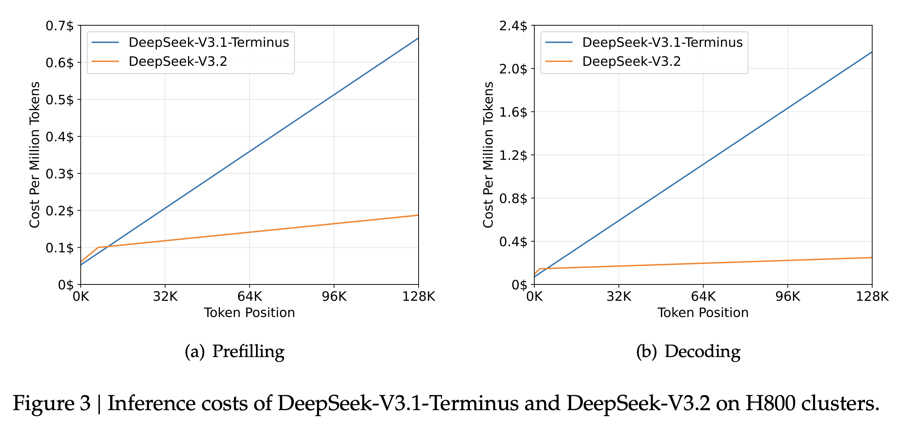 alt="Inference costs comparison">

## 第 4 页

### 🏗️ What counts as modeling capability

This might sound a bit abstract, so let's clarify. "Modeling capability" generally refers to a model's ability to represent complex functions and capture intricate patterns. You can also think of it as topological expressivity—how flexibly the model can route, store, and combine information across different layers.

As numerous mechanistic interpretability papers have shown ([1](https://transformer-circuits.pub/), [2](https://arxiv.org/abs/2312.12141v1)), information in a Transformer flows sequentially through a single residual stream. This is the main highway that layers read from and write to. Every single layer (Attention, MLP, MoE) has to read from this stream, process the data, and write it back.

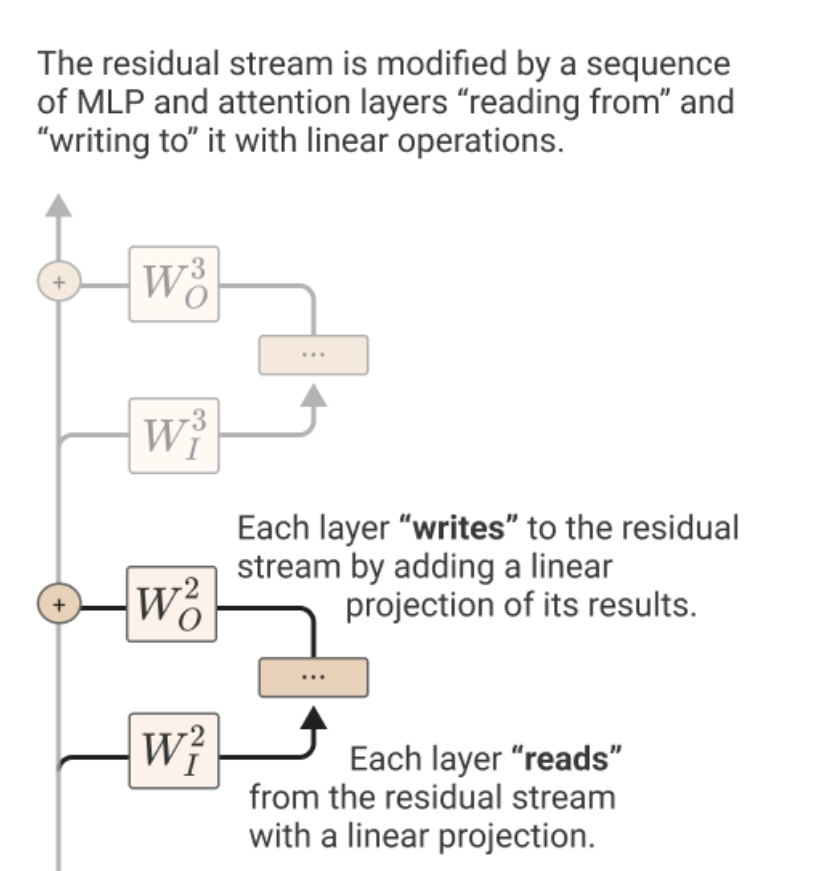 alt="Transformer residual stream illustration">
From [Anthropic’s blogpost](https://transformer-circuits.pub/2021/framework/index.html).

(This follows directly from how residual connections work: `x' = x + layer(x)`, omitting normalizations for clarity. We just chain multiple additions to an ever-changing `x'`).

The surefire way to boost modeling capability and expressivity is to widen this "highway" by increasing the hidden or embedding dimension. Intuitively, you're just creating more slots to carry information between layers. But there's a catch: the computational cost (FLOPs) of Attention/FFN/MoE layers scales quadratically with the hidden dimension. Widening the stream makes the model drastically slower and much heavier to compute.

This is exactly where HyperConnections (HC) and its upgraded version, mHC, come in. They allow us to massively increase the residual stream's bandwidth without a huge compute overhead. They effectively introduce a "virtual" width to keep representations distinct and rich. By expanding the residual stream by a factor of \(n\) (say, 4x wider), it can carry four times as much information forward without overwriting the previous data.

## 第 5 页

### ⚡ How FP4-FP8 can be more efficient

So why is it 1/3 more efficient? Tensor core computations are bottlenecked by physical resources. Specifically, it's about how many operand bits can be staged, decoded, and fed into the compute pipeline per cycle.

When the size of matrix elements shrinks, we can push more elements through the datapath in the same amount of time. But there's a catch: the compute blocks themselves must natively support this format.

Here are Nvidia's official specs. You can clearly see how cutting the operand size in half doubles the potential compute:

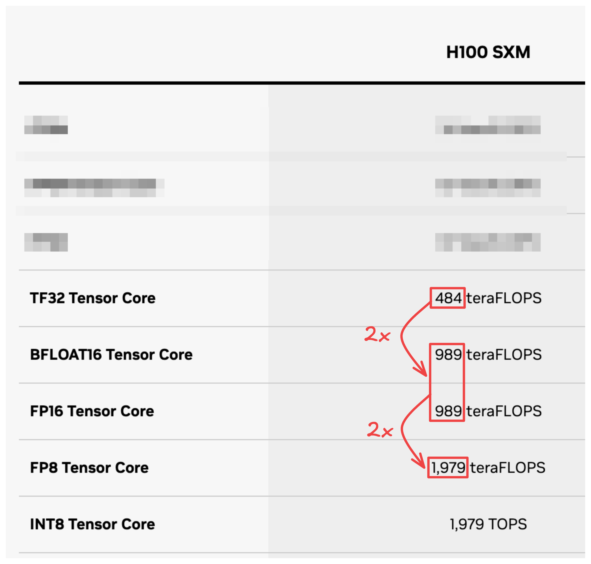 alt="Nvidia compute specs">

Under the hood, this speedup happens because GPU instructions can process larger matrices in a single pass, taking a fixed number of clock cycles.

Check out this screenshot from a [paper](https://www.scribd.com/document/768738241/Benchmarking-and-Dissecting-the-Nvidia-Hopper-GPU-Architecture) benchmarking different instructions on the H800:

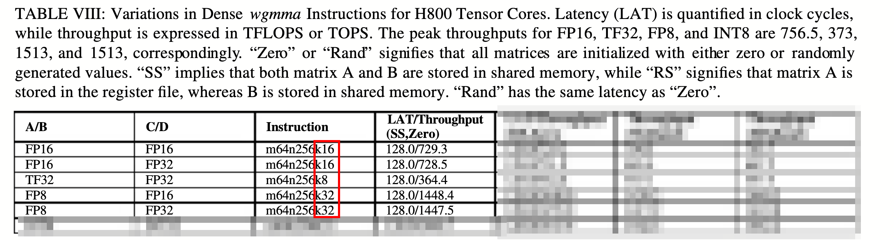 alt="H800 instructions benchmark">

Notice how the instruction names include the matrix chunk sizes `m-n-k`. For instance, `m64n256k16` (the first row for 16-bit formats) means multiplying a `64x16` matrix by a `16x256` matrix.

Now look at the 8-bit FP8 format in the fourth row. It uses `m64n256k32`, which means multiplying `64x32` by `32x256`. That's the maximum possible size for this GPU type; larger matrices just get split into chunks.

The inner dimension K has doubled, but the instruction still takes exactly 128 clock cycles to execute. So, by dropping down to 8 bits, the GPU manages to multiply twice as many elements in the same number of cycles.

This brings us to an interesting conclusion. If a GPU natively supports FP4 x FP8, it can process more elements per instruction than FP8 x FP8. This gives us a theoretical speedup of \((8+8)/(4+8) = 16/12 = 1.33\times\).

But without this hardware support, developers are stuck calling instructions that perform exactly like standard FP8 x FP8.

The current generation of Blackwell GPUs doesn't actually support this FP4 x FP8 efficiency boost. Sure, they allow multiplying any combination of `{f4,f6,f8} × {f4,f6,f8}`, but the throughput stays exactly the same. Doing `f4 x f8` is exactly as fast as `f8 x f8`. Yes, it's twice as fast as Hopper (see the blue box below), but that's it:

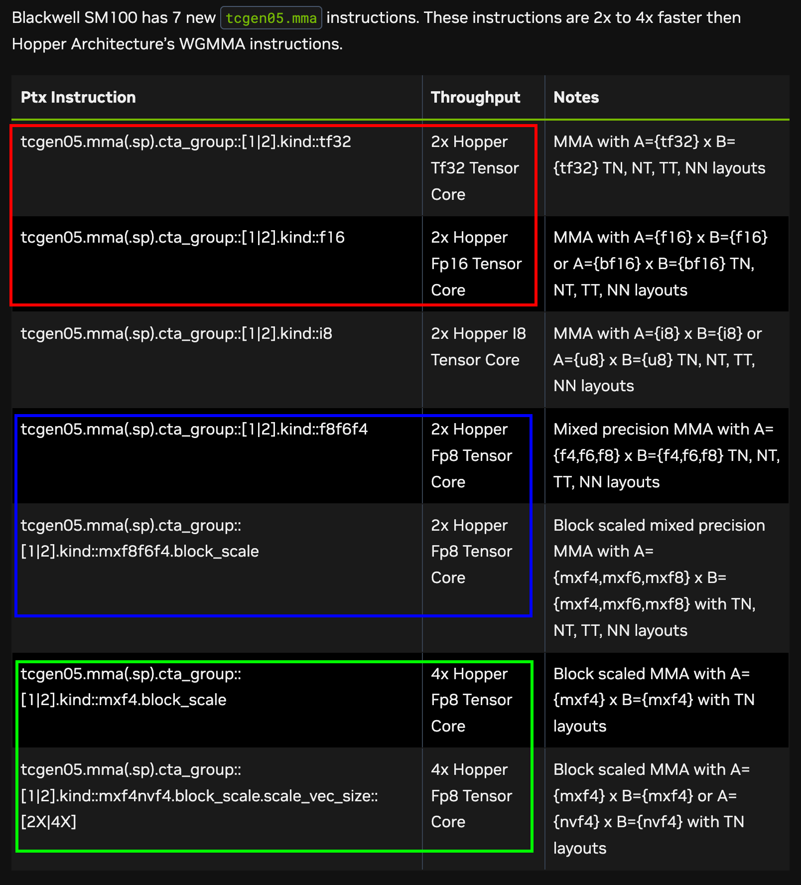 alt="Blackwell GPU specifications">

That 2x boost is just a baseline architectural improvement in the GPU, which you can also see for FP16 and TF32 (in the red box). A true 2x throughput jump only happens if you go full `f4 x f4` (in the green box).

Because of this, getting that 1/3 extra efficiency out of the box just isn't happening right now. DeepSeek will either have to transition to `f4 x f4` compute, or we'll have to wait for the next generation of hardware—like Nvidia's Vera Rubin or, more likely, upcoming Huawei chips.

## 第 6 页

### 🏗️ Transformer of Theseus

It's pretty funny that we still call these models "Transformers" in reference to the original 2017 architecture, considering we've changed almost everything since then.

The attention mechanism is completely different now (the paper we're looking at actually uses two types!). We ditched standard FFNs for MoEs—which have evolved several times themselves—swapped out positional embeddings, and moved from LayerNorm to RMSNorm.

Even the loss function has evolved to mix in multi-token prediction task. And all of this doesn't even mention the massive paradigm shift from the original encoder-decoder setup to decoder-only LLMs.

Throw in the fact that the legendary Adam optimizer was replaced by AdamW, and now we're moving toward Muon.

It’s the Transformer of Theseus. If you replace every original component over time, is it still a Transformer? I'll leave that as an exercise for the reader.

## 第 7 页

### 🎯 Multi-Token Prediction

Multi-Token Prediction (MTP) does exactly what it sounds like: it predicts multiple future tokens at every position. In V4, we’re only predicting one extra token, but why bother?

First, an MTP objective provides a denser training signal, which improves data efficiency. It also forces the model to "think ahead" and optimize its internal representations for future tokens.

As shown in the diagram from the [original DeepSeek-V3 paper](https://arxiv.org/abs/2412.19437), MTP predicts these extra tokens sequentially while maintaining the full causal chain at every step.

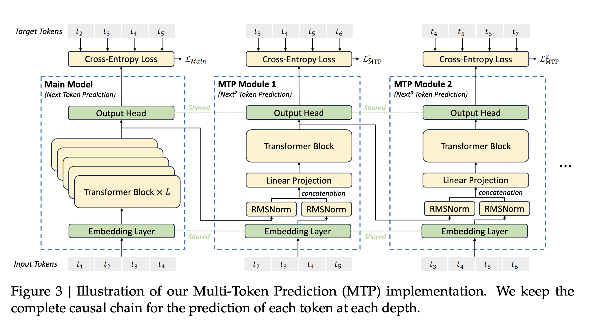 alt="MTP sequential prediction illustration">

Architecturally, each MTP module shares its input and output embeddings with the main model, but maintains its own full transformer block. This block includes an attention layer and—while the paper doesn't explicitly confirm it—likely an MoE layer (though it could just be a standard FFN).

With MTP, we compute a standard cross-entropy loss. This acts as an auxiliary loss with some weight (likely somewhere between 0.1 and 0.3, if we go by the V3 paper).

For training, MTP uses a standard cross-entropy loss. This functions as an auxiliary loss, with a weighting factor likely somewhere between 0.1 and 0.3, if we go by the V3 paper.

### 🧩 Auxiliary-loss-free expert routing

When we train MoE models, token routing often suffers from "routing collapse". This happens when the network stubbornly sends most tokens to just a few experts. This completely destroys efficiency and creates massive GPU bottlenecks, leaving most of your hardware sitting idle. Historically, the standard fix has been an auxiliary loss—a penalty that forces the model to distribute tokens evenly.

But this penalty acts as a regularization term that alters the gradients, which conflicts with the primary language modeling objective. As [shown here](https://arxiv.org/abs/2408.15664), if you make the penalty strong enough to successfully balance the load, it degrades the model's overall performance.

To escape this trade-off, the auxiliary-loss-free strategy shifts the balancing act away from the loss function and directly into the routing mechanism. It does this by applying a dynamic, expert-wise bias (just one scalar value per expert, per MoE layer).

If an expert receives more than its fair share of tokens (check out the outer columns in the image below), its bias is **decreased** to suppress selection. If an expert is underutilized, its bias gets **bumped up**. By iteratively adjusting these biases based on batch statistics, we achieve a perfectly balanced expert load without compromising the training objective.

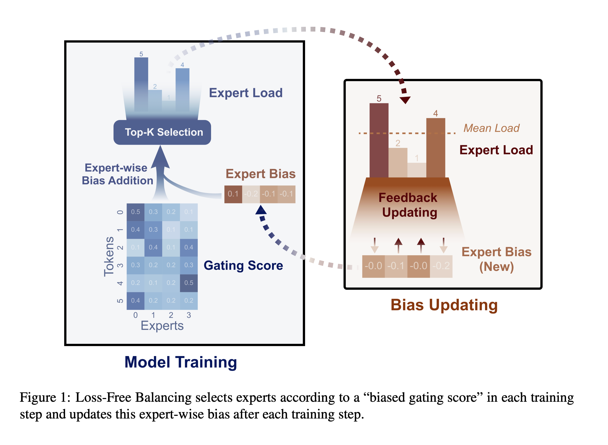 alt="Dynamic bias and load balancing in MoE layers">

The cool part is that this dynamic bias is only used to make the routing decisions. Once the top experts are chosen, the bias is stripped away. We then use the original router scores to weight the experts' actual outputs.

### 🧩 Hash routing in early layers

In almost all recent MoE models, the first one to three layers are standard, dense FFNs. We do this out of pure necessity. If you place learned MoE routing in the earliest layers, you often run into "routing collapse"—the model just dumps almost all tokens onto one or two experts, which causes severe training instability.

Why does this happen? The earliest layers of a Transformer act as feature extractors for universal, low-level traits like morphology and spelling. This happens before a token representation even absorbs its surrounding context. Since these hidden states are completely uncontextualized, standard MoE routers struggle to learn any meaningful, dynamic mappings for expert specialization.

Dense FFNs solve this by forcing all tokens through the exact same weights. This builds a shared representational foundation. It's much more efficient than increasing the hidden size, which would quadratically increase compute across all the later layers. It's also better than expanding the vocabulary size. Massive vocabularies already suffer from a long tail of rare, undertrained tokens (if you haven't read the famous [SolidGoldMagikarp](https://www.lesswrong.com/posts/aPeJE8bSo6rAFoLqg/solidgoldmagikarp-plus-prompt-generation) story, it highlights exactly this issue).

Furthermore, even if training stabilizes, the absolute best an early-layer learned router can do is memorize a static mapping. It essentially learns a hardcoded rule like, "Always send Token ID 405 to Expert 3." HashMoE simply leans into this by stripping out the learned router entirely and replacing it with a deterministic, uniform hash function.

### 🧩 Sqrt-Softplus for router scores

After selecting and computing the outputs for K experts in an MoE layer, we calculate their weighted sum. It's helpful to break this down into three distinct concepts:

- Router logits — the raw outputs of the router linear layer.

- Affinity scores — the positive scores you get after applying an activation function like \(Softmax\).

- Routing weights — the selected top-K scores after normalization, which are actually used to mix the expert outputs.

Classic MoE routers typically relied on \(Softmax\). This ensures the selected expert weights are non-negative and normalized into a probability-like distribution. But \(Softmax\) can get way too sharp because of the exponential. For example, if the router logits for 4 experts are `[4, 4, 4, 8]`, the last expert grabs about 95% of the probability mass. The first three experts are left fighting over the remaining 5%. This leads to a harsh winner-take-most dynamic.

DeepSeek-V3 tackled this by moving to \(Sigmoid\)-based affinity scores. Unlike \(Softmax\), \(Sigmoid\) scores each expert independently. If one expert gets a massive score, it doesn't automatically suppress the others.

But \(Sigmoid\) has its own fatal flaw: it saturates. Large positive logits all squash to roughly 1, and large negative logits drop to roughly 0. Gradients vanish on both ends. So, if two experts have logits of 4 and 8, \(Sigmoid\) just says, "Yep, they're both basically 1." You lose critical information about how strongly that token actually matches the expert.

This \(Sigmoid\)-style routing quickly became the standard for DeepSeek-like MoE models, including Kimi K2.x, GLM-5.x, and MiniMax-M2.x. However, with DeepSeek-V4, the team shifted gears again. They dropped \(Sigmoid\) for \(Sqrt(Softplus)\).

\(Softplus\) behaves a lot like a smooth \(ReLU\): \(Softplus(z)=\log(1+e^z)\):

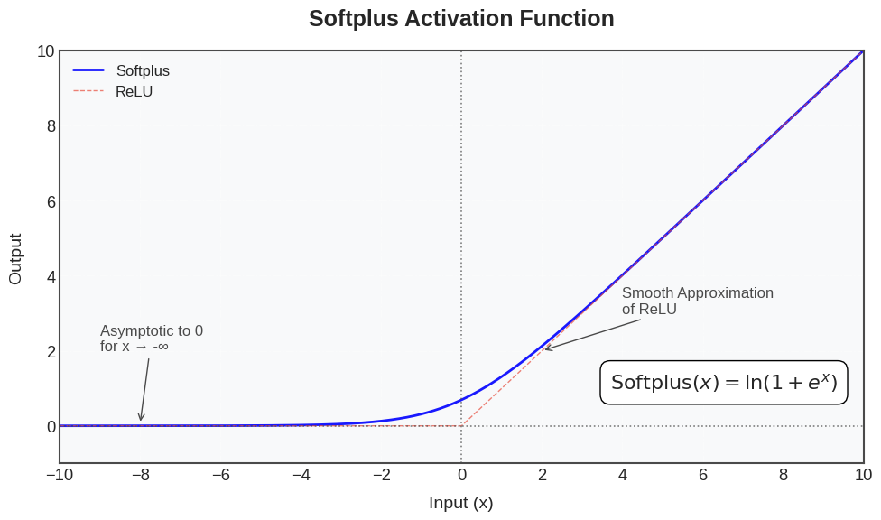 alt="Softplus activation function graph">

For highly negative values, it hugs zero. But for large positive values, it keeps growing roughly linearly instead of flattening out. This means positive router logits finally preserve their magnitude. A logit of 8 is now meaningfully stronger than a logit of 4.

Still, plain \(Softplus\) can be a bit too aggressive. If one selected expert has a massive positive logit, it can easily dominate the normalized mixture. Taking the square root beautifully solves this by compressing the dynamic range. \(Sqrt(Softplus)\) hits the perfect sweet spot.

Let's check out the MoE [code](https://huggingface.co/deepseek-ai/DeepSeek-V4-Pro/blob/main/inference/model.py#L546):

`# Compute router logits
scores = router(x)
# Convert logits into positive affinity scores
scores = F.softplus(scores).sqrt()
# Select top-K experts by affinity
indices = scores.topk(self.topk, dim=-1)[1]
weights = scores.gather(1, indices)
# Normalize relative weights among selected experts
weights /= weights.sum(dim=-1, keepdim=True)
# What's this?
weights *= self.route_scale

```

We can see that the `weights` are normalized at the end so they sum to one. But why multiply them by `self.route_scale` right after?

Imagine the selected top-6 experts output vectors with similar magnitudes, but they point in different directions. Not literally opposite, just capturing different features. When we average those vectors together, their coordinates partially cancel out. As a result, the final vector can end up much smaller than a single expert's output.

RMS (root mean square) is just a handy way to measure this. It basically means the "typical per-coordinate size" of a vector. In the toy simulation below, averaging 6 somewhat independent expert outputs gives us a vector with an RMS of only \(1/\sqrt{6} \approx 0.41\) compared to that of a single expert. Without any correction, the routed MoE branch would just become too weak.

DeepSeek-V4 Pro uses top-6 routing and sets `route_scale = 2.5`. Multiplying by 2.5 scales that uniform top-6 average back up to roughly the scale of a single expert:

`import torch
torch.manual_seed(0)

expert_out = torch.randn(4096, 6, 1024) # [tokens, top6 experts, hidden_dim]
weights = torch.ones(6) / 6 # uniform top-6 routing

original_rms = expert_out.pow(2).mean(-1).sqrt().mean()

for route_scale in [1.0, 2.5]:
 agg_out = route_scale * (expert_out * weights[None, :, None]).sum(dim=1)
 agg_rms = agg_out.pow(2).mean(-1).sqrt().mean()
 print(f&quot;route_scale={route_scale}: aggregated/original RMS = {agg_rms / original_rms:.4f}&quot;)
# route_scale=1.0: aggregated/original RMS = 0.4083
# route_scale=2.5: aggregated/original RMS = 1.0209

```

For instance, Kimi K2.5 [uses](https://huggingface.co/moonshotai/Kimi-K2.6/blob/main/config.json#L145) top-8 routing and a scale of 2.827, which is almost exactly \(\sqrt{8}\). It's not a strict rule, though.

### 🏗️ How Hyper-Connections expand

You might assume this means adding \(n_{hc}\) embedding layers at the start to pass multiple distinct embeddings down the residual stream. Surprisingly, that’s not the case. For each token, the embedding is simply repeated multiple times:

`def forward(self, input_ids: torch.Tensor, start_pos: int = 0):
 h = self.embed(input_ids)
 # Expand to hc_mult copies for Hyper-Connections using repetition
 h = h.unsqueeze(2).repeat(1, 1, self.hc_mult, 1)
 # Traverse transformer blocks
 for layer in self.layers:
 h = layer(h, start_pos, input_ids)
 # Output LMHead
 logits = self.head(h, self.hc_head_fn, self.hc_head_scale, self.hc_head_base, self.norm)
 return logits

```

Under the hood, each `layer` contains the projection matrices we’ll discuss later. We need these to mix the \(n_{hc}\) channels into one before running the core operation (like Attention or MoE), and to separate them back out afterward. 

In practice, this means that while identical embeddings enter the first transformer layer across all \(n_{hc}\) streams, they will look different by the time they exit.

### 🏗️ Hyper-Connections and Equations 1, 3, 5 explained

This equation, along with equations (3)-(5) below, might look incredibly dense and unintuitive. The key to understanding them is Figure 2 from the paper:

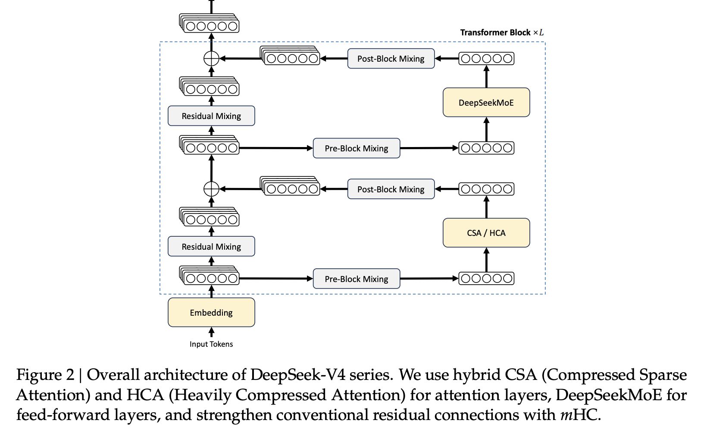 alt="Figure 2 from the paper explaining HyperConnections">

The transformer block now takes in 4 embeddings per token instead of just 1 (since \(n_{hc} = 4\) for the DeepSeek-V4 Pro architecture). However, the core layers (DeepSeekMoE / CSA / HCA) still only process a single embedding. To bridge this gap, they added two components:

- **Pre-Block Mixing** (bottom center). This is the input mapping \(A_l\) in the formula. We flatten the 4 embeddings into a single vector and pass it through a linear layer with an output dimension of 4. These 4 numbers act as weights for a weighted sum of the input embeddings. The result is a single embedding that captures all 4 "meanings" in the right proportions. This single embedding is what actually goes into the core layer.

- **Post-Block Mixing**. This corresponds to the output mapping \(C_l\) in the formula. It does the reverse, distributing that single embedding back into the 4 residual streams. Importantly, we do not split the layer output into four different vectors. Instead, we broadcast the same layer update into the four hyper-connection lanes, just with different learned amplitudes. For instance, we might write `1.1 * u` to one residual stream and `0.3 * u` to another, where \(u\) is the core layer's output.

- It might sound counterintuitive, but the weights for this step are derived by concatenating the exact same 4 embeddings used in Pre-Block Mixing. The linear layer here has identical dimensions: \(4d\) inputs to \(4\) outputs.

TL;DR: Four embeddings are compressed into a single embedding of the same size. This vector passes through the MoE/Attention layer with zero compute overhead and gets broadcast back into the 4 streams. In the equation, this is represented as \(C_lF_l(A_lX_l)\) instead of the standard \(F_l(X_l)\). After that, the result is added back to the residual streams. Because the Post-Block Mixing weights are predicted *before* the core layer, they are completely independent of its output. The model decides in advance exactly what information it wants to write and to which streams.

This diagram should help you get a better feel for pre- and post-mixing.

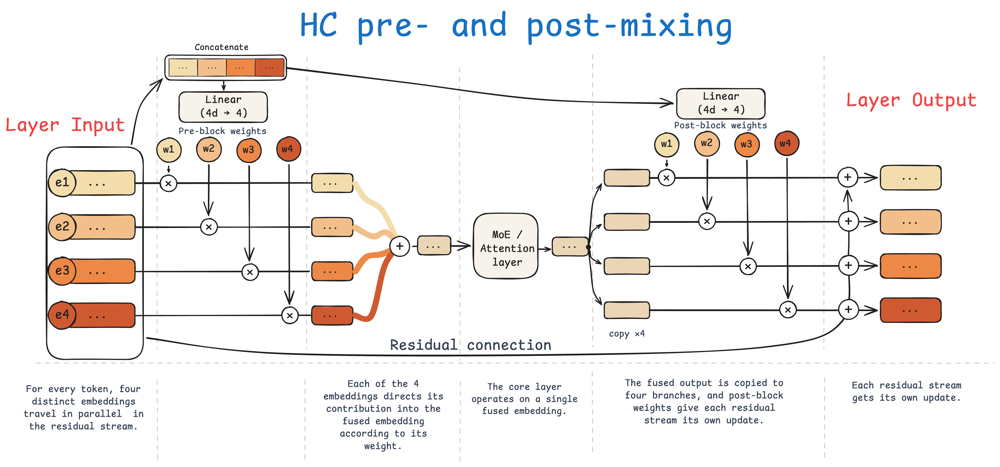 alt="Pre- and post-mixing diagram">
Normalizations, biases, and scales are omitted for clarity.

The bottom arrow labeled "Residual connection" simply computes the standard transformer update: \(x&#x27; = x + f(x)\). But in HyperConnections (and mHC), there's more going on. Besides the pre- and post-mixing shown above, there's also **Residual mixing**. The concept is similar: it blends the 4 residual streams together.

To do this, the model predicts 16 weights instead of 4. These are reshaped into a 4x4 matrix. Each row essentially acts like pre-mixing, defining how each stream influences all the others, like this:

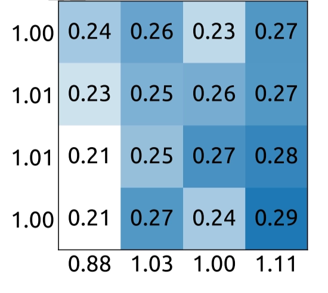 alt="4x4 residual mapping matrix visualization">

ChatGPT visualizes the flow of these residual streams like this:

 alt="Residual stream flow visualization">
Every residual stream reads from and writes to all streams.

## 第 8 页

### 📐 TF is Birkhoff polytope?

"What the hell is that?" you might ask. I hate it when simple concepts get slapped with overly complex names. As you'll see, it's actually pretty straightforward.

In this context, the residual mapping matrix \(B_l\) is exactly that 4x4 matrix I mentioned earlier. It simply defines the weights used to combine the embeddings across the different residual streams.

Researchers use all this fancy jargon to say one basic thing: let's just normalize the matrix so that every row and column sums to exactly one, and all elements stay non-negative. Matrices that follow this rule are called "doubly stochastic." The mathematical set of all such matrices is known as the "Birkhoff Polytope."

This is the core difference between mHC and standard HC. Even before V4, researchers noticed that the 4x4 matrices controlling the residual stream mixing tended to break down. The deeper you go into the network, the crazier the absolute values get:

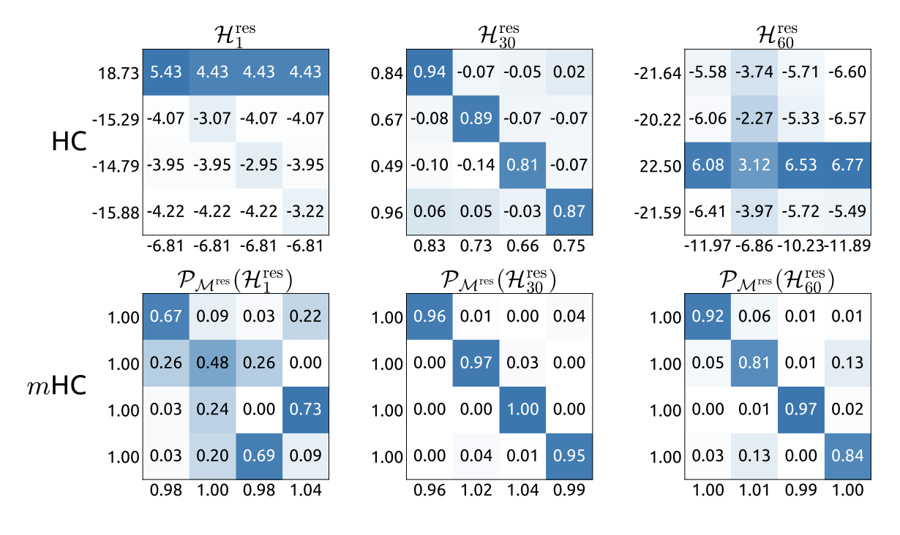 alt="Matrices in layers 1, 30, and 60 respectively.">
Matrices in layers 1, 30, and 60 respectively.

In the top half of the image, you can see the \(B_l\) matrices in a trained network without normalization. The row and column sums are printed along the left and bottom edges of each matrix. As you can see, those sums just blow up.

If we combine the streams using these raw, unnormalized weights, the vector magnitudes become completely unbounded. Instead of staying stable, they can jump by factors of tens or hundreds. That's a total nightmare for optimization and causes serious training instability.

But look at the bottom half of the image. mHC normalizes these matrices so these sums stay close to one. It's not always perfect, but hey, it works!

### ⚖️ Why constrain residual mixing in mHC?

Recall that whenever you multiply an embedding \(x\) by a weight matrix \(W\), you're applying a linear transformation. Geometrically, this transformation takes the input space and rotates, squishes, and stretches it.

The spectral norm of a matrix is simply its maximum stretch factor. Since the paper bounds this norm to 1, the matrix's maximum stretch factor is at most 1.0. As a result, no matter what vector you multiply by this matrix, the output will never be longer than the input.

Why does this matter? In mHC, we repeatedly apply mixing transformations in the residual stream. If any of these matrices have a spectral norm greater than 1, certain directions in the activation space will keep getting amplified. Even a 3% expansion at each layer yields an amplification of \(1.03^{60} \approx 5.9\) (assuming a 60-layer network).

By constraining \(B\) to be doubly stochastic, mHC makes the residual mapping behave like a mass-preserving mixer. It can blend information across the expanded residual lanes, but it can't arbitrarily amplify the signal.

[The mHC paper](https://arxiv.org/abs/2512.24880) visualizes this directly, showing the products of residual mixing matrices across 60 layers for both the unconstrained HC setup and the constrained mHC setup. In the HC case, the composite mapping develops extreme positive and negative values. This means some paths through the residual stream strongly amplify the signal or gradients—exactly the kind of behavior that destabilizes optimization.

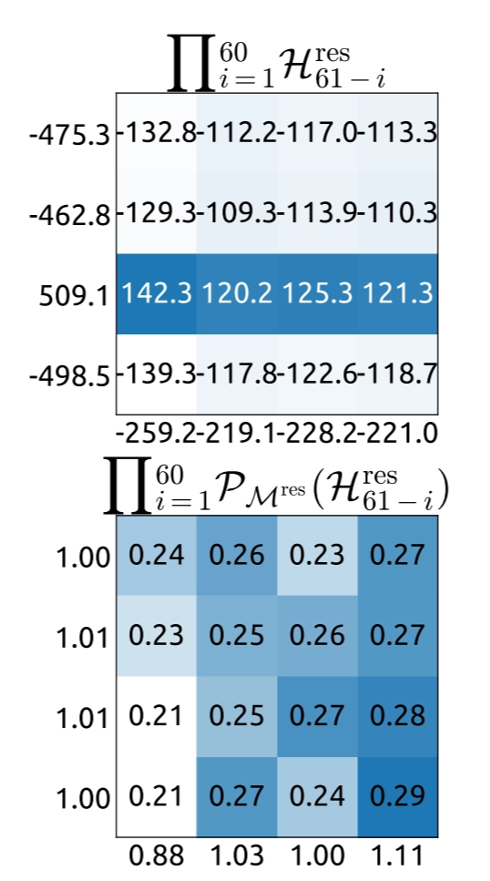 alt="Products of residual mixing matrices across 60 layers">

In the mHC case, the composite matrix remains well-behaved. Its entries are non-negative, and its row and column sums stay close to 1. They aren't exactly 1 because the underlying normalization algorithm is iterative, meaning the doubly stochastic constraint is only approximate. Crucially, however, the gains remain bounded instead of exploding.

### 🌀 The Birkhoff polytope

As mentioned earlier, this complicated phrasing just means that we normalize the matrix so that each row and column sums to 1, and all its elements are non-negative.

## 第 9 页

### 👁️ Two KV-entry series

One series, \(C^b\), contains features representing the "current chunk," while the other, \(C^a\), represents the "previous chunk." Effectively, we create two representations for each token. The first is used when the token is part of the current compression chunk and likely encodes its core meaning. The second is used when it acts as context, providing only supplementary detail.

## 第 10 页

### 👁️ Learnable positional biases

These are just per-position biases. They allow the model to learn patterns like a decay effect within a chunk, where early tokens contribute less to the sum than later ones. Since we have \(m\) tokens per chunk, we need \(m\) of these bias vectors.

### 👁️ Equations 11-12 for CSA

Let's break down what's happening in these formulas in a bit more detail. We have three pairs of terms:

- \(C^a\) and \(C^b\) — the token vectors we use to build the compressed chunk representation. As noted above, \(a\) and \(b\) denote the previous and current chunks. In CSA, each chunk has \(m=4\) tokens (in HSA, it's \(m=128\), but the idea is exactly the same).

- Intuitively, these vectors capture the actual meaning of the embedding.

- \(Z^a\) and \(Z^b\) — the local attention logits we use to weight different tokens during compression. Unlike standard Attention, where we compute one logit per token pair, here the logits are per-channel.

- Intuitively, these vectors track the importance of the information inside each token.

- \(B^a\) and \(B^b\) — as I mentioned earlier, these are just per-position biases so the model can learn things like intra-chunk decay.

- Intuitively, they downweight the importance of \(Z^a\) and \(Z^b\) depending on their position.

So, the argument passed to \(Softmax_{row}\) in the formula represents the importance of all \(2m\) tokens across both chunks (current and previous, as if they were concatenated), adjusted for their positions. The \(Softmax_{row}\) is then applied over the tokens separately for each channel. Again, this differs from a standard \(Softmax\), which typically operates on scalars. Instead, we apply this operation for each hidden channel independently, across token positions in two consecutive chunks.

As a result, \(Softmax_{row}\) outputs weighting scores \(S^a\) and \(S^b\). We use these to weight \(C^a\) and \(C^b\) channel-by-channel, as shown in equation (12). It's essentially a smarter alternative to average pooling, where the tokens dictate their own weights.

We decouple \(C\) and \(Z\) to handle specific edge cases. Sometimes a token embedding channel is disproportionately large and would normally dominate the compressed representation in a standard average. Separating them ensures it won't contribute much if it's not actually relevant in that specific context.

Ultimately, these formulas just describe a per-channel pooling operator over a local temporal window.

### 🔢 The Hadamard product

The Hadamard product \(\odot\) is simply channel-wise multiplication:

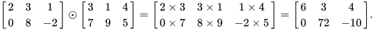 alt="Hadamard product illustration">

As I mentioned earlier, the weighting is applied per channel, rather than as a single scalar weight per token. That's exactly why we need the Hadamard product here.

## 第 11 页

### 👁️ The grouped projection trick

From what I've gathered, this is the first time an approach like this has been used. You won't find it in any previous LLMs of this scale. You do occasionally see conceptually similar ideas though, such as in [Rethinking Attention Output Projection: Structured Hadamard Transforms for Efficient Transformers](https://arxiv.org/abs/2603.08343).

### 🔢 The "quite large" attention output

When the paper says "\(cn_h\) is quite large", they mean \(c \times n_h = 512 \times 128 = 65536\). So before the attention output projection, each token has a 65,536-dimensional concatenated attention output. Since the model's hidden size is \(d = 7168\), the output projection would require a Linear layer with nearly 470 million parameters—for every single layer.

For reference, BERT-Large had 340M parameters in total. Oh, the brave new world of LLMs!

That's why DeepSeek factorizes this massive matrix into several smaller ones. This trick cuts the parameter count per layer down to \(16 \times (4096 \times 1024) + 16384 \times 7168 \approx 185\)M parameters, which is a 2.55x reduction. Across 61 layers, you're looking at roughly 28.66B parameters for the naive approach versus 11.26B parameters with GOP. That saves 17.4B parameters just in the attention output projections alone.

You might wonder why other models haven't used this trick. Well, most mainstream models have significantly smaller (compressed) per-head embedding sizes. For instance:

- In DeepSeek-V3.2, \(c \times n_h = 128 \times 128 = 16384\), and the `Linear(16384, 7168)` layer only has 117M parameters.

- For Kimi-2.5/2.6, \(c \times n_h = 128 \times 64 = 8192\), and the `Linear(8192, 7168)` layer has 59M parameters.

So, this bottleneck only emerged because of the massive increase in embedding size. This is mainly because the sequence is compressed, with each chunk representation carrying the semantic information of multiple tokens at once.

## 第 13 页

### 👁️ RoPE on 64 dimensions

The idea of applying RoPE to only a part of the embedding isn't exactly new. It surfaced recently in [Gemma 4](https://arc.net/l/quote/wvnvlywj), for example. Let's dive into how and why this actually works.

RoPE takes the Query and Key vectors and slices them up into pairs of values. A 64-dimensional vector has 32 of these pairs. We can look at each pair as a 2D vector pointing in a specific direction. RoPE applies a slight rotation to each pair, and angle of rotation decreases as we move through the embedding dimensions. As Maarten Grootendorst explains in his [Gemma 4 breakdown](https://newsletter.maartengrootendorst.com/i/193064129/p-rope):

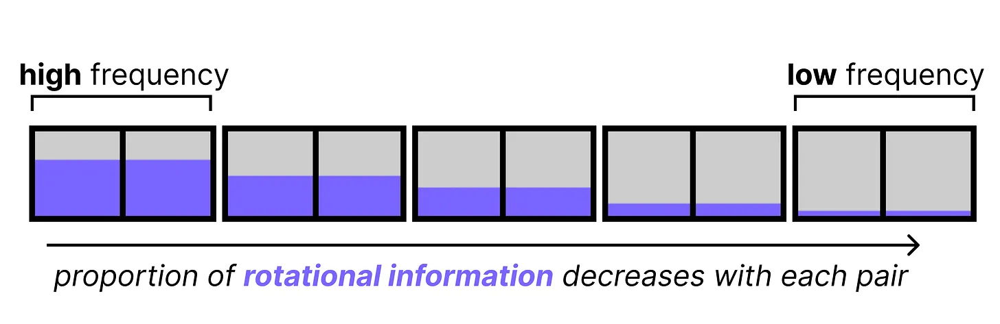 alt="image.png">

This is known as the frequency. High-frequency pairs are extremely sensitive to small position changes because they undergo a large rotation. The low-frequency pairs, on the other hand, get a very slight rotation. They barely move at all from word to word.

You could say the first pairs are high-frequency and handle short-range dependencies. The last pairs are low-frequency and manage long-range influence. Since they rotate so little over standard context lengths, relative position doesn't drastically change their dot-product contribution.

But why use rotation in the first place? RoPE changes the relative angle between the Query and Key while preserving their norms. This directly affects their dot product, which is what we use to compute attention logits. Rotation lowers the dot product, which in turn lowers the attention scores. Here's a cool GIF from Lorenzo Cesconetto’s [blog](https://towardsdatascience.com/rope-clearly-explained/):

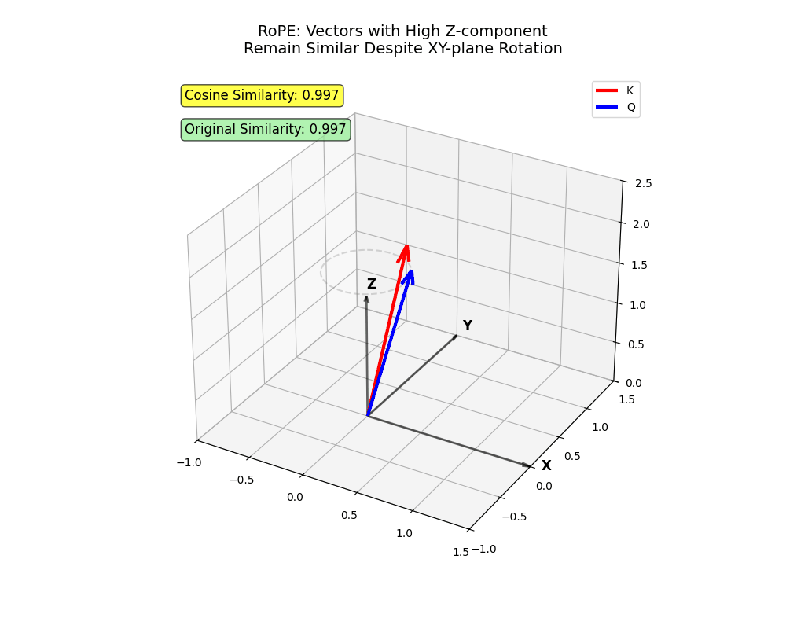 alt="DeepSeek uses RMSNorm before core attention on both Qs and KVs, so calling it “cosine” is somehow justified.">
DeepSeek uses RMSNorm before core attention on both Qs and KVs, so calling it “cosine” is somehow justified.

The tempting intuition here is simple: the larger the relative distance, the more the rotation misaligns the Query and Key, so the attention score should decay. This holds up in a toy setup where Q and K are already aligned or nearly constant. But generally speaking, it's just not true! To quote the paper [Round and Round We Go! What makes Rotary Positional Encodings useful](https://arxiv.org/abs/2410.06205):

> 

A common belief is that RoPE is useful because it helps to decay token dependency as relative distance increases. In this work, we argue that this is unlikely to be the core reason. We study the internals of a trained Gemma 7B model to understand how RoPE is being used at a mechanical level. We find that Gemma learns to use RoPE to construct robust "positional" attention patterns by exploiting the highest frequencies. We also find that, in general, Gemma greatly prefers to use the lowest frequencies of RoPE, which we suspect are used to carry semantic information.

&lt;…&gt; we carry out an ablation in which they truncate the very lowest frequencies of RoPE. The intuition is that &lt;…&gt; truncating the lowest frequencies should not harm performance. In fact, this allows RoPE to provide robust semantic channels that are distance agnostic. We call this modification p-RoPE, with \(p\) being the fraction of RoPE “kept”.

DeepSeek-V4 uses **partial RoPE**, not p-RoPE (and yes, they are actually different). The model reserves the last 64 dimensions of each 512-d attention head as a RoPE slice and computes a standard 64-d RoPE ladder directly within that slice. This differs from p-RoPE, which keeps the original full-head frequency scale but discards the lowest-frequency dimensions. To put it simply: DeepSeek reduces the rotary dimension, while p-RoPE truncates the frequency ladder.

And, of course, you could just as easily use the first 64 dimensions instead of the last—it makes absolutely no difference.

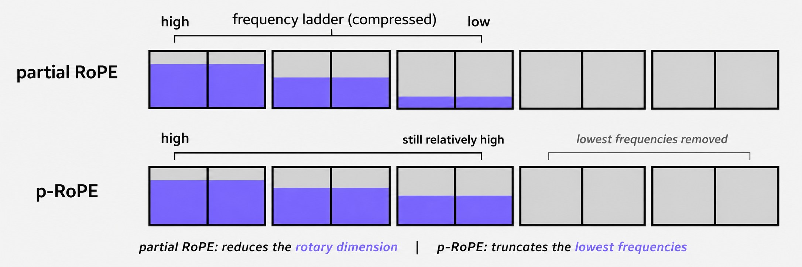 alt="image.png">

### 👁️ RoPE absolute-position leakage

To see why this happens, we need to dig into the math behind how RoPE actually works. In the previous note, we talked about slicing the Query and Key vectors into pairs of values, then rotating them by different angles.

These angles are a deterministic function of the token's **absolute** position and the specific RoPE channel pair index. But wait, don't we want relative positional encoding? Yes! And that's exactly what we get when we multiply Q and K to compute the attention logits.

To see why, let's recall two handy properties of rotation matrices:

- The transpose of a rotation matrix gives you the inverse rotation: \(R_a^T = R_{-a}\)

- Multiplying two rotation matrices adds their angles together: \(R_a R_b = R_{a+b}\)

Now, imagine we're computing the attention logit between a query at position \(t\) and a key at position \(j\). Without RoPE, that's just \(attention_{logit}(t, j) = q_t^T k_j\). Let's apply the RoPE rotation matrices to Q and K: \(q_t\rarr R_t q_t,\space\space k_j \rarr R_j k_j\). As mentioned earlier, these matrices depend *only* on their absolute positions in the sequence, \(t\) and \(j\).

So our new score becomes:

\[\begin{aligned}
score(t, j)
&amp;= (R_t q_t)^T (R_j k_j) \\
&amp;= q_t^T R_t^T R_j k_j \\
&amp;= q_t^T R_{j-t} k_j
\end{aligned}\]

Boom! The extra term in our dot product no longer depends on \(t\) and \(j\) individually. It depends purely on their difference! \(R_{j-t}\) will be exactly the same whether \(j=995, \space t=1000\) or \(j=95,\space t=100\). In both cases, the tokens are exactly 5 positions apart.

Now, let's see how RoPE actually gets applied in the Attention layer. [Here](https://huggingface.co/deepseek-ai/DeepSeek-V4-Pro/blob/main/inference/model.py#L502) is the relevant part of the code:

`kv = self.wkv(x)
kv = self.kv_norm(kv)
apply_rotary_emb(kv[..., -rd:], freqs_cis)
...
o = sparse_attn(q, kv, self.attn_sink, topk_idxs, self.softmax_scale)

```

After we call `apply_rotary_emb`, the last 64 dimensions of `kv` carry absolute positional info. Inside the attention block, we compute attention weights, which are then used to calculate a weighted sum of the values. But these values have also been RoPE-rotated based on their absolute positions. This happens because the KV vector serves as both the key and the value (which cuts our KV cache memory footprint in half).

This side effect is exactly what the authors mean when they talk about absolute position embeddings leaking into the attention output (`o`).

### 👁️ SWA + CSA/HCA = ?

Here's a fun thought experiment: does this mean the exact same token can show up in the attention calculation twice? Like, once in the sliding window and again inside a compressed CSA/HCA chunk?

Well, yes and no. The chunk doesn't contain the raw token itself; instead, its semantics are included into the chunk's overall representation.

Let's walk through an example. Imagine our query token sits at position 200. We'll use the DeepSeek-V4 Pro hyperparameters: `window_size = 128` and `compress_ratio = 4` for CSA. The sliding window will cover tokens `73...200`. Meanwhile, compressed chunk #49 spans tokens `196...199`. Since the compression overlaps, it also pulls in information from the previous block, `192...195`.

Now, suppose the indexer selects the two most recent chunks, #48 and #49. When that happens, the attention mechanism will simultaneously see:

`...
raw token 191
raw token 192
...
raw token 198
raw token 199
...
compressed summary of tokens in chunk 192...199
compressed summary of tokens in chunk 188...195
...

```

So, yes, the model can actually see the same piece of information twice or even three times (in our example, tokens `192...195`). It's just packaged in different formats.

### 👁️ The Attention-sink

The issue with these emergent attention sinks is that the attention mechanism can't just choose to look at nothing. It has to look somewhere. If all the Q-K pairs have the exact same score, the probability mass (which must sum to 1) gets smeared evenly across every single token.

Ideally, an attention head wants to lock onto a specific interaction pattern between embeddings. But some of those patterns are rare and simply aren't present in a given sequence. So, LLMs learn a neat trick: they dump their "excess" attention mass onto the very first tokens. You can clearly see this happening from layer 2 onwards in the image below:

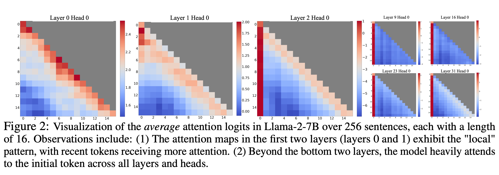 alt="Attention maps showing sink tokens">
Image from the [paper](https://arxiv.org/abs/2309.17453)

But here's where standard Sliding Window Attention (SWA) runs into trouble. As the window shifts forward, those initial tokens—the ones the model was using as an implicit sink—fall right out of the KV cache. You could fix this by constantly reprocessing the active window and recomputing its KVs, but that defeats the whole purpose of reusing the cache in the first place.

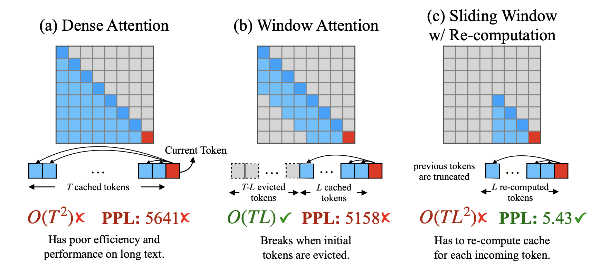 alt="image.png">

To solve this, we can simply add a dedicated sink term to the softmax denominator (though this is just one of several potential workarounds). This gives the attention head a clear "none-of-the-above" option. This way, any leftover attention mass safely drains into the sink instead of spilling over onto the active KV entries after the initial tokens drop out.

Effectively, this formula creates a dummy token. It only participates in the softmax normalization and affects the final attention output as if its value vector consisted entirely of zeros.

### 🎛️ FP4 inside the CSA indexer / attention

I did some digging with GPT-5.5 Pro, and it looks like DeepSeek-V4 is probably the first public 100B+ LLM to use FP4 inside attention during training. Even in [Nvidia's most recent paper](https://arxiv.org/abs/2604.12374) on Nemotron 3 Super, where they advertise their GPU-accelerated NVFP4 format and its pre-training stability, they explicitly keep QKV and attention projections out of NVFP4 to "maintain fidelity of few attention layers":

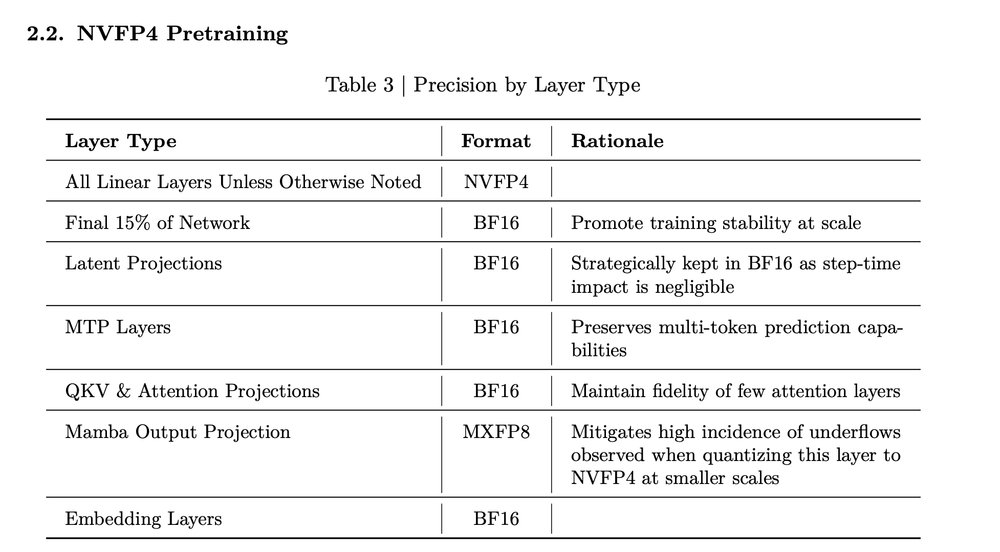 alt="image.png">

(Side note: keeping the final 15% of the network in higher precision is a really interesting trick. Duly noted 📝)

It's worth noting that DeepSeek isn't doing full FP4 attention. They only use reduced precision in the indexer, which is responsible for picking candidate chunks. Why is this approach less insane than full FP4 attention? Full attention has several numerically nasty parts that can easily blow up:

- QK dot products can have heavy-tailed logits.

- Softmax is exponential and severely amplifies these logit errors.

- Small logit differences can wildly shift probability mass.

DeepSeek-V4 sidesteps the worst of this. The indexer only needs high recall, not perfectly calibrated probabilities or exact rankings. The top-k is large enough (1024) that a little bit of score noise doesn't really matter. As long as the right block makes it into the candidate set, we're good, because it will get processed by higher-precision attention later anyway.

That said, this is still a big deal.

### 💾 Where ~2% KV cache claim comes from

Let’s break down exactly which architectural tweaks drive this massive 50x reduction. Under the hood, the memory footprint actually shrinks by 200x, but each KV entry is now 4 times wider (512 dimensions instead of 128).

Baseline KV per token per layer:

\[\begin{aligned}
2_{K,V} \times 8_{KV\space heads}
\times 128_{dim} \times 2_{BF16\space bytes}
= 4096 \space bytes
\end{aligned}\]

Here's a table summarizing how each change contributes to the final number:

Step
Size change
B/token/layer
Cumulative reduction
Intuition / notes

**Baseline: BF16 GQA8, K+V, 128-d**
—
**4096**
**1×**
starting point

**1 KV head instead of 8**
÷8
**512**
**8×**
[MQA-style cache](https://arxiv.org/abs/2305.13245): one KV stream for all query heads

**Shared KV instead of separate K and V**
÷2
**256**
**16×**
one vector acts as both key and value

**Token-level compression: CSA/HCA**
÷7.76
**33**
**124×**
CSA stores 1 per 4 tokens; HCA stores 1 per 128 tokens

**But V4 KV entry is 512-d, not 128-d**
×4
**132**
**31×**
each compressed entry is wider to summarize a token chunk

**Mixed precision: 64 BF16 + 448 FP8 dims**
÷~1.78
**74.25**
**55×**

(would be 220× without the 512-d expansion)
512 BF16 dims would be 1024 B; V4 stores 576 B

**Small overheads (CSA indexer, etc)**
+~8 B
**~82 B**
**~50×**
aligns with the paper’s ≈2%

The 7.76× effective token-compression factor comes from compression ratios for chunks of size 4 (CSA) and 128 (HCA):

\[\frac{1}{\frac{1}{2}\left(\frac{1}{4} + \frac{1}{128}\right)}
= \frac{1}{0.1289}
\approx 7.76\]

assuming a 50/50 mix.

Looking at the table, the two biggest contributors are MQA and token-level chunk compression. While MQA is standard practice these days, this chunk compression is the real architectural gem of DeepSeek-V4.

## 第 14 页

### 📝 The Muon optimizer

New, efficient optimizers—and the field of optimization as a whole—are massive topics. I definitely can't cover them fully in a single note. Hell, they deserve their own hour-long lecture!

If you want to dive deeper and build some intuition on your own, I highly recommend checking out these links:

- Original blog post: [Muon: An optimizer for hidden layers in neural networks](https://kellerjordan.github.io/posts/muon/)

- [Monotone Newton-Schulz: Near-Monotone Polynomial Iterations for Matrix Sign](https://jasonjiaxiangli.github.io/blog/monotone-ns/)

- [Understanding Muon: A Revolutionary Neural Network Optimizer](https://www.notion.so/233ffa7f40c4800eafa5cc843e039327?pvs=21)

For now, I'll just share a few important quotes from those posts:

- Traditional optimizers treat all parameters the same, but Muon is smarter. It understands that 2D weight matrices have unique geometric structures.

- When we examine the gradient matrices that traditional optimizers produce, we find they often have very high condition numbers. Think of this as how "sensitive" a matrix is to small changes. High condition numbers mean the matrix is nearly low-rank - most of its information is concentrated in just a few directions. Some parameters get huge updates while others get tiny ones, creating imbalanced learning.

- Muon solves this problem through a elegant mathematical insight: instead of applying raw momentum updates, it orthogonalizes them to create more balanced parameter changes.

- Think of orthogonalization like this: if traditional optimizers create updates that are like a bunch of arrows pointing in similar directions (wasteful and imbalanced), Muon transforms them into arrows that point in perpendicular directions - each carrying unique, non-redundant information.

- We speculate that orthogonalization effectively increases the scale of other “rare directions” which have small magnitude in the update but are nevertheless important for learning.

## 第 15 页

### 🔧 2 (or 3) Linear layers inside an expert

Reading the paper, you might think a single expert has two linear layers. But that's not the case—there are actually three. [Here's](https://huggingface.co/deepseek-ai/DeepSeek-V4-Pro/blob/main/inference/model.py#L587) the code:

`class Expert(nn.Module):
 &quot;&quot;&quot;Single MoE expert: SwiGLU FFN (w1, w2, w3). Computation in float32 for stability.&quot;&quot;&quot;
 def __init__(self, dim: int, inter_dim: int, dtype=None, swiglu_limit=0):
 super().__init__()
 self.w1 = Linear(dim, inter_dim, dtype=dtype)
 self.w2 = Linear(inter_dim, dim, dtype=dtype)
 self.w3 = Linear(dim, inter_dim, dtype=dtype)
 self.swiglu_limit = swiglu_limit

 def forward(self, x: torch.Tensor, weights: Optional[torch.Tensor] = None) -&gt; torch.Tensor:
 dtype = x.dtype
 gate = self.w1(x).float()
 up = self.w3(x).float()
 if self.swiglu_limit &gt; 0:
 up = torch.clamp(up, min=-self.swiglu_limit, max=self.swiglu_limit)
 gate = torch.clamp(gate, max=self.swiglu_limit)
 x = F.silu(gate) * up
 if weights is not None:
 x = weights * x
 return self.w2(x.to(dtype))

```

As you can see, `w1` (gate) and `w3` (up) have the exact same dimensions. Under the hood, they are actually [fused](https://github.com/deepseek-ai/DeepGEMM/blob/211d2678d9d178de7a77fbfefe7310e0f4f8821c/deep_gemm/include/deep_gemm/impls/sm100_fp8_fp4_mega_moe.cuh#L37) into a single linear layer (Linear-1) and computed in parallel. You can even spot this in Figure 5, where L1 takes about twice as long to compute as L2:

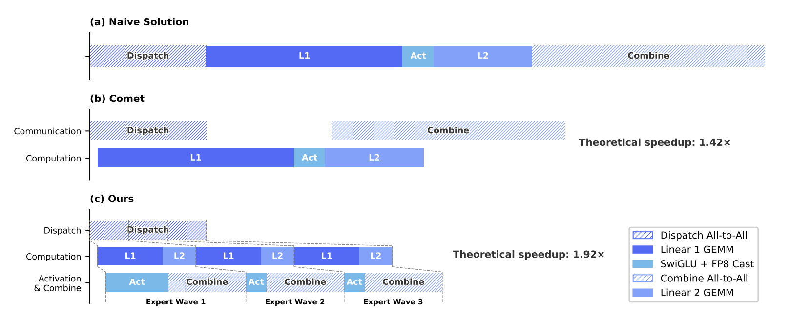 alt="Timeline comparison of L1 and L2 computation">

### 🔧 Expert parallelism

Borrowing from the excellent [Ultra-Scale Playbook](https://huggingface.co/spaces/nanotron/ultrascale-playbook?section=expert_parallelism):

The design of MoE layers makes it easy to implement parallelism across the experts dimension, for what we call expert parallelism (EP). Since the feedforward layers are fully independent, we can simply put each expert's feedforward layer on a different worker (GPU). Compared to TP (TensorParallelism), this approach is much more lightweight, since we don't need to split the matrix multiplication; we just need to route the hidden states of a token to the right expert.

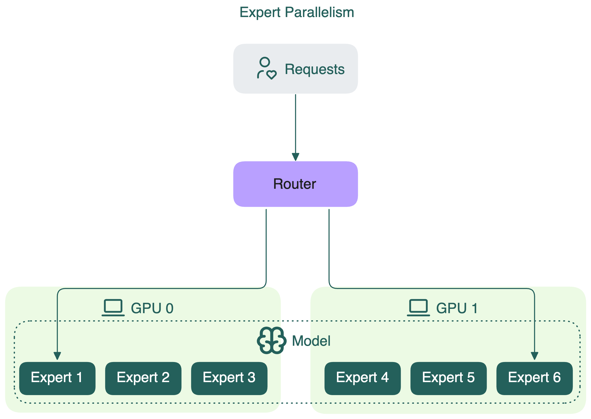 alt="Expert Parallelism routing illustration">

There are a few tricks to make EP work efficiently, and they are closely tied to model design. For instance, DeepSeek-V3 enforces a constraint in the router, ensuring that each token is sent to at most \(M\) nodes (in their case, 4) to keep the tokens on a single node and reduce communication overhead.

## 第 16 页

### ⚙️ Torch ATen operators

ATen is PyTorch's low-level tensor operator library. When you write standard PyTorch code like this:

`y = torch.softmax(x, dim=-1)
z = torch.matmul(y, w)
u = z + bias

```

PyTorch translates it into lower-level ATen operators:

`aten::softmax
aten::matmul
aten::add
aten::view
aten::sum

```

While these ATen ops are great building blocks, chaining them together creates two major bottlenecks. First is the kernel launch overhead. Every ATen call requires the host CPU to schedule a separate GPU kernel. While individual launch times are microscopic, doing this for hundreds of tiny ops per layer adds up quickly.

Second is the memory bandwidth bottleneck. Executing ops sequentially forces intermediate tensors to be written out to slow global GPU memory (VRAM), only to be immediately read back into fast on-chip memory (SRAM/registers) by the next operator.

You can drastically speed up your code by replacing multiple ATen ops with a fused kernel. This minimizes CPU scheduling overhead and lets you keep intermediate results in fast memory, preventing expensive read/write cycles.

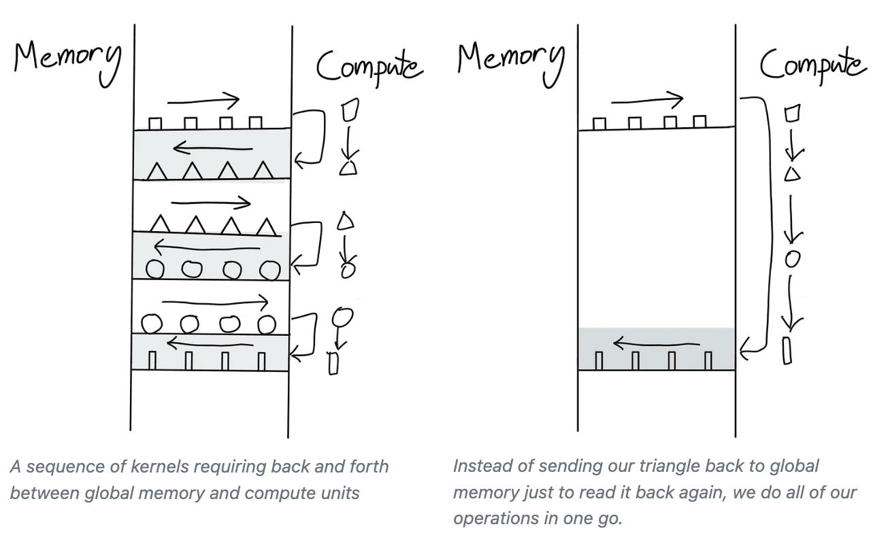>

From [the Ultra-Scale Playbook](https://huggingface.co/spaces/nanotron/ultrascale-playbook?section=fused_kernels).

## 第 17 页

### 📝 Why integer analysis shows up

When translating a high-level tensor operation into low-level GPU code, the compiler has to map exact memory slices to specific CUDA threads (compute units). You might write something innocent in Python like `x[:, ::2].T + bias`, but behind the scenes, that turns into an absolute of integer arithmetic over shapes, strides, offsets, block sizes, thread IDs, masks, and alignment constraints.

This is where a solver comes in, acting as a mini theorem prover. The compiler hits it with questions like: "Can this index ever go out of bounds?", "Will two threads write to the exact same address?", or "Are these elements guaranteed to be contiguous?" If the solver can mathematically prove these properties, the compiler gets the green light to take a highly optimized fast path.

Vectorized memory loading is a classic example. If several values are contiguous and properly aligned in GPU memory, the kernel can fetch them in a single instruction instead of using multiple scalar loads. But the moment you introduce slicing, transposing, padding, or custom layouts, logical "neighbors" in your tensor are rarely physical neighbors in memory anymore.

Because the underlying address formula might involve strides, modulos, floor division, and symbolic dimensions, the compiler has to prove that `address(k + 1) == address(k) + 1` (and that `k` remains strictly within bounds). If it can't prove this, It falls back to a slow, conservative approach using scalar loads and runtime bounds checks.

So, where does this solver actually live in everyday PyTorch? If you're running in standard eager mode, it doesn't. Eager mode relies entirely on pre-compiled kernels where human engineers have already done all the heavy mathematical lifting.

But the second you wrap your model in torch.compile(), everything changes. PyTorch starts generating custom GPU kernels on the fly. Behind the scenes, it fires up SymPy—a symbolic math library—to act as this exact kind of solver. By symbolically analyzing dynamic shapes and strides, SymPy proves to TorchInductor (the compiler) exactly when it's safe to vectorize memory reads or fuse operations without unnecessary overhead.

## 第 18 页

### ⚙️ Why split-KV is unavailable

First, let's break down what the Split-KV method is and why we need it. Then we’ll look at why we can't actually use it here.

In NVIDIA GPU architecture, the Streaming Multiprocessor (SM) is the fundamental computational building block. You can think of it loosely as a highly parallel GPU "core". A modern GPU like an H100 has over a hundred SMs, and we usually parallelize compute workloads across them.

The famous FlashAttention algorithm works exceptionally well during training because it parallelizes across the batch and query dimensions. During pre-training or the prefill phase of inference, we process many query tokens in parallel, which naturally provides enough work to keep all SMs busy.

But during decoding—for both standard inference and, more importantly, RL rollouts—the query length is tiny. It's often just a single token. Combine that with long contexts that force small batch sizes due to memory limits, and the GPU suddenly lacks parallel work. Most of the SMs sit completely idle, leading to terrible GPU utilization.

To fix this, we use Split-KV. This decoding-focused optimization splits the long sequence dimension (the KV cache) into smaller chunks to be processed in parallel across multiple SMs. This allows all SMs to work on the exact same query simultaneously. Afterward, a separate step gathers the partial results from all SMs and reduces (sums) them to produce the final attention output:

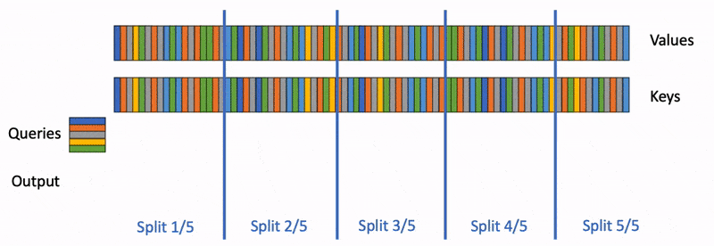 alt="Split-KV method illustration">

However, Split-KV's reduction step is problematic. DeepSeek requires bitwise batch invariance, meaning the same token must produce exactly the same bits regardless of where it appears in a batch.

In standard floating-point arithmetic, the order of summation matters. Due to rounding errors, \((A+B)+C\neq A+(B+C)\). Since the final bitwise result strictly depends on the exact grouping and order of these additions, Split-KV can't guarantee the strict reproducibility that DeepSeek needs.

### ⚙️ When split-KV is removed

In the previous note, we saw how Split-KV slices the long sequence dimension (the KV cache) into smaller chunks to process them in parallel across multiple SMs. Without it, our GPU parallelization options shrink to just splitting over the batch and query length.

Since the query length during decoding is exactly 1, there's nothing to parallelize there. We're left with just the batch.

In the standard approach without Split-KV, a single batch element occupies all the resources of an entire SM. An H800 GPU physically has 132 SMs. I don't know the exact batch size DeepSeek uses for long-context RL rollouts, but let's assume it's 200 to keep things simple.

Each SM picks up one batch element, multiplying the current token's Query by the KV cache of the entire context. The first 132 elements start processing immediately, fully saturating the GPU. This is the first wave. The remaining 68 requests (\(200 - 132 = 68\)) have to wait for the second wave, since there are no free SMs left.

Once the first wave finishes, the remaining 68 elements are assigned to the newly freed SMs. But now the GPU is half-idle. We're only using 68 out of 132 SMs, while the other 64 just sit there doing nothing.

This hardware underutilization is exactly what Split-KV solved. It allowed us to spread the tail of the batch across all SMs. But the DeepSeek-V4 team decided to ditch it to preserve batch invariance.

Interesting insight: this means bumping the batch size from 200 to 264 is essentially free in terms of latency (assuming you have enough VRAM for the KV cache). The compute time for batches of 200 and 264 will be exactly the same. In both cases, the GPU needs to execute exactly two waves.

The [Nvidia docs](https://docs.nvidia.com/deeplearning/performance/dl-performance-matrix-multiplication/index.html#wave-quant) have a great chart illustrating this effect for matrix multiplication of sizes \(M \times K\) and \(K \times N\). If \(K\) and \(M\) are fixed while \(N\) grows, the number of tiles (chunks) and execution time increase in discrete steps:

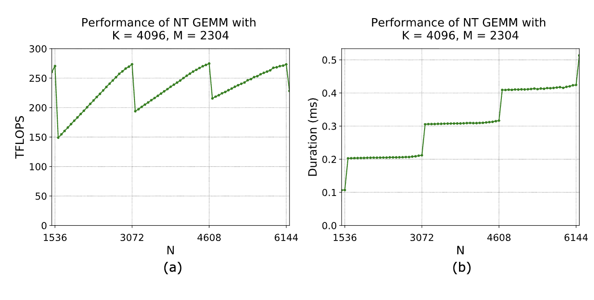 alt="Nvidia wave quantization chart">

A matrix with \(N=3100\) will take the exact same amount of time to compute as a matrix with \(N=4500\).

This exact scenario leads to severe wave-quantization inefficiencies. Without the ability to parallelize the workload at a finer granularity, we simply can't fully utilize the GPU.

### ⚙️ Split-K for small batches

Conceptually, split-K is based on the exact same idea as the split-KV trick we discussed earlier, but this time, we’re applying it to GEMM (general matrix multiplication).

We use GEMM all the time in linear layers to multiply inputs by a weight matrix. The operation `C = A @ B` has the following shapes:

- A: [M, K]

- B: [K, N]

- C: [M, K] x [K, N] = [M, N]

We calculate each element \(C[m, n]\) as a sum over \(K\): \(C[m, n] = \sum_k A[m, k] * B[k, n]\).

Usually, GEMM parallelizes the computation by slicing the \([m, n]\) grid into tiles. A single CUDA block handles a specific tile \(C[m0:m1, n0:n1]\). It loops through all values of \(K\), accumulates the sum, and writes out the finished tile.

Split-K takes this a step further by splitting the computation along the \(K\) dimension. Now, our tile looks like this:

\[C[m0:m1, n0:n1]
= partial_0 + partial_1 + partial_2 + partial_3 + ...\]

We use this splitting technique in roughly the same scenarios as split-KV. When parallelizing across just two axes (especially when one is very small, like the batch size) doesn't generate enough parallel work, some SMs on the GPU end up idle. This reduces hardware utilization.

Just like with split-KV, the order in which we accumulate the partial sums \(partial_0 + partial_1 + partial_2 + partial_3\) actually matters. If we don't preserve it, we break batch invariance. Floating-point addition simply isn't associative: \((A+B)+C\neq A+(B+C)\).

Note that even though "split-KV" and "split-K" sound very similar, the "K" refers to completely different things.

In split-KV, it stands for Keys and Values in attention calculations. Split-KV slices the sequence dimension, and later we have to merge the partial softmax statistics and weighted values.

In split-K, `K` refers to one of the GEMM dimensions. It's the reduction dimension, which usually corresponds to the input feature dimension in a `[batch_size, features_dim]` matrix.

### 🔩 24 in mHC dimensions

Let's quickly recap how mHC works. It takes \(m\) embeddings of size \(d\) from the residual stream, concatenates them, normalizes them, and passes the resulting \(m*d\) vector through three linear layers:

- Pre-Block Mixing (4 output features)

- Post-Block Mixing (4 output features)

- Residual Mixing (\(4\times 4\) output features)

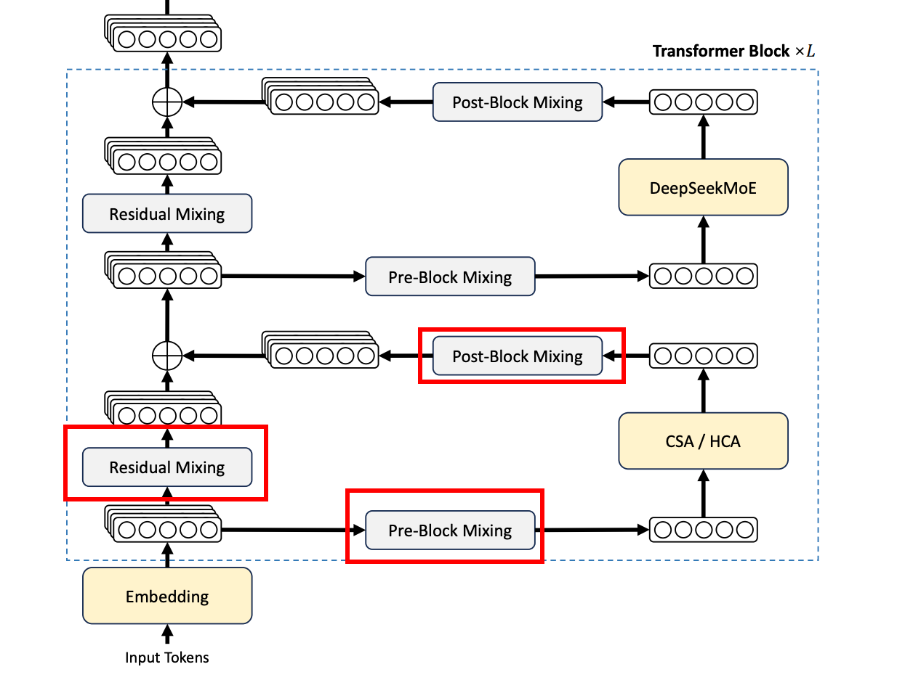 alt="mHC mixing layers diagram">

We can actually fuse these three linear layers into a single layer with an output dimension of \(4 + 4 + (4\times4)=24\). This 24 is exactly the number of scalars mHC needs to generate for the three small mixing matrices when we set `n_hc = 4`. You can see this reflected in the [inference code](https://huggingface.co/deepseek-ai/DeepSeek-V4-Pro/blob/main/inference/model.py#L666):

`# assume hc_mult = 4
mix_hc = (2 + hc_mult) * hc_mult
hc_dim = hc_mult * args.dim

# both of these are 24 x (4 * dim)
self.hc_attn_fn = nn.Parameter(torch.empty(mix_hc, hc_dim))
self.hc_ffn_fn = nn.Parameter(torch.empty(mix_hc, hc_dim))

```

Interestingly, this fusion slightly complicates the Muon optimizer logic we discussed earlier. We now have three completely different projections bundled together into a single 2D weight matrix (`hc_attn_fn` and `hc_ffn_fn`). The DeepSeek team likely anticipated this, and presumably only fuses these layers during the forward pass and at inference time.

## 第 19 页

### 🎛️ FP4 during post-training

Back in DeepSeek-V3, the core training framework relied on FP8 mixed precision for both pretraining and RL. Just a quick refresher: this means we mix and match different data types—the big win here is that MoE weights are stored and multiplied in FP8, which saves a massive amount of memory. Meanwhile, attention and other sensitive components are kept in higher precision.

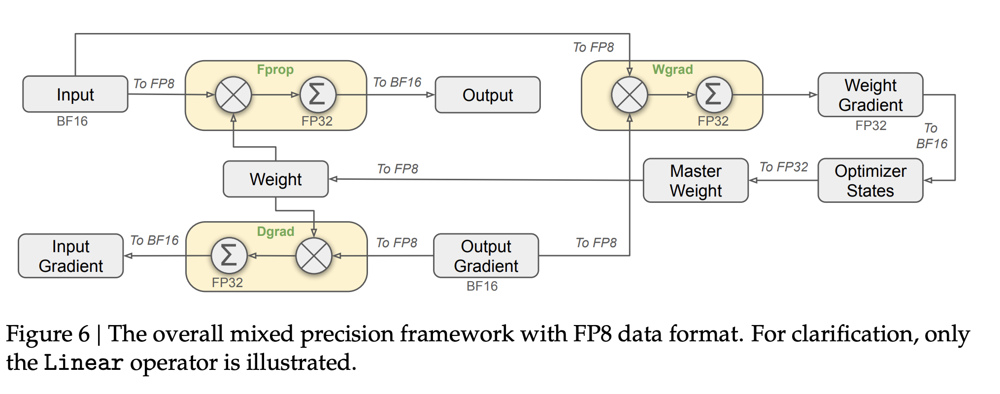 alt="It really was quite something!">

It really was quite something!

Now, DeepSeek-V4 introduces a much more granular breakdown across the different training stages. I’ve put together a quick table summarizing all the precision types mentioned throughout the paper. It's super handy to keep this in mind as we go:

Stage
Type
Notes

LM Pretrain
**FP8 mixed**
Inherits the DS-V3 training framework. Core Linear GEMMs are in FP8. No FP4 whatsoever.

Specialist SFT
**simulated FP4→FP8**
QAT in post-training. FP4 expert weights are de-quantized to FP8 for the forward and backward passes.

Specialist RL / rollouts
**native FP4**
No backward pass. Uses FP4 weights directly for sampling.

Specialist RL / train
**simulated FP4→FP8**
Backward pass over FP8 weights. Gradients flow into FP32 master weights via STE.

OPD / student rollouts
**native FP4**
The student generates on-policy trajectories.

OPD / teacher logits inference
**native FP4**
Inference-only forward passes, meaning no backward pass is needed.

OPD / student train
**simulated FP4→FP8**
Reverse-KL / full-vocab distillation.

Model serving (API)
**native FP4**
FP4 is used for MoE expert weights and the CSA indexer QK path.

I want to reiterate: we aren't talking about compressing *all* the model weights here. The paper clarifies this later on (specifically, right in the same paragraph as this note):

> 

We apply FP4 (MXFP4) quantization to two components: (1) MoE expert weights, which are a major source of GPU memory occupancy and (2) the Query-Key (QK) path in the indexer of CSA, where QK activations are cached, loaded, and multiplied entirely in FP4.

So, none of this affects how things like token embeddings are stored.

### 🎛️ FP4-to-FP8 scale absorption

At first glance, losslessly casting FP4 values to FP8 seems straightforward. But it's not totally clear if the quantization scales will actually fit. Let's peek under the hood to see how these quantizations work.

DeepSeek-V3 was trained in FP8. Unlike our good old FP16 and FP32, this format comes with a catch. 16 and 32 bits give you enough dynamic range to accurately capture the spread of values in a neural network. But 8 bits just isn't enough—numbers quickly collapse into zeros or blow up to infinity due to overflow and underflow.

To fix this, FP8 relies on a separate quantization scale that lives outside those 8 bits. We calculate this scale so that multiplying it back restores the original weight with minimal loss: \(w \approx w_{fp8} * scale\).

The memory savings come from sharing a single quantization scale across a whole block of FP8 values. Block sizes differ for activations and weights, but for this note, we'll stick to weights. In DeepSeek-V3, they group and scale weight elements in 128x128 blocks (i.e., per 128 input channels and 128 output channels).

If a matrix is larger than that, we simply slice it into 128x128 tiles. For example, the FP8 weights for a `Linear(7168, 2048)` layer get chopped into \((7168/128) \times (2048/128) = 896\) blocks. So, alongside the raw FP8 values, we also have to store 896 scaling factors. The matrix multiplications natively factor in these scales. Here's a great visualization from [Nvidia's blog](https://developer.nvidia.com/blog/per-tensor-and-per-block-scaling-strategies-for-effective-fp8-training/):

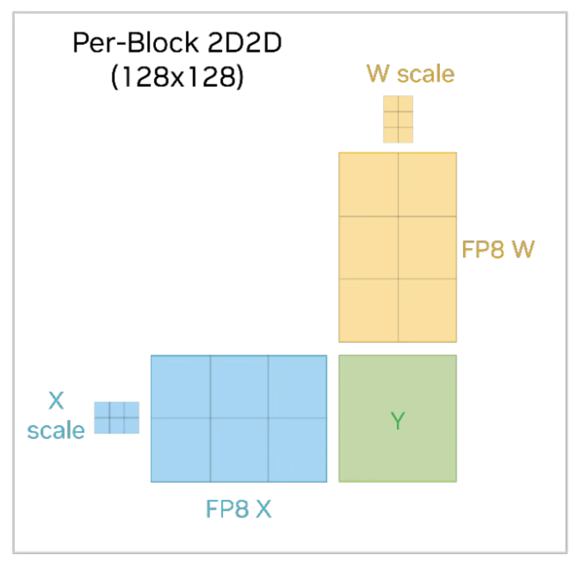 alt="FP8 block scaling visualization">

DeepSeek-V4 applies the exact same principle to FP4. However, because FP4 quantization is much more aggressive, rounding errors accumulate faster. To counter this, they shrank the group size down to 1x32. This means a single 128x128 block of FP8 values now contains exactly \((128 / 1) \times (128 / 32) = 512\) of these tiny FP4 chunks.

Spot the problem yet? Standard FP8 expects exactly one scale per 128x128 block, but our new FP4 setup has 512 scales for that same block. DeepSeek claims the FP8 weights can just "absorb" these extra scales. Let's write some code to prove it:

`import torch

# FP8 block: 128x128; FP4 scale tile: 1x32
R, C, G = 128, 128, 32

# Values exactly representable by FP4
fp4 = torch.tensor([0, .5, 1, 1.5, 2, 3, 4, 6,
 -.5, -1, -1.5, -2, -3, -4, -6],
 dtype=torch.float32)

# Fake already-quantized FP4 payload, unpacked into fp32
q4 = fp4[torch.randint(len(fp4), (R, C))].view(R, C // G, G)

# One local scale per 1x32 tile
s4 = (2.0 ** torch.randint(0, 15, (R, C // G)))

# One shared FP8 scale for the whole 128x128 block
s8 = torch.tensor(2.0 ** 8)

# Absorb local FP4 scales into the FP8 payload
original_data = q4 * s4[..., None]
q8 = (original_data / s8).reshape(R, C)
q8 = q8.to(torch.float8_e4m3fn)

# Same weights: many FP4 local scales vs one FP8 block scale
assert torch.equal(
 (q4 * s4[..., None]).reshape(R, C),
 q8.float() * s8,
)

```

In this snippet, `fp4` lists the actual values that an FP4 number can represent. It can only express a small, fixed grid (values taken from [here](https://developer.nvidia.com/blog/introducing-nvfp4-for-efficient-and-accurate-low-precision-inference/#:~:text=What%20is%20NVFP4?,same%20for%20the%20negative%20range)), not arbitrary floats. We use `torch.randint(len(fp4), (R, C))` to sample random entries from this grid, simulating an already-quantized FP4 payload (MoE weights).

Next, in `s4` we randomly sample one local power-of-two scale per 1x32 tile. Finally, `s8 = 2^8` is our shared 128x128 FP8 block scale. I picked this specific value for the toy example so the rescaled payload fits cleanly into FP8, though in reality, it might differ.

Now for the magic. The line `original_data = q4 * s4[..., None]` reconstructs the original weights in higher precision. Then, `q8 = (original_data / s8).reshape(R, C)` folds that fine-grained FP4 scale information directly into the FP8 payload itself. If the final `assert` passes, it means the FP4→FP8 conversion didn't introduce any additional rounding error. `q4 * s4` and `q8 * s8` reconstruct the exact same weights.

Keep in mind that information is inherently lost when you initially compress the weights down to the FP4 grid. FP4 simply can't store a value like 1.7—it has to snap to 1.5, as you can see in our `fp4` tensor.

## 第 21 页

### 🔧 Context-parallel all-gather

Yes, each rank receives the full KV cache for the entire sequence.

You might expect this to eat up a ton of space and completely blow up your VRAM. But thanks to the incredible efficiency of CSA and HCA, the actual memory footprint is tiny, even for super long context windows.

Let's do some quick math. For simplicity, we'll assume all elements are stored in BF16 (2 bytes per element), even though DeepSeek mentioned storing some dimensions in FP8.

For a 64k token context, a single CSA layer stores \(64\text{k}/4 = 16,384\) KV entries (thanks to the compression factor \(m=4\)). That comes out to just:

\[512 \times 2 \times 16,384
= 16.7\text{M} \text{ bytes}
\approx 16.7\text{ MB}\]

per layer, per sequence.

For HCA, that number drops by a factor of \(128/4 = 32\). We're talking less than a single megabyte!

Even scaling all the way up to a 1M token context, we're still only looking at roughly 256 MB and 8 MB, respectively. These numbers are so small they barely make a dent in either your network bandwidth or VRAM.

## 第 22 页

### 💾 Layer-varying KV caches

This is because CSA and HCA operate on different chunk sizes (for example, \(m=4\) versus \(m&#x27;=128\)). To handle this, we have to keep token buffers of different sizes so we can compress them into a single chunk later on. Consequently, one layer will have vastly more token slots than another.

We also have to account for the fact that CSA and HCA inherently produce different numbers of chunks due to their distinct compression factors. On top of that, CSA requires us to store the lightning indexer keys in the KV cache. 

Long story short, the layers differ a lot.

## 第 24 页

### 🚀 Is on-disk KV cache fast enough?

You might think reading from disk is extremely slow and would massively spike response latency—especially in long-context scenarios with a massive KV cache.

But it turns out, that's not the case. In their recent paper, [DualPath: Breaking the Storage Bandwidth Bottleneck in Agentic LLM Inference](https://arxiv.org/abs/2602.21548), DeepSeek wrote: “Our cluster-wide 3FS has no internal DRAM cache and can saturate the 400Gbps bandwidth of the storage NIC.”

3FS is the name of their custom file system. The interesting part is the lack of a DRAM cache. This means the system isn't faking its performance by keeping hot KV blocks in a massive DRAM data cache; everything is read directly from SSDs.

Despite this, the storage architecture is designed to completely saturate the Network Interface Controller (NIC). In other words, you physically can't pump more data into a given GPU server without adding more NICs.

For context, 400 Gbps is roughly 50 GB/s. That's about the bandwidth of a single fast DDR5 memory channel. Sure, it falls way short of the aggregate server DRAM bandwidth. But it's actually right on par with the relevant ingress path into a GPU. This path is typically the PCIe Gen5 I/O fabric, which pushes about 64 GB/s in one direction.

So, a single fully saturated 400 Gbps storage NIC gets you pretty close to the per-GPU host ingress limit. Of course, this is still a drop in the bucket compared to the massive HBM bandwidth inside the GPU itself.

But a standard host doesn't just have one GPU—it has eight. Since eight GPUs have to share that 400 Gbps connection, you're still looking at a pretty hefty bottleneck.

This is exactly the problem DeepSeek tackles in that DualPath paper I mentioned earlier. They actually managed to nearly double the throughput by using the NIC of a neighboring host and routing the data over a blazing-fast GPU-to-GPU link (via a separate Storage NIC, or SNIC).

Now, how do you saturate that 50 GB/s read speed using SSDs? That's obviously way beyond what a single SSD can handle. But it's totally doable for a small cluster of datacenter NVMe drives. On paper, roughly four PCIe 5.0 SSDs or eight PCIe 4.0 SSDs can easily max it out.

This perfectly explains the hardware design described on [DeepSeek’s GitHub](https://github.com/deepseek-ai/3fs). They use a 3FS storage node packed with 16 PCIe 4.0 NVMe drives and two 400 Gbps NICs. This SSD array can deliver up to 112 GB/s of sequential read bandwidth.

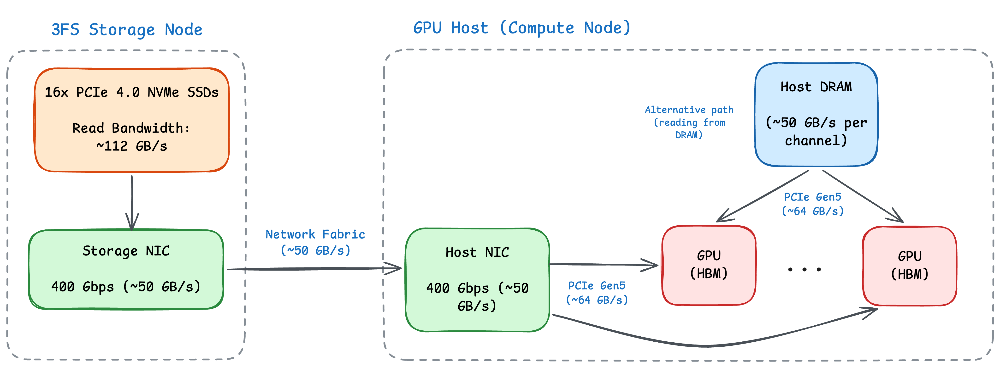 alt="DeepSeek 3FS storage node architecture">

This doesn't magically turn an SSD into RAM for cache reads. But it does explain why this setup isn't orders of magnitude slower than reading the cache straight out of DRAM.

## 第 26 页

### 📝 How to combine AdamW + Muon

As mentioned earlier in the paper, AdamW is also applied to the static biases and gating factors of the mHC modules.

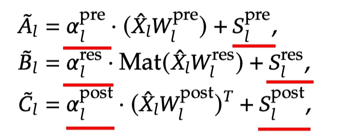 alt="These six parameters from Equations 3-5.">
These six parameters from Equations 3-5.

But why do we make this specific split? Why train some layers with Muon and others with AdamW?

Let's recall what we discussed about Muon in an earlier note. Traditional optimizers treat all parameters exactly the same. Muon is smarter. It understands that 2D weight matrices (like those in Linear layers) have unique geometric structures.

During the backward pass, it doesn't just apply raw momentum updates. Instead, it orthogonalizes them to create much more balanced parameter changes.

This means Muon’s operation only really makes sense when the parameter is a proper matrix transform. Let’s look at the exceptions:

- **Embedding module:** Yes, technically it's a 2D matrix of shape \(vocab\_size \times hidden\_dim\). But semantically, it's not a normal dense linear map—it's a lookup table. The rows correspond to discrete tokens, not continuous input features. AdamW is a better fit here because it maintains per-parameter adaptive second moments. This allows rows for rare and frequent tokens to get different effective learning rates.

- **Prediction head** (often called the LM head): it's It's a classifier over a categorical vocabulary. Its rows and columns are tied to token identities, not just hidden features.

- **RMSNorm:** The weights here are usually just a 1D scale vector. There is no meaningful 2D matrix geometry to orthogonalize. You could try reshaping it to \(1\times d\), but then Muon would just degenerate into normalizing or coupling the entire vector update. That's definitely not what you want.

- **mHC components:** The same logic applies to the mHC static biases and gates.

You can easily carry this logic over to your own experiments. Muon is fantastic for internal learned matrix transforms. For everything else, just stick to AdamW.

## 第 27 页

### 🎯 SwiGLU clamping

Even though they explicitly say "throughout the **training**," you absolutely have to do this during inference too. Otherwise, generation [breaks](https://github.com/sgl-project/sglang/issues/23752):

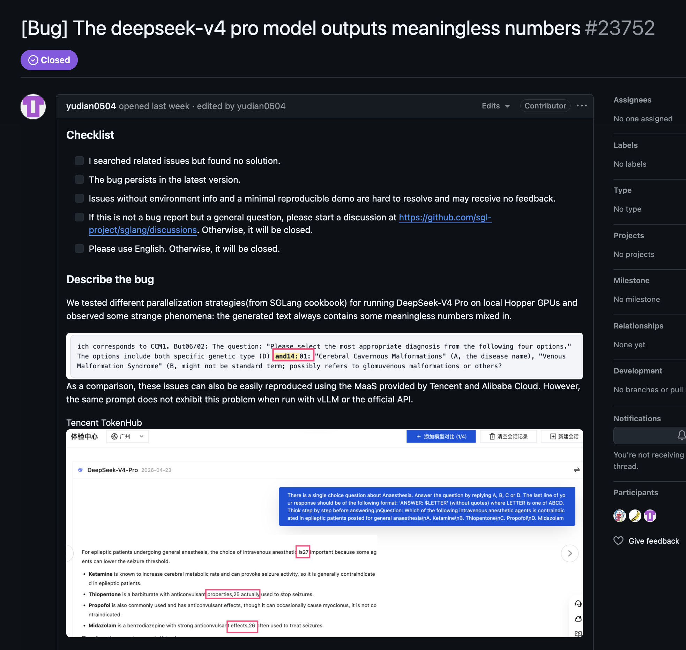 alt="Broken generation issue">

In DeepSeek's initial code release, the SwiGLU clipping for the shared expert was missing. There was even a comment right next to it, so leaving it out was a deliberate choice. (Did an LLM write that? 🤔)

Fortunately, the open-source community quickly tracked down the issue: "the missing clamp causes shared-expert SiLU output to grow to **±2000+** during inference. This pollutes the residual stream via `final_hidden_states += shared_output`, propagates through `mhc_post`, and degrades `lm_head` logits at sentence-boundary positions."

DeepSeek quickly [rolled out a fix](https://huggingface.co/deepseek-ai/DeepSeek-V4-Pro/commit/a1fd202632e91bc0efe4eedb63ce554649c53997):

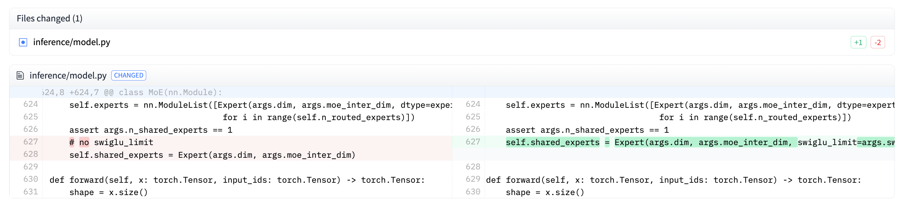 alt="DeepSeek bug fix commit">

Long story short: don't forget to clip your activations!

## 第 29 页

### 📝 Generative Reward Models

A Generalist Reward Model (GRM) is a model trained to evaluate non-verifiable or weakly verifiable tasks. These evaluation scores allow us to run RLVR (Reinforcement Learning from Verifiable Rewards) algorithms like GRPO.

Right now, DeepSeek has just [one paper](https://arxiv.org/abs/2504.02495) detailing their GRM. Personally, I suspect this specific approach is a bit outdated and has probably evolved (I'll touch on one of those changes in the next note). But I still want to give you a rough idea of how a GRM works.

The GRM is trained using RL. Given a prompt and a policy trajectory, it learns to write an evaluation plan—basically a set of principles and their relative weights. From there, it generates a critique, a partial score for each principle, and a final weighted score.

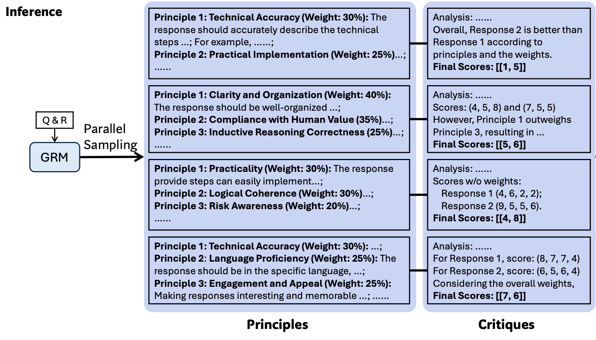 alt="GRM evaluation process diagram">
From [this paper](https://arxiv.org/abs/2504.02495)

This approach easily generalizes to tasks where a simple binary "right/wrong" score doesn't work. Think creative writing, report compilation, summarization, and many others.

### 📝 Same GRM ⇔ Policy model

As far as I know, DeepSeek hasn't published a standalone paper showing exactly how they train a general GRM alongside their base model. They do have a paper on [Inference-Time Scaling for Generalist Reward Modeling](https://arxiv.org/abs/2504.02495) that covers the core principles of GRM training. Interestingly, though, they don't even use it as a Reward Model for the LLM in GRPO in that work.

That said, we can find a very similar approach in [DeepSeekMath-v2](https://arxiv.org/abs/2511.22570). There, the authors train the exact same model in three distinct modes simultaneously:

- **Proof Generator**: actually solves the math problems.

- **Verifier**: identifies issues and scores proofs from the Proof Generator.

- **Meta-Verifier**: reviews the proof analyses produced by the Verifier.

As a result, the model masters all three skills. More importantly, this setup helps "incentivize the Proof Generator to identify and resolve as many issues as possible in their own proofs before finalizing them." Since the model already knows how to find errors and critique itself, it can self-verify on the fly while generating a solution. This is exactly what drives up the quality!

What's cool is that the authors didn't just combine all three modes right away. They arrived at this setup after running some error analysis:

> 

&lt;…&gt; we observed a critical limitation: when prompted to both generate and analyze its own proof in one shot, the generator tends to claim correctness even when the external verifier easily identify flaws. In other words, while the generator can refine proofs based on external feedback, it fails to evaluate its own work with the same rigor as the dedicated verifier.

This observation motivated us to endow the proof generator with genuine verification capabilities.

The proof verifier and generator create a tight feedback loop. The verifier improves the generator, and as the generator gets better, it produces new proofs that push the verifier’s current limits.

For the general domain, these verification capabilities might look a lot like the DeepSeek GRM. The model first comes up with "Principles" that determine the quality of a potential response for a given query. Then, it evaluates the answer based on these principles and calculates a final score using a weighted sum. Everything is learned end-to-end via RL, and the model writes its own reasoning to justify the score. Humans don't have to hardcode these principles at all.

 alt="GRM evaluation process diagram">
From [this paper](https://arxiv.org/abs/2504.02495)

## 第 31 页

### 🤖 Reasoning across agent turns

When I was using Codex and ChatGPT last year, I kept wondering: can these models actually see their own reasoning from the previous steps? Half the time, it felt like they couldn't. I’d point out a specific step in their logic and ask, "Why did you do that?"—and they'd completely lose the plot. They genuinely had no clue what I was talking about.

 alt="Hidden CoT example">

Now the meta has shifted: models are explicitly fed their previous reasoning steps. This keeps them from getting stuck in endless logic loops. Not only is it a massive UX upgrade, but it also slashes token usage, especially for tool calling. A model can formulate a plan and execute several tool calls sequentially, without needing to constantly reinvent the plan for future calls because it was discarded.

Even Anthropic, who are notoriously secretive about their closed-source Claude Code—talked about this in a recent [blog post](https://www.anthropic.com/engineering/april-23-postmortem):

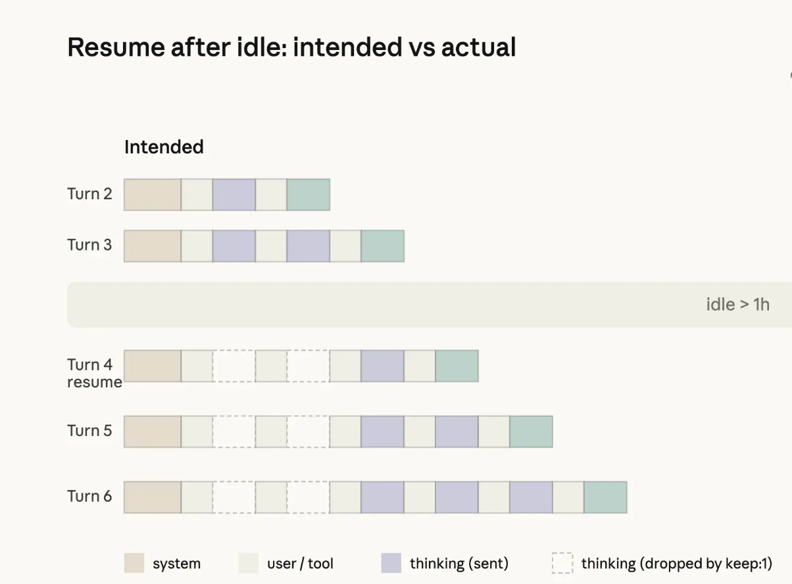 alt="Anthropic blog post snippet about reasoning chains">

## 第 33 页

### 🎓 Why reverse KL is used for on-policy distillation

Okay, what is reverse KL, and why don't we use forward KL? Let's break it down.

Approaches to post-training a student model generally fall into two categories. To quote a great [blog post](https://thinkingmachines.ai/blog/on-policy-distillation/#loss-function-reverse-kl) by Thinking Machines:

- **On-policy** training samples rollouts from the student model itself and assigns them some reward.

- **Off-policy** training relies on target outputs from an external source that the student learns to imitate.

The downside of off-policy training is that the student learns in contexts the teacher frequents, not the ones the student itself will actually encounter. This leads to compounding errors. If the student makes an early mistake that the teacher would never make, it drifts further and further away from the states it saw during training.

So why not use on-policy methods all the time? It helps to compare on-policy distillation to RL. The student generates trajectories, and the teacher grades each of them to provide feedback. But standard RL has a massive downside: this feedback is very sparse. The student only learns that its final answer was wrong and avoids that path in the future. It doesn't learn exactly where it made the mistake.

Intuitively, the core idea of on-policy distillation (OPD) is to sample trajectories from the student model and use a high-performing teacher to grade **each token** along the way.

Let's recall that Kullback-Leibler (KL) divergence is a type of statistical distance. It measures how much an approximating probability distribution \(Q\) (the student) differs from a target or reference distribution \(P\) (the teacher).

Crucially, divergences are generally asymmetric, meaning \(D_{KL}(P || Q) \neq D_{KL}(Q || P)\). Because of this asymmetry, we have to choose the order of the arguments, which dictates whether we use Forward KL or Reverse KL.

The formula for Forward KL, straight from [Wikipedia](https://en.wikipedia.org/wiki/Kullback%E2%80%93Leibler_divergence), looks like this:

\[D_{\mathrm{KL}}(P || Q)
= \sum_{x \in \mathcal{X}} P(x)\log\frac{P(x)}{Q(x)}\]

In this formula, \(x\) is the token actually sampled at a given position in the teacher's trajectory. Since we're using the teacher for rollouts, this is an off-policy approach. The loss is then summed over the sampled tokens in that rollout. \(P(x)\) is the probability predicted by the teacher model for that token given a specific prefix. \(Q(x)\) is the probability predicted by the student model for the exact same prefix.

In other words, the teacher's predicted probability acts as the weight in the sum we want to minimize. Suppose, for example, that at a given prefix, the teacher's distribution looks like this:

Token
Teacher (P(x))
Meaning

A
0.499
valid reasoning path

B
0.499
another valid reasoning path

C
0.002
bad / weird continuation

Now let's compare two possible students. Student 1 covers both good options and imitates the teacher's output almost exactly. Student 2 simply commits to a single good option:

Token
Student (Q(x))

A
0.997

B
0.001

C
0.002

Student 2 is basically saying, "I know the teacher likes both A and B, but I'll mostly just use A." It doesn't perfectly match the full teacher distribution, but it still confidently chooses a valid, teacher-approved token.

You can read Forward KL as asking: "For every token the teacher likes, does the student also assign probability mass there?" This happens because the multiplier in our equation is \(P(x)\), the teacher's probability. Intuitively, we're teaching the student not to ignore any important options the teacher considers valid—Student 2 from the example above would be punished.

This is exactly why Forward KL is known as a **mode-covering** objective. It forces the student to cover all the major modes of the teacher's distribution. If the teacher uses several plausible reasoning styles, Forward KL pushes the student to preserve every single one of them.

Reverse KL is, as the name suggests, reversed:

\[D_{\mathrm{KL}}(Q || P)
= \sum_{x \in \mathcal{X}} Q(x)\log\frac{Q(x)}{P(x)}\]

The critical difference here is that \(x\) is the token actually sampled at a position in the student's trajectory.

You can read this one as: "For every token the student wants to use, does the teacher also approve of it?" This makes sense because our multiplier is now \(Q(x)\), the student's probability.

If the student assigns zero probability to token B, it won't be penalized at all, even if the teacher thinks B is a perfectly valid option. However, Reverse KL heavily penalizes the student if it puts probability mass on a bad token like C, when the teacher considers \(P(C)\) to be tiny.

This is why Reverse KL is called **mode-seeking**. It tends to commit to one high-probability mode instead of spreading its probability mass over all available modes. In other words, it tells the student: "Pick something the teacher likes. You don't have to cover every possible thing they like, just pick one. But whatever you do, don't put mass on tokens the teacher deems unlikely.”

The 2023 [MiniLLM](https://arxiv.org/abs/2306.08543) paper provides a good empirical validation of this concept using a toy experiment setup:

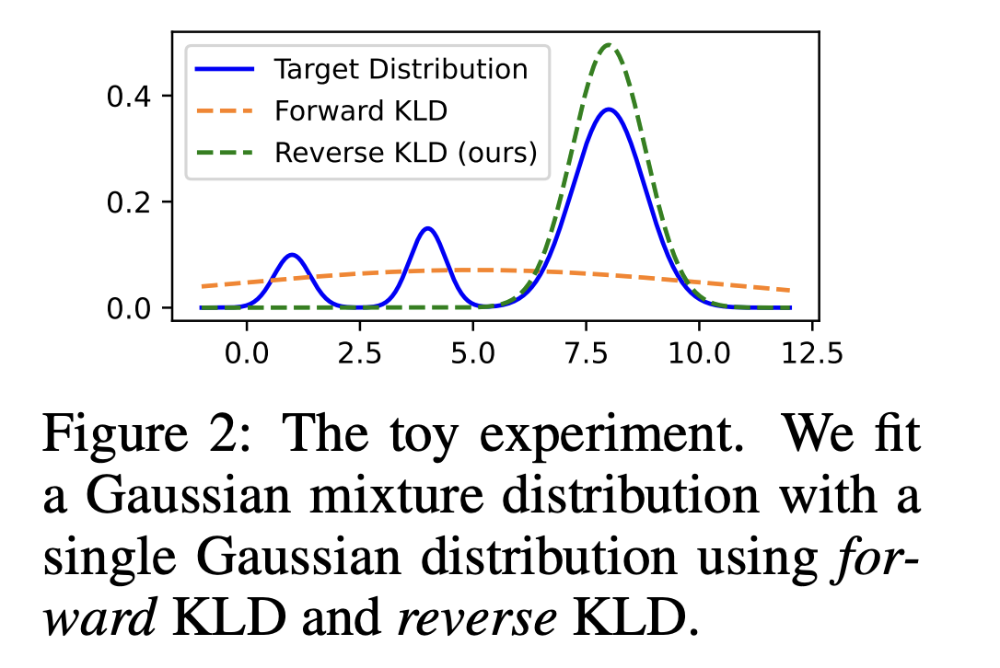 alt="MiniLLM paper empirical validation">

Real LLM experiments in that same paper confirm this behavior as well. We also saw this recently in the [Qwen 3 paper](https://arxiv.org/abs/2505.09388):

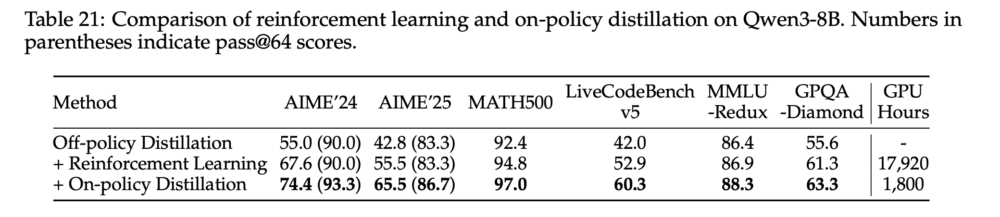 alt="Qwen 3 paper results">

The Qwen team reported that starting from the exact same off-policy distilled 8B checkpoint, on-policy distillation outperformed direct RL while using roughly one-tenth of the GPU hours.

The exact reason why OPD works this well is still an ongoing topic of discussion. Will Brown from Prime Intellect wrote an interesting piece on it [here](https://x.com/willccbb/status/2050038277454143918).

## 第 34 页

### 🎓 Teacher hidden-state caching

This might look like a tiny optimization you could easily skip. But let's run the numbers to see how much memory it actually saves.

To figure this out, we need the bit precision for the teacher's last-layer hidden states and materialized logits. The paper leaves this out, so let's keep it simple and assume standard 2-byte floats (BF16/FP16). This gives us the following memory footprint per teacher, per sequence:

- \(M_{\text{logits}} = \text{Seq\_len} \times |\text{Vocab}| \times 2\)

- \(M_{\text{hidden}} = \text{Seq\_len} \times \text{dim} \times 2\)

Let's assume a context length of 64k—a fairly standard size for agentic rollouts. For DeepSeek-V4 Pro \(|\text{Vocab}| = 131,072\) and \(d = 7168\), we'd need 16 GB to store the logits versus just 0.875 GB for the hidden states. That’s a difference of over 15 GB per sequence, per teacher.

(And yes, if they used FP8 instead of BF16/FP16, the absolute numbers would be cut in half, but the savings ratio stays exactly the same).

It's also worth noting that hidden states (and especially output logits) are not KV cache entries. They don't get compressed into chunks of 4 or 128 tokens, so we can't rely on those massive memory savings here.

DeepSeek mentions using over ten teacher models. That means we are saving over 150 GB per sequence. That number sounds so ridiculous I actually had to double-check my math.

## 第 38 页

### 📈 The SimpleQA-Verified situation

DeepSeek-V4 Pro crushing Kimi K2.6 here feels a bit off. Since Kimi is also a huge 1-trillion parameter model trained on over 30T tokens, the performance gap on SimpleQA seems disproportionately large. While I don't doubt V4's underlying quality, this result points toward overfitting or a failure to properly filter out the eval data from their pretraining set.

That said, I'm not saying DeepSeek is faking it. V4 performs legitimately well on [AA-Omniscience](https://artificialanalysis.ai/evaluations/omniscience)—a newer benchmark designed to measure a model's breadth of knowledge—where it still manages to outperform Kimi:

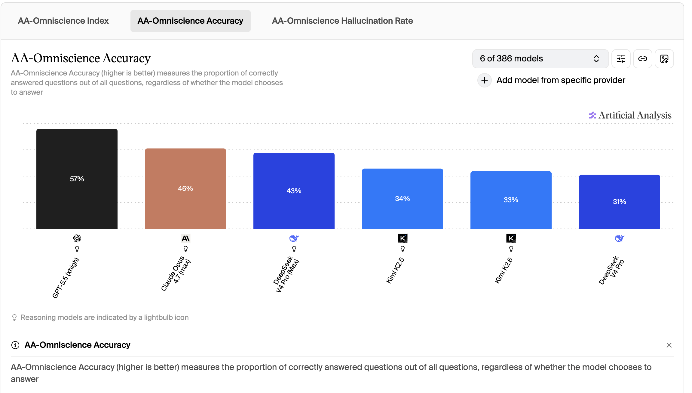 alt="AA-Omniscience benchmark comparison">

## 第 39 页

### 📈 Agentic effort levels

Looking at the table, there isn't a significant difference between the `high` and `max` settings on DeepSeek-V4 Pro for agentic tasks. While diminishing returns are expected at the highest reasoning tiers, the real issue is the complete lack of `medium` or `low` options.

Just look at how GPT-5.5 scales across a suite of benchmarks. Having these lower tiers gives you way more control:

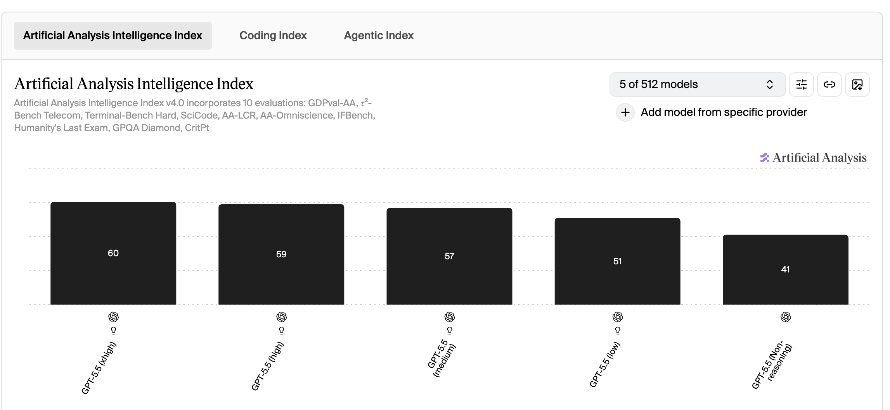 alt="GPT-5.5 benchmark scores across reasoning efforts">

Sure, GPT-5.5's `xhigh` and `high` settings are quite similar as well. However, the lower tiers are important for balancing quality, API costs, and response times. You can see how the reasoning chain lengths scale across different configurations:

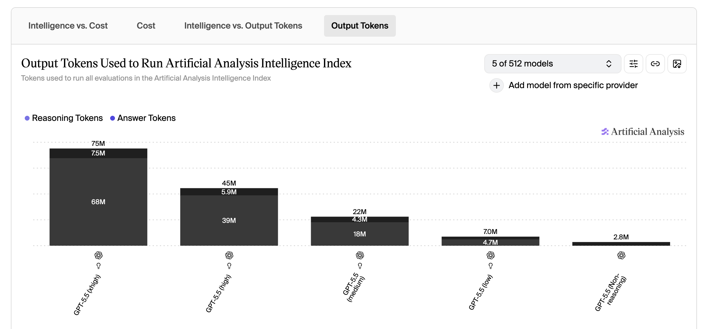 alt="Reasoning chain length comparison">

It looks like we'll have to wait for DeepSeek-V4.1+ to introduce `medium` / `low` reasoning efforts before we see any meaningful differentiation. I’d say `medium + max` is an ideal combo.

## 第 44 页

### 📈 Coding R&D benchmarks

DeepSeek aside, this is an insane amount of progress on real-world engineering tasks. Sonnet 4.5 came out on September 29, 2025, and Opus 4.6 dropped on February 5, 2026. In just four months, the success rate jumped from 50% to 80%.

And keep in mind, these aren't trivial problems. We're talking about complex R&amp;D tasks typically handled by a top-tier engineering team.

It's only going to accelerate from here 🚀
