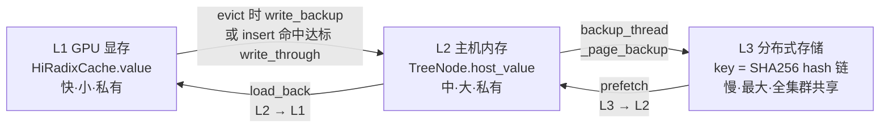
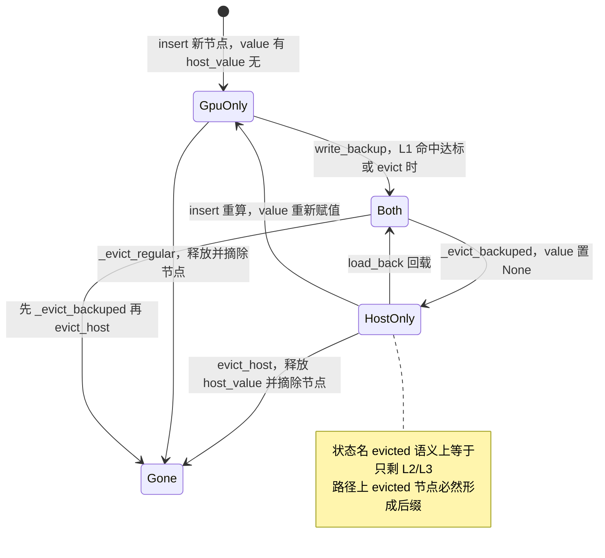
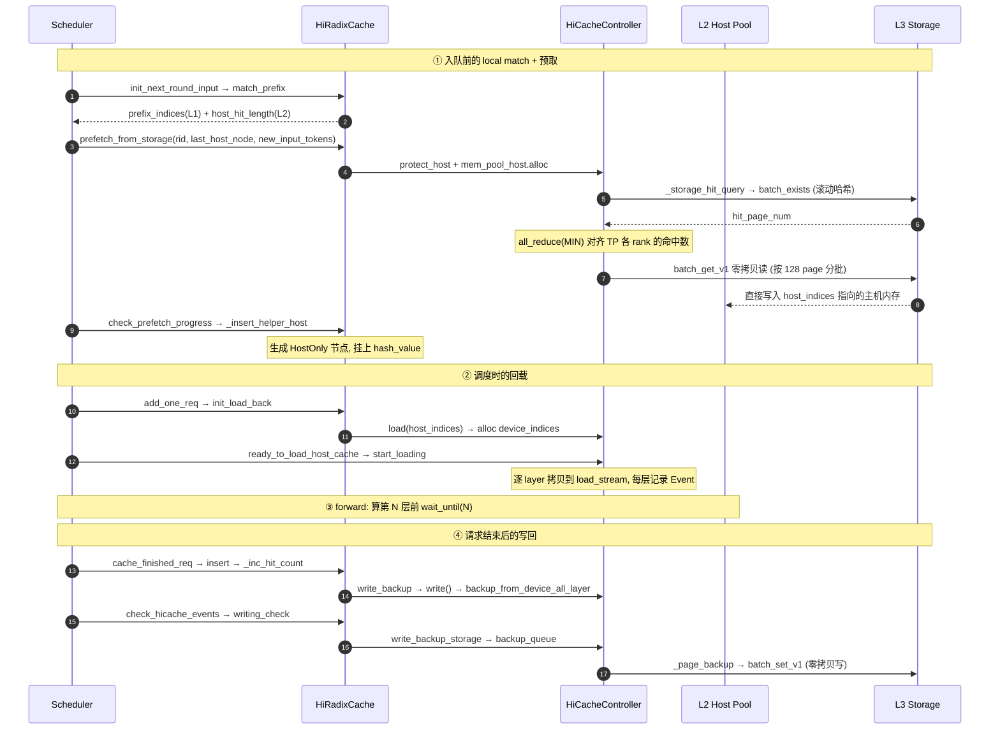
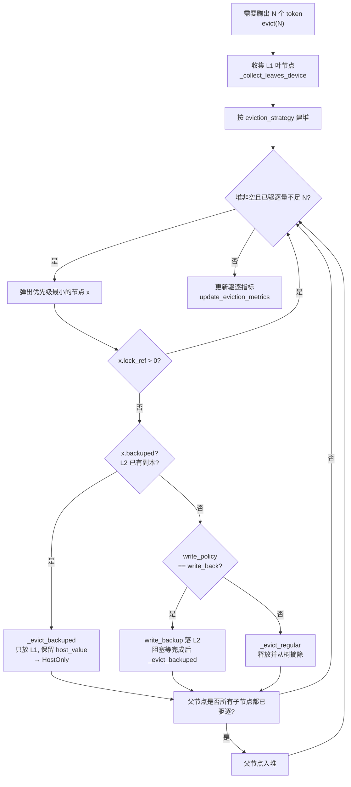
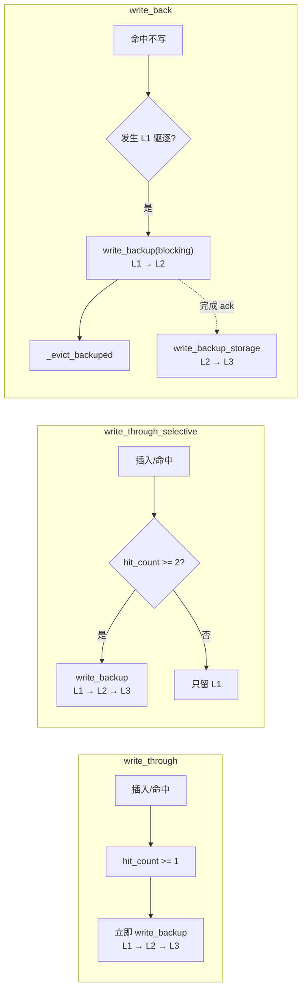
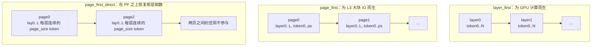
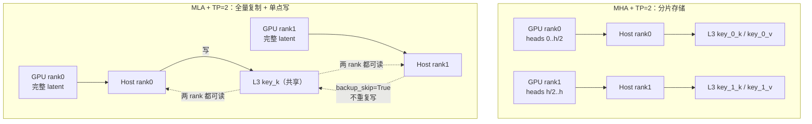

HiCache 是 SGLang 把 RadixAttention 从"GPU 显存内的前缀复用"扩展到"GPU + 主机内存 + 分布式存储"三级缓存的实现。本文不复述官方设计文档的结论，而是直接拆代码，回答三个问题：

1. **三级缓存各自的数据结构和生命周期是什么**；
2. **每一层的替换（驱逐）策略是什么，层与层之间靠什么规则联动**；
3. **它怎么适配 MHA / MLA / 不同 attention backend / 不同并行方式**。

本文基于 sglang 仓库 `main` 分支 commit `54df514ba`（2026-09-17）的代码。行号会随后续迭代漂移，请以仓库当前代码为准。

---

## 0. 结论先行

| 层级 | 介质 | 管理元件 | 驱逐粒度 | 驱逐策略 | 谁决定容量 |
| --- | --- | --- | --- | --- | --- |
| L1 | GPU 显存 | `HiRadixCache` + `token_to_kv_pool_allocator` | Radix 树节点（叶优先） | `EvictionStrategy`：LRU / LFU / FIFO / MRU / FILO / Priority | `--mem-fraction-static` 推导 |
| L2 | 主机 pinned memory | `HostKVCache` 子类 + 空闲槽栈 | Radix 树节点（**必须是已从 L1 踢出的节点**） | 同样走 `EvictionStrategy`，但候选集被三重条件过滤 | `--hicache-ratio` / `--hicache-size` |
| L3 | 分布式存储 | `HiCacheStorage` 抽象（Mooncake / 3FS / NIXL / AIBrix / 文件） | 后端自定（通常 key→page） | **SGLang 完全不管理**，交给后端做 TTL/LRU | 后端集群容量 |

一句话总览三层关系：



注意箭头是**非对称**的：

- 向上（L1→L2→L3）是**写回**，由命中计数或驱逐触发；
- 向下（L3→L2）是**预取**，有阈值与超时策略；
- L2→L1 是**回载（load back）**，带 layer 级计算/传输 overlap。

---

## 1. 元数据层：HiRadixTree 与 TreeNode 状态机

### 1.1 树节点携带"每一级是否存在"的信息

`HiRadixCache` 直接复用 `RadixCache` 的 `TreeNode`，只是给每个节点额外挂了"主机侧存在性"的字段（`python/sglang/srt/mem_cache/radix_cache.py:88`）：

```python
class TreeNode:
    def __init__(self, id=None, priority=0):
        self.children = defaultdict(TreeNode)
        self.parent: TreeNode = None
        self.key: RadixKey = None
        self.value: Optional[torch.Tensor] = None        # L1: GPU KV 的 slot 下标
        self.lock_ref = 0                                # 被运行中请求持有 → 禁止驱逐
        self.last_access_time = time.monotonic()         # LRU 依据
        self.creation_time = time.monotonic()            # FIFO 依据
        self.hit_count = 0                               # LFU 依据 / write_through_selective 依据
        self.host_ref_counter = 0                        # 被 prefetch/backup 持有 → 禁止驱逐 host_value
        self.host_value: Optional[torch.Tensor] = None   # L2: 主机内存的 slot 下标
        self.hash_value: Optional[List[str]] = None      # L3: 每页的 SHA256 链式哈希
        self.priority = priority                         # priority-aware 驱逐依据

    @property
    def evicted(self):
        return self.value is None

    @property
    def backuped(self):
        return self.host_value is not None

    def protect_host(self):     # host_ref_counter += 1
    def release_host(self):     # host_ref_counter -= 1，为 0 抛错
```

三个关键设计点：

1. **`value` 和 `host_value` 存的是 slot 下标而非数据**，数据本身在 `token_to_kv_pool_allocator` 的 device pool 和 `HostKVCache.kv_buffer` 里。树的节点只是"索引 + 元数据"，这一步让 local match 可以做到零数据拷贝。
2. **`evicted` / `backuped` 是两个正交的布尔**，组合出节点的四种状态。
3. **`hash_value` 是"每页一个 SHA256"的列表**，用链式哈希（`prior_hash`）把位置信息编码进去（`hicache_storage.py:15`）。这保证 L3 上的 key 对"同一段 token 出现在不同位置"是区分开的，跨实例、跨请求都能精确命中。

### 1.2 节点的四态状态机



关键不变量：**沿任意一条根到叶的路径，`evicted` 的节点必然构成后缀**。原因是 L1 驱逐是"叶优先 + 全子节点已驱逐才上推父节点"（`hiradix_cache.py:347`），所以不可能出现"中间节点被驱逐但更深的后代还在 GPU 上"。这个不变量是 `match_prefix` 能把 `device_indices` 当作**连续前缀**返回、并把 `host_hit_length` 简单向上累加的前提（`hiradix_cache.py:690`）。

---

## 2. 一次请求的完整数据流



### 2.1 Local match：只遍历树，不搬数据

`HiRadixCache.match_prefix`（`hiradix_cache.py:669`）返回四元组：

```python
value, last_node = self._match_prefix_helper(self.root_node, key)
# value: 只收集"未被驱逐"的节点 value → 拼成 device_indices
host_hit_length = 0
last_host_node = last_node
while last_node.evicted:            # 向上走，累加只存在于 L2 的长度
    host_hit_length += len(last_node.host_value)
    last_node = last_node.parent
while not last_host_node.backuped:  # 找到最深的一个"L2 里有数据"的节点
    last_host_node = last_host_node.parent
```

- `page_size > 1` 时 key 先按页截断（`hiradix_cache.py:680`），匹配也按页对齐比较（`radix_cache.py:168` 的 `_key_match_paged`）；
- 命中落在节点中间时会 `_split_node` 切出精确边界，同时把 `value` 和 `host_value` 一起切分（`hiradix_cache.py:807`）。

### 2.2 Prefetch：L3 → L2

触发条件在 scheduler 侧（`scheduler.py:1501`）：

```python
def _prefetch_kvcache(self, req: Req):
    if self.enable_hicache_storage:
        req.init_next_round_input(self.tree_cache)
        if req.last_node.backuped:      # 只有 L2 已有数据才发预取，否则完整性无法保证
            last_hash = req.last_host_node.get_last_hash_value()
            matched_len = len(req.prefix_indices) + req.host_hit_length
            new_input_tokens = req.fill_ids[matched_len:]
            self.tree_cache.prefetch_from_storage(
                req.rid, req.last_host_node, new_input_tokens, last_hash, prefix_keys)
```

`prefetch_from_storage`（`hiradix_cache.py:705`）做三件事：按 `page_size` 截断、做三重准入判断（storage 是否开启 / 长度是否过阈值 / 是否被限流）、分配主机内存（不够就 `evict_host` 腾）。

预取线程 `prefetch_thread_func`（`cache_controller.py:707`）是核心：

```python
hash_value, storage_hit_count = self._storage_hit_query(operation)
if self.tp_world_size > 1:
    torch.distributed.all_reduce(storage_hit_count_tensor, op=ReduceOp.MIN, ...)
if storage_hit_count < self.prefetch_threshold:
    self.prefetch_revoke_queue.put(operation.request_id)     # 收益太小 → 撤销
    self.append_host_mem_release(operation.host_indices)
else:
    operation.hash_value = hash_value[: storage_hit_count // self.page_size]
    self.append_host_mem_release(operation.host_indices[storage_hit_count:])
    self.prefetch_buffer.put(operation)
```

`_storage_hit_query`（`cache_controller.py:675`）逐批（`page_size * 128` token）滚动计算页哈希并调 `batch_exists`，**遇到第一个未命中的页就停**——因为 L3 命中必须是连续前缀。这是"all-or-nothing 到第一个空洞为止"的语义。

真正的数据搬运在辅助线程 `prefetch_io_aux_func` → `_page_transfer`（`cache_controller.py:627`），以 `storage_batch_size = 128` 页为单位，`page_get_func` 在零拷贝后端下就是 `batch_get_v1(hash_values, host_indices, extra_info)`——**主机内存地址直接交给后端**，没有任何中间 buffer。

调度器在 `get_new_batch_prefill` 的主循环里不断询问进度（`scheduler.py:1869`）：

```python
if self.enable_hicache_storage:
    prefetch_done = self.tree_cache.check_prefetch_progress(req.rid)
    if not prefetch_done:
        continue        # 本轮跳过这个请求，等预取
```

`check_prefetch_progress`（`hiradix_cache.py:608`）调用 `can_terminate_prefetch` 判定停止条件（见 §3.6），然后把已取回的数据通过 `_insert_helper_host` 挂成 `HostOnly` 节点。

### 2.3 Load back：L2 → L1，带 layer 级 overlap

`PrefillAdder.add_one_req`（`schedule_policy.py:608`）：

```python
if req.host_hit_length > 0:
    new_indices, req.last_node = self.tree_cache.init_load_back(
        req.last_host_node, req.host_hit_length
    )
    req.prefix_indices = torch.cat([req.prefix_indices, new_indices])
```

`load_back`（`hiradix_cache.py:410`）先把 `evicted` 的祖先链收集成 `nodes_to_load`，`torch.cat` 成一段连续的 host 下标，然后：

```python
if len(host_indices) < self.load_back_threshold:   # 默认 10 token，太小不值当
    self.dec_lock_ref(ancester_node); return None
device_indices = self.cache_controller.load(host_indices=host_indices, node_id=last_hit_node.id)
if device_indices is None:                          # 显存不够，先驱逐再重试
    self.evict(len(host_indices))
    device_indices = self.cache_controller.load(...)
```

设备侧的准备只是**分配下标 + 入队**（`cache_controller.py:474`），真正拷贝在 `start_loading`（`cache_controller.py:510`）：

```python
producer_id = self.layer_done_counter.update_producer()
...
with device_module.stream(self.load_stream):
    for i in range(self.layer_num):
        self.mem_pool_host.load_to_device_per_layer(
            self.mem_pool_device, host_indices, device_indices, i, self.io_backend)
        producer_event.complete(i)          # 每层完成即 record 一个 Event
```

然后 scheduler 把返回的 `producer_id` 塞进 batch（`scheduler.py:1942`）：

```python
if self.enable_hierarchical_cache:
    new_batch.hicache_consumer_index = self.tree_cache.ready_to_load_host_cache()
```

forward 时 device pool 的每次取 buffer 都会挂一次同步（`memory_pool.py:738`）：

```python
def get_key_buffer(self, layer_id: int):
    if self.layer_transfer_counter is not None:
        self.layer_transfer_counter.wait_until(layer_id - self.start_layer)
    return self._get_key_buffer(layer_id)
```

**这就是"计算与传输 overlap"的实现方式**：算第 N 层之前只等第 N 层的拷贝事件，而不是等整段 KV 拷完。`LayerDoneCounter` 维护 3 组 `LayerLoadingEvent` 轮转（`cache_controller.py:69`），支持 overlap 调度模式下多个 batch 在流水线里共存。

### 2.4 Write back：L1 → L2 → L3

`HiRadixCache` 没有覆写 `cache_finished_req`，写回是由 `RadixCache.insert` 路径上的命中计数触发的（`hiradix_cache.py:251`）：

```python
def _inc_hit_count(self, node: TreeNode, chunked=False):
    if self.cache_controller.write_policy == "write_back" or chunked:
        return                                   # write_back 策略不在命中时写
    node.hit_count += 1
    if not node.backuped:
        if node.hit_count >= self.write_through_threshold:
            self.write_backup(node)              # 达阈值 → L1 → L2
```

`write_backup`（`hiradix_cache.py:215`）分配主机槽、入写队列、并把节点记进 `ongoing_write_through`；`write_backup` 之后 `inc_lock_ref(node)` 锁住节点直到写完成（write_back 策略下不锁，因为它紧接着就会被驱逐）。

`check_hicache_events` 每个调度循环被调用一次（`hiradix_cache.py:498`）：

```python
def check_hicache_events(self):
    self.writing_check()      # 收割 L1→L2 的完成事件 → 触发 L2→L3
    self.loading_check()      # 收割 L2→L1 的完成事件 → dec_lock_ref
    if self.enable_storage:
        self.drain_storage_control_queues()   # 撤销预取 / 备份 ack / 释放主机内存
```

`writing_check` 在 storage 开启时会顺链触发 L2→L3（`hiradix_cache.py:299`）：

```python
for ack_id in ack_list:
    backuped_node = self.ongoing_write_through.pop(ack_id)
    self.dec_lock_ref(backuped_node)
    if self.enable_storage:
        self.write_backup_storage(backuped_node)      # → backup_queue → batch_set_v1
```

所以 **L1→L2 的完成是 L2→L3 的触发条件**，两级写回天然串行，不会出现"还在往主机写就往存储写"的撕裂。

---

## 3. 替换策略：逐层拆解

这一节是本文重点。

### 3.1 L1 驱逐：`HiRadixCache.evict`

`HiRadixCache` 覆写了基类的 `evict`，从"纯 LRU 链表"改成了**带可插拔策略的堆**（`hiradix_cache.py:321`）：

```python
def evict(self, num_tokens: int):
    leaves = self._collect_leaves_device()       # 只收集"设备上有值"的叶节点
    eviction_heap = [
        (self.eviction_strategy.get_priority(node), node) for node in leaves
    ]
    heapq.heapify(eviction_heap)

    num_evicted = 0
    write_back_nodes = []
    while num_evicted < num_tokens and len(eviction_heap):
        _priority, x = heapq.heappop(eviction_heap)
        if x.lock_ref > 0:                       # 被运行中请求持有 → 跳过
            continue
        if not x.backuped:
            if self.cache_controller.write_policy == "write_back":
                num_evicted += self.write_backup(x, write_back=True)   # 先落 L2
                write_back_nodes.append(x)
            else:
                num_evicted += self._evict_regular(x)                   # 直接释放
        else:
            num_evicted += self._evict_backuped(x)                      # 只放 L1，保 L2
        # 所有子节点都被驱逐了 → 父节点变成新的叶子，入堆
        for child in x.parent.children.values():
            if child in write_back_nodes: continue
            if not child.evicted: break
        else:
            new_priority = self.eviction_strategy.get_priority(x.parent)
            heapq.heappush(eviction_heap, (new_priority, x.parent))

    if self.cache_controller.write_policy == "write_back":
        self.writing_check(write_back=True)          # 阻塞等所有 write back 完成
        for node in write_back_nodes:
            assert node.backuped
            self._evict_backuped(node)
```

逐条读下来有四个要点：

**① 候选集是"设备侧叶节点"**（`_collect_leaves_device`，`hiradix_cache.py:906`）：节点本身没被驱逐、非根、且所有子节点都被驱逐（或没有子节点）。叶优先 + 父节点上推，保证驱逐是"从路径末端往前切"。

**② 策略可插拔**（`evict_policy.py`）：

```python
class LRUStrategy(EvictionStrategy):
    def get_priority(self, node): return node.last_access_time

class LFUStrategy(EvictionStrategy):
    def get_priority(self, node): return (node.hit_count, node.last_access_time)

class FIFOStrategy(EvictionStrategy):
    def get_priority(self, node): return node.creation_time

class MRUStrategy(EvictionStrategy):
    def get_priority(self, node): return -node.last_access_time

class FILOStrategy(EvictionStrategy):
    def get_priority(self, node): return -node.creation_time

class PriorityStrategy(EvictionStrategy):
    def get_priority(self, node): return (node.priority, node.last_access_time)
```

堆是小顶堆，优先级越小越先被弹出。虽然 `evict_policy.py` 定义了 6 种，但**命令行只暴露 LRU / LFU 两种**（`server_args.py:157`：`RADIX_EVICTION_POLICY_CHOICES = ["lru", "lfu"]`，可通过 `add_radix_eviction_policy_choices` 扩展），其余是给插件/内部使用的。

**③ 三条驱逐路径，差别在"要不要保住 L2"**：

| 分支 | 条件 | 动作 | 结果 |
| --- | --- | --- | --- |
| `_evict_regular` | 节点没有 L2 副本，且策略非 write_back | 释放 GPU slot，从树上摘除节点 | 数据彻底消失 |
| `_evict_backuped` | 节点已有 L2 副本 | 释放 GPU slot，`value = None` | 节点降级为 **HostOnly**，仍可被匹配命中并回载 |
| `write_backup` + `_evict_backuped` | 策略是 write_back 且没有 L2 副本 | 先写 L2（阻塞），再释放 GPU slot | 节点降级为 HostOnly |

**④ 与写回策略的耦合是这套设计的精髓**：`write_back` 模式下驱逐动作自带"落盘"语义，所以 `--hicache-write-policy write_back` 实际上把 L1 驱逐变成了"L2 填充器"。代价是驱逐路径上有一次阻塞式 `writing_check`。



### 3.2 L2 驱逐：`HiRadixCache.evict_host`

```python
def evict_host(self, num_tokens: int):
    leaves = self._collect_leaves()          # 基类版本: 无子节点 + lock_ref == 0
    eviction_heap = [(self.eviction_strategy.get_priority(node), node) for node in leaves]
    heapq.heapify(eviction_heap)

    num_evicted = 0
    while num_evicted < num_tokens and len(eviction_heap):
        _priority, x = heapq.heappop(eviction_heap)
        if x == self.root_node:
            break
        if not x.evicted:                    # ① L1 里还有副本 → 不动它
            continue
        if x.host_ref_counter > 0:           # ② 有正在进行的 prefetch/backup → 不动它
            continue
        num_evicted += self.cache_controller.evict_host(x.host_value)
        key = self.get_child_key_fn(x.key)
        v = x.parent.children.pop(key, None) # ③ 驱逐 L2 = 把节点从树上摘掉
        assert v == x, f"parent does not have child key, {key}"
        if len(x.parent.children) == 0 and x.parent.evicted:
            new_priority = self.eviction_strategy.get_priority(x.parent)
            heapq.heappush(eviction_heap, (new_priority, x.parent))
```

三个过滤条件构成的语义是：

1. **只有"已经从 L1 被踢出"的节点才允许丢 L2**。也就是说 L2 的淘汰严格晚于 L1，保证三级缓存是"逐级老化"而不是"随机老化"。这个设计让 L2 天然只保存"冷数据"，与 CPU cache 的 victim 语义一致。
2. **`host_ref_counter` 是 L2 侧的引用计数**，与 L1 的 `lock_ref` 正交：`protect_host()` 在预取发起前和备份发起前加，`release_host()` 在 `drain_storage_control_queues` 里对应 ack 后减。
3. **L2 淘汰 = 从树上删除节点**，而不是"降级到 L3"。这是一个容易误解的点：**HiCache 不把 L3 当作 L2 的 victims 容器**，L3 的写入只由 write policy 决定（§3.5）。所以一旦 L2 淘汰，如果 L3 里没有该 key，数据就真的没了——下次请求要重算。

另外注意 `evict_host` 用的是基类 `_collect_leaves`（`radix_cache.py:751`），它**不检查 `evicted`**，候选里既有 L1 叶也有 HostOnly 叶，靠循环内的 `if not x.evicted: continue` 过滤；而且它带 `lock_ref == 0` 条件，所以被运行中请求保护的节点不会被摘。

### 3.3 L3 驱逐：SGLang 不管

这是设计上明确的一处"甩锅"（`hicache_storage.py:62` 的抽象里没有任何 evict/TTL 接口）：

```python
class HiCacheStorage(ABC):
    def batch_get_v1(...) -> List[bool]: ...     # 零拷贝读
    def batch_set_v1(...) -> List[bool]: ...     # 零拷贝写
    def batch_exists(self, keys, extra_info=None) -> int:
        """return the number of consecutive existing keys from the start"""
    def clear(self) -> None: ...
    def get_stats(self): return None
```

`RadixCache` 的文档也明确写了（`hicache_design.md`）："为了减少开销，HiRadixTree 不存储也不持续同步 L3 KV cache 的元数据，而是在访问 L3 时实时向后端查询"。因此：

- L3 的替换策略 = **后端自己的策略**（Mooncake 的分布式 LRU/租约、3FS 的 TTL、NIXL 插件的对象存储生命周期）；
- SGLang 侧只在预取时用 `batch_exists` 探活，探到不存在就当 miss，**不会去修正树上的 `hash_value`**；
- 唯一的主动清理接口是 `clear_storage_backend()`（`hiradix_cache.py:193`），对应 HTTP 的 `/clear_hicache_storage_backend`。

### 3.4 替换策略总表

| 维度 | L1 | L2 | L3 |
| --- | --- | --- | --- |
| 候选集 | `_collect_leaves_device`：设备侧叶节点 | `_collect_leaves` + `x.evicted`：只在 L2 的叶节点 | 后端自定 |
| 优先级函数 | `eviction_strategy.get_priority` | **同一个** `eviction_strategy` | 后端自定 |
| 保护机制 | `lock_ref`（运行中请求） | `lock_ref` + `host_ref_counter`（IO 在途） | 后端自定 |
| 淘汰后动作 | 释放 GPU slot；可能先写 L2 | 释放主机 slot + **从树摘除** | 后端自定 |
| 触发点 | `token_to_kv_pool_allocator.alloc` 失败时 | `evict_host()` / `write_backup` 分配失败重试 / prefetch 分配失败重试 | 后端内部 |
| 是否阻塞 | write_back 策略下阻塞 | 非阻塞 | 取决于后端 |

一个细节：L1 和 L2 **共用同一个 `eviction_strategy` 实例**（都从 `RadixCache.__init__` 继承），所以 `--radix-eviction-policy lfu` 会同时改变两级的淘汰顺序。这是刻意的——冷热判断口径要统一。

### 3.5 提升/写入策略：L1 → L2 → L3 的准入规则

由 `--hicache-write-policy` 控制，三个档位的差异只体现在"什么时候把 L1 数据复制到 L2"（`hiradix_cache.py:122`）：

```python
self.write_through_threshold = (
    1 if server_args.hicache_write_policy == "write_through" else 2
)
```



代码上的对应关系（`hiradix_cache.py:251`）：

```python
def _inc_hit_count(self, node, chunked=False):
    if self.cache_controller.write_policy == "write_back" or chunked:
        return                      # write_back 完全不在这里写；chunked 请求也不写
    node.hit_count += 1
    if not node.backuped and node.hit_count >= self.write_through_threshold:
        self.write_backup(node)
```

三点值得注意：

1. **`chunked` 请求被显式跳过**。因为 chunked prefill 的中间态 KV 还可能被后续 chunk 的 prefix match 命中并复用，提前备份容易造成"半截数据落盘"。所以 chunked 路径只在 `cache_finished_req`（`chunked=False`）时才参与计数。
2. **L2→L3 的写入条件与 L1→L2 不同**：只要 storage 开启，`writing_check` 收割到 L1→L2 的 ack 后就无条件触发 L2→L3（`hiradix_cache.py:299`）。也就是说 `write_through` 与 `write_through_selective` 的差别只是"多快开始写 L2"（阈值 1 还是 2），而**一旦这一级决定写 L2，就会顺着链继续写 L3**——L3 侧没有独立的热度门槛。
3. **MLA 只在 tp_rank 0 真正写 L3**（`cache_controller.py:280`）：

```python
self.backup_skip = (
    self.storage_config.is_mla_model
    # todo: load balancing
    and self.storage_config.tp_rank != 0
)
```

原因见 §5.5。

### 3.6 预取策略：L3 → L2 的准入与终止

预取有三层准入，逐层收紧：

```python
# 第一层：长度阈值 + 限流（hiradix_cache.py:718）
if (not self.enable_storage
        or prefetch_length < self.prefetch_threshold        # 默认 256 token
        or self.cache_controller.prefetch_rate_limited()):  # 占用超限
    return

# 第二层：主机内存容量（hiradix_cache.py:726）
host_indices = self.cache_controller.mem_pool_host.alloc(prefetch_length)
if host_indices is None:
    self.evict_host(prefetch_length)      # 先腾 L2
    host_indices = self.cache_controller.mem_pool_host.alloc(prefetch_length)
if host_indices is None:
    last_host_node.release_host(); return  # 还是不够 → 放弃

# 第三层：后端实际命中数（cache_controller.py:732）
if storage_hit_count < self.prefetch_threshold:
    self.prefetch_revoke_queue.put(operation.request_id)   # 撤销，退内存
```

注意 `prefetch_threshold` 被夹紧过（`cache_controller.py:300`）：

```python
self.prefetch_threshold = max(prefetch_threshold, self.page_size)
self.prefetch_capacity_limit = int(0.8 * (self.mem_pool_host.size - self.mem_pool_device.size))
```

**限流口径是"在途预取 token 数不超过 L2 比 L1 多出来的那部分容量的 80%"**，留 20% 给正常回载/写回。

终止策略由 `--hicache-storage-prefetch-policy` 控制（`hiradix_cache.py:569`）：

```python
def can_terminate_prefetch(self, operation):
    if self.prefetch_stop_policy == "best_effort":
        return True                                   # 队列一腾空就走
    completed = (operation.completed_tokens == len(operation.hash_value) * self.page_size)
    if self.prefetch_stop_policy == "wait_complete":
        can_terminate = completed
    elif self.prefetch_stop_policy == "timeout":
        can_terminate = completed or self.is_prefetch_timeout(operation)
    # TP 同步：用 MAX 归约，任一 rank 能终止 / 已终止，则全体一致终止
    states = torch.tensor([1 - int(can_terminate), int(operation.is_terminated())], ...)
    torch.distributed.all_reduce(states, op=ReduceOp.MAX, group=self.tp_group)
    return states[0].item() == 0 or states[1].item() == 1
```

超时用线性函数（`hiradix_cache.py:561`）：

$$ \text{timeout} = \texttt{prefetch\_timeout\_base} + \texttt{prefetch\_timeout\_per\_page} \times \#\text{pages} $$

其中 `prefetch_timeout_per_page = page_size / 1024 * prefetch_timeout_per_ki_token`，默认 `base = 1s`、`per_ki_token = 0.25s`。也就是"固定开销 + 按页数线性增长的边际开销"，避免长序列被固定超时误杀。

### 3.7 三个在途表 + 三个 IPC 队列：状态收敛机制

HiCache 的并发面很宽（调度线程、写流、读流、预取线程、备份线程），状态收敛靠的是一组显式的在途表和队列（`hiradix_cache.py:114`）：

```python
self.ongoing_write_through = {}   # node.id → node   L1→L2 在途
self.ongoing_load_back = {}       # node.id → node   L2→L1 在途
self.ongoing_prefetch = {}        # rid → (node, tokens, host_indices, operation)
self.ongoing_backup = {}          # op.id → node     L2→L3 在途
```

| 表 | 保护动作 | 释放动作 |
| --- | --- | --- |
| `ongoing_write_through` | `inc_lock_ref(node)`（write_back 策略除外） | `writing_check` → `dec_lock_ref` + 触发 L2→L3 |
| `ongoing_load_back` | `inc_lock_ref(last_hit_node)` | `loading_check` → `dec_lock_ref` |
| `ongoing_prefetch` | `protect_host()` | `drain_storage_control_queues` / `release_host()` |
| `ongoing_backup` | `protect_host()` | `drain_storage_control_queues` / `release_host()` |

`drain_storage_control_queues`（`hiradix_cache.py:508`）把三个队列的排空合并成**一次 TP 同步**，这是很典型的"减少通信次数"的工程优化：

```python
qsizes = torch.tensor([
    cc.prefetch_revoke_queue.qsize(),
    cc.ack_backup_queue.qsize(),
    cc.host_mem_release_queue.qsize(),
], dtype=torch.int)
if self.tp_world_size > 1:
    torch.distributed.all_reduce(qsizes, op=ReduceOp.MIN, group=self.tp_group)
```

**用 MIN 归约取最小队列长度**，保证每个 TP rank 处理相同数量的条目——因为 "处理多少个" 会改变 radix 树的结构，各 rank 的树必须保持一致。同样的模式反复出现在 HiCache 里：

| 位置 | 归约 | 目的 |
| --- | --- | --- |
| `writing_check` | `all_reduce(MIN)` on `finish_count` | 各 rank 同步收割相同数量的写 ack |
| `check_prefetch_progress` | `all_reduce(MIN)` on `completed_tokens` | 各 rank 插入相同长度的 HostOnly 节点 |
| `can_terminate_prefetch` | `all_reduce(MAX)` on `[1-can_terminate, is_terminated]` | 任一方可终止/已终止 → 全体终止 |
| `prefetch_thread_func` | `all_reduce(MIN)` on `storage_hit_count` | 防止各 rank 对阈值判断不一致 |
| `drain_storage_control_queues` | `all_reduce(MIN)` on 三个队列长度 | 合并同步，减少通信 |

另外 `prefetch_tp_group` 是一个**独立的 gloo 通信组**（`cache_controller.py:313`），因为预取发生在后台线程里，不能复用 NCCL 主组。

---

## 4. 跨层一致性的两个基石

### 4.1 链式 SHA256：让 key 自带位置信息

L3 的 key 不能是"这段 token 的哈希"这么简单——同一段 token 出现在不同上下文里是不同的 KV。HiCache 用**前缀链式哈希**解决（`hicache_storage.py:15`）：

```python
def get_hash_str(token_ids: List[int], prior_hash: str = None) -> str:
    hasher = hashlib.sha256()
    if prior_hash:
        hasher.update(bytes.fromhex(prior_hash))
    for t in token_ids:
        if isinstance(t, tuple):
            # EAGLE bigram 模式: 两个元素都哈希进去
            for elem in t:
                hasher.update(elem.to_bytes(4, byteorder="little", signed=False))
        else:
            hasher.update(t.to_bytes(4, byteorder="little", signed=False))
    return hasher.hexdigest()
```

`compute_node_hash_values`（`radix_cache.py:192`）逐页计算，每页的 `prior_hash` 是上一页的哈希——**页哈希 = H(父页哈希 || 本页 token)**。这就把"从根到本页的完整路径"编码进去了，跨实例、跨请求的命中语义因此是精确的。

节点分裂时哈希列表也要跟着切（`split_node_hash_value`，`radix_cache.py:227`）；在叶子插入新节点时惰性计算（`hiradix_cache.py:899` 只在 `enable_storage` 时算）。

### 4.2 页对齐是三级的公共粒度

`page_size` 同时决定了四件事：

1. 树的匹配粒度（`_key_match_paged`）：一个页内只要有一个 token 不同，整页不算命中；
2. L3 的 key 粒度：**一页一个哈希、一页一个存储对象**；
3. 主机内存 allocation 的最小单位（`HostKVCache.alloc` 里有 `assert need_size % self.page_size == 0`）；
4. L3 的批量 IO 粒度（`storage_batch_size = 128` 页一批）。

这四者必须一致，否则跨级搬运会错位。所以 `prefetch_from_storage` 第一件事就是把长度截到页边界（`hiradix_cache.py:714`），`match_prefix` 也是（`hiradix_cache.py:680`）。

代价是**命中率与 IO 效率的权衡**：页越大，元数据越少、IO 越大块（`get_page_buffer_meta` 能返回更大的连续 buffer），但"只命中半页"的场景会浪费。

---

## 5. 异构 Attention 的适配

这是第二个核心问题。HiCache 面对的差异来自四个层面：**KV 数据结构、内存布局、并行切分语义、attention backend**。

### 5.1 分派入口：靠 KV pool 的运行时类型

`HiRadixCache.__init__`（`hiradix_cache.py:46`）是唯一的适配决策点：

```python
self.kv_cache = params.token_to_kv_pool_allocator.get_kvcache()
if isinstance(self.kv_cache, MHATokenToKVPool):
    self.token_to_kv_pool_host = MHATokenToKVPoolHost(
        self.kv_cache, server_args.hicache_ratio, server_args.hicache_size,
        self.page_size, server_args.hicache_mem_layout)
elif isinstance(self.kv_cache, MLATokenToKVPool):
    self.token_to_kv_pool_host = MLATokenToKVPoolHost(
        self.kv_cache, server_args.hicache_ratio, server_args.hicache_size,
        self.page_size, server_args.hicache_mem_layout)
else:
    raise ValueError(f"HiRadixCache only supports MHA and MLA yet")
```

整个 HiCache 的 attention 适配就是**两个主机侧 pool 子类 + 一组按 (pool类型 × layout × io_backend) 分派的传输算子**。树的逻辑对两者完全一致——这是 `RadixCache` 抽象带来的红利。

而树本身的选择在 scheduler（`scheduler.py:786`）：

```python
if envs.SGLANG_EXPERIMENTAL_CPP_RADIX_TREE.get():
    self.tree_cache = RadixCacheCpp(params=params, server_args=server_args)
elif self.enable_hierarchical_cache:
    self.tree_cache = HiRadixCache(params=params, server_args=server_args)
    self.tp_worker.register_hicache_layer_transfer_counter(
        self.tree_cache.cache_controller.layer_done_counter)
elif self.is_hybrid_swa:
    self.tree_cache = SWARadixCache(params=params, sliding_window_size=self.sliding_window_size)
elif self.is_ssm_model:
    self.tree_cache = MambaRadixCache(params=params, ...)
```

**这段 `elif` 链的优先级就是支持矩阵**：HiCache 排在 SWA / Mamba 之前，也就是说这两类模型一旦开了 `--enable-hierarchical-cache` 就会走 HiRadixCache 分支；如果它们的 KV pool 不是 MHA/MLA 类型（例如 `SWAKVPool`、`HybridLinearKVPool`），就会直接 `raise ValueError`。见 §5.9。

### 5.2 MHA vs MLA：每个 token 的字节数与布局

| | MHA（含 GQA/MQA） | MLA |
| --- | --- | --- |
| 设备侧结构 | `k_buffer[layer]` + `v_buffer[layer]`，每个形状 `(size, head_num, head_dim)` | 单个 `kv_buffer[layer]`，形状 `(size, 1, kv_lora_rank + qk_rope_head_dim)` |
| 每 token 字节数 | `head_dim × head_num × layer_num × itemsize × 2` | `(kv_lora_rank + qk_rope_head_dim) × 1 × itemsize × layer_num` |
| 主机池类 | `MHATokenToKVPoolHost` | `MLATokenToKVPoolHost` |
| 传输 | k/v 两路，`transfer_kv_per_layer` / `transfer_kv_all_layer` 系列 | 单路 latent，`transfer_kv_per_layer_mla` / `transfer_kv_all_layer_mla` |
| 存储后端 key | MHA：`{key}_{rank}_k` + `{key}_{rank}_v` | MLA：`{key}_k`（不带 rank） |

注意上面 `head_num` 是**该 rank 上的本地 head 数**（TP 切分之后），所以 MHA 每 token 的主机占用天然是 `1/tp_size`；而 MLA 的 `kv_lora_rank + qk_rope_head_dim` 是全量、各 rank 重复。

MHA 的 host pool 还额外缓存了所有层的数据指针，专供 kernel 后端用（`memory_pool_host.py:257`）：

```python
self.k_data_refs = [self.k_buffer[i] for i in range(self.layer_num)]
self.v_data_refs = [self.v_buffer[i] for i in range(self.layer_num)]
self.k_data_ptrs = torch.tensor([x.data_ptr() for x in self.k_data_refs],
                                dtype=torch.uint64, device=self.device_pool.device)
```

把指针预先放进 GPU tensor，`transfer_kv_all_layer` 的 kernel 就能直接读指针数组，不用逐层 launch。

### 5.3 主机侧内存布局

`--hicache-mem-layout` 有四种（外加 NPU 专用一种），直接决定 `kv_buffer` 的维度排列（`memory_pool_host.py:280`）：

```python
if self.layout == "layer_first":
    dims = (2, self.layer_num, self.size, self.head_num, self.head_dim)
elif self.layout == "page_first":
    dims = (2, self.size, self.layer_num, self.head_num, self.head_dim)
elif self.layout == "page_first_direct":
    dims = (2, self.page_num, self.layer_num, self.page_size, self.head_num, self.head_dim)
elif self.layout == "page_head":
    dims = (2, self.page_num, self.head_num, self.page_size, self.layer_num, self.head_dim)
```



| 布局 | 连续的是 | 优点 | 缺点 |
| --- | --- | --- | --- |
| `layer_first` | 同一层的所有 token | 与 GPU 计算的逐层访问天然一致，H2D 拷贝可以按层直接 `memcpy` | 一个 page 的数据散在 `layer_num` 段里，L3 写入要拆成 `layer_num` 个对象 |
| `page_first` | 同一个 page 的所有层 | 一个 page 的内存完全连续，可整体零拷贝给 L3 | 从 L2 回载到 GPU 时，每层都要跨 `layer_num` 步长取数，访存不连续 |
| `page_first_direct` | 一个 page 内、每一层的连续 `page_size` 个 token | 兼顾：L3 侧仍然连续（按 page 分配），L2→GPU 的拷贝又能按"页-层"聚合成连续块 | 需要 `--hicache-io-backend direct` 配合，且页间有对齐空洞 |
| `page_head` | 一个 page 内、每个 head 的连续 `page_size × layer_num` | 面向按 head 并行的拷贝 kernel | 布局复杂度最高，仅 MHA 支持 |

约束关系由 `_handle_hicache`（`server_args.py:1772`）自动修正在先：

```python
if self.hicache_mem_layout == "page_first_direct" and self.hicache_io_backend not in ["direct", "kernel_ascend"]:
    self.hicache_io_backend = "direct"
    logger.warning("Page first direct layout only support direct io backend")
```

以及 `HiRadixCache.__init__` 里对 `direct + page_first` 的强制降级（`hiradix_cache.py:38`）：

```python
if server_args.hicache_io_backend == "direct":
    if server_args.hicache_mem_layout == "page_first":
        server_args.hicache_mem_layout = "page_first_direct"
        logger.warning("Page first layout is not supported with direct IO backend, switching to page first direct layout")
```

**这些警告值得留意**：日志里出现 layout 被改写，说明你的配置组合不被支持，实际布局和你想的不一样，最好显式对齐配置。

### 5.4 I/O backend × layout 的算子分派矩阵

`MHATokenToKVPoolHost` 的两个核心方法就是一张派发表（`memory_pool_host.py:322` 与 `:425`）：

| io_backend | layout | 回载算子 | 备份算子 |
| --- | --- | --- | --- |
| `kernel` | `layer_first` | `jit_transfer_hicache_one_layer`（Triton JIT）/ `transfer_kv_per_layer` | `jit_transfer_hicache_all_layer` / `transfer_kv_all_layer` |
| `kernel` | `page_first` | `transfer_kv_per_layer_pf_lf` | `transfer_kv_all_layer_lf_pf` |
| `kernel` | `page_head` | `transfer_kv_per_layer_ph_lf` | `transfer_kv_all_layer_lf_ph` |
| `direct` | `layer_first` | `transfer_kv_direct` | `transfer_kv_direct` |
| `direct` | `page_first_direct` | `transfer_kv_per_layer_direct_pf_lf` | `transfer_kv_all_layer_direct_lf_pf` |
| `kernel_ascend` | `page_first_direct` / `page_first_kv_split` | `transfer_kv_dim_exchange`（H2D） | `transfer_kv_dim_exchange`（D2H） |

MLA 侧是同构的缩减版（`transfer_kv_per_layer_mla` / `transfer_kv_all_layer_mla` / `transfer_kv_per_layer_mla_pf_lf` / `transfer_kv_all_layer_mla_lf_pf`），没有 `page_head` 分支。

两个值得注意的实现细节：

**① `direct` 后端需要把索引搬到 CPU**（`cache_controller.py:491`）：

```python
def move_indices(self, op: CacheOperation):
    if self.io_backend == "kernel":
        if not host_indices.is_cuda:
            host_indices = host_indices.to(self.device, non_blocking=True)
        return host_indices, device_indices
    elif self.io_backend == "direct":
        if self.mem_pool_host.layout == "layer_first":
            device_indices = device_indices.cpu()
            host_indices, idx = host_indices.sort()       # 排序 → 页内连续
            return host_indices, device_indices.index_select(0, idx)
        elif self.mem_pool_host.layout == "page_first_direct":
            return host_indices, device_indices.cpu()
```

`layer_first + direct` 下要对 `host_indices` 排序并同步重排 `device_indices`，目的是把散乱的 GPU slot 变成按主机地址递增的顺序，让 `cudaMemcpyAsync` 能以页为单位连续拷贝。

**② kernel 路径下指针数组预置在 GPU**（见 §5.2），JIT kernel 的可用性还会按元素宽度做能力检查：

```python
self.can_use_jit = _is_cuda and can_use_hicache_jit_kernel(
    element_size=self.element_dim * self.dtype.itemsize)
```

元素过宽（大 head_dim 或宽 dtype）时自动回退到预编译的 `sgl_kernel.kvcacheio` 算子。

### 5.5 TP 语义：MHA 分片复制 vs MLA 全量复制

这是最容易写错缓存的一处差异。

**MHA + TP**：每个 rank 只持有 `head_num/tp_size` 个头。所以：

- 主机池每 token 只存本 rank 的分片（`head_num` 是本地 head 数）；
- L3 的 key 必须带 rank，否则不同 rank 的分片会互相覆盖。Mooncake 就是这么做的（`mooncake_store.py:528`）：

```python
def batch_exists(self, keys, extra_info=None) -> int:
    if self.is_mla_backend:
        query_keys = [f"{key}_k" for key in keys]
        key_multiplier = 1
    else:
        query_keys = []
        for key in keys:
            query_keys.append(f"{key}_{self.local_rank}_k")
            query_keys.append(f"{key}_{self.local_rank}_v")
        key_multiplier = 2
```

`HiCacheFile` 则是给整个 key 加后缀（`hicache_storage.py:189`）：

```python
if is_mla_model:
    self.config_suffix = f"_{model_name}"
else:
    self.config_suffix = f"_{model_name}_{tp_rank}_{tp_size}"
```

**MLA**：每个 rank 持有**完全相同**的 latent KV。所以：

- 每个 rank 仍然各自完成 L1→L2（本地回载需要），但 L2→L3 **只由 rank 0 写**，避免 N 倍冗余：

```python
self.backup_skip = (self.storage_config.is_mla_model and self.storage_config.tp_rank != 0)
```

- L3 的 key 不带 rank，所有 rank 共享同一份，读的时候各 rank 都可以按相同 key 命中。



顺带一提，`_generate_storage_config`（`cache_controller.py:372`）在 DP attention 开启时会改用 **attention 维度的 rank/size**：

```python
if is_dp_attention_enabled():
    self.tp_rank = get_attention_tp_rank()
    self.tp_size = get_attention_tp_size()
    self.dp_rank = get_attention_dp_rank()
else:
    self.tp_rank = get_tensor_model_parallel_rank()
    self.tp_size = get_tensor_model_parallel_world_size()
    self.dp_rank = 0
```

因为 KV cache 的切分维度由 attention 的并行方式决定，而不是 MoE 的 TP 维度。DP attention 下如果按 `get_tensor_model_parallel_rank()` 算，会把不该共享的 rank 混在一起。

### 5.6 Attention backend 的兼容性约束

`_handle_hicache`（`server_args.py:1792`）里有一段专门的 FA3 兼容处理：

```python
if ((self.enable_hierarchical_cache or self.disaggregation_decode_enable_offload_kvcache)
        and self.hicache_io_backend == "kernel"):
    # fix for the compatibility issue with FlashAttention3 decoding and HiCache kernel backend
    if self.decode_attention_backend is None:
        if not self.use_mla_backend():
            self.decode_attention_backend = "flashinfer" if is_flashinfer_available() else "triton"
        else:
            self.decode_attention_backend = "flashinfer" if is_sm100_supported() else "triton"
    elif self.decode_attention_backend == "fa3":
        self.hicache_io_backend = "direct"
        logger.warning("FlashAttention3 decode backend is not compatible with hierarchical cache. "
                       "Setting hicache_io_backend to vanilla I/O, which may lead to suboptimal performance with small page sizes.")
```

原因是 GPU 辅助的 I/O kernel 与 FA3 的 decode kernel 对 KV buffer 的地址/对齐假设冲突。自动处理策略是**优先换 decode backend（保性能 I/O），只在用户显式指定 fa3 时降级成 direct I/O**。

还有其他几处 backend 相关的自动调整，都是"改一个参数而不是拒绝启动"的风格：

| 场景 | 处理 |
| --- | --- |
| `--hicache-storage-backend mooncake` + `layer_first` | 按 io backend 改成 `page_first_direct`（direct）或 `page_first`（kernel），因为 L3 需要一个 page 连续 |
| `page_first_direct` + 非 direct io backend | 强制 `hicache_io_backend = direct` |
| `direct` + `page_first` | 强制改成 `page_first_direct` |
| NPU | 强制 `io_backend = kernel_ascend`；layout 按 backbone 选：MLA → `page_first_kv_split`（K/V 分开分配，便于 `transfer_kv_dim_exchange`），MHA → `page_first_direct`（`hardware_backend/npu/utils.py:55`） |
| `--enable-hierarchical-cache` + `--disable-radix-cache` | 直接报错，二者互斥（`server_args.py:2073`） |

### 5.7 EAGLE 投机解码：bigram key

EAGLE 的 draft 模型按 bigram 组织键，HiCache 在几处做了适配：

```python
# match_prefix / insert 前统一转换（hiradix_cache.py:671, :843）
key, _ = self.maybe_bigram_convert(key)

# 保证 value 长度对齐 bigram key 长度（hiradix_cache.py:848）
if self.is_eagle and value is not None:
    value = value[: len(key)]
```

`RadixKey.is_bigram` 标记会让 `get_hash_str` 按 tuple 处理（见 §4.1），保证 L3 的 key 在 bigram 模式下也唯一。测试用例 `TestHiCacheEagle`（`test/srt/hicache/test_hicache_variants.py`）同时校验 MMLU 分数和 `avg_spec_accept_length > 2.26`，防止"缓存能跑但把接受率搞坏"。

### 5.8 零拷贝 L3 接口

对支持零拷贝的后端（Mooncake / HF3FS / EIC），走的是 v1 接口（`hicache_storage.py:73`）：

```python
def batch_get_v1(self, keys, host_indices, extra_info=None) -> List[bool]:
    """Retrieve values for multiple keys."""
def batch_set_v1(self, keys, host_indices, extra_info=None) -> List[bool]:
    """Store multiple key-value pairs."""
```

参数只有 `host_indices`（主机内存下标），后端通过 `mem_pool_host.get_page_buffer_meta(indices)`（`memory_pool_host.py:573`）拿到**裸指针数组 + 每段长度**，直接把数据 RDMA/gpudirect 进主机内存。以 MHA 为例：

```python
def get_page_buffer_meta(self, indices):
    assert len(indices) % self.page_size == 0
    ptr_list = []
    kv_buffer_data_ptr = self.kv_buffer.data_ptr()
    v_offset = self.layer_num * self.size * self.head_num * self.head_dim * self.dtype.itemsize
    if self.layout == "layer_first":
        for index in range(0, len(indices), self.page_size):
            for layer_id in range(self.layer_num):
                k_ptr = (kv_buffer_data_ptr
                         + indices[index] * self.head_num * self.head_dim * self.dtype.itemsize
                         + layer_id * self.size * self.head_num * self.head_dim * self.dtype.itemsize)
                v_ptr = k_ptr + v_offset
                ptr_list.append(k_ptr); ptr_list.append(v_ptr)
        element_size = self.dtype.itemsize * self.page_size * self.head_num * self.head_dim
        element_size_list = [element_size] * len(ptr_list)
    elif self.layout in ["page_first", "page_first_direct", "page_head"]:
        for index in range(0, len(indices), self.page_size):
            k_ptr = (kv_buffer_data_ptr
                     + indices[index] * self.layer_num * self.head_num * self.head_dim * self.dtype.itemsize)
            ptr_list.append(k_ptr); ptr_list.append(k_ptr + v_offset)
        element_size = self.layer_num * self.dtype.itemsize * self.page_size * self.head_num * self.head_dim
        element_size_list = [element_size] * len(ptr_list)
    return ptr_list, element_size_list
```

**对照这段代码就能理解布局选择的实际代价**：`layer_first` 下一个 page 要拆成 `2 × layer_num` 个指针（每层 K/V 各一个），而 `page_first` 只需要 2 个（K/V 各一大块）。这就是官方文档说"`page_first` / `page_first_direct` 让一个 page 可以作为单个对象传给 L3"的具体含义。

选择零拷贝还是通用接口的依据是后端类型（`cache_controller.py:321`）：

```python
if (self.storage_backend_type in ["hf3fs", "mooncake", "eic"]) or (
    self.storage_backend_type == "dynamic"
    and bool(self.storage_config.extra_config.get("interface_v1", 0))):
    self.page_get_func = self._page_get_zero_copy
    self.page_set_func = self._page_set_zero_copy
```

通用接口 `_generic_page_get` / `_generic_page_set`（都标了 `# todo: deprecate`）会先 `mem_pool_host.get_data_page()` 把数据拷进一个临时 flat tensor 再交给后端——多一次拷贝，是给自定义后端兜底的路径。

### 5.9 不支持 / 边界场景

| 场景 | 现状 | 依据 |
| --- | --- | --- |
| MHA / MLA | 完整支持 | `hiradix_cache.py:48–65` |
| MHA-FP4 / MLA-FP4（`MHATokenToKVPoolFP4` 等） | 是 MHA/MLA 的子类，按父类路径分派；实际正确性取决于 `store_dtype` 与 host pool 的 `dtype` 推导是否一致 | `memory_pool_host.py:112` 用 `device_pool.store_dtype` |
| SWA（`--sliding-window-size`，如 gpt-oss 一类混合 SWA 模型） | **不支持**。`SWARadixCache` 有自己的一套"full 层 + swa 层"双 LRU 列表，且与 HiCache 在 `elif` 链上互斥；若 KV pool 不是 MHA/MLA，构造时直接 `ValueError` | `scheduler.py:793`、`swa_radix_cache.py:331` |
| Mamba / SSM 混合模型 | **不支持**。`MambaRadixCache` 有自己的 `full_lru_list` / `mamba_lru_list` 和 tombstone 机制，树的节点形态也不一样 | `scheduler.py:798`、`mamba_radix_cache.py:322` |
| NSA（`NSATokenToKVPool`） | 它是 `MLATokenToKVPool` 的子类，会被分派到 `MLATokenToKVPoolHost`。注意 FP8 store 下设备 buffer 的最后一维是 `override_kv_cache_dim`（含量化 scale），而 host pool 按 `kv_lora_rank + qk_rope_head_dim` 推导每 token 大小，两者不一致属于边界情况 | `memory_pool.py:1646`、`memory_pool_host.py:665` |
| 实验性 C++ radix tree | 只支持 non-hicache 路径，带 host cache 的分支直接 `NotImplementedError` | `radix_cache_cpp.py:71` |
| LMCache | 是 HiCache 的**替代方案**（`--enable-lmcache`），另一套实现，不走本文路径 | `mem_cache/storage/lmcache/` |
| 多模态 embedding cache | 正交组件（`MultiModalStaticCache` 是 `OrderedDict` + LRU），不参与三级 KV 缓存 | `multimodal_cache.py` |

---

## 6. 参数速查与调优要点

| 参数 | 作用 | 默认 | 调优提示 |
| --- | --- | --- | --- |
| `--enable-hierarchical-cache` | 总开关 | off | 与 `--disable-radix-cache` 互斥 |
| `--hicache-ratio` | L2 容量 / L1 容量 | — | 必须 > 1（代码里有 `assert self.size > device_pool.size`） |
| `--hicache-size` | L2 容量（GB/rank） | — | 优先级高于 ratio；启动时会校验主机剩余内存（预留 10GB） |
| `--page-size` | 三级公共粒度 | 1 | 大页提升 IO 效率但可能降低命中率；NSA 强制 64 |
| `--hicache-write-policy` | L1→L2 准入 | `write_through_selective` | 带宽充足用 `write_through`；L3 容量紧张用 `write_back` |
| `--hicache-io-backend` | H2D/D2H 通道 | `kernel` | `direct` 是兜底；fa3 decode 会自动降级到 direct |
| `--hicache-mem-layout` | L2 排布 | `layer_first` | 用 L3 就用 `page_first_direct`（direct）或 `page_first`（kernel） |
| `--hicache-storage-backend` | L3 后端 | none | 不开 storage 时只有 L1+L2 两级 |
| `--radix-eviction-policy` | 驱逐策略 | `lru` | `lfu` 对"长驻热点前缀"更友好；**同时影响 L1 和 L2** |
| `prefetch_threshold`（extra config） | 预取最小 token 数 | 256 | 会被 `max(threshold, page_size)` 夹紧 |
| `prefetch_timeout_base` / `prefetch_timeout_per_ki_token` | 预取超时 | 1s / 0.25s | 只对 `timeout` 策略生效 |
| `--hicache-storage-prefetch-policy` | 预取终止策略 | `best_effort` | 生产建议 `timeout`：兼顾 SLO 与命中率 |
| `hicache_storage_pass_prefix_keys`（extra config） | 给后端传滚动 prefix key | False | 路径式后端（如 3FS）需要 |

两个容量相关的隐含约束值得一提：

```python
# 主机内存必须比设备内存大，且 page 对齐
assert self.size > device_pool.size, \
    "The host memory should be larger than the device memory with the current protocol"
self.page_num = self.size // self.page_size + 1
self.size = self.page_num * self.page_size
```

以及预取限流上限 `prefetch_capacity_limit = 0.8 × (L2 容量 − L1 容量)`——**L2 与 L1 的容量差决定了预取并发度上限**。如果 `--hicache-ratio 1.2` 这种"L2 只比 L1 大一点"的配置配上一个高并发预取的负载，预取会被频繁限流，实际等效于没有 L3。

---

## 7. 小结

把上面的分析压缩成判断规则：

1. **HiCache 的"三级"是逻辑三级、物理两套元数据**。树节点上只有 L1/L2 的 slot 下标是精确维护的，L3 完全靠 `hash_value` 实时向后端查询——这是"不为了 L3 元数据付同步成本"的取舍，代价是 L3 的替换策略交给后端、SGLang 无法干预。
2. **替换策略只有一套实现，作用于两个层级**：`EvictionStrategy`（LRU/LFU/...）+ 叶优先 + `lock_ref`。L1 与 L2 的区别不是算法，而是**候选集的过滤条件**：L2 只能淘汰"已从 L1 退出"的节点，于是自然形成"逐级老化"。L3 的替换策略不在 SGLang 里。
3. **层间的联动靠"写策略 + 在途表 + 引用计数"三者**：write policy 决定提升时机，`ongoing_*` 四张表追踪在途操作，`lock_ref` / `host_ref_counter` 保证在途数据不被驱逐，`check_hicache_events` 每个调度循环收敛一次状态。
4. **Attention 适配是"两个 host pool + 一张算子分派表"**，树的逻辑完全不感知 attention 类型。真正的差异集中在三点：每 token 的字节数（MHA 两路 vs MLA 单路 latent）、TP 下的复制语义（MHA 分片 + key 带 rank vs MLA 全量 + 只 rank 0 写）、以及 backend 与 layout/io_backend 的兼容矩阵。
5. **配置组合会被自动改写**。看到日志里出现 "switching to ... layout" / "Setting hicache_io_backend to vanilla I/O" 这类 warning，说明实际运行配置和传入的不同，排障时应以日志为准。
