> **作者**: Aleksa Gordić
> **原文**: [Inside the Transformer: The Life of a Token](https://www.aleksagordic.com/blog/transformer)

在这篇文章中，我将深入剖析一个现代稠密 Transformer [[1]](https://arxiv.org/abs/1706.03762) 的内部实现。我只关注单张 GPU 上的前向传播——就当我们要执行一次训练步——而忽略反向传播和分布式系统的细节（实践中，大型 Transformer 在训练和推理时都会分片到多台设备上）。

作为贯穿全文的例子，我会使用 [Rnj 1.5](https://huggingface.co/EssentialAI/rnj-1.5-instruct) 的真实架构——这是我在 Ashish Vaswani 的 AI Lab（Essential AI Labs）与团队一起参与的模型。

> **Rnj-1.5 背后的团队：**
> 没有这样一群了不起的人，就不会有 Rnj 1.5（按字母排序）：
> 代码组：Adarsh Chaluvaraju, Devaansh Gupta, Yash Jain, Somanshu Singla, Saurabh Srivastava（技术负责人）, Anil Thomas
> STEM 组：Aleksa Gordić（技术负责人）, Michael Pust, Tim Romanski, Ali Shehper, Kurt Smith（技术负责人）, Ameya Velingker
> 基础设施组：Mike Callahan, Philip Monk（技术负责人）, Khoi Nguyen（技术负责人）, Alok Tripathy, Yash Vanjani
> 组织运营：Divya Mansingka, Mohit Parmar, Peter Rushton
> 研究与工程路线图：Ashish Vaswani

我们于本周发布了它，权重已在 [Hugging Face](https://huggingface.co/EssentialAI/rnj-1.5-instruct) 上开源。

它是 Rnj 1.0 [[2]](https://essential.ai/research/rnj-1) 的长上下文续作，把上下文窗口从 32k 扩展到 160k，在 128k 上下文窗口的 RULER 上拿到 79 分。这一版的编程能力也在更多评测框架上更强。详情见[模型卡](https://huggingface.co/EssentialAI/rnj-1.5-instruct)。

本文分为七个部分：

- Transformer 前向传播：一个 token 的宏观流转
- RMSNorm（均方根层归一化）：归一化层
- GeGLU MLP（多层感知机）：GELU 门控的前馈块
- MHA（多头注意力）：多头自注意力
- YaRN：面向长上下文的位置嵌入
- 核心 Attention：全局 + 块内局部
- Transformer 数学：每 token FLOPs、集群规模估算等

在后续文章中，我会深入条件计算，聚焦稀疏 Transformer（MoE）。

## Transformer 前向传播

作为贯穿全文的例子，假设我们从数据集中采样出 2 个「文档」，其中：

- batch size = 1
- 序列长度 = 16
- 开启文档打包（document packing）

我们将追踪一个 token 如何流经整个 Transformer，并在沿途拆解每个组件。

开始吧。花点时间分析下面这张图：

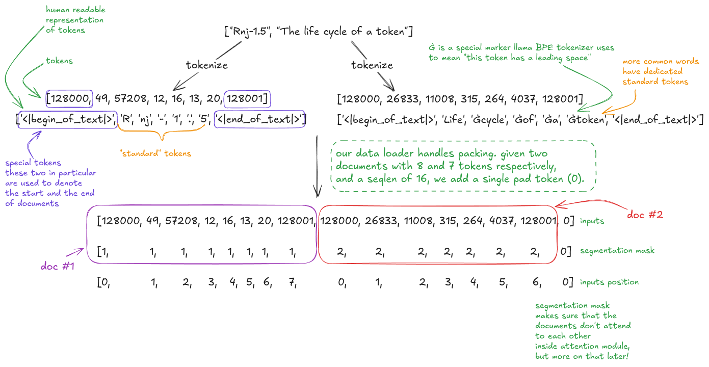

我们把文档分词成整数序列，再把两个文档打包进同一条序列。

在本文的讨论范围内，分词器是一个黑盒组件：输入文本，映射为一个 token 序列，每个 token 用一个整数 ID 表示。实践中，分词器是用 BPE 之类的算法在一个独立语料上「训练」出来的——这类算法通过反复合并高频字符/字节序列来学出一张词表。好的分词器设计有不少值得追求的性质；比如把每个数字单独切成一个 token，有助于数值推理。

在 token 之外，我们还构造两个辅助结构：

- 输入位置（inputs positions）——供位置嵌入模块（YaRN）使用
- 分段掩码（segmentation mask）——供 attention 做掩码使用

这就是预处理阶段。

> **旁注：**
> 出于效率考虑，数据会在训练开始前提前切好块，数据加载器把这些预处理好的结构直接喂进训练循环。到那时我们就再也不碰原始字符串了。（Spark）数据管线和数据加载器本身就足以各写一篇博客。

接下来，我们用输入 token 去索引嵌入表。

你可以把嵌入表理解为这个 LLM 的词表。

这次索引操作把整数序列变成了 16 个 4096 维 bf16 向量组成的序列：

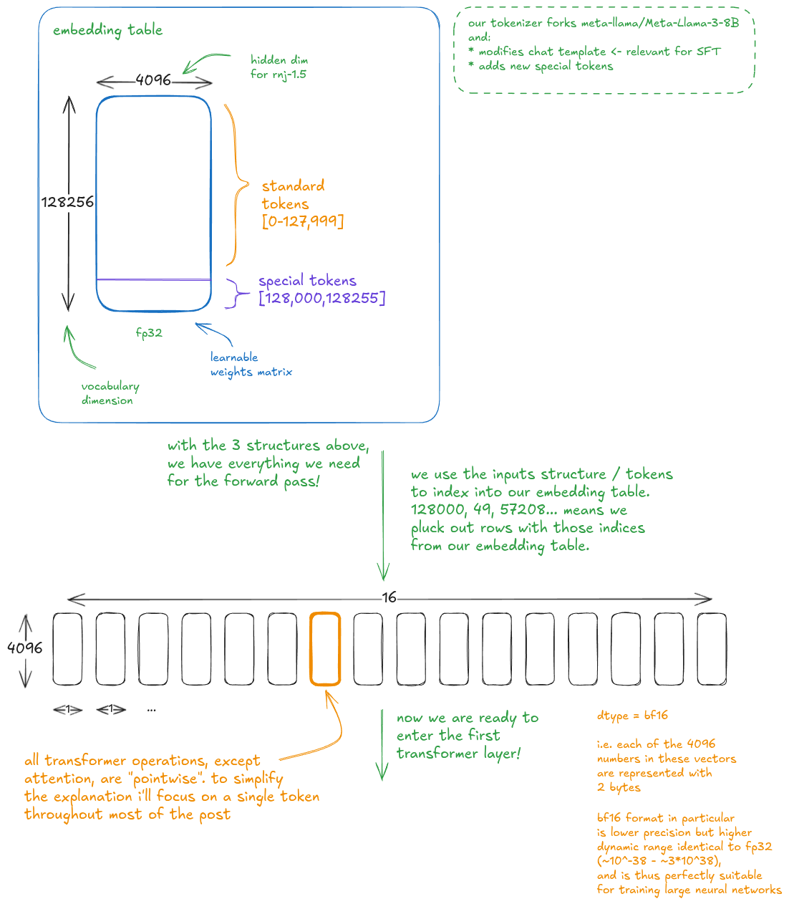

> **旁注：**
> 特殊 token 并不会在分词时自然出现——没有任何文本会映射到 ≥ 128,000 的 token ID。它们是在训练时注入的（推理时也会用到），用来提升性能（如 FIM、仓库打包等）或强制特定行为（如生成结束/轮次结束、工具调用）。

展开讲讲 FIM [[3]](https://arxiv.org/abs/2207.14255)（fill-in-the-middle，中间填充）特殊 token。

（预）训练时，我们拿一篇文档，切成前缀、中缀和后缀，拼成 `<FIM_PRE> prefix <FIM_SUF> suffix <FIM_MID> middle` 这样的序列，训练模型根据前缀和后缀预测中缀。这个能力随后可以在推理时派上用场。

举个例子，想象在你最爱的 IDE 里把 Rnj 1.5 当自动补全模型用。光标天然把代码切成前缀和后缀，中间是缺口。插入 FIM token、再以 `<FIM_MID>` 结尾，就等于提示模型为这个缺口生成补全。这些 token 帮助我们把意图传达给模型。

分词器本身足够单独写一篇博客，这里就此打住。

现在我们可以进入第一层 Transformer 了。

注意，所有 Transformer 层的结构（几乎）相同，所以我只讲一层。实践中我们要穿过 32 层——你可以把它想象成一个 for 循环，只不过在 Rnj 1.5 里每一层都有自己独立的可学习权重。

说「几乎」，是因为 Rnj-1.5 同时使用块内局部注意力和全局注意力层——两者唯一的区别是掩码。在更高的抽象层级上，「各层结构相同」这句话依然成立。细节留到 attention 一节。

另外注意，有些 Transformer 实现会在层间做权重共享或部分权重共享（变体很多），但这里我们只关注 Rnj 1.5。

让我们做一次穿过 Transformer 块的前向传播。仔细分析下图：

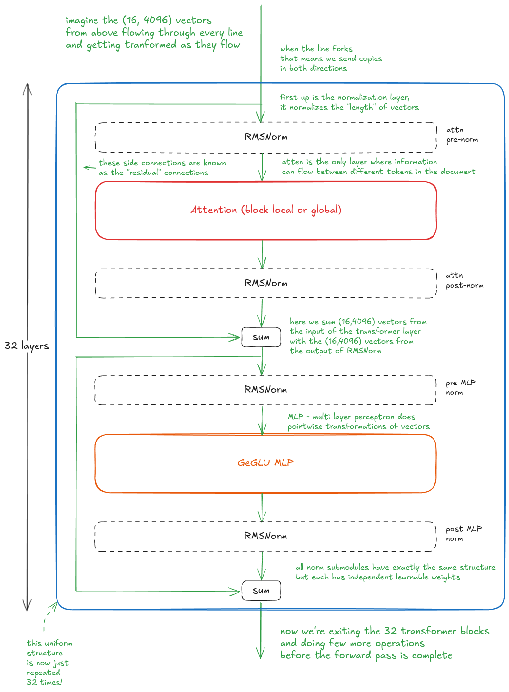

宏观上看，一个块由四个 RMSNorm 子模块、一个 MLP、一个 attention 模块、两条残差连接和两次求和组成。残差连接只是把块中较早时刻的向量原样向前传递。

重要的是，除 attention 外，所有子模块都作用于单个向量。

> **补充背景：**
> 实践中你会发现 Transformer 块有非常多的变体。设计选择包括：归一化层的数量、类型与摆放位置，MLP 的具体结构（门控 vs 非门控、门控函数的选择等），残差连接的结构（恒等映射、Attention Residuals [[4]](https://arxiv.org/abs/2603.15031) 等），尤其是 attention 模块。
> 大体上，注意力机制在序列长度方向要么是二次的（如 MLA [[5]](https://arxiv.org/abs/2405.04434)、缩放点积注意力等），要么是线性的（如 Kimi Linear [[6]](https://arxiv.org/abs/2510.26692)），两者在建模能力（尤其长上下文）与效率之间各有取舍。

向量离开最后一个 Transformer 块后，通过一次矩阵乘法被投影到 128,256 维空间，得到 logits，再经 softmax 转成概率分布。推理时我们从这个分布里采样，训练时它进入交叉熵损失。

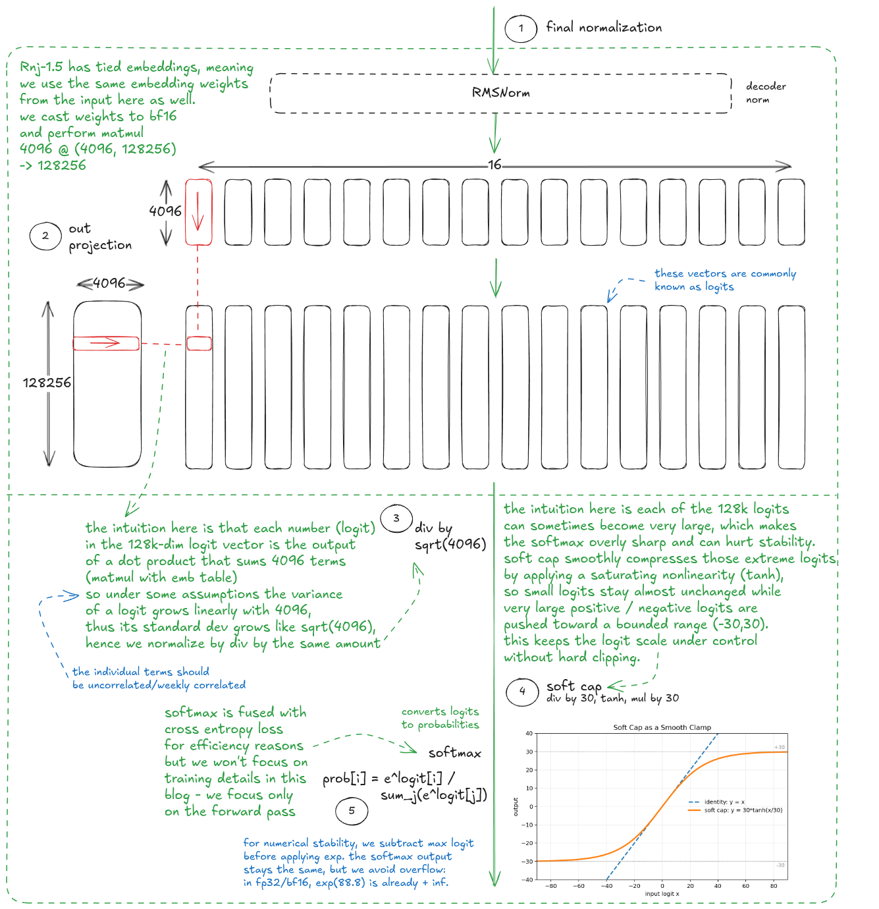

接下来，我们深入各个子层。这次我按倒序讲——这样恰好是从最简单到最复杂的顺序：

- RMSNorm（均方根层归一化）
- GeGLU MLP（多层感知机）
- Attention（缩放点积注意力）

## RMSNorm（均方根层归一化）

RMSNorm [[7]](https://arxiv.org/abs/1910.07467) 是一种用来稳定深度神经网络训练的归一化技术。

如前所述，RMSNorm 作用于单个向量，所以我们只看一个 bf16 的 4096 维向量（其余向量都以同样方式并行处理）。输出的形状和数据类型不变：

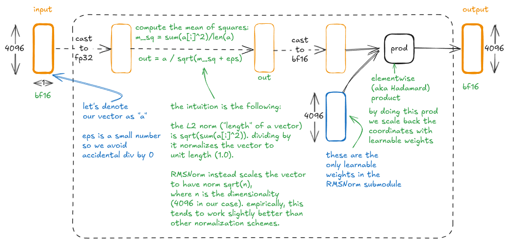

## GeGLU MLP（多层感知机）

MLP 是一个简单的逐位置（pointwise）前馈神经网络，用来学习输入与输出向量之间的非线性关系。

我们的变体是 GeGLU（GELU 门控线性单元 [[8]](https://arxiv.org/abs/2002.05202)），门控机制使用 GELU，形式为 `W2 @ GELU(W0@X)*(W1@X)`：

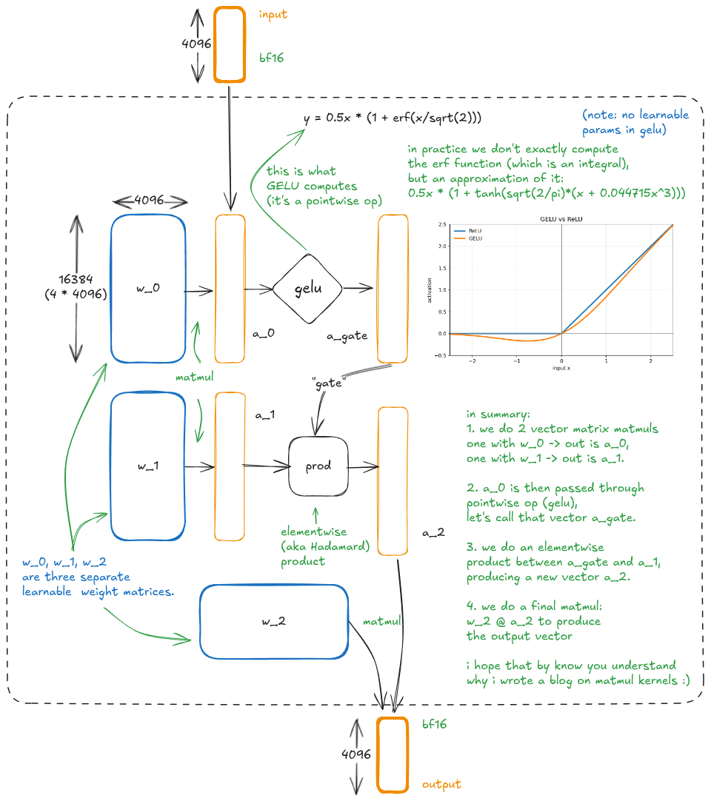

用 ReLU 的时候，「门」是字面意义的门：门控向量非负，只会抑制或缩放特征。换成 GELU 后，门控值可以为负，门还能翻转特征的符号——「门」这个词如今只是一个宽松的历史叫法了。

## MHA（多头注意力）

MHA 是一种自注意力机制，用于建模序列中不同 token 之间的关系。我们用的是 MHA 的一个特殊变体，叫 GQA，全称分组查询注意力（group query attention）——K/V 头的数量比 Q 头少，因此多组查询（group）会关注同一组键。

我会先给出宏观概览，然后深入两个最有意思的组件：YaRN 和核心 attention。

我们先把每个向量各自映射成查询、键、值向量，然后 reshape、归一化查询与键、施加 YaRN（通过旋转注入位置信息）。接下来是核心 attention，跨位置混合信息。最后做一次线性投影得到输出。

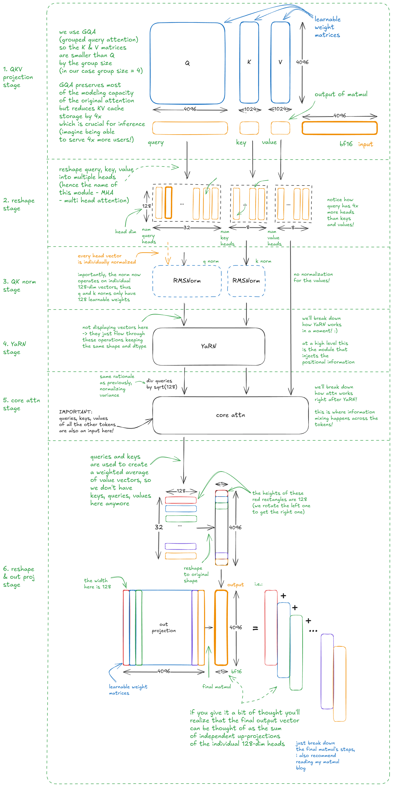

现在让我们聚焦 YaRN（Yet another RoPE extensioN）。

## YaRN

YaRN [[9]](https://arxiv.org/abs/2309.00071) 对 RoPE [[10]](https://arxiv.org/abs/2104.09864)（旋转位置嵌入）做了一处巧妙的修改，使模型能更好地外推到更长的上下文长度。

可是，我们为什么首先需要位置嵌入呢？

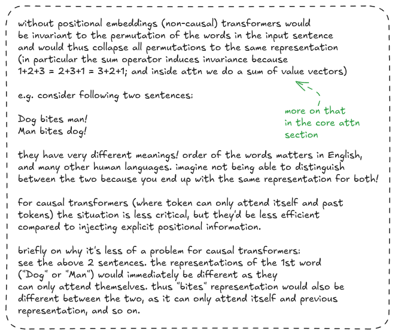

理解了「为什么」，再来看 RoPE 是怎么工作的：

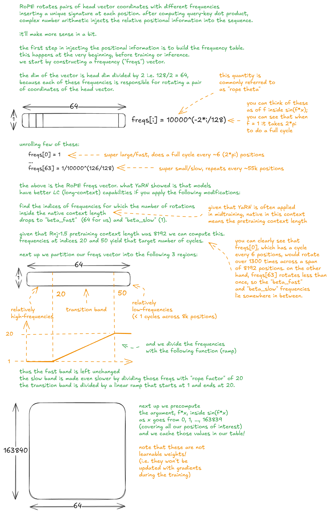

这张图可视化了不同 YaRN 频率的行为。注意，我们最慢的频率每 108.8 万个位置才转完一圈！

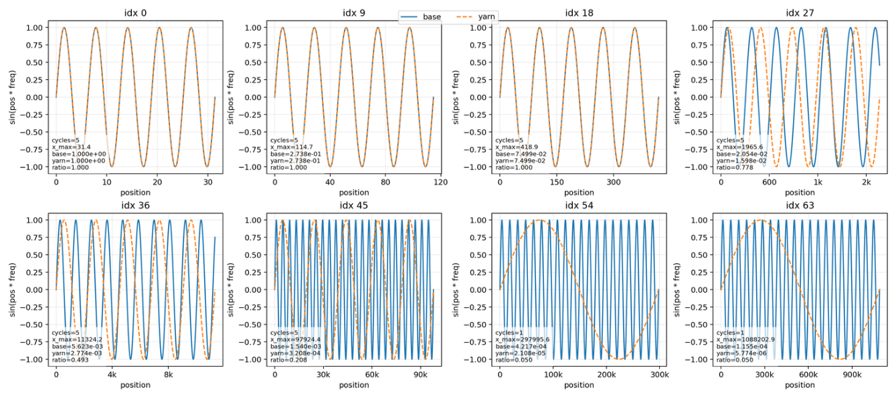

有了这些，我们就可以看位置嵌入是如何在前向传播中被注入的：

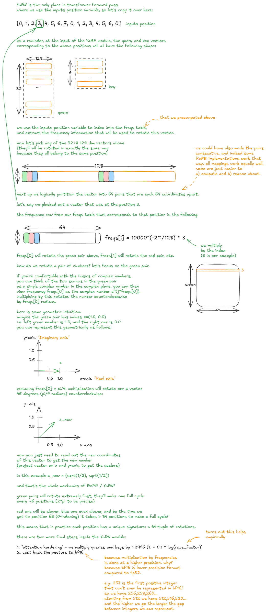

YaRN 的前向传播到这里就讲完了。

弄懂了机制之后，你可能还在疑惑：YaRN 通过对查询和键向量做成对的坐标旋转、再点积，是怎么把相对位置信息编码进去的？

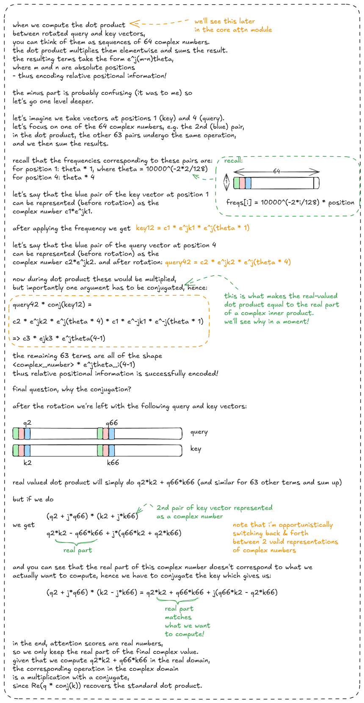

RoPE/YaRN 的全部内容就这么多！ :)

## 核心 Attention

最后来分析核心注意力机制。实践中我们用的是 FlashAttention——它值得单独写一篇（我在 23 年真写过一篇，[去看看](https://gordicaleksa.medium.com/eli5-flash-attention-5c44017022ad) [[11]](https://gordicaleksa.medium.com/eli5-flash-attention-5c44017022ad)）。这里我们走一遍朴素（vanilla）注意力。

核心 attention 是序列中 token 之间建模关系的机制。花点时间分析下图：

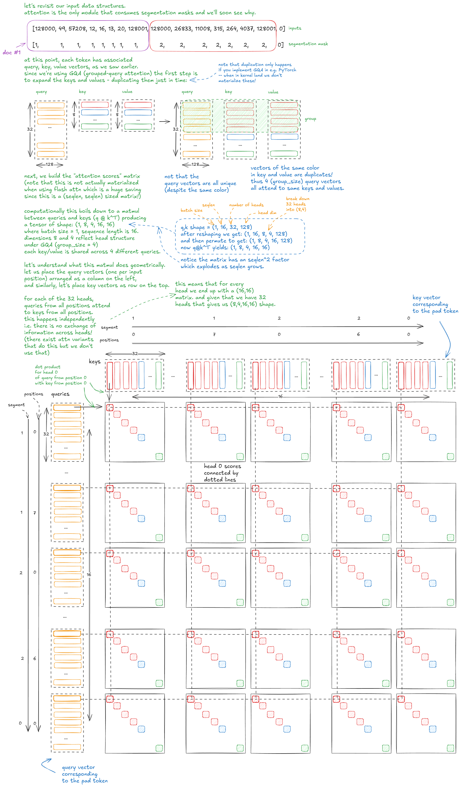

如果到这一步就停下，会出现两个问题：

- 文档 1 的 token 能关注到文档 2 的 token（反之亦然）
- token i 能关注到 token i+1（未来的 token），破坏了因果性

要阻止这些，就得引入掩码！

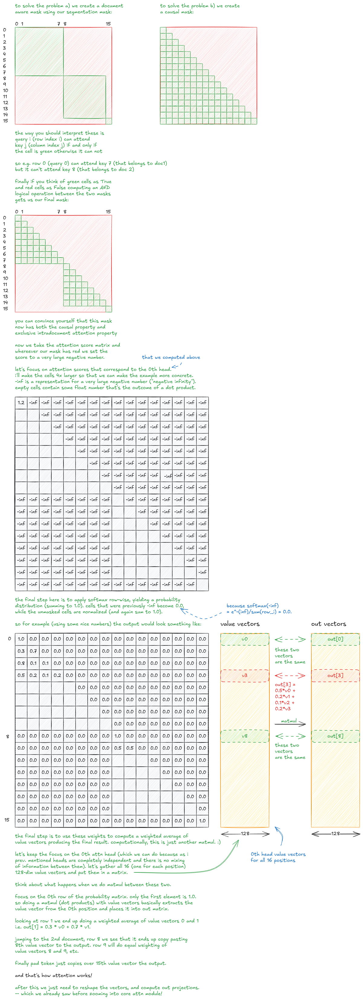

现在想象序列长度不是 16 而是 32,768。为简单起见，假设是单篇文档、无填充。掩码会长什么样？

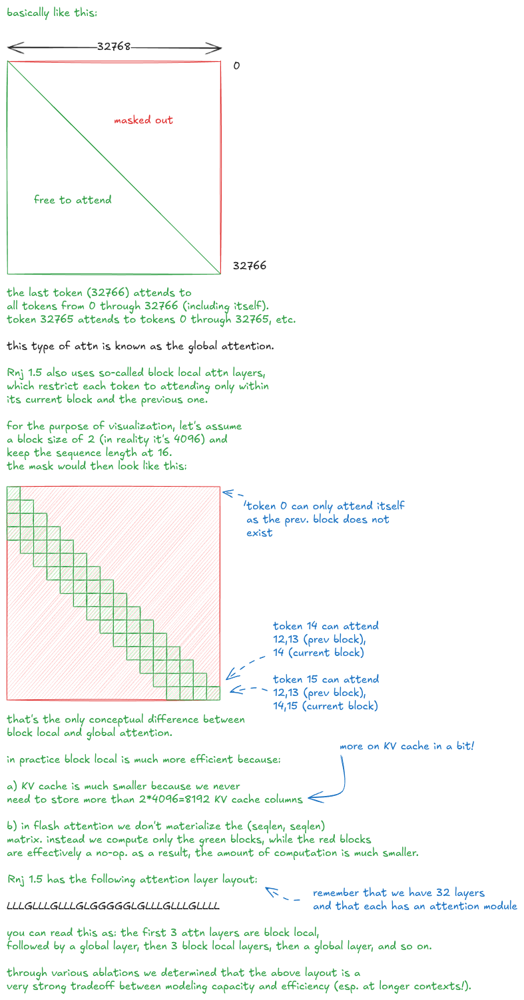

换一种方式来看这个布局，聚焦位置 9,000 和 10,000 上的两个 token：

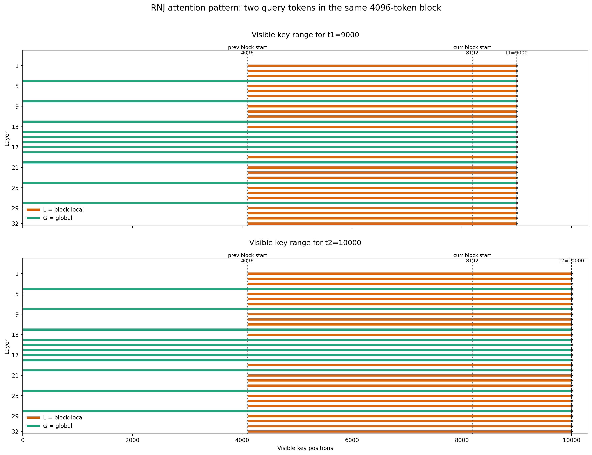

可以看到，在大多数层（块内局部）里，这两个 token 无法关注 4,096 以外的位置；而在其余八层（全局）里，它们可以一路回看到位置 0。

## Transformer 数学

最后，我想简单谈谈 KV 缓存——它是理解推理的极其重要的概念。到目前为止我们看的都是训练时的前向传播。

推理时，Transformer 是自回归的——一次生成一个 token。如果每一步都为之前所有 token 重算一遍键和值，效率会低得离谱。好在没必要：在因果 Transformer 里，它们保持不变。我们只需算一次，存进缓存。

来过一遍 KV 缓存最基本的存储需求：

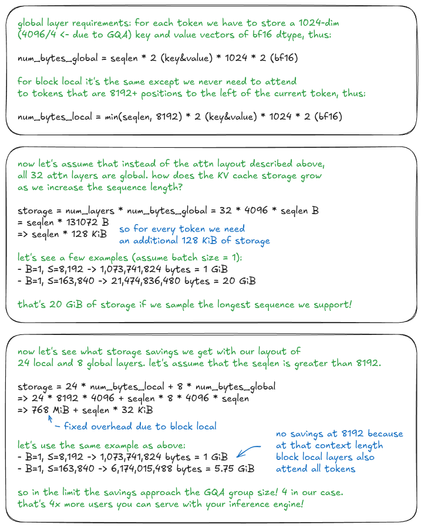

再算一算 Rnj 1.5 有多少可学习参数。只需过一遍架构，把所有可学习权重清点一遍即可。

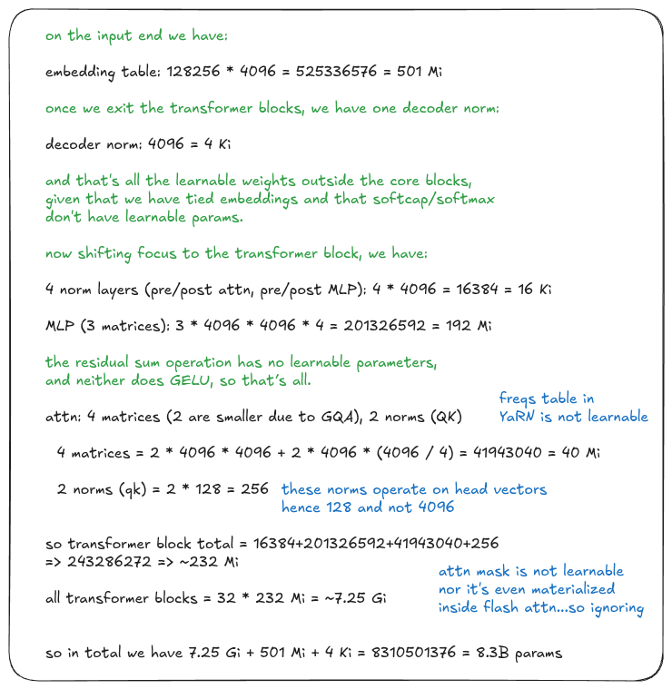

方便心算的经验法则：你只需数 MLP 里的 3 个矩阵和 attention 里的 4 个矩阵，其余都可以忽略。

再算算每个 token 需要多少计算量（FLOPs）。这对规划集群规模极其有用——详见本节之后的内容。

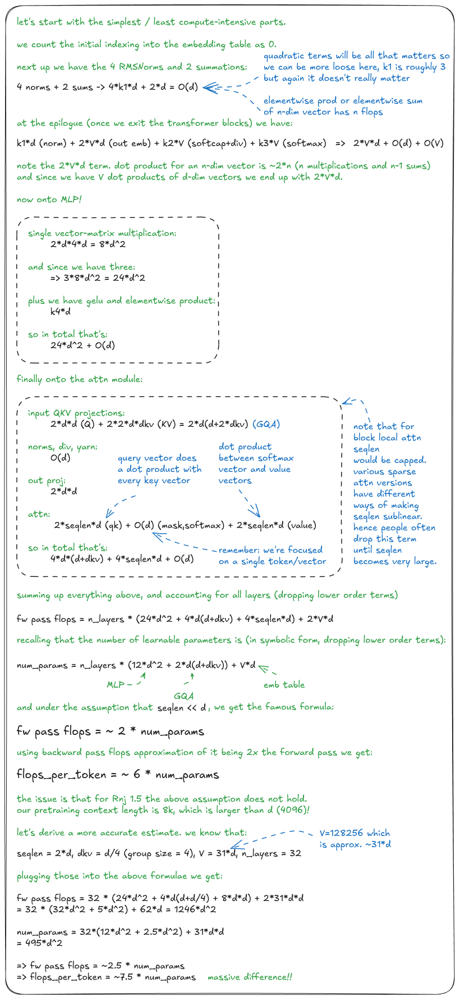

6N 公式值得记住。同样值得记住的是它成立的条件（即序列长度远小于模型内部维度）。

最后看看怎么用上面的公式估算集群规模：

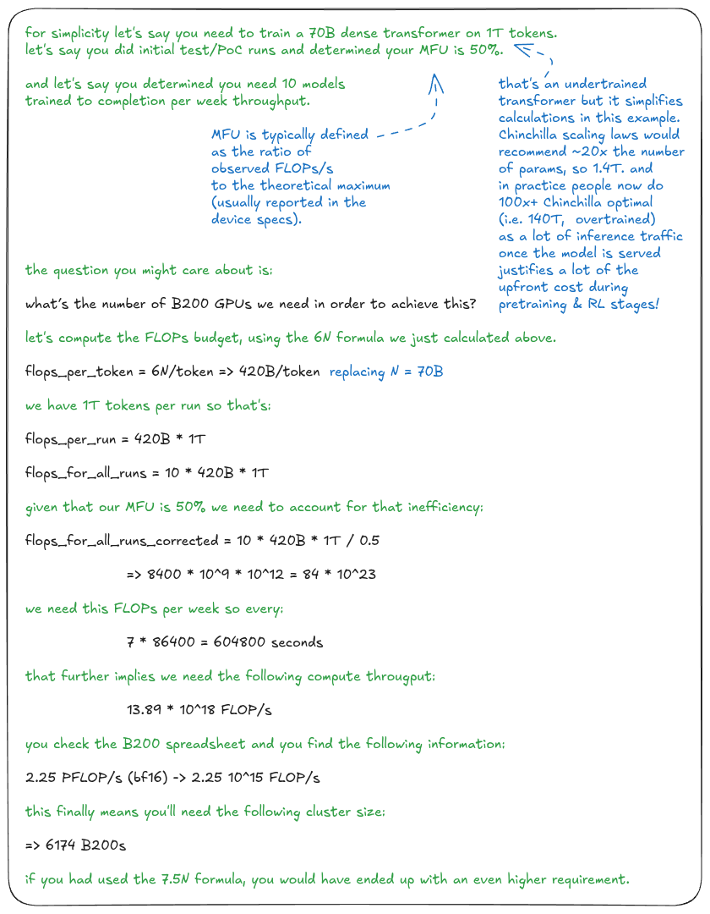

现在你可以去找孙正义要 10 亿美元的种子轮了。

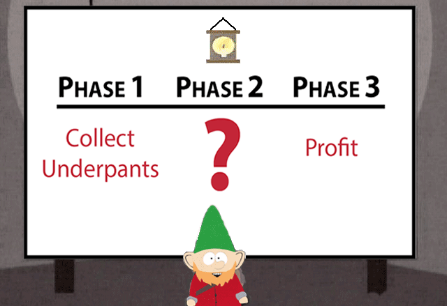

## 尾声

我们看了一个 token 如何流经 Transformer、所有子组件如何协同工作。

我们深入探讨了 YaRN 和 attention，并推导了一些最重要的 Transformer 公式。

在接下来的文章里，我会更深入地讲 MoE、Muon（优化器 [[12]](https://kellerjordan.github.io/posts/muon/)），以及若干架构创新：MLA（DeepSeek）、MTP（多 token 预测）、DSA（稀疏注意力 [[13]](https://arxiv.org/abs/2512.02556)）。

> **联系作者：**
> 如果你发现文中任何错误，请 DM 我——欢迎在 [X](https://x.com/gordic_aleksa) 或 [LinkedIn](https://www.linkedin.com/in/aleksagordic/) 上给我留言，或通过[匿名反馈表单](https://docs.google.com/forms/d/1z1fEirrN2xtGxAsJvptpM7yV4ByT5SF25S-XiMPrXNA/edit)告诉我。

## 参考文献

1. "Attention Is All You Need", https://arxiv.org/abs/1706.03762
2. RNJ 1.0, https://essential.ai/research/rnj-1
3. "Efficient Training of Language Models to Fill in the Middle", https://arxiv.org/abs/2207.14255
4. "Attention Residual Learning", https://arxiv.org/abs/2603.15031
5. "DeepSeek-V2: A Strong, Economical, and Efficient Mixture-of-Experts Language Model", https://arxiv.org/abs/2405.04434
6. "Kimi Linear: An Expressive, Efficient Attention Architecture", https://arxiv.org/abs/2510.26692
7. "Root Mean Square Layer Normalization", https://arxiv.org/abs/1910.07467
8. "GLU Variants Improve Transformer", https://arxiv.org/abs/2002.05202
9. "YaRN: Efficient Context Window Extension of Large Language Models", https://arxiv.org/abs/2309.00071
10. "RoFormer: Enhanced Transformer with Rotary Position Embedding", https://arxiv.org/abs/2104.09864
11. "Eli5 Flash Attention", https://gordicaleksa.medium.com/eli5-flash-attention-5c44017022ad
12. Muon, https://kellerjordan.github.io/posts/muon/
13. "Dissecting Sparsity in Large Language Models: Intrinsic Data-Aware Sparse Attention", https://arxiv.org/abs/2512.02556

---

**原文链接**: [Inside the Transformer: The Life of a Token](https://www.aleksagordic.com/blog/transformer)
