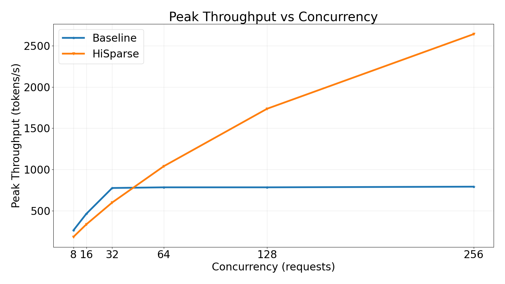
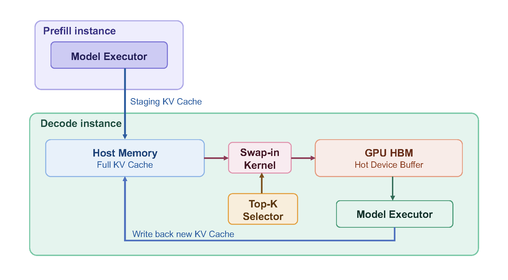
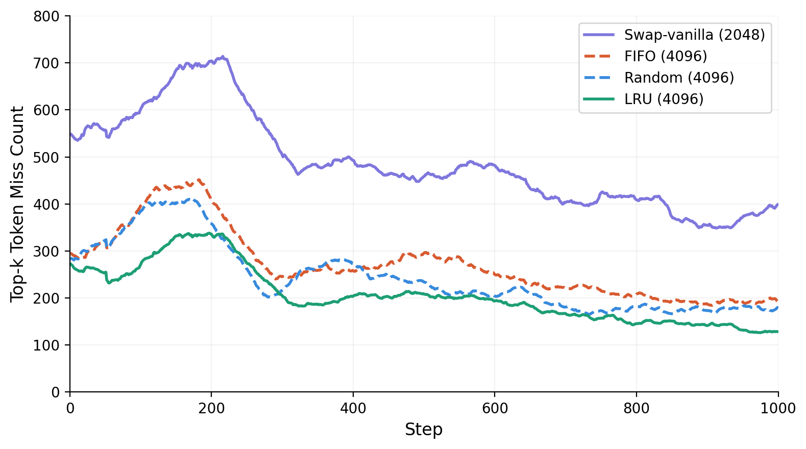
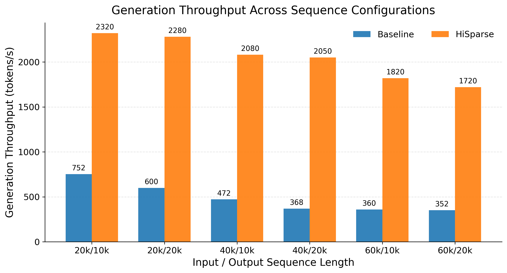

> **来源**: vLLM 官方设计文档（developer preview / latest，2026-09-12 更新）；文末附 LMSYS Blog 的 SGLang HiSparse 博文（2026-04-10）作为延伸对照
> **原文**: [HiSparse local KV offload architecture](https://docs.vllm.ai/en/latest/design/hisparse/)

状态：实验性（experimental）。

# vLLM HiSparse 本地 KV 卸载架构

## 速览

这套设计里有三种不同的职责：

1. 常规 KV cache 系统管理 GPU 块池（block pool）和块表（block table）。
2. `HiSparseCoordinator` 管理逻辑主机块、源前缀身份（source-prefix identity），以及主机/GPU 之间的驻留（residency）状态迁移。
3. `HiSparseConnector` 在 scheduler 和 worker 之间搬运驻留工作；`HiSparseWorker` 负责协调传输，而每个 cache 各自的 `HiSparseRuntime` 对象持有 host/hot 视图与 GPU 替换状态。

worker 侧的任何对象都不分配或释放逻辑块。HMA 提供驻留组和热组共享的 GPU 分配；它不管理 CPU 内存，也不持有任何 KV 身份。

```
request ────► HiSparseCoordinator ── source blocks + residency policy
                    │
                    ├──► KV cache manager ── resident/hot GPU leases (HMA)
                    │
                    └──► HiSparseConnector ── host bytes + copies + GPU LRU
```

这是一个本地 KV connector。当同时配置了 P/D 或其他卸载 connector 时，`MultiConnector` 会把它与 `HiSparseConnector` 组合起来。

`host_pool_gib` 配置在 `HiSparseConnector` 上，是每个数据并行副本（data-parallel replica）可用的主机缓存容量，而不是节点级的内存预算。张量并行（TP）的各 rank 持有同一份逻辑缓存的复制视图。这些视图可以使用每个 rank 私有的后备内存，也可以共用一份物理分配，配置的容量不变。因此物理主机内存的实际占用取决于拓扑和实现。实际可用容量可能略小，因为预算会向下取整到完整的主机块。

## 所有权

| 对象 | 所有者 | 「所有者」的含义 |
| --- | --- | --- |
| HiSparse 源与前缀身份 | `HiSparseCoordinator` | 把 token 映射到逻辑主机块 |
| 驻留 GPU 块租约 | 常规 KV cache manager | 分配和释放 HMA 块 |
| 驻留块表 | 常规 KV cache manager | 告诉 attention 驻留页在哪里 |
| 驻留状态迁移 | `HiSparseCoordinator` | 规划「先换出、再释放」的事务 |
| 逻辑主机块分配 | `HiSparseCoordinator` | 拥有独立的 CPU 块池及其生命周期 |
| 锁页主机池生命周期 | `HiSparseWorker` | worker 级的后备内存与销毁 |
| 每 cache 的主机视图与热内容 | `HiSparseRuntime` | 绑定 host/hot 存储，填充 cache manager 提供的热租约 |
| 热行映射与 LRU | `HiSparseRuntime` | 解析命中，并在 GPU 上挑选受害者 |
| 驻留缓存路由 | `HiSparseCacheHandle` | 向 attention 暴露驻留或 host/hot 解析 |
| 稀疏注意力 | attention backend | 消费设备缓存和物理行 ID |
| HMA | 分配器 | 提供 GPU 容量；不持有任何 KV 语义 |

关键的区分是「逻辑分配」与「内容」。`HiSparseCoordinator` 拥有主机块 ID 及其与请求/前缀的关联；`HiSparseWorker` 和它下面的各 cache runtime 拥有对应的字节。常规 cache manager 只看得到设备池。source group 的 `block_pool_id=None`；设备池的消费者在用它索引之前必须先收窄这个值，这样主机所有权就无法伪装成一个数字型的 GPU 池。

## 代码边界

```
scheduler process                           worker process

HiSparseConnector                          HiSparseConnector
  └─ HiSparseCoordinator                         └─ HiSparseWorker
       │                                          │
       │ connector metadata                       ├─ host bytes
       │ - page transfers                         ├─ copy scheduling
       │ - block-table replacements               └─ per-layer hot state
       └───────────────────────────────────────────────►│
       ◄──────── connector worker metadata ─────────────┘
                    enqueued and completed transfer IDs
```

指令经 `kv_connector_metadata` 下发；传输更新经 `KVConnectorOutput.kv_connector_worker_meta` 返回。model runner 不解释 page transfer。入队确认（enqueue acknowledgement）让 scheduler 能按流顺序释放源租约；完成确认负责发布已拷贝好的主机页。

## 驻留设备页

驻留页被有意放在 `HiSparseRuntime` 之外。

KV cache 初始化时，在构造 `HiSparseWorker` 之前，先把 cache manager 的分配绑定到面向 attention 的 `HiSparseCacheHandle` 上。同一个 handle 的 runtime 保留传输计划所需的驻留源索引。这里没有第二个驻留对象，也没有额外的注册包装层。

```
KV cache setup
   │
   ├─ bind resident allocation ──► HiSparseCacheHandle
   │                               cache + block table + slot mapping
   │
   ├─ bind host/hot allocation ──► HiSparseRuntime
   │                               host + hot + GPU LRU
   │
   └─ register cache handles ────► HiSparseWorker
                                   step-level transfers

HiSparseWorker registers the same HiSparseCacheHandle objects directly
```

attention 构造时，把每一层链接到真正持有 indexer 的最近一层。这会在 GPU 内存 profile 之前释放 follower 层重复的 LRU 张量。缓存绑定只负责挂接存储；它不会从物理 packed-tensor 的排列顺序去推断语义分组。构造游标（construction cursor）随 worker 的锁页状态一起销毁。

每个 HiSparse decode batch 都使用同一个融合解析器（fused resolver）。它先查驻留页，再查热行，最后查锁页主机内存。驻留命中在 kernel 内部就直接返回，不会走热行 LRU 查找或主机拷贝；没有框架级的驻留路由，也没有单独的 CUDA graph。decode 路径上不新增任何 CPU 决策。解析器直接消费 attention metadata 里已有的、graph 稳定的请求映射；worker 和各个 cache handle 都不保留重复的映射。

投机解码（speculative decoding）按顺序解析并消费每个验证步。每一步拿到各自可重放（replayable）的计划行，同时共享该请求的热缓存状态，因此后一步不可能在前一步消费之前复用某个热行。

## P/D 导入目标

decoder 对每个请求只依据常规 cache 准入计算做一次落地目标的选择。如果完整的导入前缀装得进设备池，NIXL 会把它直接传进驻留 GPU 页。否则，若固定的「主机后备 GPU 占用」加上主机源块装得下，请求就导入主机层（host tier）。这里没有上下文长度阈值之类的启发式；等待容量的请求在多次准入重试之间保持既定选择不变。

主机导入会先经过一个有界的 decoder-GPU 暂存池（staging pool），再拷入已注册的主机内存。立即需要的页会在这次拷贝中同时镜像到各自的驻留目的地。两种落地目标随后都使用上文描述的同一个融合 decode 解析器。

## 索引器 KV 卸载

HiSparse 不为 indexer KV 维护私有的 CPU 副本。indexer 仍是一个正常的、可做前缀缓存的 GPU cache 组。如果 `OffloadingConnector` 与 HiSparse 一起配置，它会经由通用 KV 卸载路径存储和恢复该组；HiSparse 继续只拥有稀疏 MLA 的主机层。

两个前缀源的命中长度可能不同。当 HiSparse 主机前缀超出 GPU 驻留的 indexer 前缀时，scheduler 会请求 `OffloadingConnector` 只恢复缺失的 indexer 后缀，并截断到主机前缀边界。如果该后缀不可用，所有组回退到它们共同拥有的较短前缀。NIXL P/D 传输仍把 indexer KV 直接放进它的 GPU 组。

## 换出（Spill）事务

一个驻留块在其内容尚未交给 worker 之前不能被复用。

```
HiSparseCoordinator                            HiSparseWorker
          │                                     │
          │ pin source and destination leases   │
          │── SparseKVPageTransfer ─────────────►│
          │                                     │ enqueue GPU-to-host copy
          │◄── enqueued transfer ID ────────────│
          │ replace resident table entry        │
          │ release resident lease to HMA       │
          │                                     │ copy reaches its event
          │◄── completed transfer ID ───────────│
          │ mark host page valid                │
          │ release destination host lease      │
```

「enqueued」表示拷贝已进入 worker 流。流顺序保证此时复用驻留 GPU 块去做后续工作是安全的，但主机页还没有发布。「completed」表示 worker 已观察到该拷贝的事件；只有到那时，coordinator 才发布主机页供前缀复用，并释放其目的租约。另有一个独立的 host-write 事件，保护直接读 CPU 的读者，使其不会看到已在加速器上排队的写。

worker 传输里只包含传输 ID 和物理拷贝坐标。请求身份和逻辑页状态都留在 scheduler。

## 热行查找与 LRU

NVIDIA CUDA 路径把替换逻辑全部留在加速器上：

```
top-K logical positions
        │
        ▼
resident page? ── yes ──► resident physical row
        │ no
        ▼
hot row? ──────── yes ──► existing hot physical row + update GPU LRU
        │ no
        ▼
choose GPU LRU victim ──► copy pinned host row ──► hot physical row
```

目前不支持 ROCm，因为融合的 HiSparse cache 操作只有 CUDA kernel 实现。未来的平台特定 worker 可以提供相同的 command、output 与 cache 解析边界。

## 主要类

| 类 | 继承 / 实现 | 职责 |
| --- | --- | --- |
| `HiSparseCoordinator` | 纯 scheduler 组件 | 主机分配、源前缀、驻留租约与换出状态机 |
| `HiSparseConnector` | `KVConnectorBase_V1`、`SupportsHMA` | scheduler/worker 元数据与生命周期边界 |
| `HiSparseResidentManager` | `SingleTypeKVCacheManager` | 常规块池簿记，支持主机后备的空洞 |
| `PagedCacheView` | 不可变数据对象 | 共享的驻留/热 HMA 张量绑定 |
| `HiSparseWorker` | connector 持有的 worker 组件 | worker 级传输调度与主机池生命周期 |
| `HiSparseRuntime` | worker 持有的纯组件 | 每 cache 的 host/hot 张量、GPU LRU 与融合解析 |
| `HiSparseCacheHandle` | 纯 attention 组件 | 驻留视图与融合缓存解析 |
| `SparseKVOffloadCommand` | dataclass | scheduler 到 worker 的不透明工作单元 |

## 性能不变量

- 驻留命中在融合解析器内部绕过热行 LRU 查找与主机拷贝。
- 热行查找、受害者选择和 LRU 更新全部在 GPU 上完成。
- 热行未命中时仍直接从已注册的锁页主机内存拷贝。
- Top-K 解析留在 attention 调用内部，保持可被 CUDA graph 捕获。
- 兼容的层仍共享一份 miss 计划。
- 共享 index 的 follower 层在内存测算之前释放其私有 LRU 状态。
- 除非配置了通用 KV 卸载器，HiSparse 不碰 indexer KV。
- 驻留与热租约仍可共享同一份打包的 HMA 分配。
- 不新增任何设备标量回读（readback）或 CPU/设备间元数据往返。
- 抽象包裹融合 kernel，不额外增加 kernel launch。
- HiSparse 关闭时，scheduler 不会构造卸载命令，也不会构造空更新表。

## 仍属于平台特定的部分

command/result 与 attention 层的边界可以共享。主机分配器、拷贝实现、热行布局和替换策略应当保持平台特定。NVIDIA 使用当前的加速器端 LRU 与融合 host/hot kernel。目前不支持 ROCm；AMD 或其他加速器后端可以实现自己的 worker，而不必把 NVIDIA 的策略强加进共享边界。

## 延伸对照：SGLang HiSparse——同一问题的另一条路线

> **来源**: LMSYS Blog（2026-04-10）
> **原文**: [HiSparse: Turbocharging Sparse Attention with Hierarchical Memory](https://www.lmsys.org/blog/2026-04-10-sglang-hisparse/)

vLLM 这份设计文档并非凭空出现。更早的 2026 年 4 月，SGLang 社区（LMSYS）就发布了同名的 HiSparse——作为他们 HiCache 工作的延续（本博此前对 SGLang HiCache 有专文拆解）。两个框架面对同一个问题（稀疏注意力下的 KV 内存管理），收敛出了高度相似的架构：GPU 热缓冲 + 主机层 + GPU 端 LRU + 融合 kernel。这个趋同本身就很说明问题：一套关于稀疏注意力 KV 管理的最佳实践正在成型。

### 为什么稀疏注意力会浪费性能

自注意力因二次方的计算与内存/IO 开销，已成为 LLM 长上下文扩展的主要瓶颈，由此催生了对高效注意力机制的持续关注。其中稀疏注意力尤其有前景：只关注选中的一小部分 KV cache，在保持强建模能力的同时，避开了常规注意力随上下文增长而急剧上升的计算与 I/O 开销。

然而稀疏注意力——典型形式是 top-k 选择——并没有消除内存容量瓶颈。实践中，完整上下文的 KV cache 必须驻留在 GPU HBM 中以保证快速访问，尽管任一解码步真正活跃的条目只占一小部分。结果，稀疏注意力往往受限于容量而非算力，制约了可用的 batch size 和整体吞吐。如下图所示，基线（不带 HiSparse 的稀疏注意力）的 token 生成吞吐早早进入平台期，因为 KV cache 占用很快顶到 GPU 显存容量上限。

相比之下，HiSparse 的吞吐随并发数接近线性扩展，在 256 并发时达到基线的 3 倍以上。注意在低并发下 HiSparse 有适度开销——稀疏 KV 加载带来的额外 I/O 超过了省下的内存收益；随着并发上升、内存压力成为主导，收益才变得显著。



GLM-5.1-FP8 模型在 PD 混部 8×H200 部署上、32k 输入 / 8k 输出请求的基准结果。

### HiSparse 的设计

延续此前的 HiCache 工作，SGLang 提出 HiSparse：一套为突破上述限制设计的层级内存系统。HiSparse 主动把不活跃的 KV cache 条目卸载到主机内存，显著降低 GPU 显存压力；同时在 GPU HBM 上维护一个热设备缓冲（hot device buffer），存放被频繁访问的 KV 区域，把关键路径上的数据搬运降到最低。这使得更大的解码 batch size 成为可能，在提升吞吐的同时支撑更长的上下文。下图展示 HiSparse 的工作流。虽然画的是 prefill–decode 分离部署，该设计同样适用于混部实例。



（译注：这套「热缓冲 + 主机层 + GPU 端 LRU」的组合，与上面 vLLM 设计文档里的驻留页/热行/GPU LRU 结构几乎一一对应；vLLM 的「融合解析器」做的正是下面这个 swap-in kernel 的事。）

### 高效的换入（swap-in）kernel

系统核心是一个专用 CUDA kernel，它一次性完成三件事：

1. 在设备缓冲中识别 top-k cache miss；
2. 用 LRU 策略挑选驱逐候选；
3. 更新页表，并把所需条目从主机内存取回设备内存。

下图展示了热缓冲大小与驱逐策略对 miss 率的影响。更大的热设备缓冲（4096 vs 2048 个槽位）加上 LRU 驱逐，miss 次数大幅下降，直接转化为关键路径上更低的换入延迟。



DeepSeek-V3.2（top-k=2048）在 LongBenchV2 上的 cache miss 次数基准，miss 数经过 100 步滚动窗口平滑。

### 基准结果

对 GLM-5.1-FP8 各种序列长度配置的扫描显示，长上下文场景下吞吐最高提升 5 倍。



GLM-5.1-FP8 模型在双 H20 PD 分离部署上、不同输入/输出序列长度组合的基准结果。

启用方式是打开 `--enable-hisparse` 并配置 `--hisparse-config`，三个关键参数：`top_k`、`device_buffer_size`（热设备缓冲槽位数）与 `host_to_device_ratio`（主机层与设备缓冲的容量比）。

PD 分离部署（推荐，双 H20 节点）：

```bash
# prefill instance:
python3 -m sglang.launch_server \
 --model-path "zai-org/GLM-5.1-FP8" --trust-remote-code --watchdog-timeout 100000 \
 --chunked-prefill-size 65536 --max-running-requests 480 --mem-fraction-static 0.8 \
 --tp-size 8 --dp-size 8 --enable-dp-attention --schedule-conservativeness 0.5 \
 --disaggregation-mode prefill \
 --disaggregation-ib-device mlx5_0,mlx5_1,mlx5_2,mlx5_3 \
 --dist-init-addr 127.0.0.1:5757 --nnodes 1 --node-rank 0

# decode instance:
python3 -m sglang.launch_server \
 --model-path "zai-org/GLM-5.1-FP8" --trust-remote-code --watchdog-timeout 100000 \
 --chunked-prefill-size 65536 --max-running-requests 480 --mem-fraction-static 0.85 \
 --tp-size 8 --dp-size 8 --enable-dp-attention \
 --load-balance-method round_robin --prefill-round-robin-balance \
 --kv-cache-dtype bfloat16 --nsa-decode-backend flashmla_sparse \
 --disaggregation-mode decode --dist-init-addr 127.0.0.1:5757 \
 --disaggregation-ib-device mlx5_0,mlx5_1,mlx5_2,mlx5_3 --nnodes 1 --node-rank 0 \
 --enable-hisparse \
 --hisparse-config '{"top_k": 2048, "device_buffer_size": 6144, "host_to_device_ratio": 10}'
```

PD 混部部署（单机 8×H200）：

```bash
python3 -m sglang.launch_server \
 --model-path "zai-org/GLM-5.1-FP8" --trust-remote-code --watchdog-timeout 100000 \
 --chunked-prefill-size 65536 --max-running-requests 480 --mem-fraction-static 0.85 \
 --tp-size 8 --dp-size 8 --enable-dp-attention --disable-radix-cache \
 --enable-hisparse \
 --hisparse-config '{"top_k": 2048, "device_buffer_size": 4096, "host_to_device_ratio": 8}'
```

### 未来工作

HiSparse 目前支持使用 DeepSeek Sparse Attention（DSA）的模型家族，包括 DeepSeek-V3.2 和 GLM-5.1。作为实验特性，他们计划持续改进性能与模型覆盖。HiSparse 面向高并发场景以最大化吞吐，但 top-k cache miss 带来的额外 I/O 也引入了一定开销；他们期望通过更好的计算/传输重叠来降低这部分开销，并认为 Grace Blackwell（GB）等新平台更高的 CPU–GPU 带宽会进一步缓解它。展望未来，沿着 HiCache 的方向，他们计划把这套层级内存管理推广到更广泛的新兴架构，包括混合模型。

（原文并致谢阿里云 TairKVCache 团队、蚂蚁 SCT 推理团队、Stanford 及百度百骥团队等，此处从略，见原文。）

### 两套方案对照（译注）

| 维度 | SGLang HiSparse（LMSYS 博文） | vLLM HiSparse（设计文档） |
| --- | --- | --- |
| 发布时间 | 2026-04-10，附公开基准 | 设计文档（experimental），未见基准 |
| 目标模型 | DSA 家族（DeepSeek-V3.2、GLM-5.1），`nsa-decode-backend flashmla_sparse` | 稀疏 MLA；indexer KV 走通用卸载路径 |
| GPU 热结构 | 热设备缓冲（`device_buffer_size` 槽位） | 驻留页 + 热行（HMA 租约） |
| 主机层容量 | `host_to_device_ratio` 控制容量比 | `host_pool_gib`（每 DP 副本） |
| 替换决策 | LRU，在 swap-in kernel 内于 GPU 上完成 | GPU LRU + 融合解析器，全部在加速器上 |
| miss 处理 | 识别 top-k miss → 换入 | 融合解析：驻留页 → 热行 → 锁页主机内存 |
| P/D | 分离与混部均支持 | NIXL P/D 导入（设备直传或主机层落地） |
| 一致性协议 | 博文未展开 | 两阶段 spill 事务（enqueued/completed）+ host-write 事件 |

---

**原文链接**:

- [HiSparse local KV offload architecture — vLLM docs](https://docs.vllm.ai/en/latest/design/hisparse/)
- [HiSparse: Turbocharging Sparse Attention with Hierarchical Memory — LMSYS Blog](https://www.lmsys.org/blog/2026-04-10-sglang-hisparse/)
