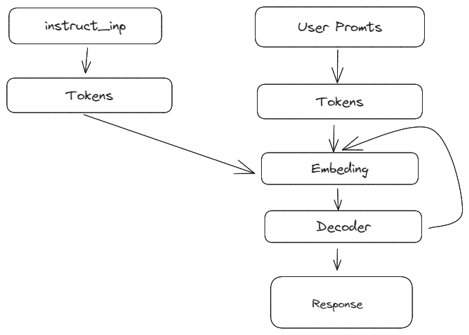
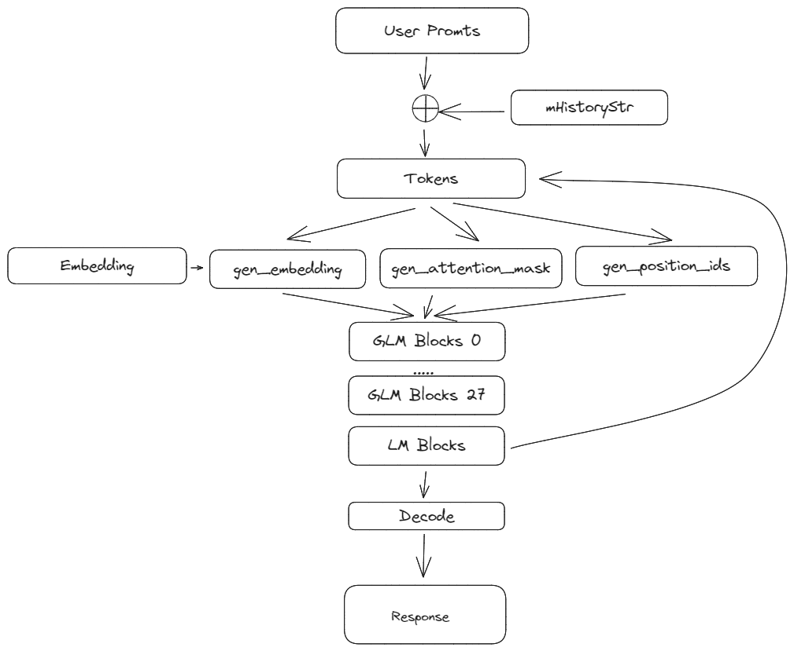

## Causual LM
这里以llama模型为例，通常在执行用户输入之前会有一个[[文章/LM basic知识#Prefill]]的过程。然后根据用户promts 得到输出。

### Perfix LM
这里以GLM为例介绍，展示了基本的流程。

## prefix LM和causal LM的区别

attention mask不同，prefix LM的prefix部分的token互相能看到，causal LM严格遵守只有后面的token才能看到前面的token的规则。

## Prefill
对于causual LM，在正式推理前，需要一部分前置输入，这个过程就是Prefill。主要目的是产生 kv cache

> the prefill stage which takes a prompt sequence to generate the key-value cache (KV cache) for each transformer layer of the LLM

**prefill phase**

$$
x^i_K = x^i · w^i_K; x^i_V = x^i · w^i_V
$$

$$
x^i_Q = x^i · w^i_Q  
$$
$$
x^i_{Out} = fSoftmax(\frac{x^i_Q (x^i_K)^T}{\sqrt{h}}) · x^i_V · w^i_O + x^i \\

$$

$$
x^(i+1) = frelu(x^i_{out} ·w_1)·w_2+x^i_{out}
$$
