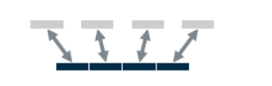
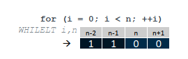
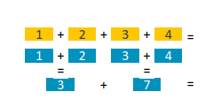
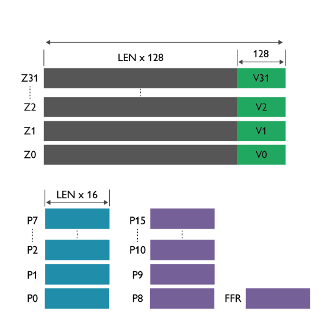

SVE对比NEON有几个新增的地方。
1. 变长的向量
2. 支持Gather-load && Scatter-store

3. 可以由P寄存器控制向量通道的计算

5. 由软件控制的向量切分。
	1. 基于First Fault 寄存器完成的，加载不合法内存页的时候，会有记录
		

1. 扩展浮点和位运算的水平缩减

## SVE 寄存器
- Scalable vector registers
`Z0-Z15`, 支持double、float、float16，int64、int32、int16、int8
向量寄存器长度128-2048bit可变，具体取决于SoC厂商确定，当前手机上上商用的由联发科的天玑9200，长度是128bit，这部分与NEON共用。
- Scalable predicate registers
谓词寄存器，
	- P0-P7 控制的数据加载、存取、计算
	- P8-P15做循环控制
	- FFR ： 用来软件推测的FFR寄存器
