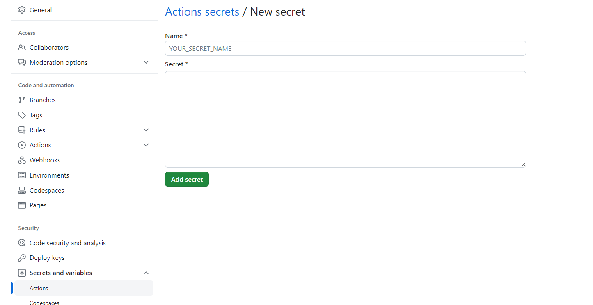
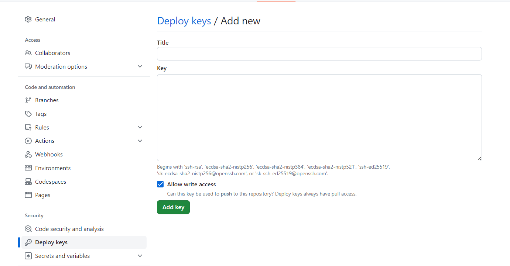

# 介绍
Github Actions 可以很方便实现 CI/CD 工作流，类似 Travis 的用法，来帮我们完成一些工作，比如实现自动化测试、打包、部署等操作。当我们运行 Jobs 时，它会创建一个容器 (runner)，容器支持：Ubuntu、Windows 和 MacOS 等系统，在容器中我们可以安装软件，利用安装的软件帮我们处理一些数据，然后把处理好的数据推送到某个地方。

本文将介绍利用 Github Actions 实现自动部署 hexo 到 Github Pages，在之前我们需要写完文章执行 `hexo generate --deploy` 来部署，当你文章比较多的时候，可能还需要等待很久，而且还可能会遇到本地安装的 Node.js 版本与 Hexo 不兼容的问题，目前我就是因为电脑的 Node.js 版本升到 v14 版本导致与 Hexo 不兼容部署不了，才来捣腾 Github Actions 功能的。利用 Github Actions 你将会没有这些烦恼。


# 前提
## 创建所需仓库
1. 创建 your.github.io 仓库用来存放博客和静态博客页面，这两个在不同分支。

## 生成部署密钥
一路按回车直到生成成功

```shell
$ ssh-keygen -t rsa -b 4096 -C "$(git config user.email)" -f gh-pages -N ""
```

当前目录下会有 gh-pages 和 gh-pages.pub 两个文件。

## 配置部署密钥
复制  `gh-pages` 文件内容，在仓库 `Settings -> secrets and variables -> new repository secret` 页面上添加。

1. 在 `Name` 输入框填写 `ACTIONS_DEPLOY_KEY`。
2. 在 `secret`输入框填写  `gh-pages` 文件内容。




复制  `gh-pages.pub` 文件内容，在 仓库 Settings -> Deploy keys -> Add deploy key 页面上添加。

1. 在 Title 输入框填写 HEXO_DEPLOY_PUB。
2. 在 Key 输入框填写  gh-pages.pub 文件内容。
3. 勾选 Allow write access 选项。




# 编写 Github Actions
## Workflow 模版
在 blog 仓库根目录下创建 .github/workflows/deploy.yml 文件，目录结构如下。

```blog (repository)
└── .github
    └── workflows
        └── deploy.yml

```

在 deploy.yml 文件中粘贴以下内容。

```yml
name: Pages

# 触发器、分支
on:
  push:
    branches:
      - gh-pages  # default branch
jobs:
  # 子任务
  pages:
    runs-on: ubuntu-latest # 定运行所需要的虚拟机环境
    permissions:
      contents: write
    steps:
      - uses: actions/checkout@v2
        with:
          submodules: true
          fetch-depth: 1
      # 每个name表示一个步骤:step
      - name: Use Node.js 18.x
        uses: actions/setup-node@v2
        with:
          node-version: '18.17.1' # 自己正在使用的node版本即可
      - name: Global Config
        env:
          ACTIONS_DEPLOY_KEY: ${{secrets.ACTIONS_DEPLOY_KEY}}
        run: |
          sudo timedatectl set-timezone "Asia/Shanghai"
          mkdir -p ~/.ssh/
          echo "$ACTIONS_DEPLOY_KEY" > ~/.ssh/id_rsa
          chmod 600 ~/.ssh/id_rsa
          git config --global user.email "xx"
          git config --global user.name "XXX"
      # - run: node -v # 查看node版本号
      # 缓存依赖项: https://docs.github.com/cn/actions/using-workflows/caching-dependencies-to-speed-up-workflows
      - name: Cache NPM dependencies
        uses: actions/cache@v2
        with:
          # npm cache files are stored in `~/.npm` on Linux/macOS
          path: ~/.npm
          # path: node_modules
          key: ${{ runner.OS }}-npm-cache
          restore-keys: |
            ${{ runner.OS }}-npm-cache
      # 查看路径 : /home/runner/work/blog/blog
      # - name: Look Path
      #   run: pwd
      # 查看文件
      - name: Look Dir List
        run: tree -L 3 -a
      # 第一次或者依赖发生变化的时候执行 Install Dependencies，其它构建的时候不需要这一步
      - name: Install Dependencies
        run: npm install
      - name: Look Dir List
        run: tree -L 3 -a
      - name: Clean
        run: npm run clean
      - name: Build
        run: npm run build
      - name: Deploy
        run: npm run deploy
      - name: Get the output
        run: |
          echo "${{ steps.deploy.outputs.notify }}"

```


# hexo配置文件
blog 根目录下，名为 _config.yml，配置一下deploy的分支信息。

```yml
deploy: 
  type: git 
  repository: xxx
  branch: deploy
```

# 执行任务
写一篇文章，push 到 仓库的 master 分支，在仓库 Actions 页面查看当前 task。

当任务完成后查看您的博客 https://your.github.io，如果不出意外的话已经可以看到新添加的文章了。

# 小结
偷懒是人类发展的动力，人都有偷懒的想法，目的就是为了让自己能够活得更好，经过几千年的不断发展，现在人偷懒的方式无疑更加的先进。
