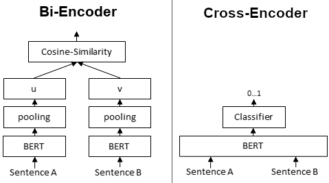

Bi-encoder和Cross-encoder是在自然语言理解任务模型的两种不同方法，在信息检索和相似性搜索二者的使用更为广泛。在LLM大火的今天，RAG的pipe line中这两个模块作为提升检索精度的模块更是备受瞩目。

|          | Bi-encoder                                                   | Cross-encoder                                                |
| -------- | ------------------------------------------------------------ | ------------------------------------------------------------ |
| 架构     | 有两个**独立**的编码器 —— 一个用于编码输入的查询，另一个用于编码候选文档。这些编码器独立工作，为查询和每个文档生成嵌入表示。 | 查询和文档一起在**单个**编码器中处理。这意味着模型将查询和文档作为输入，并产生联合表示 |
| 训练方式 | 在训练期间，模型被训练以最大化查询与相关文档之间的相似性，同时最小化查询与不相关文档之间的相似性。训练通常使用对比损失函数进行。 | 与Bi-encoder类似，Cross-encoder被训练以最大化相关查询-文档对之间的相似性。但是，由于它们同时处理查询和文档，因此它们捕获了两者之间的交互。 |
| 使用     | 在推理时，模型独立计算查询与每个文档之间的相似性得分。相似性得分最高的文档被认为是最相关的。 | Cross-encoder为每个查询-文档对生成单一的相似性得分，考虑了查询和文档嵌入之间的交互。得分最高的文档被认为是最相关的。 |

## 使用哪个：

- Bi-encoder：当您拥有大规模数据集和计算资源时，使用Bi-encoder。由于相似性得分可以独立计算，它们在推理期间通常更快。它们适用于**捕获查询和文档之间复杂交互不太关键**的任务。

- Cross-encoder：当捕获**查询和文档之间的交互对于您的任务至关重要**时，请选择Cross-encoder。它们在**计算上更为密集**，但可以在理解查询和文档之间的上下文或关系至关重要的场景中提供更好的性能。

## 讨论

1. 为什么embedding 在RAG中常常失真？还需要rerank模型来做二次处理。

   > 虽然训练上二者都是度量学习的思路，但在推理判断阶段，还是有很大区别的。
   >
   > - embedding 模型在获取embeding向量时，仅仅考虑了当前的文本，rerank模型则是把query跟相关的文档信息一起做了比较。
   > - sentence embedding vector 本质上还是word的建模，无论pooling方式如何，重合的关键词越多，一般来说最终也越相近。rerank模型则是在最后学习一个映射，输出的就是0-1的相似性判断。简单来说就是rerank功能更明确，效果也更好。

2. embedding 模型和rerank模型是否只有训练架构上的区别？在模型结构上有没有偏好？

   > 当前绝大多数embeding模型都是BERT架构的，rerank模型多数时XLMRobertaForSequenceClassification

3. 如果一定要rerank模型，是不是可以在一定范围内牺牲embeding的召回精度？选用较小的embedding 模型，但是提高topK。

4. 这两类模型的训练细节有哪些？

