## 文档概述

本文档使用 Philippe Kruchten 的 4+1 视图模型描述 EXO 分布式 AI 推理系统的软件架构。该系统是一个点对点的分布式推理集群，将多个设备连接起来运行大型语言模型（LLM）。

### 核心技术栈
- **推理后端**: MLX (Apple Silicon), 支持张量并行和流水线并行
- **网络层**: libp2p (Rust) + Gossipsub 协议
- **API层**: FastAPI (Python)，支持 OpenAI、Claude、Ollama 兼容接口
- **前端**: Svelte 5 + TypeScript
- **语言**: Python 3.13+, Rust (nightly), TypeScript
- **状态管理**: 事件溯源 (Event Sourcing)

---

## 1. 逻辑视图 (Logical View)

逻辑视图描述系统的功能需求分解为类、接口和对象。本视图关注核心组件及其职责。

### 1.1 核心架构模式

**事件溯源架构 (Event Sourcing Architecture)**

系统采用事件溯源模式进行状态管理：
- **事件 (Events)**: 所有状态变更以不可变事件形式记录
- **命令 (Commands)**: 触发状态变更的意图
- **状态 (State)**: 通过事件重放得到的当前状态快照

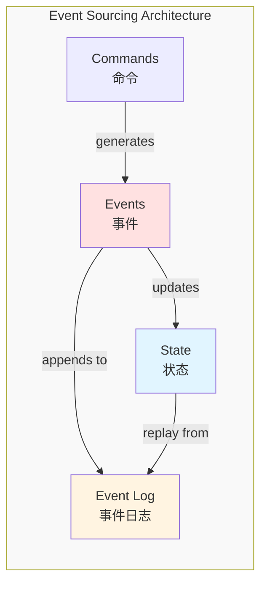

### 1.2 主要组件层次

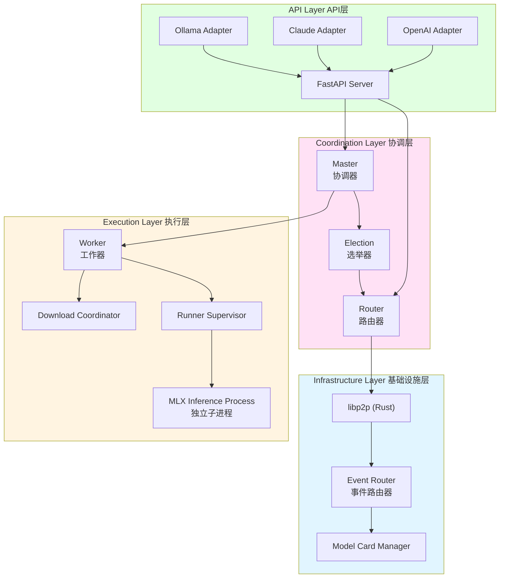

### 1.3 核心类定义

#### 1.3.1 Node 类 (src/exo/main.py)
**职责**: 单个 EXO 节点的容器，管理所有子组件的生命周期

```python
@dataclass
class Node:
    router: Router                    # libp2p 网络路由
    event_router: EventRouter         # 事件路由和转发
    download_coordinator: DownloadCoordinator | None  # 模型下载协调
    worker: Worker | None             # 推理工作器
    election: Election                # 主节点选举
    master: Master | None             # 集群主控器
    api: API | None                   # HTTP API 服务器
```

#### 1.3.2 Master 类 (src/exo/master/main.py)
**职责**: 集群状态协调器，负责事件溯源和实例放置

**关键方法**:
- `_command_processor()`: 处理命令并生成事件
- `_event_processor()`: 索引事件并广播
- `_plan()`: 定期清理失效实例和超时节点

**状态管理**:
```python
class Master:
    state: State  # 全局不可变状态
    _event_log: DiskEventLog  # 事件日志
    command_task_mapping: dict[CommandId, TaskId]
```

#### 1.3.3 Worker 类 (src/exo/worker/main.py)
**职责**: 执行推理任务，管理 Runner 进程

**关键方法**:
- `plan_step()`: 规划并执行任务（创建 Runner、下载模型等）
- `_event_applier()`: 应用事件到本地状态
- `_poll_connection_updates()`: 拓扑发现（ping 其他节点）

**核心组件**:
```python
class Worker:
    runners: dict[RunnerId, RunnerSupervisor]  # 运行器进程管理
    input_chunk_buffer: dict[CommandId, dict]  # 图像数据缓存
    _download_backoff: KeyedBackoff[ModelId]   # 下载重试退避
```

#### 1.3.4 API 类 (src/exo/api/main.py)
**职责**: HTTP API 服务器，提供多种 LLM API 兼容接口

**支持接口**:
- OpenAI Chat Completions API (`/v1/chat/completions`)
- Anthropic Claude API (`/v1/messages`)
- OpenAI Responses API (`/v1/responses`)
- Ollama API (`/ollama/api/*`)
- 图像生成 API (`/v1/images/generations`)

**流式响应**:
```python
async def _token_chunk_stream(
    command_id: CommandId
) -> AsyncGenerator[TokenChunk | ErrorChunk | ToolCallChunk | PrefillProgressChunk]:
    """为给定命令生成 token 流，直到完成"""
```

#### 1.3.5 Router 类 (src/exo/routing/router.py)
**职责**: 基于 libp2p 的发布/订阅消息路由

**Topic 定义**:
```python
GLOBAL_EVENTS = TypedTopic("global_events", PublishPolicy.Always, GlobalForwarderEvent)
LOCAL_EVENTS = TypedTopic("local_events", PublishPolicy.Always, LocalForwarderEvent)
COMMANDS = TypedTopic("commands", PublishPolicy.Always, ForwarderCommand)
ELECTION_MESSAGES = TypedTopic("election_messages", PublishPolicy.Always, ElectionMessage)
CONNECTION_MESSAGES = TypedTopic("connection_messages", PublishPolicy.Never, ConnectionMessage)
DOWNLOAD_COMMANDS = TypedTopic("download_commands", PublishPolicy.Always, ForwarderDownloadCommand)
```

### 1.4 类型系统

#### 1.4.1 事件类型 (src/exo/shared/types/events.py)
**可区分联合类型**:
```python
Event = (
    TestEvent
    | TaskCreated
    | TaskStatusUpdated
    | TaskFailed
    | TaskDeleted
    | TaskAcknowledged
    | InstanceCreated
    | InstanceDeleted
    | RunnerStatusUpdated
    | NodeTimedOut
    | NodeGatheredInfo
    | NodeDownloadProgress
    | ChunkGenerated
    | InputChunkReceived
    | TopologyEdgeCreated
    | TopologyEdgeDeleted
    | TracesCollected
    | TracesMerged
    | CustomModelCardAdded
    | CustomModelCardDeleted
)
```

#### 1.4.2 命令类型 (src/exo/shared/types/commands.py)
**命令联合**:
```python
Command = (
    TextGeneration
    | ImageGeneration
    | ImageEdits
    | CreateInstance
    | DeleteInstance
    | PlaceInstance
    | StartDownload
    | CancelDownload
    | DeleteDownload
    | AddCustomModelCard
    | DeleteCustomModelCard
    | SendInputChunk
    | TaskCancelled
    | TaskFinished
    | RequestEventLog
)
```

#### 1.4.3 状态类型 (src/exo/shared/types/state.py)
**全局状态**:
```python
class State(CamelCaseModel):
    instances: Mapping[InstanceId, Instance]
    runners: Mapping[RunnerId, RunnerStatus]
    downloads: Mapping[NodeId, Sequence[DownloadProgress]]
    tasks: Mapping[TaskId, Task]
    last_seen: Mapping[NodeId, datetime]
    topology: Topology
    last_event_applied_idx: int
    
    # 细粒度节点状态
    node_identities: Mapping[NodeId, NodeIdentity]
    node_memory: Mapping[NodeId, MemoryUsage]
    node_disk: Mapping[NodeId, DiskUsage]
    node_system: Mapping[NodeId, SystemPerformanceProfile]
    node_network: Mapping[NodeId, NodeNetworkInfo]
```

### 1.5 设计模式应用

| 模式 | 应用位置 | 描述 |
|------|---------|------|
| **事件溯源** | 全局状态管理 | 所有状态变更为不可变事件，支持重放和审计 |
| **CQRS** | Master/Worker 分离 | 命令（写入）和事件（读取）分离处理 |
| **发布/订阅** | Router/TopicRouter | 基于 libp2p Gossipsub 的去中心化消息传递 |
| **适配器** | API 层 | 多种 LLM API 格式适配（OpenAI、Claude、Ollama） |
| **策略模式** | Instance Placement | 支持流水线并行、张量并行等多种放置策略 |
| **监督模式** | RunnerSupervisor | 监控和管理推理子进程的生命周期 |

### 1.6 核心类关系图

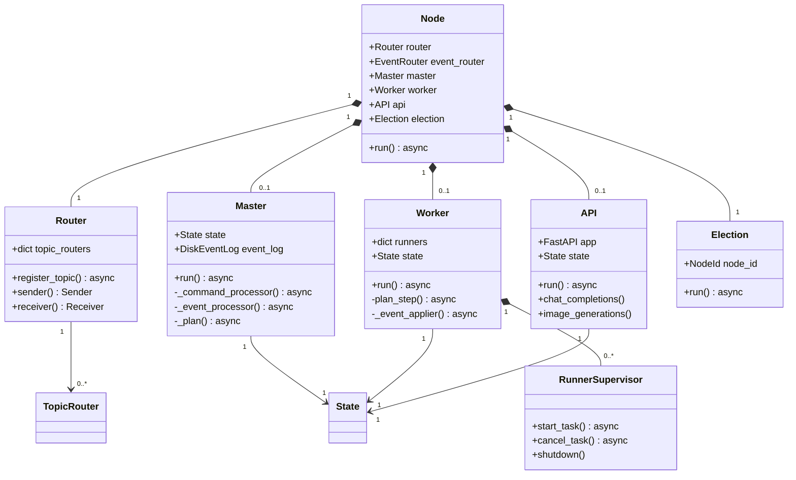

---

## 2. 实现视图 (Development View)

实现视图描述开发环境的静态组织，包括代码结构、模块划分和依赖关系。

### 2.1 代码组织结构

```
exo/
├── src/exo/
│   ├── __init__.py
│   ├── __main__.py          # 程序入口
│   ├── main.py              # Node 类定义
│   │
│   ├── api/                 # API 层 (FastAPI)
│   │   ├── main.py          # API 类和路由定义
│   │   ├── adapters/        # API 格式适配器
│   │   │   ├── chat_completions.py    # OpenAI Chat Completions
│   │   │   ├── claude.py              # Anthropic Claude Messages API
│   │   │   ├── responses.py           # OpenAI Responses API
│   │   │   └── ollama.py              # Ollama API
│   │   ├── types/           # API 类型定义
│   │   └── tests/           # API 测试
│   │
│   ├── master/              # 协调层
│   │   ├── main.py          # Master 类
│   │   ├── placement.py     # 实例放置算法
│   │   ├── placement_utils.py
│   │   ├── image_store.py   # 图像缓存存储
│   │   └── tests/
│   │
│   ├── worker/              # 执行层
│   │   ├── main.py          # Worker 类
│   │   ├── plan.py          # 任务规划逻辑
│   │   ├── runner/          # Runner 管理
│   │   │   ├── runner_supervisor.py
│   │   │   ├── runner_process.py
│   │   │   └── interface.py
│   │   └── tests/
│   │
│   ├── download/            # 模型下载
│   │   ├── coordinator.py   # 下载协调器
│   │   ├── shard_downloader.py
│   │   ├── impl_shard_downloader.py
│   │   └── tests/
│   │
│   ├── routing/             # 网络路由
│   │   ├── router.py        # Router 类
│   │   ├── event_router.py  # EventRouter 类
│   │   ├── topics.py        # Topic 定义
│   │   └── connection_message.py
│   │
│   ├── shared/              # 共享代码
│   │   ├── types/           # Pydantic 类型定义
│   │   │   ├── events.py
│   │   │   ├── commands.py
│   │   │   ├── tasks.py
│   │   │   ├── state.py
│   │   │   ├── chunks.py
│   │   │   └── ...
│   │   ├── apply.py         # 事件应用函数
│   │   ├── election.py      # 选举算法
│   │   ├── topology.py      # 拓扑管理
│   │   ├── models/          # 模型卡片
│   │   │   └── model_cards.py
│   │   └── tests/
│   │
│   └── utils/               # 工具函数
│       ├── channels.py      # async channel 实现
│       ├── task_group.py    # async task group
│       ├── info_gatherer/   # 系统信息收集
│       └── ...
│
├── rust/                    # Rust 组件
│   ├── exo_pyo3_bindings/   # PyO3 绑定
│   │   ├── src/
│   │   │   ├── lib.rs
│   │   │   ├── networking.rs
│   │   │   └── ident.rs
│   │   └── tests/
│   │
│   ├── networking/          # libp2p 网络
│   │   ├── src/
│   │   │   ├── lib.rs
│   │   │   ├── swarm.rs
│   │   │   └── discovery.rs
│   │   └── tests/
│   │
│   └── util/                # Rust 工具
│       └── src/lib.rs
│
├── dashboard/               # Svelte 前端
│   ├── src/
│   │   ├── routes/          # 页面路由
│   │   ├── lib/
│   │   │   ├── components/  # Svelte 组件
│   │   │   ├── stores/      # Svelte stores
│   │   │   └── types.ts
│   │   └── app.html
│   ├── package.json
│   └── vite.config.ts
│
├── resources/               # 资源文件
│   ├── inference_model_cards/   # 推理模型卡片 (TOML)
│   └── image_model_cards/       # 图像模型卡片 (TOML)
│
├── scripts/                 # 工具脚本
│   └── download_model_to_cluster.py
│
└── bench/                   # 基准测试
    ├── exo_bench.py
    └── ...
```

### 2.2 模块依赖图

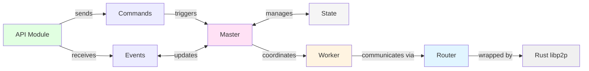

### 2.3 技术栈与依赖

#### 2.3.1 Python 依赖
| 类别 | 库 | 用途 |
|------|-----|------|
| **Web框架** | FastAPI | HTTP API |
| | Hypercorn | ASGI 服务器 |
| **序列化** | Pydantic | 数据验证和序列化 |
| **异步** | Anyio | 异步运行时 |
| **网络** | exo_pyo3_bindings (Rust) | libp2p 网络 |
| **日志** | Loguru | 日志记录 |
| **测试** | pytest, pytest-asyncio | 单元测试 |
| **类型检查** | basedpyright | 严格类型检查 |
| **代码格式** | ruff, nix fmt | 代码格式化 |
| **模型处理** | huggingface_hub | 模型下载 |

#### 2.3.2 Rust 依赖
| 类别 | 库 | 用途 |
|------|-----|------|
| **网络** | libp2p | P2P 网络 |
| | rust-discovery | mDNS 节点发现 |
| **Python绑定** | PyO3 | Python-Rust FFI |
| | pyo3-async-runtimes | 异步运行时集成 |
| **异步** | Tokio | 异步运行时 |
| **日志** | pyo3-log | 日志桥接 |

#### 2.3.3 前端依赖
| 类别 | 库 | 用途 |
|------|-----|------|
| **框架** | Svelte 5 | UI 框架 |
| **构建** | Vite | 前端构建工具 |
| **HTTP** | ky/fetch | HTTP 客户端 |

### 2.4 构建和开发工具

| 工具 | 用途 |
|------|------|
| **uv** | Python 包管理和虚拟环境 |
| **rustup** | Rust 工具链管理 |
| **nix** | 代码格式化 |
| **pytest** | Python 测试运行器 |
| **npm** | Node.js 包管理 |

---

## 3. 进程视图 (Process View)

进程视图描述运行时的进程、线程和通信机制。

### 3.1 进程架构

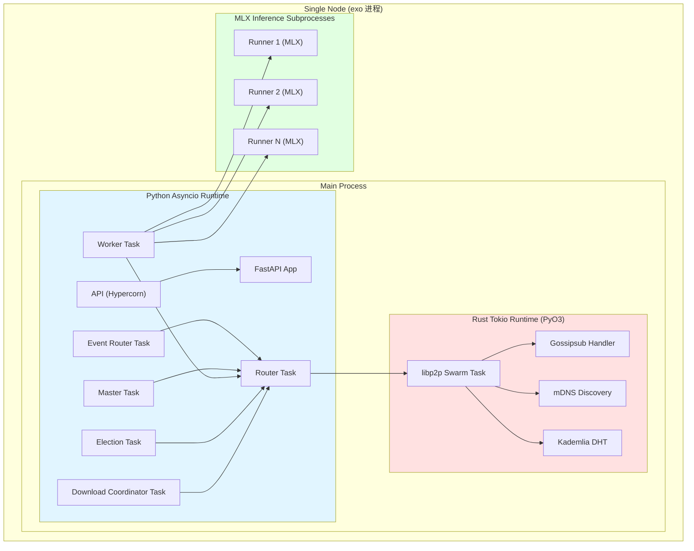

### 3.2 组件通信流程

#### 3.2.1 推理请求流程

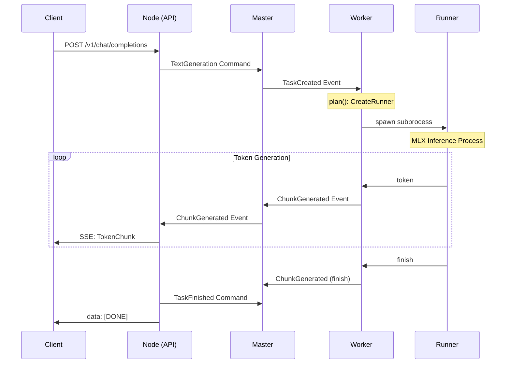

#### 3.2.2 事件广播流程

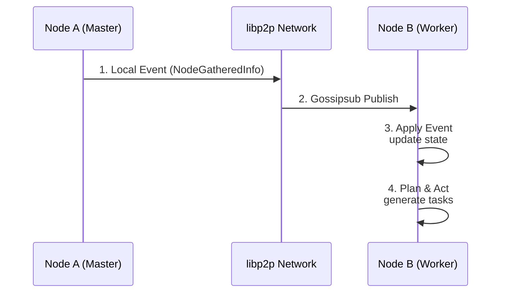

#### 3.2.3 主节点选举流程

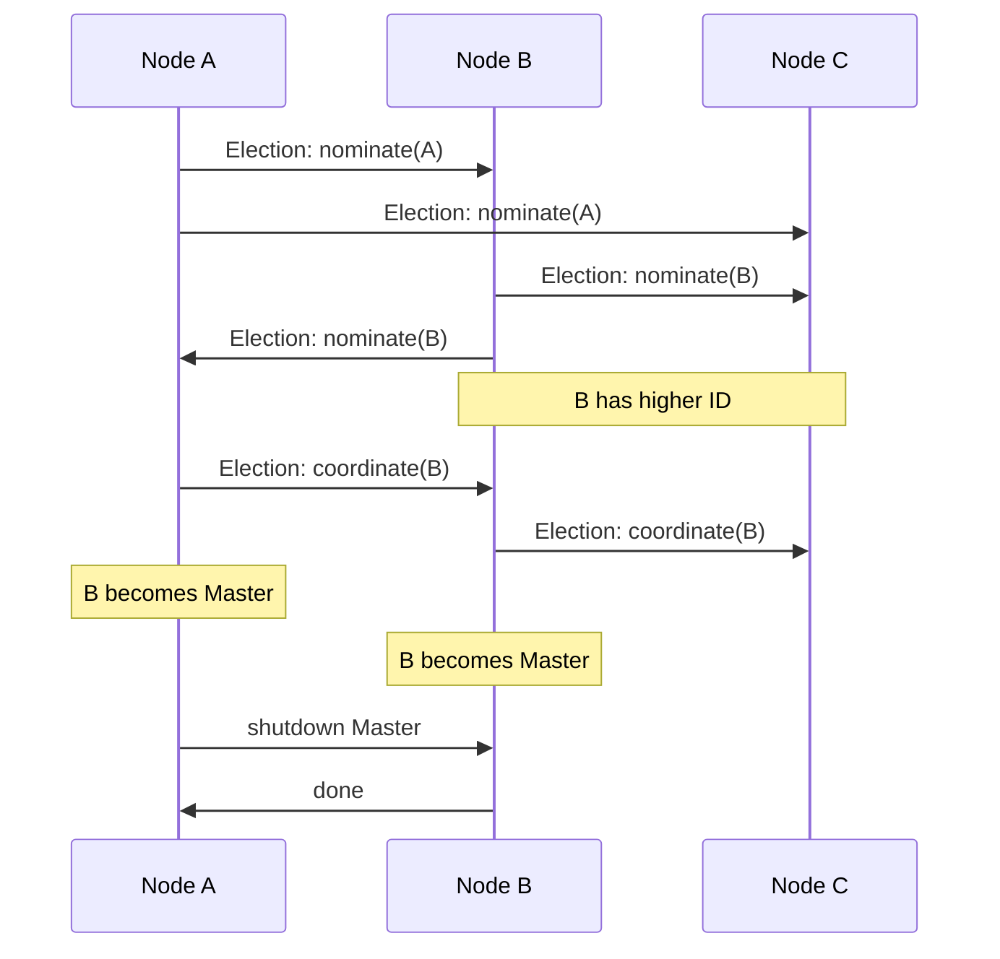

### 3.3 并发模型

**Python Asyncio (任何框架)**:
- 所有主要组件运行在单个事件循环中
- 使用 `anyio.create_task_group()` 管理并发任务
- 通过 `asyncio.Queue` / channel 进行组件间通信

**Rust Tokio (libp2p)**:
- 独立的 Tokio 运行时，通过 PyO3 桥接
- Gossipsub 订阅和消息处理在 Rust 任务中运行
- 使用 `tokio::sync::mpsc` 进行跨语言通信

**MLX 子进程**:
- 每个 Runner 在独立的子进程中运行
- 通过 stdin/stdout JSON-RPC 通信
- 支持多 GPU/设备并行

### 3.4 同步机制

| 组件 | 同步原语 | 用途 |
|------|---------|------|
| **Election** | Bully Algorithm | 分布式主节点选举 |
| **Event Apply** | IndexedEvent | 严格顺序事件应用 |
| **Task Planning** | KeyedBackoff | 指数退避重试 |
| **Network** | Gossipsub | 弹性消息传播 |

### 3.5 任务状态机

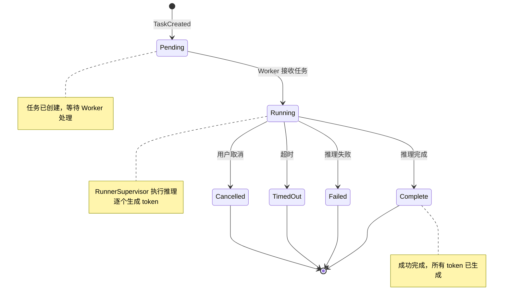

---

## 4. 部署视图 (Deployment View)

部署视图描述硬件拓扑、网络配置和组件的物理部署。

### 4.1 集群拓扑

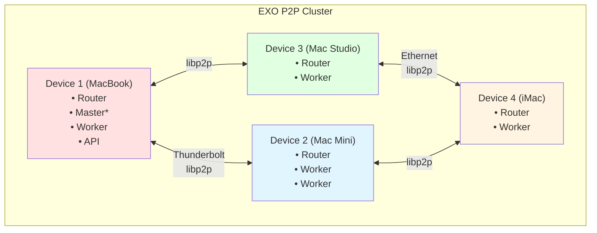

### 4.2 节点类型

| 节点类型 | 描述 | 组件 |
|---------|------|------|
| **协调器节点** | 运行 Master 的节点 | Router + Master + (可选) Worker |
| **工作器节点** | 运行推理的节点 | Router + Worker + Runners |
| **API 节点** | 提供 HTTP API 的节点 | Router + API + (可选) Master |
| **纯协调器** | 仅运行 Master，不运行 Worker | `--no-worker` 模式 |

### 4.3 网络配置

**libp2p Multiaddr 格式**:
```
/ip4/<IP>/tcp/<PORT>/p2p/<PeerID>
/ip6/<IP>/tcp/<PORT>/p2p/<PeerID>
```

**支持的传输层**:
- TCP/IP (IPv4/IPv6)
- mDNS (本地节点发现)
- Thunderbolt RDMA (高性能互连，macOS 专用)

**端口配置**:
| 端口 | 用途 | 默认值 |
|------|------|--------|
| `libp2p_port` | libp2p 监听端口 | 0 (OS 自动分配) |
| `api_port` | HTTP API 端口 | 52415 |

### 4.4 存储布局

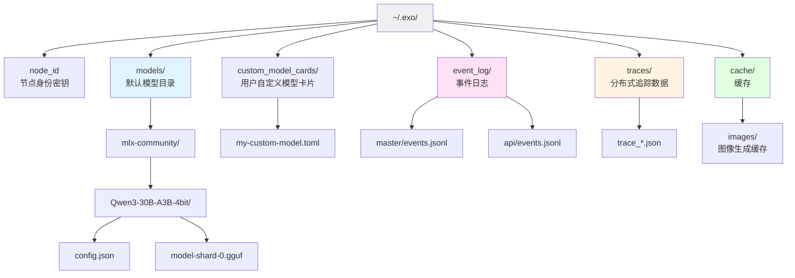

### 4.5 环境变量配置

| 变量 | 描述 | 默认值 |
|------|------|--------|
| `EXO_DEFAULT_MODELS_DIR` | 模型下载目录 | `~/.local/share/exo/models` |
| `EXO_MODELS_DIRS` | 额外模型目录（冒号分隔） | - |
| `EXO_MODELS_READ_ONLY_DIRS` | 只读模型目录 | - |
| `EXO_OFFLINE` | 离线模式 | `false` |
| `EXO_ENABLE_IMAGE_MODELS` | 启用图像模型 | `false` |
| `EXO_LIBP2P_NAMESPACE` | 集群命名空间 | - |
| `EXO_TRACING_ENABLED` | 启用分布式追踪 | `false` |
| `EXO_BOOTSTRAP_PEERS` | 启动节点 | - |

### 4.6 部署场景

#### 场景 1: 单机部署（开发/测试）
```bash
# 启动单个节点，同时运行所有组件
uv run exo

# 访问 Web UI: http://localhost:52415
```

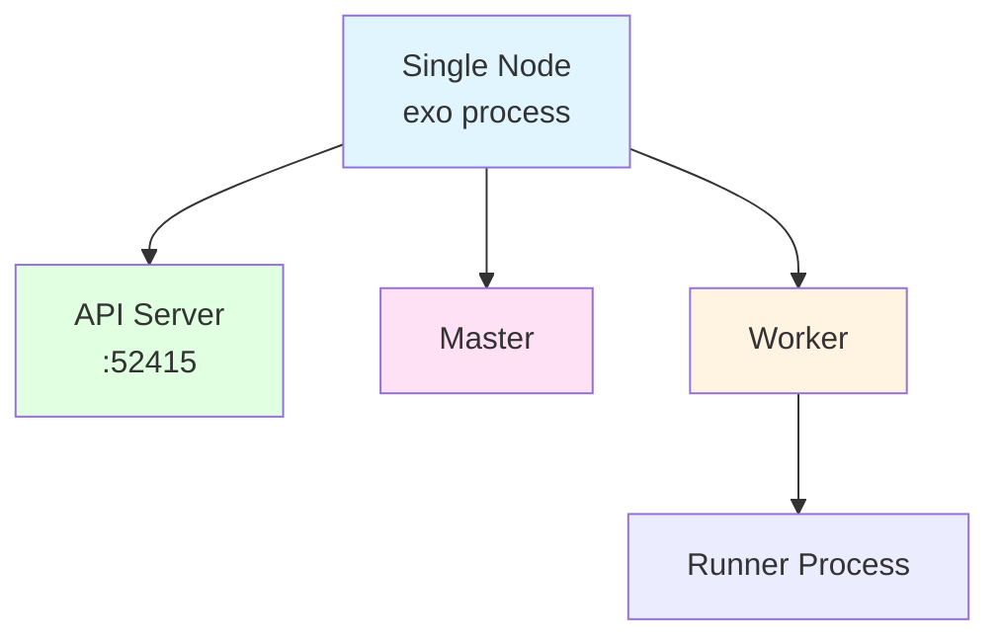

#### 场景 2: 多机集群（本地网络）
```bash
# 节点 1 (协调器 + API)
uv run exo --force-master

# 节点 2-N (工作器)
uv run exo --bootstrap-peers /ip4/192.168.1.10/tcp/<PORT>/p2p/<PEER_ID>
```

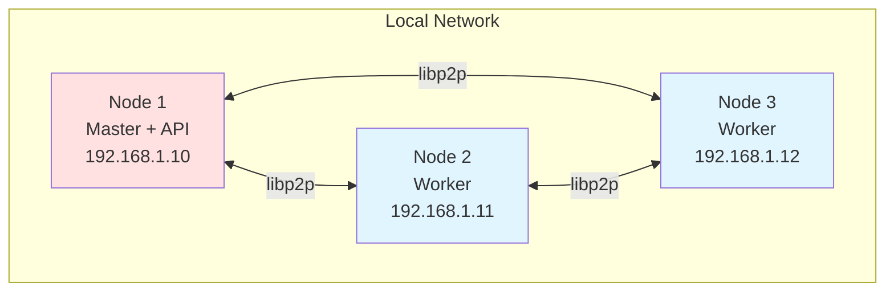

#### 场景 3: 混合部署（高性能计算）
```bash
# Mac Studio (高性能节点 - 运行推理)
uv run exo --no-api --force-master

# MacBook (API + 协调器 - 轻量级)
uv run exo --no-worker --api-port 52415
```

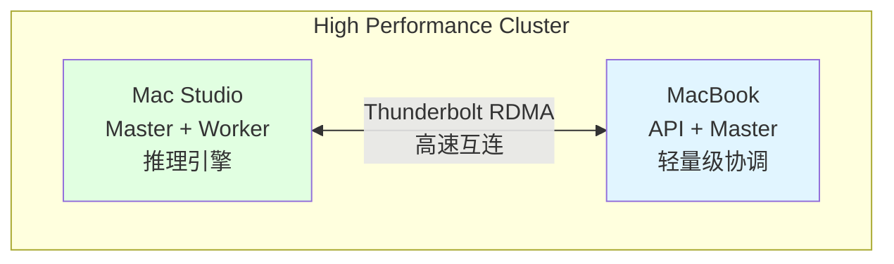

---

## 5. 用例视图 (Use Case View)

用例视图描述系统功能场景和用户交互。

### 5.1 核心用例

#### 用例 1: 文本生成（聊天补全）

**主要参与者**:
- 用户 / 客户端应用
- API 层
- Master 协调器
- Worker 工作器
- MLX Runner

**前置条件**:
- 模型已下载并实例已创建
- 集群中至少有一个活跃节点

**流程**:
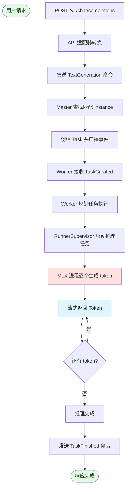

**扩展流程**:
- **图像输入**: 用户发送图像数据，API 分块发送 InputImageChunk
- **工具调用**: LLM 返回 tool_calls，API 格式化为 OpenAI 格式
- **取消请求**: 用户断开连接，API 发送 TaskCancelled 命令

#### 用例 2: 模型下载

**主要参与者**:
- 用户
- API
- Master
- DownloadCoordinator
- HuggingFace Hub

**流程**:
```
1. 用户调用 POST /download/start
2. Master 发送 StartDownload 命令
3. DownloadCoordinator 开始下载模型分片
4. 定期广播 NodeDownloadProgress 事件
5. 下载完成后，广播 DownloadCompleted 事件
6. Worker 检测到模型就绪，可以创建实例
```

#### 用例 3: 集群自愈

**主要参与者**:
- Election 系统
- Master
- Worker

**场景**:
```
1. 当前 Master 节点故障
2. 其他节点检测到连接丢失
3. Election 触发新的 Bully 算法选举
4. 最高 ID 节点成为新 Master
5. 新 Master 清理失效节点和实例
6. Worker 重新连接到新 Master
```

#### 用例 4: 实例放置

**主要参与者**:
- 用户
- Master
- Placement 算法

**策略**:

| 策略 | 描述 | 适用场景 |
|------|------|----------|
| **Pipeline** | 模型层分布在多个节点 | 单机内存不足，低延迟互连 |
| **Tensor** | 张量并行，同一层分片 | 大模型，高带宽网络 |
| **MlxRing** | MLX Ring 通信 | Thunderbolt RDMA 网络 |
| **MlxJaccl** | JACCL 通信后端 | 高性能互连 |

**流程**:
```
1. 用户调用 POST /instance/place
2. Master 调用 Placement 算法
3. 根据资源评估选择节点
4. 生成 ShardAssignments
5. 广播 InstanceCreated 事件
6. 各节点 Worker 启动 Runner
```

### 5.2 API 端点映射

| 功能 | OpenAI API | Claude API | Ollama API |
|------|-----------|------------|------------|
| **聊天** | `POST /v1/chat/completions` | `POST /v1/messages` | `POST /ollama/api/chat` |
| **补全** | - | - | `POST /ollama/api/generate` |
| **模型列表** | `GET /v1/models` | - | `GET /ollama/api/tags` |
| **模型信息** | - | - | `POST /ollama/api/show` |
| **图像生成** | `POST /v1/images/generations` | - | - |
| **图像编辑** | `POST /v1/images/edits` | - | - |

### 5.3 用户界面

**Web Dashboard (Svelte)**:
- **主页**: 集群状态、实例列表、拓扑图
- **聊天界面**: 实时聊天、模型选择、多模态输入
- **模型管理**: 浏览、搜索、添加自定义模型
- **下载管理**: 进度监控、取消操作
- **追踪查看**: 性能分析、延迟统计

---

## 6. 架构约束与质量属性

### 6.1 架构约束

| 约束类型 | 描述 | 影响 |
|---------|------|------|
| **平台** | macOS (Apple Silicon) 优先 | MLX 推理引擎限制 |
| **Python 版本** | Python 3.13+ | 使用最新类型特性 |
| **网络** | libp2p + Gossipsub | 点对点消息传递 |
| **状态管理** | 事件溯源 | 不可变事件 + 状态重放 |
| **类型安全** | 严格类型检查 | `basedpyright` 0 错误 |

### 6.2 质量属性

#### 可扩展性 (Scalability)
- **水平扩展**: 添加新节点自动加入集群
- **模型分片**: 支持流水线并行和张量并行
- **负载均衡**: 基于实例任务数的请求分配

#### 可用性 (Availability)
- **主节点冗余**: Bully 算法自动故障转移
- **弹性网络**: Gossipsub 自动重连和消息去重
- **优雅降级**: Worker 在 Master 重选期间暂停请求

#### 性能 (Performance)
- **流式响应**: SSE 实时 token 生成
- **RDMA 加速**: Thunderbolt 高速互连
- **连续批处理**: MLX 连续批处理支持

#### 可维护性 (Maintainability)
- **严格类型**: 全覆盖类型注解
- **纯函数**: 事件应用逻辑无副作用
- **测试覆盖**: pytest-asyncio 测试框架

#### 可观测性 (Observability)
- **事件日志**: 所有状态变更持久化
- **分布式追踪**: 任务级别性能追踪
- **状态 API**: `/state` 实时集群状态查询

---

## 7. 未来演进方向

### 7.1 短期规划
1. **Prefill/Decode 分离**: 预填充和解码阶段分布式优化
2. **更多推理后端**: 支持 GGML、vLLM 等
3. **云部署**: 支持 Linux + GPU 集群

### 7.2 长期愿景
1. **联邦学习**: 跨节点模型微调
2. **自动缩放**: 基于负载的动态实例调整
3. **多模态**: 视频、音频生成支持

---

## 附录 A: 术语表

| 术语 | 定义 |
|------|------|
| **Event** | 不可变的状态变更记录，包含唯一 event_id |
| **Command** | 意图表达，触发状态变更 |
| **Instance** | 模型实例，包含分片分配信息 |
| **Runner** | MLX 推理进程，托管在 Worker 管理下 |
| **Task** | 工作单元，绑定到特定 Instance |
| **Session** | 选举周期标识 |
| **Shard** | 模型分片，可独立加载 |
| **Topology** | 集群网络拓扑图 |
| **PeerID** | libp2p 节点标识符 |
| **Master** | 集群协调器节点 |
| **Worker** | 推理执行节点 |

---

## 附录 B: 参考资料

**核心代码**:
- 主入口: `src/exo/main.py`
- Master: `src/exo/master/main.py`
- Worker: `src/exo/worker/main.py`
- API: `src/exo/api/main.py`
- 事件定义: `src/exo/shared/types/events.py`
- 状态定义: `src/exo/shared/types/state.py`

**项目文档**:
- CLAUDE.md: 项目开发指南
- README.md: 项目概述

**外部技术**:
- libp2p: https://libp2p.io/
- MLX: https://ml-explore.github.io/mlx/
- FastAPI: https://fastapi.tiangolo.com/
- Svelte: https://svelte.dev/

---

**文档结束**
