本文档使用 Philippe Kruchten 的 **4+1 视图模型**描述 EXO 分布式 AI 推理系统的软件架构。该系统是一个点对点的分布式推理集群，将多个设备连接起来运行大型语言模型（LLM）。

## 文档概述

本文档使用 Philippe Kruchten 的 **4+1 视图模型**描述 EXO 分布式 AI 推理系统的软件架构。该系统是一个点对点的分布式推理集群，将多个设备连接起来运行大型语言模型（LLM）。

### 4+1 视图模型概览

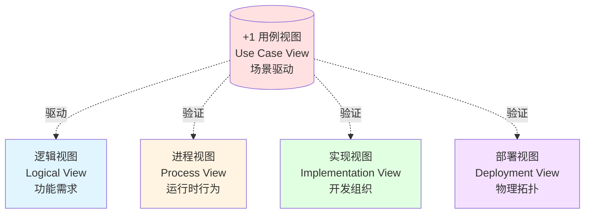
```mermaid
graph TB
    UC[("+1 用例视图<br/>Use Case View<br/>场景驱动")]
    LOGICAL["逻辑视图<br/>Logical View<br/>功能需求"]
    PROCESS["进程视图<br/>Process View<br/>运行时行为"]
    IMPLEMENTATION["实现视图<br/>Implementation View<br/>开发组织"]
    DEPLOYMENT["部署视图<br/>Deployment View<br/>物理拓扑"]

    UC -.->|"驱动"| LOGICAL
    UC -.->|"验证"| PROCESS
    UC -.->|"验证"| IMPLEMENTATION
    UC -.->|"验证"| DEPLOYMENT

    style UC fill:#ffe1e1
    style LOGICAL fill:#e1f5ff
    style PROCESS fill:#fff4e1
    style IMPLEMENTATION fill:#e1ffe1
    style DEPLOYMENT fill:#f5e1ff
```

| 视图 | 关注点 | 主要读者 | 描述内容 |
|------|--------|----------|----------|
| **逻辑视图** | 功能需求 | 架构师、开发者 | 类、对象、接口、职责划分 |
| **进程视图** | 运行时行为 | 架构师、集成工程师 | 进程、线程、同步、通信 |
| **实现视图** | 开发组织 | 开发者、项目经理 | 文件结构、依赖关系、构建系统 |
| **部署视图** | 物理拓扑 | 运维工程师、部署工程师 | 硬件配置、网络拓扑、部署方案 |
| **用例视图** | 场景驱动 | 所有利益相关者 | 用户场景、用例、验收标准 |

### 核心技术栈
- **推理后端**: MLX (Apple Silicon), 支持张量并行和流水线并行
- **网络层**: libp2p (Rust) + Gossipsub 协议
- **API层**: FastAPI (Python)，支持 OpenAI、Claude、Ollama 兼容接口
- **前端**: Svelte 5 + TypeScript
- **语言**: Python 3.13+, Rust (nightly), TypeScript
- **状态管理**: 事件溯源 (Event Sourcing)

---

## +1. 用例视图 (Use Case View)

用例视图是整个架构的**驱动视图**，描述系统如何被各种参与者使用。每个用例都会在其他四个视图中得到验证。

### 1.1 主要参与者 (Actors)

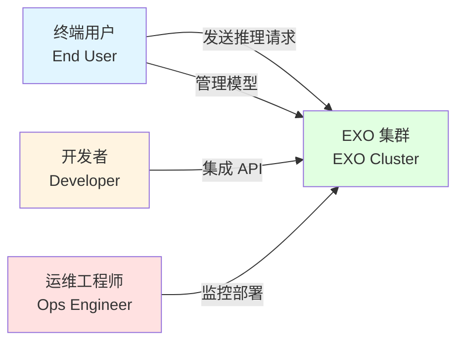
```mermaid
graph LR
    USER["终端用户<br/>End User"]
    DEV["开发者<br/>Developer"]
    OPS["运维工程师<br/>Ops Engineer"]
    SYSTEM["EXO 集群<br/>EXO Cluster"]

    USER -->|"发送推理请求"| SYSTEM
    USER -->|"管理模型"| SYSTEM
    DEV -->|"集成 API"| SYSTEM
    OPS -->|"监控部署"| SYSTEM

    style USER fill:#e1f5ff
    style DEV fill:#fff4e1
    style OPS fill:#ffe1e1
    style SYSTEM fill:#e1ffe1
```

### 1.2 核心用例

#### 用例 1: 文本生成（聊天补全）

**主要参与者**: 终端用户  
**前置条件**: 模型已加载，集群正常运行  
**主成功场景**:

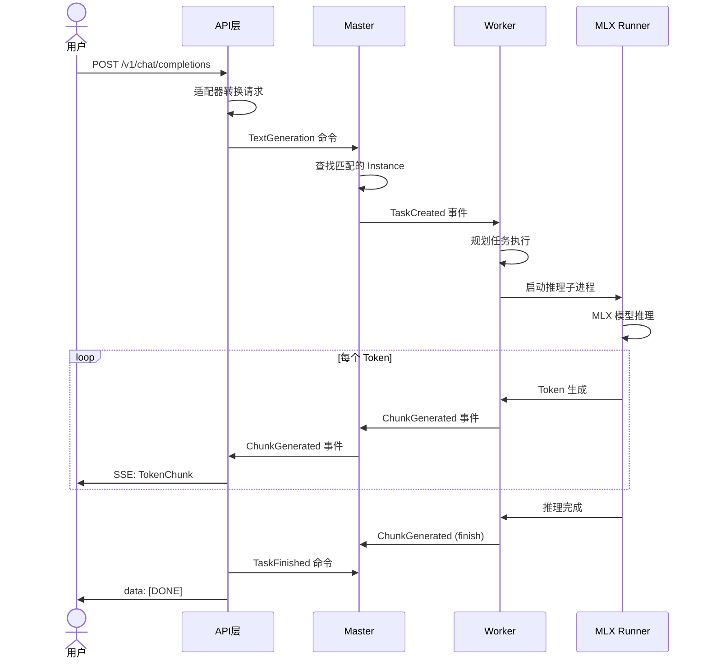
```mermaid
sequenceDiagram
    actor User as 用户
    participant API as API层
    participant Master as Master
    participant Worker as Worker
    participant Runner as MLX Runner

    User->>API: POST /v1/chat/completions
    API->>API: 适配器转换请求
    API->>Master: TextGeneration 命令
    Master->>Master: 查找匹配的 Instance
    Master->>Worker: TaskCreated 事件
    Worker->>Worker: 规划任务执行
    Worker->>Runner: 启动推理子进程
    Runner->>Runner: MLX 模型推理
    
    loop 每个 Token
        Runner->>Worker: Token 生成
        Worker->>Master: ChunkGenerated 事件
        Master->>API: ChunkGenerated 事件
        API->>User: SSE: TokenChunk
    end
    
    Runner->>Worker: 推理完成
    Worker->>Master: ChunkGenerated (finish)
    API->>Master: TaskFinished 命令
    API->>User: data: [DONE]
```

**扩展场景**:
- **多模态输入**: 用户发送图像，分块传输
- **工具调用**: LLM 返回 function_call
- **取消请求**: 用户断开连接

**验证标准**:
- 逻辑视图: API 适配器正确转换请求格式
- 进程视图: 流式响应延迟 < 100ms
- 实现视图: 适配器代码模块化
- 部署视图: 单节点可处理并发请求

#### 用例 2: 分布式模型推理

**主要参与者**: 终端用户、集群系统  
**前置条件**: 多个节点在线，模型支持分片  
**主成功场景**:

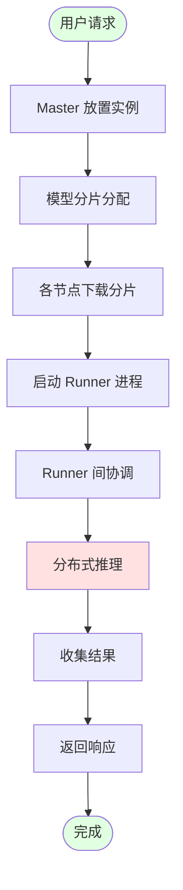
```mermaid
flowchart TD
    START([用户请求])
    PLACE[Master 放置实例]
    SHARD[模型分片分配]
    DOWNLOAD[各节点下载分片]
    RUNNER[启动 Runner 进程]
    COORDINATE[Runner 间协调]
    INFERENCE[分布式推理]
    COLLECT[收集结果]
    RESP[返回响应]

    START --> PLACE
    PLACE --> SHARD
    SHARD --> DOWNLOAD
    DOWNLOAD --> RUNNER
    RUNNER --> COORDINATE
    COORDINATE --> INFERENCE
    INFERENCE --> COLLECT
    COLLECT --> RESP
    RESP --> END([完成])

    style START fill:#e1ffe1
    style END fill:#e1ffe1
    style INFERENCE fill:#ffe1e1
```

**场景说明**:
- **流水线并行**: 模型层分布在多个节点
- **张量并行**: 同层分片到多个节点
- **RDMA 加速**: Thunderbolt 高速互连

**验证标准**:
- 逻辑视图: ShardAssignments 正确计算
- 进程视图: 节点间通信延迟可控
- 实现视图: 放置算法可扩展
- 部署视图: 网络带宽满足要求

#### 用例 3: 集群自愈

**主要参与者**: 集群系统  
**前置条件**: 节点故障或网络分区  
**主成功场景**:

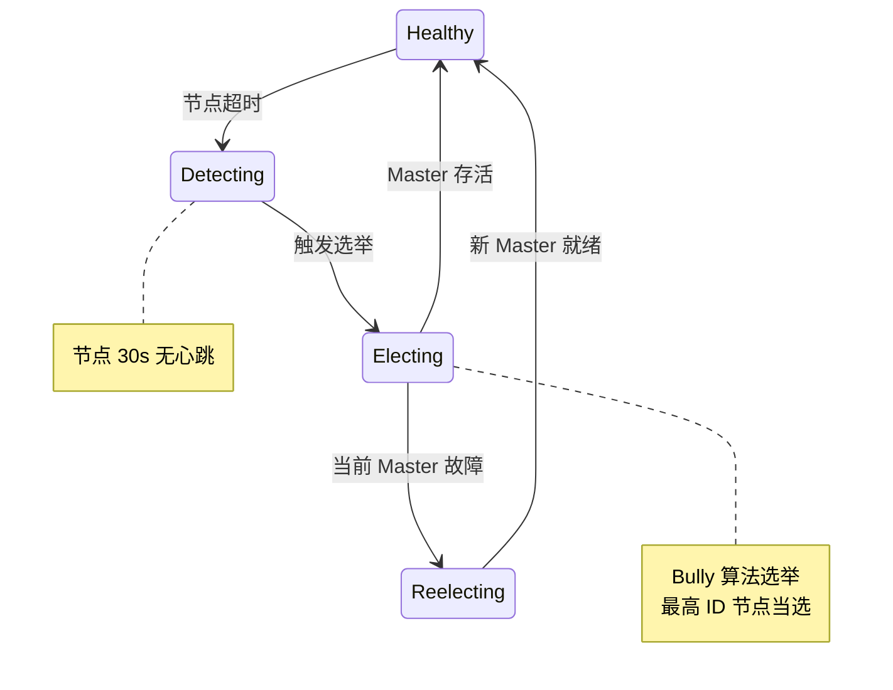
```mermaid
stateDiagram-v2
    Healthy --> Detecting: 节点超时
    Detecting --> Electing: 触发选举
    Electing --> Reelecting: 当前 Master 故障
    Reelecting --> Healthy: 新 Master 就绪
    Electing --> Healthy: Master 存活

    note right of Detecting
        节点 30s 无心跳
    end note

    note right of Electing
        Bully 算法选举
        最高 ID 节点当选
    end note
```

**验证标准**:
- 逻辑视图: Election 消息类型完整
- 进程视图: 选举收敛时间 < 10s
- 实现视图: 选举逻辑无死锁
- 部署视图: 网络分区后可恢复

#### 用例 4: 模型下载与管理

**主要参与者**: 终端用户  
**前置条件**: 磁盘空间充足  
**主成功场景**:

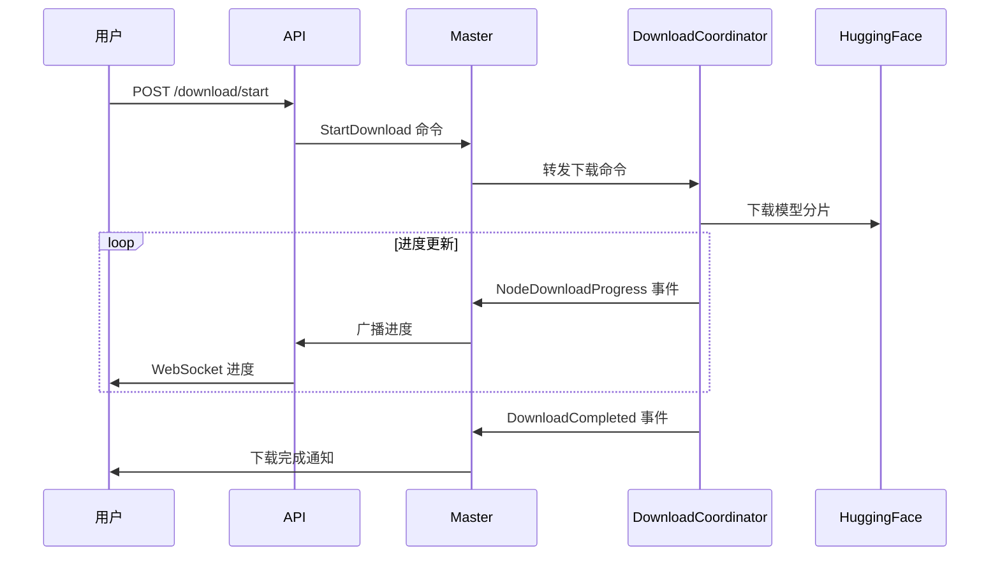
```mermaid
sequenceDiagram
    participant User as 用户
    participant API as API
    participant Master as Master
    participant DC as DownloadCoordinator
    participant HF as HuggingFace

    User->>API: POST /download/start
    API->>Master: StartDownload 命令
    Master->>DC: 转发下载命令
    DC->>HF: 下载模型分片
    
    loop 进度更新
        DC->>Master: NodeDownloadProgress 事件
        Master->>API: 广播进度
        API->>User: WebSocket 进度
    end
    
    DC->>Master: DownloadCompleted 事件
    Master->>User: 下载完成通知
```

**验证标准**:
- 逻辑视图: 模型卡片格式正确
- 进程视图: 支持断点续传
- 实现视图: 下载器模块独立
- 部署视图: 支持只读模型目录

---

## 1. 逻辑视图 (Logical View)

逻辑视图描述系统的功能结构，关注**类、对象、接口及其职责**。这是最经典的面向对象设计视图。

### 1.1 核心架构模式

**事件溯源 + CQRS**:

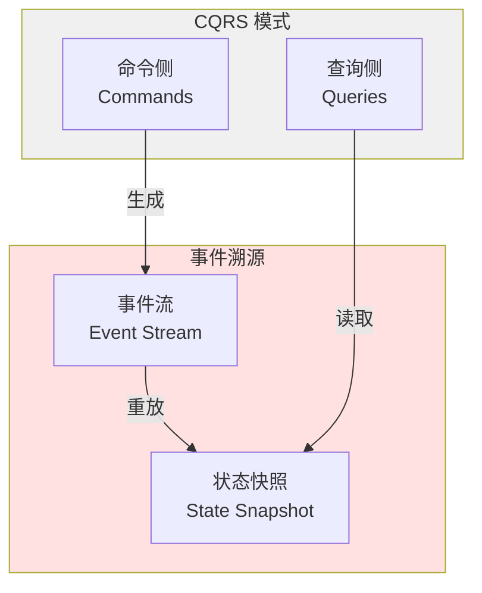
```mermaid
graph TB
    subgraph CQRS["CQRS 模式"]
        CMD["命令侧<br/>Commands"]
        QUERY["查询侧<br/>Queries"]
    end
    
    subgraph ES["事件溯源"]
        EVT["事件流<br/>Event Stream"]
        STATE["状态快照<br/>State Snapshot"]
    end

    CMD -->|"生成"| EVT
    EVT -->|"重放"| STATE
    QUERY -->|"读取"| STATE

    style CQRS fill:#f0f0f0
    style ES fill:#ffe1e1
```

### 1.2 核心类层次结构

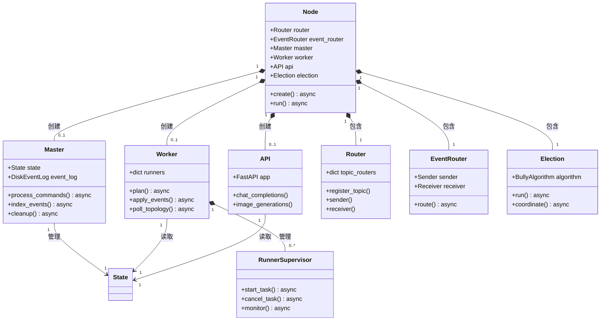
```mermaid
classDiagram
    class Node {
        +Router router
        +EventRouter event_router
        +Master master
        +Worker worker
        +API api
        +Election election
        +create() async
        +run() async
    }

    class Master {
        +State state
        +DiskEventLog event_log
        +process_commands() async
        +index_events() async
        +cleanup() async
    }

    class Worker {
        +dict runners
        +plan() async
        +apply_events() async
        +poll_topology() async
    }

    class API {
        +FastAPI app
        +chat_completions()
        +image_generations()
    }

    class Router {
        +dict topic_routers
        +register_topic()
        +sender()
        +receiver()
    }

    class EventRouter {
        +Sender sender
        +Receiver receiver
        +route() async
    }

    class Election {
        +BullyAlgorithm algorithm
        +run() async
        +coordinate() async
    }

    class RunnerSupervisor {
        +start_task() async
        +cancel_task() async
        +monitor() async
    }

    Node "1" *-- "1" Router : 包含
    Node "1" *-- "1" EventRouter : 包含
    Node "1" *-- "0..1" Master : 创建
    Node "1" *-- "0..1" Worker : 创建
    Node "1" *-- "0..1" API : 创建
    Node "1" *-- "1" Election : 包含
    Worker "1" *-- "0..*" RunnerSupervisor : 管理
    
    Master "1" --> "1" State : 管理
    Worker "1" --> "1" State : 读取
    API "1" --> "1" State : 读取
```

### 1.3 包结构

```mermaid
package {
    [API Layer] --> [Coordination Layer]
    [Coordination Layer] --> [Execution Layer]
    [Execution Layer] --> [Infrastructure Layer]
}

package "API Layer" {
    [FastAPI Server]
    [OpenAI Adapter]
    [Claude Adapter] 
    [Ollama Adapter]
}

package "Coordination Layer" {
    [Master]
    [Election]
    [Event Router]
}

package "Execution Layer" {
    [Worker]
    [Download Coordinator]
    [Runner Supervisor]
}

package "Infrastructure Layer" {
    [libp2p Router]
    [Model Card Manager]
    [Event Log]
}
```

### 1.4 关键接口

#### Command 接口 (命令)
```python
class Command(TaggedModel):
    command_id: CommandId
    
class TextGeneration(Command): ...
class ImageGeneration(Command): ...
class CreateInstance(Command): ...
```

#### Event 接口 (事件)
```python
class BaseEvent(TaggedModel):
    event_id: EventId
    
class TaskCreated(BaseEvent): ...
class ChunkGenerated(BaseEvent): ...
class InstanceCreated(BaseEvent): ...
```

#### State 接口 (状态)
```python
class State(CamelCaseModel):
    instances: Mapping[InstanceId, Instance]
    tasks: Mapping[TaskId, Task]
    topology: Topology
    last_event_applied_idx: int
```

### 1.5 设计模式应用

| 模式 | 位置 | 说明 |
|------|------|------|
| **Event Sourcing** | 全局状态管理 | 不可变事件 + 状态重放 |
| **CQRS** | Master/Worker | 命令查询分离 |
| **Pub/Sub** | Router/TopicRouter | 去中心化消息传递 |
| **Adapter** | API 层 | 多种 LLM API 适配 |
| **Strategy** | Instance Placement | 多种分片策略 |
| **Supervisor** | RunnerSupervisor | 进程监控和重启 |

---

## 2. 进程视图 (Process View)

进程视图描述系统的**运行时行为**，关注进程、线程、通信和同步机制。

### 2.1 单节点进程结构

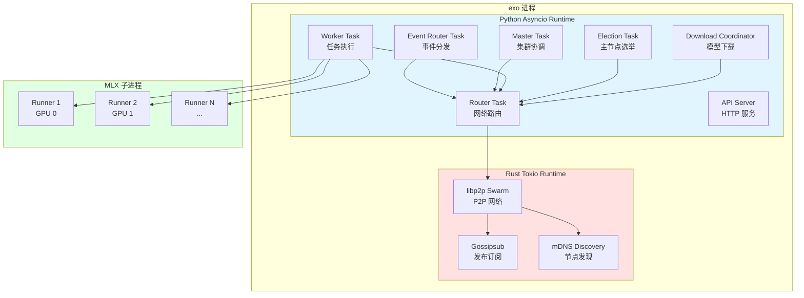
```mermaid
graph TB
    subgraph Process["exo 进程"]
        subgraph PythonRuntime["Python Asyncio Runtime"]
            RouterTask["Router Task<br/>网络路由"]
            EventRouterTask["Event Router Task<br/>事件分发"]
            MasterTask["Master Task<br/>集群协调"]
            WorkerTask["Worker Task<br/>任务执行"]
            ElectionTask["Election Task<br/>主节点选举"]
            DownloadTask["Download Coordinator<br/>模型下载"]
            APITask["API Server<br/>HTTP 服务"]
        end

        subgraph RustRuntime["Rust Tokio Runtime"]
            Libp2pTask["libp2p Swarm<br/>P2P 网络"]
            GossipsubTask["Gossipsub<br/>发布订阅"]
            MDNSTask["mDNS Discovery<br/>节点发现"]
        end
    end

    subgraph Subprocesses["MLX 子进程"]
        Runner1["Runner 1<br/>GPU 0"]
        Runner2["Runner 2<br/>GPU 1"]
        RunnerN["Runner N<br/>..."]
    end

    RouterTask --> Libp2pTask
    EventRouterTask --> RouterTask
    MasterTask --> RouterTask
    WorkerTask --> RouterTask
    ElectionTask --> RouterTask
    DownloadTask --> RouterTask
    
    Libp2pTask --> GossipsubTask
    Libp2pTask --> MDNSTask
    
    WorkerTask --> Runner1
    WorkerTask --> Runner2
    WorkerTask --> RunnerN

    style PythonRuntime fill:#e1f5ff
    style RustRuntime fill:#ffe1e1
    style Subprocesses fill:#e1ffe1
```

### 2.2 节点间通信模式

#### libp2p Gossipsub 消息传播

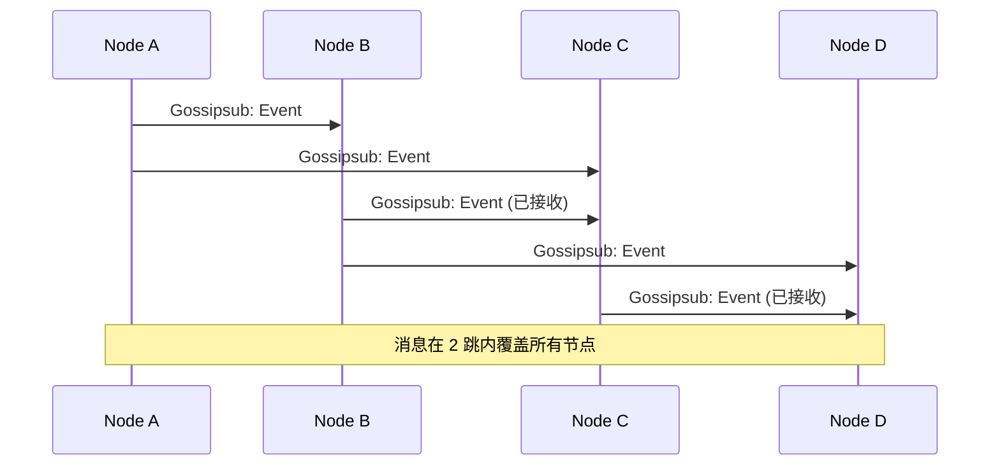
```mermaid
sequenceDiagram
    participant N1 as Node A
    participant N2 as Node B
    participant N3 as Node C
    participant N4 as Node D

    N1->>N2: Gossipsub: Event
    N1->>N3: Gossipsub: Event
    
    N2->>N3: Gossipsub: Event (已接收)
    N2->>N4: Gossipsub: Event
    
    N3->>N4: Gossipsub: Event (已接收)
    
    Note over N1,N4: 消息在 2 跳内覆盖所有节点
```

#### Topic 分发策略

| Topic | 发布策略 | 说明 |
|-------|----------|------|
| `GLOBAL_EVENTS` | Always | Master 索引的事件，广播所有节点 |
| `LOCAL_EVENTS` | Always | Worker 生成的本地事件 |
| `COMMANDS` | Always | 用户和 API 的命令 |
| `ELECTION_MESSAGES` | Always | 选举协议消息 |
| `DOWNLOAD_COMMANDS` | Always | 模型下载命令 |
| `CONNECTION_MESSAGES` | Never | 本地连接更新 |

### 2.3 并发控制

#### Python Asyncio 并发模型


```mermaid
graph LR
    EL["Event Loop<br/>单线程事件循环"]
    TG["TaskGroup<br/>任务组管理"]
    Q["Channels<br/>异步队列"]

    EL --> TG
    TG --> Q

    style EL fill:#ffe1e1
    style TG fill:#e1f5ff
    style Q fill:#fff4e1
```

**并发原语**:
- `anyio.create_task_group()`: 结构化并发
- `channels`: 跨组件通信
- `asyncio.Event`: 状态同步

#### Rust Tokio 并发模型

**跨语言通信**:
```python
# Python side
receiver: Receiver[PyFromSwarm] = router.receiver()

# Rust side
tokio::spawn(async move {
    loop {
        let msg = swarm.recv().await;
        python_sender.send(msg).await;
    }
})
```

### 2.4 同步机制

#### 事件索引同步

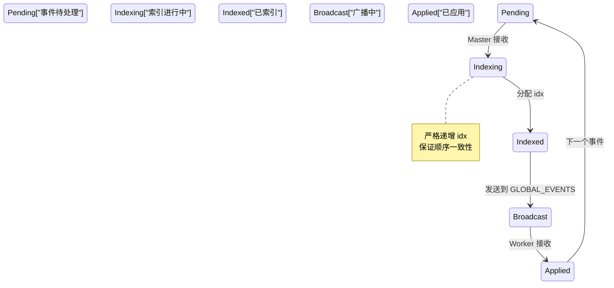
```mermaid
stateDiagram-v2
    Pending["事件待处理"]
    Indexing["索引进行中"]
    Indexed["已索引"]
    Broadcast["广播中"]
    Applied["已应用"]

    Pending --> Indexing: Master 接收
    Indexing --> Indexed: 分配 idx
    Indexed --> Broadcast: 发送到 GLOBAL_EVENTS
    Broadcast --> Applied: Worker 接收
    Applied --> Pending: 下一个事件

    note right of Indexing
        严格递增 idx
        保证顺序一致性
    end note
```

#### 选举同步 (Bully Algorithm)

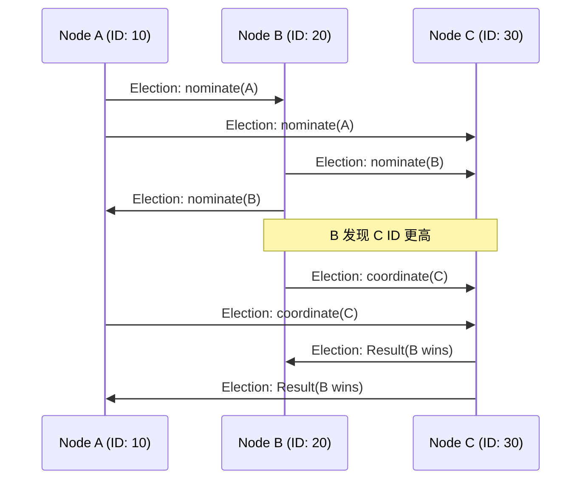
```mermaid
sequenceDiagram
    participant A as Node A (ID: 10)
    participant B as Node B (ID: 20)
    participant C as Node C (ID: 30)

    A->>B: Election: nominate(A)
    A->>C: Election: nominate(A)
    
    B->>C: Election: nominate(B)
    B->>A: Election: nominate(B)
    
    Note over B,C: B 发现 C ID 更高
    
    B->>C: Election: coordinate(C)
    A->>C: Election: coordinate(C)
    
    C->>B: Election: Result(B wins)
    C->>A: Election: Result(B wins)
```

### 2.5 性能考虑

| 操作 | 延迟目标 | 优化策略 |
|------|----------|----------|
| **Token 生成** | < 100ms | 流式响应、连续批处理 |
| **事件传播** | < 50ms | Gossipsub、消息压缩 |
| **Master 切换** | < 10s | Bully 算法、快速收敛 |
| **模型加载** | < 30s | 分片下载、并行加载 |

---

## 3. 实现视图 (Implementation View)

实现视图描述系统的**开发组织**，关注代码结构、依赖关系和构建系统。

### 3.1 代码目录结构

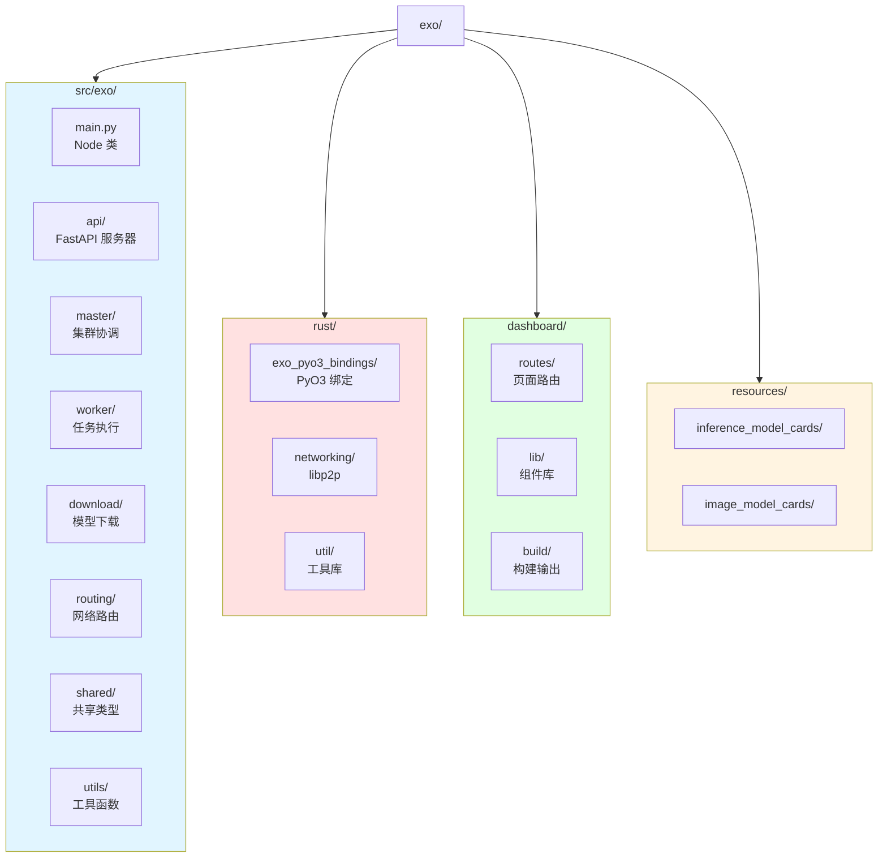
```mermaid
graph TB
    ROOT["exo/"]
    
    subgraph SRC["src/exo/"]
        MAIN["main.py<br/>Node 类"]
        API["api/<br/>FastAPI 服务器"]
        MASTER["master/<br/>集群协调"]
        WORKER["worker/<br/>任务执行"]
        DOWNLOAD["download/<br/>模型下载"]
        ROUTING["routing/<br/>网络路由"]
        SHARED["shared/<br/>共享类型"]
        UTILS["utils/<br/>工具函数"]
    end
    
    subgraph RUST["rust/"]
        BINDINGS["exo_pyo3_bindings/<br/>PyO3 绑定"]
        NETWORKING["networking/<br/>libp2p"]
        UTIL["util/<br/>工具库"]
    end
    
    subgraph DASHBOARD["dashboard/"]
        ROUTES["routes/<br/>页面路由"]
        LIB["lib/<br/>组件库"]
        BUILD["build/<br/>构建输出"]
    end
    
    subgraph RESOURCES["resources/"]
        MODELS["inference_model_cards/"]
        IMAGES["image_model_cards/"]
    end
    
    ROOT --> SRC
    ROOT --> RUST
    ROOT --> DASHBOARD
    ROOT --> RESOURCES

    style SRC fill:#e1f5ff
    style RUST fill:#ffe1e1
    style DASHBOARD fill:#e1ffe1
    style RESOURCES fill:#fff4e1
```

### 3.2 模块依赖关系

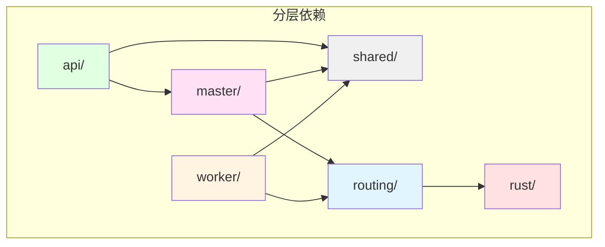
```mermaid
graph TB
    subgraph Layers["分层依赖"]
        API["api/"]
        MASTER["master/"]
        WORKER["worker/"]
        SHARED["shared/"]
        ROUTING["routing/"]
        RUST["rust/"]
    end
    
    API --> MASTER
    API --> SHARED
    MASTER --> SHARED
    WORKER --> SHARED
    MASTER --> ROUTING
    WORKER --> ROUTING
    ROUTING --> RUST

    style API fill:#e1ffe1
    style MASTER fill:#ffe1f5
    style WORKER fill:#fff4e1
    style SHARED fill:#f0f0f0
    style ROUTING fill:#e1f5ff
    style RUST fill:#ffe1e1
```

**依赖规则**:
- 上层可以依赖下层
- 同层之间通过接口通信
- `shared/` 是唯一共享模块

### 3.3 核心模块说明

#### 3.3.1 shared/ - 共享类型定义

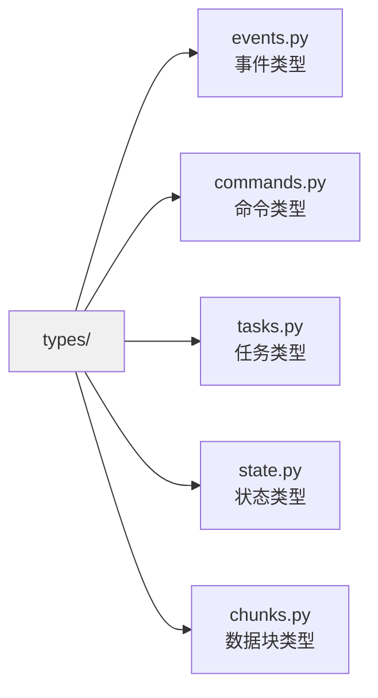
```mermaid
graph LR
    TYPES["types/"]
    EVENTS["events.py<br/>事件类型"]
    COMMANDS["commands.py<br/>命令类型"]
    TASKS["tasks.py<br/>任务类型"]
    STATE["state.py<br/>状态类型"]
    CHUNKS["chunks.py<br/>数据块类型"]

    TYPES --> EVENTS
    TYPES --> COMMANDS
    TYPES --> TASKS
    TYPES --> STATE
    TYPES --> CHUNKS

    style TYPES fill:#f0f0f0
```

**设计原则**:
- 所有类型使用 Pydantic 模型
- 使用 `frozen=True` 确保不可变性
- 使用可区分联合类型 (Discriminated Unions)

#### 3.3.2 master/ - 集群协调

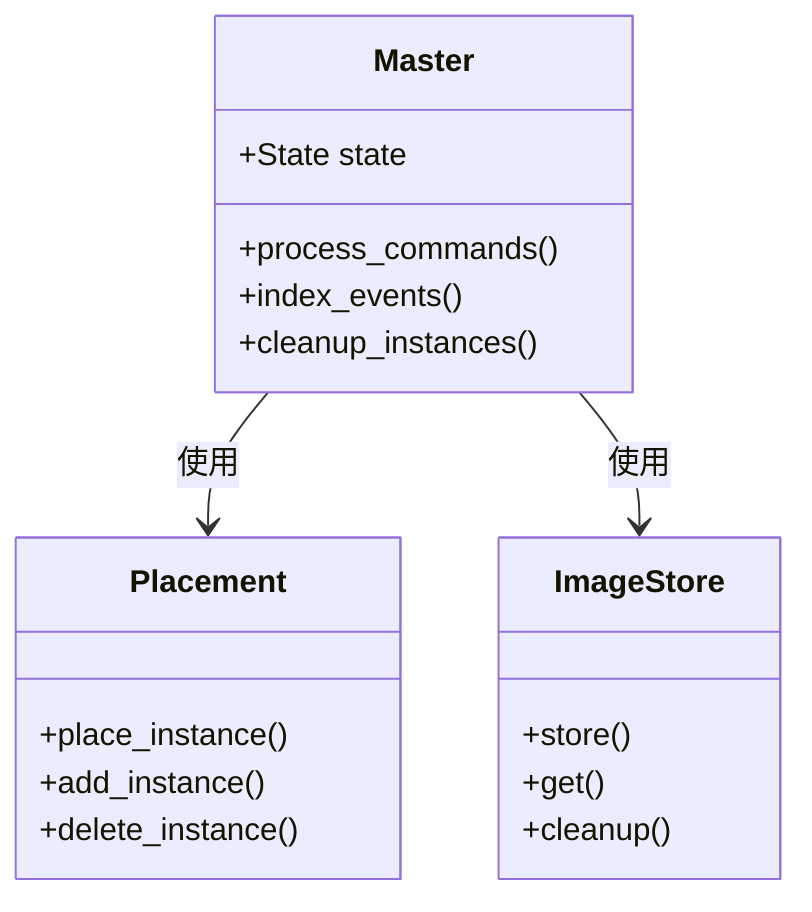
```mermaid
classDiagram
    class Master {
        +State state
        +process_commands()
        +index_events()
        +cleanup_instances()
    }
    
    class Placement {
        +place_instance()
        +add_instance()
        +delete_instance()
    }
    
    class ImageStore {
        +store()
        +get()
        +cleanup()
    }
    
    Master --> Placement : 使用
    Master --> ImageStore : 使用
```

#### 3.3.3 worker/ - 任务执行

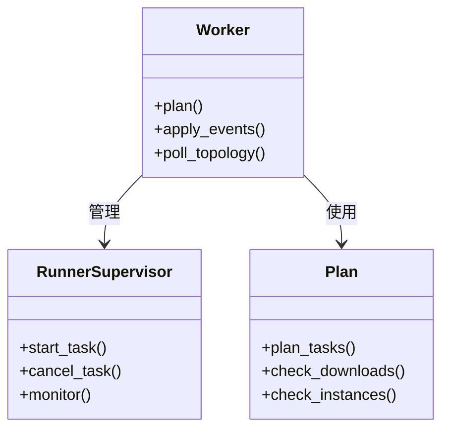
```mermaid
classDiagram
    class Worker {
        +plan()
        +apply_events()
        +poll_topology()
    }
    
    class RunnerSupervisor {
        +start_task()
        +cancel_task()
        +monitor()
    }
    
    class Plan {
        +plan_tasks()
        +check_downloads()
        +check_instances()
    }
    
    Worker --> RunnerSupervisor : 管理
    Worker --> Plan : 使用
```

### 3.4 构建系统

#### Python 包管理

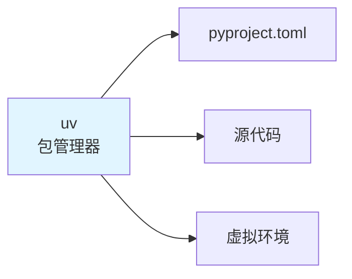
```mermaid
graph LR
    UV["uv<br/>包管理器"]
    PYPROJECT["pyproject.toml"]
    SRC["源代码"]
    VENV["虚拟环境"]

    UV --> PYPROJECT
    UV --> SRC
    UV --> VENV

    style UV fill:#e1f5ff
```

**构建步骤**:
```bash
# 1. 安装依赖
uv pip install -e .

# 2. 构建仪表板
cd dashboard && npm run build

# 3. 运行
uv run exo
```

#### Rust 构建

```mermaid
graph LR
    CARGO["cargo<br/>Rust 构建工具"]
    CRATES["Rust Crates"]
    PYO3["PyO3 Bindings"]
    PYTHON["Python 扩展"]

    CARGO --> CRATES
    CRATES --> PYO3
    PYO3 --> PYTHON

    style CARGO fill:#ffe1e1
```

#### 前端构建

```mermaid
graph LR
    NPM["npm<br/>Node.js 包管理"]
    VITE["Vite<br/>构建工具"]
    SVELTE["Svelte 组件"]
    BUILD["构建输出"]

    NPM --> VITE
    VITE --> SVELTE
    VITE --> BUILD

    style NPM fill:#e1ffe1
```

### 3.5 技术栈总览

| 层级 | 技术 | 用途 |
|------|------|------|
| **前端** | Svelte 5, Vite, TypeScript | Web UI |
| **后端** | FastAPI, Hypercorn | HTTP API |
| **网络** | libp2p, Gossipsub | P2P 通信 |
| **推理** | MLX | 模型推理 |
| **序列化** | Pydantic | 数据验证 |
| **异步** | Anyio, Tokio | 并发运行时 |
| **构建** | uv, cargo, npm | 构建工具 |
| **测试** | pytest, pytest-asyncio | 单元测试 |

---

## 4. 部署视图 (Deployment View)

部署视图描述系统的**物理拓扑**，关注硬件配置、网络部署和运维方案。

### 4.1 集群拓扑

```mermaid
graph TB
    subgraph Cluster["EXO P2P 集群"]
        subgraph Site1["站点 1: 本地网络"]
            D1["MacBook Pro<br/>Master + API<br/>192.168.1.10"]
            D2["Mac Mini<br/>Worker<br/>192.168.1.11"]
        end
        
        subgraph Site2["站点 2: 数据中心"]
            D3["Mac Studio<br/>Worker<br/>10.0.0.10"]
            D4["iMac<br/>Worker<br/>10.0.0.11"]
        end
    end

    D1 <-->|"Thunderbolt<br/>RDMA"| D2
    D3 <-->|"Ethernet<br/>10Gbps"| D4
    D1 <-->|"VPN<br/>libp2p"| D3

    style D1 fill:#ffe1e1
    style D2 fill:#e1f5ff
    style D3 fill:#e1ffe1
    style D4 fill:#fff4e1
```

### 4.2 节点类型配置

| 节点类型 | 硬件要求 | 软件 | 数量 |
|---------|----------|------|------|
| **Master + API** | 8GB+ RAM, 4核 | exo --force-master | 1-3 |
| **Worker** | 16GB+ RAM, GPU/Metal | exo --no-api | 2-N |
| **纯协调器** | 4GB+ RAM | exo --no-worker | 0-1 |

### 4.3 网络配置

#### libp2p Multiaddr 格式

```
/ip4/<IP>/tcp/<PORT>/p2p/<PEER_ID>
/ip6/<IP>/tcp/<PORT>/p2p/<PEER_ID>
```

#### 支持的传输协议

```mermaid
graph LR
    TCP["TCP/IP<br/>IPv4/IPv6"]
    MDNS["mDNS<br/>本地发现"]
    TB["Thunderbolt<br/>RDMA"]

    TCP --> LIBP2P["libp2p Stack"]
    MDNS --> LIBP2P
    TB --> LIBP2P

    style LIBP2P fill:#e1f5ff
```

#### 端口分配

| 端口 | 服务 | 协议 |
|------|------|------|
| `0` (自动) | libp2p | TCP |
| `52415` | HTTP API | HTTP |
| `随机` | mDNS | UDP |

### 4.4 存储布局

```mermaid
graph TB
    HOME["~/.exo/"]
    
    NODEID["node_id<br/>身份密钥"]
    MODELS["models/<br/>模型文件"]
    CARDS["custom_model_cards/<br/>自定义卡片"]
    LOGS["event_log/<br/>事件日志"]
    TRACES["traces/<br/>追踪数据"]
    CACHE["cache/<br/>缓存"]
    
    HOME --> NODEID
    HOME --> MODELS
    HOME --> CARDS
    HOME --> LOGS
    HOME --> TRACES
    HOME --> CACHE

    style HOME fill:#f0f0f0
    style MODELS fill:#e1f5ff
    style LOGS fill:#fff4e1
    style TRACES fill:#ffe1e1
```

### 4.5 部署场景

#### 场景 A: 开发环境 (单节点)

```mermaid
graph TB
    DEV["开发机器<br/>MacBook Pro"]
    ALL["所有组件<br/>Master + Worker + API"]
    UI["Web UI<br/>localhost:52415"]

    DEV --> ALL
    ALL --> UI

    style DEV fill:#e1ffe1
    style ALL fill:#f0f0f0
```

**启动命令**:
```bash
uv run exo
```

#### 场景 B: 小型集群 (本地网络)

```mermaid
graph TB
    subgraph LAN["本地网络 192.168.1.0/24"]
        N1["节点 1: Master + API<br/>192.168.1.10"]
        N2["节点 2: Worker<br/>192.168.1.11"]
        N3["节点 3: Worker<br/>192.168.1.12"]
    end

    N1 <-->|"libp2p"| N2
    N1 <-->|"libp2p"| N3
    N2 <-->|"libp2p"| N3

    style N1 fill:#ffe1e1
    style N2 fill:#e1f5ff
    style N3 fill:#e1f5ff
```

**启动命令**:
```bash
# 节点 1
uv run exo --force-master --api-port 52415

# 节点 2-3
uv run exo --bootstrap-peers /ip4/192.168.1.10/tcp/<PORT>/p2p/<PEER_ID>
```

#### 场景 C: 高性能集群 (混合部署)

```mermaid
graph TB
    subgraph HPC["高性能环境"]
        MASTER["协调节点<br/>MacBook<br/>API + Master"]
        WORKER1["计算节点 1<br/>Mac Studio<br/>Worker"]
        WORKER2["计算节点 2<br/>Mac Studio<br/>Worker"]
    end

    MASTER <-->|"Thunderbolt<br/>40Gbps"| WORKER1
    MASTER <-->|"Thunderbolt<br/>40Gbps"| WORKER2

    style MASTER fill:#ffe1e1
    style WORKER1 fill:#e1ffe1
    style WORKER2 fill:#e1ffe1
```

**启动命令**:
```bash
# 协调节点
uv run exo --no-worker --force-master

# 计算节点
uv run exo --no-api --bootstrap-peers <COORDINATOR_MULTIADDR>
```

### 4.6 监控和运维

#### 健康检查

```mermaid
graph LR
    MONITOR["监控系统"]
    API["API /health"]
    METRICS["/state"]
    LOGS["/events"]

    MONITOR --> API
    MONITOR --> METRICS
    MONITOR --> LOGS

    style MONITOR fill:#ffe1e1
```

**检查端点**:
- `GET /state` - 集群状态
- `GET /events` - 事件流
- `GET /node_id` - 节点标识

#### 日志聚合

```bash
# 查看集群状态
curl http://localhost:52415/state

# 查看事件日志
curl http://localhost:52415/events

# 查看特定节点的内存
curl http://localhost:52415/state/node_memory
```

---

## 5. 架构质量属性

### 5.1 可扩展性 (Scalability)

| 维度 | 策略 | 指标 |
|------|------|------|
| **水平扩展** | 添加新节点自动加入 | < 30s 发现并加入 |
| **模型分片** | 流水线并行 / 张量并行 | 支持 100+ 层模型 |
| **负载均衡** | 基于任务数的请求分配 | 自动负载均衡 |

```mermaid
graph LR
    SINGLE["单节点<br/>1x 性能"]
    CLUSTER["集群<br/>Nx 性能"]
    
    SINGLE -->|"添加节点"| CLUSTER
    
    style SINGLE fill:#ffe1e1
    style CLUSTER fill:#e1ffe1
```

### 5.2 可用性 (Availability)

| 故障类型 | 检测时间 | 恢复时间 | 策略 |
|---------|----------|----------|------|
| **Master 故障** | 30s | < 10s | Bully 算法选举 |
| **Worker 故障** | 30s | 自动 | 重新放置实例 |
| **网络分区** | 30s | < 10s | 自动重连和选举 |

```mermaid
stateDiagram-v2
    Healthy --> Degraded: 节点故障
    Degraded --> Recovering: 检测到故障
    Recovering --> Healthy: 故障恢复
    
    note right of Degraded
        降级运行
        部分实例不可用
    end note
    
    note right of Recovering
        重新选举
        实例迁移
    end note
```

### 5.3 性能 (Performance)

| 操作 | P50 | P95 | P99 |
|------|-----|-----|-----|
| **Token 生成** | 50ms | 100ms | 200ms |
| **事件传播** | 20ms | 50ms | 100ms |
| **实例创建** | 1s | 5s | 10s |
| **模型下载** | 1min | 5min | 15min |

### 5.4 可维护性 (Maintainability)

```mermaid
graph TB
    CODE["代码质量"]
    TEST["测试覆盖"]
    DOC["文档完善"]
    TYPE["类型安全"]

    CODE --> TEST
    CODE --> DOC
    CODE --> TYPE

    style CODE fill:#e1f5ff
    style TEST fill:#e1ffe1
    style DOC fill:#fff4e1
    style TYPE fill:#ffe1e1
```

**质量保证**:
- 严格类型检查 (`basedpyright`)
- 高测试覆盖率 (`pytest-asyncio`)
- 完整的架构文档
- 代码审查流程

### 5.5 可观测性 (Observability)

```mermaid
graph LR
    LOGS["事件日志"]
    TRACES["分布式追踪"]
    METRICS["状态指标"]
    DASH["仪表板"]

    LOGS --> DASH
    TRACES --> DASH
    METRICS --> DASH

    style DASH fill:#e1f5ff
```

**可观测性特性**:
- **事件溯源**: 所有状态变更可追溯
- **分布式追踪**: 任务级别的性能追踪
- **实时状态**: `/state` API 实时查询
- **Web UI**: 可视化监控面板

---

## 附录

### A. 术语表

| 术语 | 定义 |
|------|------|
| **Event** | 不可变的状态变更记录 |
| **Command** | 触发状态变更的意图 |
| **Instance** | 模型实例，包含分片分配 |
| **Runner** | MLX 推理进程 |
| **Task** | 工作单元，绑定到 Instance |
| **Session** | 选举周期标识 |
| **Shard** | 模型分片 |
| **Topology** | 集群网络拓扑 |
| **PeerID** | libp2p 节点标识 |

### B. 参考资料

**内部文档**:
- CLAUDE.md - 开发指南
- README.md - 项目概述

**核心代码**:
- `src/exo/main.py` - Node 类
- `src/exo/master/main.py` - Master 类
- `src/exo/worker/main.py` - Worker 类
- `src/exo/api/main.py` - API 类

**外部技术**:
- [libp2p](https://libp2p.io/)
- [MLX](https://ml-explore.github.io/mlx/)
- [FastAPI](https://fastapi.tiangolo.com/)
- [4+1 View Model](https://www.ibm.com/docs/en/rational-uml/9.0.0?topic=views-four-plus-one-model)

---

**文档结束**
