## 📊 文档中的流程图索引

本文档包含以下 Mermaid 流程图（需要支持 Mermaid 的 Markdown 查看器）：

1. **架构层次图** - 展示从应用层到物理层的完整架构
2. **mDNS 发现流程图** - 设备发现的详细序列图
3. **传输协议栈图** - libp2p 传输层分层结构
4. **节点启动时序图** - 完整的启动流程
5. **连接建立详细流程图** - mDNS、TCP、Noise、Yamux 的完整步骤
6. **消息流向图** - 消息从发送到网络传输的路径
7. **Thunderbolt 依赖关系图** - Thunderbolt 与 mDNS 的分层依赖
8. **Thunderbolt 数据收集流程图** - InfoGatherer 触发到使用的完整流程
9. **Thunderbolt 关联流程图** - 两个数据源的关联逻辑
10. **Thunderbolt 完整使用流程图** - 从构造到 RDMA 通信的4个阶段
11. **Thunderbolt 设备发现时序图** - 完整的 Thunderbolt 发现和 RDMA 建立流程
12. **选举流程图** - Bully 算法的详细执行流程
13. **角色切换场景图** - Master 故障后的重新选举
14. **RDMA Queue Pair 状态机图** - RDMA 连接建立的状态转换过程

> **注意**：如果流程图无法显示，请使用支持 Mermaid 的 Markdown 查看器，如：
> - GitHub（在线查看）
> - VS Code（安装 Markdown Preview Mermaid Support 插件）
> - Typora
> - Obsidian

## 概述

exo 使用基于 libp2p 的点对点网络架构，通过 mDNS (Multicast DNS) 实现本地网络内的自动设备发现，并支持 bootstrap peers 作为备选方案。在支持的 macOS 设备上，exo 还可以利用 **RDMA over Thunderbolt 5** 实现超低延迟（99% 延迟降低）的设备间通信。本文档详细描述了设备发现和连接建立的完整流程。

## 架构层次

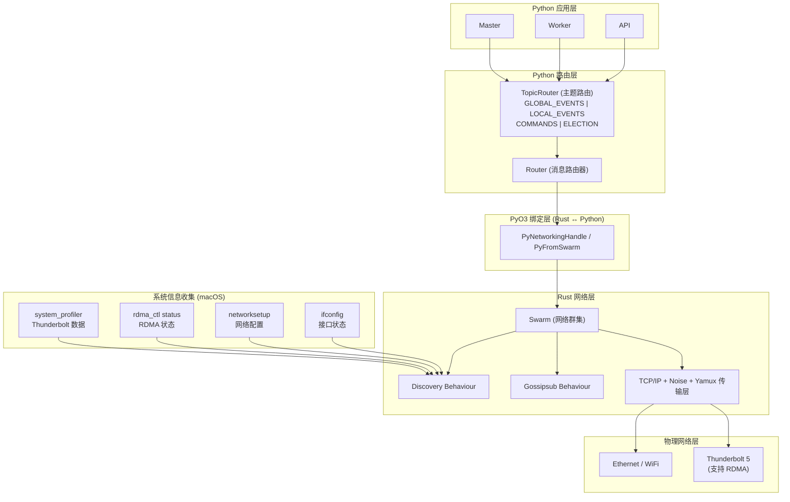

## 核心组件概述

exo 的 `Node` 运行以下核心组件：

| 组件 | 是否所有节点运行 | 说明 |
|------|-----------------|------|
| **Router** | ✅ 是 | libp2p 网络层，所有节点都有 |
| **Election** | ✅ 是 | 参与主控器选举（Bully 算法） |
| **Worker** | ✅ 是* | 处理推理任务（除非 `--no-worker`） |
| **Master** | ❌ 否 | **只有一个节点通过选举成为 master** |
| **API** | ✅ 是 | 提供 API 和 dashboard（所有节点） |

* 可以通过 `--no-worker` 禁用

---

# 第一部分：设备发现与基础连接

## 1.1 mDNS 设备发现

### mDNS 配置参数

```rust
const MDNS_RECORD_TTL: Duration = Duration::from_secs(2_500);    // mDNS 记录生存时间
const MDNS_QUERY_INTERVAL: Duration = Duration::from_secs(1_500); // mDNS 查询间隔
const RETRY_CONNECT_INTERVAL: Duration = Duration::from_secs(5);  // 重试连接间隔
```

### 发现流程

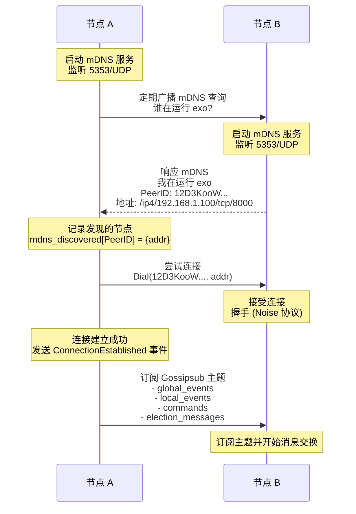

### 连接状态跟踪

```rust
pub enum Event {
    ConnectionEstablished {
        peer_id: PeerId,
        connection_id: ConnectionId,
        remote_ip: IpAddr,
        remote_tcp_port: u16,
    },
    ConnectionClosed {
        peer_id: PeerId,
        connection_id: ConnectionId,
        remote_ip: IpAddr,
        remote_tcp_port: u16,
    },
}
```

### 连接维护机制

```rust
// 每 5 秒重试连接所有发现的节点
if self.retry_delay.poll(cx).is_ready() {
    for (p, mas) in self.mdns_discovered.clone() {
        for ma in mas {
            self.dial(p, ma)  // 尝试连接
        }
    }
}
```

## 1.2 传输层配置

### 传输协议栈

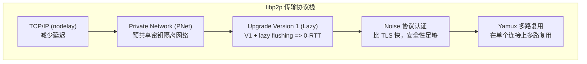

### 私有网络配置

```rust
// 通过网络版本生成预共享密钥，实现网络隔离
static PNET_PRESHARED_KEY: LazyLock<[u8; 32]> = LazyLock::new(|| {
    let builder = Sha3_256::new().update(b"exo_discovery_network");

    if let Ok(var) = env::var(OVERRIDE_VERSION_ENV_VAR) {  // EXO_LIBP2P_NAMESPACE
        let bytes = var.into_bytes();
        builder.update(&bytes)
    } else {
        builder.update(NETWORK_VERSION)  // "v0.0.1"
    }
    .finalize()
});
```

## 1.3 连接建立详细流程

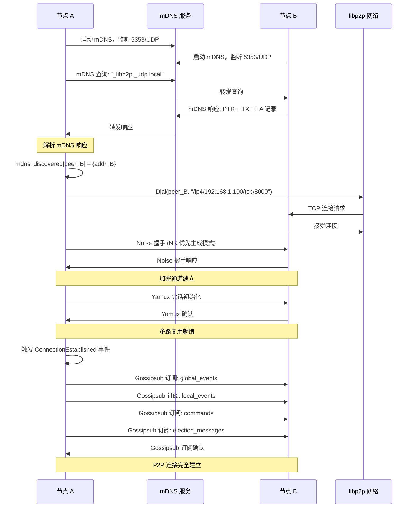

---

# 第二部分：集群架构与选举机制

## 2.1 选举机制概述

exo 使用 **Bully 算法**实现主控器选举，确保集群中始终只有一个 Master，并支持 Master 角色的动态切换。

### 节点角色

| 组件 | 是否所有节点运行 | 说明 |
|------|-----------------|------|
| **Router** | ✅ 是 | libp2p 网络层 |
| **Election** | ✅ 是 | 参与主控器选举 |
| **Worker** | ✅ 是* | 处理推理任务 |
| **Master** | ❌ 否 | **只有一个节点通过选举成为 master** |
| **API** | ✅ 是 | 提供 HTTP API |

* 可以通过 `--no-worker` 禁用

### Bully 算法核心思想

```
Bully 算法：
1. 每个 NodeId 可以比较大小
2. ID 最大（最资深）的节点成为 Master
3. 如果有新节点加入或 Master 宕机，触发重新选举
4. 通过 seniority 机制防止频繁切换
```

### 选举消息比较

```python
# src/exo/shared/election.py:28-39
def __lt__(self, other: Self) -> bool:
    # 优先级: clock > seniority > commands_seen > node_id
    if self.clock != other.clock:
        return self.clock < other.clock
    if self.seniority != other.seniority:
        return self.seniority < other.seniority
    elif self.commands_seen != other.commands_seen:
        return self.commands_seen < other.commands_seen
    else:
        return self.proposed_session.master_node_id < other.proposed_session.master_node_id
```

**比较优先级**：
1. **clock**（选举轮次）：越新越优先
2. **seniority**（资深度）：当选次数越多越优先
3. **commands_seen**（处理命令数）：处理越多越优先
4. **node_id**（节点 ID）：ID 越大越优先

## 2.2 选举触发时机

### 1. 节点启动时

```python
# src/exo/shared/election.py:86-99
async def run(self):
    logger.info("Starting Election")
    async with self._tg as tg:
        tg.start_soon(self._election_receiver)
        tg.start_soon(self._connection_receiver)
        tg.start_soon(self._command_counter)

        # 立即启动第一轮选举（超时为 0）
        candidates: list[ElectionMessage] = []
        await self._campaign(candidates, campaign_timeout=0.0)
```

### 2. 新节点连接时

```python
# src/exo/shared/election.py:159-180
async def _connection_receiver(self) -> None:
    with self._cm_receiver as connection_messages:
        async for first in connection_messages:
            # 等待 200ms 收集所有连接消息
            await anyio.sleep(0.2)
            rest = connection_messages.collect()

            # 增加时钟（触发新一轮选举）
            self.clock += 1
            candidates: list[ElectionMessage] = []
            self._candidates = candidates

            # 启动新的竞选活动
            self._tg.start_soon(
                self._campaign, candidates, DEFAULT_ELECTION_TIMEOUT
            )
```

### 3. Master 宕机时

```python
# libp2p Ping 机制
const PING_TIMEOUT: Duration = Duration::from_millis(2_500);
const PING_INTERVAL: Duration = Duration::from_millis(2_500);

# Ping 失败 → 关闭连接 → 触发重新选举
```

## 2.3 角色动态切换机制

### `_elect_loop` 处理选举结果

```python
# src/exo/main.py:168-260
async def _elect_loop(self):
    with self.election_result_receiver as results:
        async for result in results:
            # result.is_new_master: 是否有新 Master
            # result.session_id.master_node_id: 当选 Master 的 NodeId
            # result.won_clock: 当选的轮次

            # === 场景 1：本节点当选 Master ===
            if result.session_id.master_node_id == self.node_id:
                if self.master is None:
                    # 提升自己为 Master
                    logger.info("Node elected Master - promoting self")
                    self.master = Master(...)
                    self._tg.start_soon(self.master.run)

            # === 场景 2：其他节点当选 Master ===
            elif result.session_id.master_node_id != self.node_id:
                if self.master is not None:
                    # 降级：关闭自己的 Master 组件
                    logger.info(f"Node XXX elected master - demoting self")
                    await self.master.shutdown()
                    self.master = None

            # === 场景 3：新 Master 产生（无论是不是自己） ===
            if result.is_new_master:
                # 重启 EventRouter（使用新的 session_id）
                self.event_router.shutdown()
                self.event_router = EventRouter(result.session_id, ...)
                self._tg.start_soon(self.event_router.run)

                # 重启 Worker（使用新的 EventRouter）
                if self.worker:
                    await self.worker.shutdown()
                    self.worker = Worker(...)
                    self._tg.start_soon(self.worker.run)
```

### 关键切换场景

**场景：Master 宕机，重新选举**

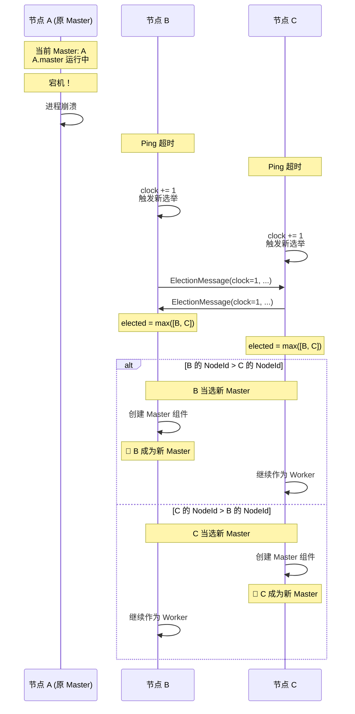

---

# 第三部分：Thunderbolt/RDMA 深度解析

## 3.1 Thunderbolt 与 mDNS 的依赖关系

**重要概念**：Thunderbolt/RDMA **依赖 mDNS**（或其他节点发现机制）才能工作。

### 依赖链分析

```
Thunderbolt RDMA 完整依赖链：

┌─────────────────────────────────────────────────────────────┐
│ 步骤 1: mDNS 发现节点                                       │
│   ├─ 发现 PeerID 和 IP 地址                                 │
│   ├─ 建立 TCP 连接                                          │
│   └─ 完成 Noise + Yamux 握手                                │
├─────────────────────────────────────────────────────────────┤
│ 步骤 2: 加入 Gossipsub 网络                                 │
│   └─ 订阅主题：local_events, global_events                  │
├─────────────────────────────────────────────────────────────┤
│ 步骤 3: 传播 Thunderbolt 标识符                             │
│   ├─ MacThunderboltIdentifiers 事件                         │
│   │   └─ 广播 domain_uuid → node_id 映射                    │
│   └─ 每个节点学习其他节点的 domain_uuid                      │
├─────────────────────────────────────────────────────────────┤
│ 步骤 4: 检测 Thunderbolt 物理连接                           │
│   └─ MacThunderboltConnections 事件                         │
│       └─ 广播 Thunderbolt 线缆连接（source_uuid ↔ sink_uuid）│
├─────────────────────────────────────────────────────────────┤
│ 步骤 5: 创建 RDMA 连接                                      │
│   ├─ 使用映射表：domain_uuid → node_id                      │
│   ├─ 创建 RDMAConnection 对象                               │
│   └─ 更新拓扑图                                             │
└─────────────────────────────────────────────────────────────┘
```

### 关键证据

**关键代码**（`src/exo/shared/apply.py:335-354`）：

```python
case MacThunderboltConnections():
    # 🔑 关键：需要先有 domain_uuid → node_id 映射
    conn_map = {
        tb_ident.domain_uuid: (nid, tb_ident.rdma_interface)
        for nid in state.node_thunderbolt        # ← 数据从哪里来？
        for tb_ident in state.node_thunderbolt[nid].interfaces
    }

    # 创建 RDMA 连接
    as_rdma_conns = [
        Connection(
            source=event.node_id,
            sink=conn_map[tb_conn.sink_uuid][0],  # ← 如果映射不存在，KeyError
            edge=RDMAConnection(...),
        )
        for tb_conn in info.conns
        if tb_conn.source_uuid in conn_map  # ← 映射不存在就跳过
        if tb_conn.sink_uuid in conn_map
    ]

    topology.replace_all_out_rdma_connections(event.node_id, as_rdma_conns)
```

### 场景分析

**场景：两台 Mac 通过 Thunderbolt 5 线缆连接，但 mDNS 失败**

```
配置：
- 节点 A: node_id_A, domain_uuid = "AAAA-AAAA"
- 节点 B: node_id_B, domain_uuid = "BBBB-BBBB"
- Thunderbolt 线缆: AAAA-AAAA ↔ BBBB-BBBB

执行流程：

1. mDNS 失败
   └─ 节点 A 无法发现节点 B
   └─ 无法建立 libp2p 连接
   └─ 无法加入 Gossipsub 网络

2. InfoGatherer 继续工作
   ├─ 节点 A: system_profiler 检测到 domain_uuid_A
   └─ 节点 B: system_profiler 检测到 domain_uuid_B

3. 节点 A 的 state.node_thunderbolt：
   {node_id_A: [ThunderboltIdentifier(domain_uuid="AAAA-AAAA", ...)]}
   ← 只有节点 A 自己的信息

4. 节点 A 收到 MacThunderboltConnections 事件：
   conns = [
     ThunderboltConnection(
       source_uuid="AAAA-AAAA",
       sink_uuid="BBBB-BBBB"  ← 检测到了物理连接
     )
   ]

5. 尝试构建映射：
   conn_map = {"AAAA-AAAA": (node_id_A, "rdma_en2")}
   ← "BBBB-BBBB" 不在映射中！

6. 尝试创建连接：
   if tb_conn.sink_uuid in conn_map:  ← False
       # 跳过这个连接

结果：虽然检测到了 Thunderbolt 物理连接，
     但无法建立逻辑连接，因为不知道 "BBBB-BBBB" 是哪个节点。
```

### 依赖关系总结

| 场景 | mDNS | libp2p | Gossipsub | Thunderbolt | 结果 |
|------|------|--------|-----------|-------------|------|
| **场景 1** | ✅ | ✅ | ✅ | ✅ | ✅ RDMA 连接成功 |
| **场景 2** | ✅ | ✅ | ✅ | ❌ | ⚠️ Socket 连接（降级） |
| **场景 3** | ❌ | ❌ | ❌ | ✅ | ❌ **无法建立连接** |
| **场景 4** | ❌ | ✅* | ✅ | ✅ | ✅ RDMA 连接成功 |

*场景 4：使用 bootstrap peers 替代 mDNS

## 3.2 Thunderbolt 数据收集机制

### InfoGatherer 触发流程

InfoGatherer 的 Thunderbolt 监控任务在节点启动时自动触发，无需用户干预。

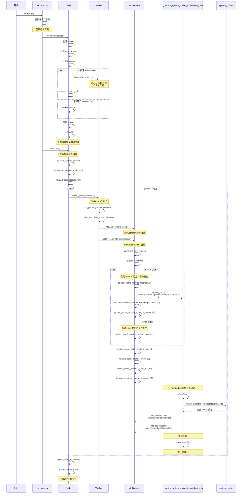

### 数据收集流程

**触发时机**：InfoGatherer 启动时创建后台任务，每 5 秒执行一次

**收集步骤**：

```python
# src/exo/utils/info_gatherer/info_gatherer.py:452-476
async def _monitor_system_profiler_thunderbolt_data(
    self, system_profiler_interval: float
):
    while True:
        try:
            # 1. 获取接口映射：Thunderbolt 端口名称 → 网络接口
            iface_map = await _gather_iface_map()
            # 例如: {"Thunderbolt 1": "en2", "Thunderbolt 2": "en3"}

            # 2. 调用 system_profiler 获取 Thunderbolt 连接数据
            data = await ThunderboltConnectivity.gather()
            # 返回: [ThunderboltConnectivityData, ...]

            # 3. 提取 Thunderbolt 标识符
            idents = [
                i.ident(iface_map)
                for i in data
                if (it := i.ident(iface_map)) is not None
            ]

            # 4. 提取 Thunderbolt 连接关系
            conns = [i.conn() for i in data if (it := i.conn()) is not None]

            # 5. 发送事件
            await self.info_sender.send(MacThunderboltIdentifiers(idents=idents))
            await self.info_sender.send(MacThunderboltConnections(conns=conns))
        except Exception as e:
            logger.opt(exception=e).warning("Error gathering Thunderbolt data")

        await anyio.sleep(5)  # 等待 5 秒
```

## 3.3 两个数据源的关联

### 为什么要关联两个数据源？

**核心问题**：创建完整的 RDMA 接口信息需要同时使用两个数据源。

#### 两个数据源各提供一部分信息

**数据源 1：`system_profiler`（Thunderbolt 硬件信息）**

```json
{
  "domain_uuid_key": "AABBCCDD-EEFF-0011-2233-445566778899",
  "receptacle_id_key": "1",
  "current_speed_key": "80 Gb/s"
}
```

**它告诉我们**：
- ✅ Thunderbolt 设备的唯一 ID (`domain_uuid`)
- ✅ 它在端口 1 上 (`receptacle_id_key`)
- ✅ 当前速度是 80 Gb/s (`current_speed_key`)
- ❌ **但不知道对应的网络接口是 `en2`、`en3` 还是其他**

**数据源 2：`networksetup`（端口名称到接口的映射）**

```bash
Hardware Port: Thunderbolt 1
Device: en2

Hardware Port: Thunderbolt 2
Device: en3
```

**它告诉我们**：
- ✅ "Thunderbolt 1" 对应设备 `en2`
- ✅ "Thunderbolt 2" 对应设备 `en3`
- ❌ **但不知道 Thunderbolt 硬件信息（UUID、速度等）**

#### 关联流程图

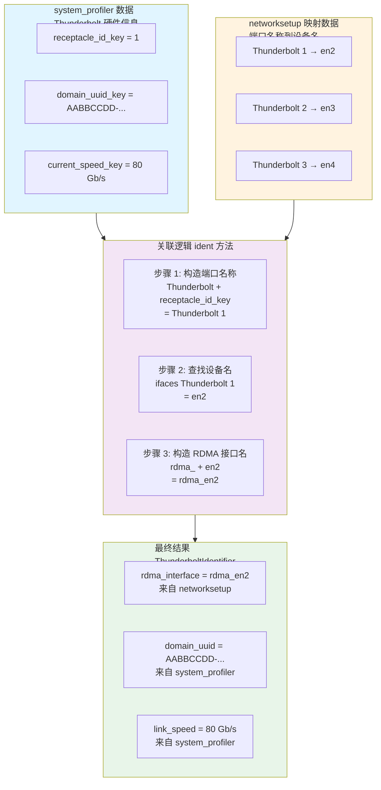

#### 关联代码实现

**`_gather_iface_map()` 函数**：

```python
# src/exo/utils/info_gatherer/info_gatherer.py:336-353
async def _gather_iface_map() -> dict[str, str] | None:
    proc = await anyio.run_process(
        ["networksetup", "-listallhardwareports"], check=False
    )

    ports: dict[str, str] = {}
    port = ""
    for line in proc.stdout.decode("utf-8").split("\n"):
        if line.startswith("Hardware Port:"):
            port = line.split(": ")[1]
        elif line.startswith("Device:"):
            ports[port] = line.split(": ")[1]
            port = ""

    return ports
```

**`ident()` 方法完成关联**：

```python
# src/exo/shared/types/thunderbolt.py:35-50
def ident(self, ifaces: dict[str, str]) -> ThunderboltIdentifier | None:
    # 步骤 1: 构造端口名称
    tag = f"Thunderbolt {self.receptacle_1_tag.receptacle_id_key}"

    # 步骤 2: 在映射中查找设备名
    iface = f"rdma_{ifaces[tag]}"

    # 步骤 3: 组合所有信息
    return ThunderboltIdentifier(
        rdma_interface=iface,
        domain_uuid=self.domain_uuid_key,
        link_speed=self.receptacle_1_tag.current_speed_key or ""
    )
```

## 3.4 Thunderbolt 数据的完整使用流程

### 4 个阶段的数据流转

```mermaid
flowchart TD
    subgraph Phase1["阶段 1: 数据收集与存储"]
        P1_1["InfoGatherer 收集 Thunderbolt 数据<br/>system_profiler + networksetup"]
        P1_2["构造 ThunderboltIdentifier<br/>rdma_interface, domain_uuid, link_speed"]
        P1_3["发送 MacThunderboltIdentifiers 事件<br/>via Gossipsub"]
        P1_4["Master 存储到 state.node_thunderbolt<br/>domain_uuid → node_id 映射建立"]
    end

    subgraph Phase2["阶段 2: 拓扑构建"]
        P2_1["接收 MacThunderboltConnections 事件<br/>source_uuid ↔ sink_uuid"]
        P2_2["查询 state.node_thunderbolt 映射<br/>domain_uuid → node_id, rdma_interface"]
        P2_3["创建 RDMAConnection 对象<br/>source_rdma_iface, sink_rdma_iface"]
        P2_4["更新 State.topology<br/>添加 RDMA 连接边"]
    end

    subgraph Phase3["阶段 3: 模型放置"]
        P3_1["接收模型推理请求<br/>PlaceInstance 命令"]
        P3_2["选择合适的节点环<br/>topology.get_cycles"]
        P3_3["检查是否为 RDMA 环<br/>topology.is_rdma_cycle"]
        P3_4["构建 RDMA 设备矩阵<br/>get_mlx_jaccl_devices_matrix"]
        P3_5["创建 MlxJacclInstance<br/>jaccl_devices = matrix"]
    end

    subgraph Phase4["阶段 4: 分布式推理"]
        P4_1["Master 发送 CreateInstance 命令<br/>到各个 Worker"]
        P4_2["Worker 接收实例配置<br/>包含 jaccl_devices 矩阵"]
        P4_3["Worker 启动 MLX JACCL 引擎<br/>使用 RDMA 接口进行通信"]
        P4_4["跨设备张量并行<br/>通过 rdma_en2, rdma_en3 等"]
    end

    Phase1 --> Phase2
    Phase2 --> Phase3
    Phase3 --> Phase4

    style Phase1 fill:#e3f2fd
    style Phase2 fill:#fff3e0
    style Phase3 fill:#f3e5f5
    style Phase4 fill:#e8f5e9
```

### 详细步骤说明

#### 阶段 1：数据收集与存储

```python
# 构造 ThunderboltIdentifier
ThunderboltIdentifier(
    rdma_interface="rdma_en2",
    domain_uuid="AABBCCDD-EEFF-0011-2233-445566778899",
    link_speed="80 Gb/s"
)

# 发送事件
MacThunderboltIdentifiers(idents=[ThunderboltIdentifier(...)])

# Master 存储到状态
# src/exo/shared/apply.py:330-334
case MacThunderboltIdentifiers():
    update["node_thunderbolt"] = {
        **state.node_thunderbolt,
        event.node_id: NodeThunderboltInfo(interfaces=info.idents)
    }
```

#### 阶段 2：拓扑构建

```python
# 构建映射表
conn_map = {
    tb_ident.domain_uuid: (nid, tb_ident.rdma_interface)
    for nid in state.node_thunderbolt
    for tb_ident in state.node_thunderbolt[nid].interfaces
}

# 创建 RDMA 连接
as_rdma_conns = [
    Connection(
        source=event.node_id,
        sink=conn_map[tb_conn.sink_uuid][0],
        edge=RDMAConnection(
            source_rdma_iface=conn_map[tb_conn.source_uuid][1],
            sink_rdma_iface=conn_map[tb_conn.sink_uuid][1],
        )
    )
]

# 更新拓扑
topology.replace_all_out_rdma_connections(event.node_id, as_rdma_conns)
```

#### 阶段 3：模型放置

```python
# 构建 RDMA 设备矩阵
# src/exo/master/placement_utils.py:296-325
def get_mlx_jaccl_devices_matrix(
    selected_cycle: list[NodeId],
    cycle_digraph: Topology,
) -> list[list[str | None]]:
    """
    构建设备连接矩阵
    matrix[i][j] = 设备 i 连接到设备 j 的 RDMA 接口名
    """
    matrix = [[None for _ in range(num_nodes)] for _ in range(num_nodes)]

    for i, node_i in enumerate(selected_cycle):
        for j, node_j in enumerate(selected_cycle):
            for conn in cycle_digraph.get_all_connections_between(node_i, node_j):
                if isinstance(conn, RDMAConnection):
                    matrix[i][j] = conn.source_rdma_iface  # "rdma_en2"
                    break

    return matrix

# 矩阵示例（3 个节点）:
# [
#   [None, "rdma_en2", "rdma_en3"],
#   ["rdma_en3", None, "rdma_en2"],
#   ["rdma_en2", "rdma_en3", None]
# ]

# 创建实例
target_instances[instance_id] = MlxJacclInstance(
    instance_id=instance_id,
    shard_assignments=shard_assignments,
    jaccl_devices=mlx_jaccl_devices,  # ← RDMA 接口矩阵
    jaccl_coordinators=mlx_jaccl_coordinators,
)
```

#### 阶段 4：分布式推理

```python
# Worker 接收实例配置
instance: MlxJacclInstance = {
    jaccl_devices: [
        [None, "rdma_en2", "rdma_en3"],
        ["rdma_en3", None, "rdma_en2"],
        ["rdma_en2", "rdma_en3", None]
    ]
}

# Worker 启动 MLX JACCL 引擎
# jaccl_devices 矩阵被传递给 MLX distributed

# MLX 使用 RDMA 接口进行通信
# - 节点 A 通过 "rdma_en2" 向节点 B 发送张量数据
# - 节点 B 通过 "rdma_en3" 从节点 A 接收张量数据
# - 绕过 TCP/IP 协议栈，直接内存访问
```

#### RDMA 连接建立详解

拓扑构建完成后，exo 为 MLX distributed 提供配置，MLX distributed 框架负责建立实际的 RDMA 连接：

**职责划分**：
- **exo**：构建 RDMA 拓扑，提供 `jaccl_devices` 配置矩阵
- **MLX distributed**：读取配置，通过 libibverbs 建立 RDMA 连接

##### 步骤 1：MLX Distributed 初始化

```python
# src/exo/worker/engines/mlx/utils_mlx.py:128-149

case MlxJacclInstance(
    jaccl_devices=jaccl_devices,  # RDMA 设备矩阵
    jaccl_coordinators=jaccl_coordinators
):
    # 1. 验证矩阵格式
    assert all(
        jaccl_devices[i][i] is None for i in range(len(jaccl_devices))
    )

    # 2. 将矩阵序列化为 JSON
    jaccl_devices_json = json.dumps(jaccl_devices)
    # 例如: [[null, "rdma_en2", "rdma_en3"], ...]

    # 3. 写入协调文件
    with open(coordination_file, "w") as f:
        f.write(jaccl_devices_json)

    # 4. 设置环境变量
    os.environ["MLX_IBV_DEVICES"] = coordination_file
    os.environ["MLX_RANK"] = str(rank)
    os.environ["MLX_JACCL_COORDINATOR"] = jaccl_coordinator

    # 5. 初始化 MLX Distributed
    group = mx.distributed.init(backend="jaccl", strict=True)
```

##### 步骤 2：MLX 如何使用 RDMA 接口

**重要说明**：exo **不直接建立** RDMA 连接。exo 只负责提供配置信息，实际的 RDMA 连接建立由 **MLX distributed** 框架内部处理。

调用链如下：
```
exo → mx.distributed.init(backend="jaccl") → MLX distributed 内部 → libibverbs → RDMA 硬件
```

**exo 的职责**（止步于此）：
```python
# src/exo/worker/engines/mlx/utils_mlx.py:128-149
# exo 只负责配置，不直接操作 RDMA

# 1. 序列化设备矩阵
jaccl_devices_json = json.dumps(jaccl_devices)

# 2. 写入配置文件
with open(coordination_file, "w") as f:
    f.write(jaccl_devices_json)

# 3. 设置环境变量（告诉 MLX 使用哪些 RDMA 接口）
os.environ["MLX_IBV_DEVICES"] = coordination_file
os.environ["MLX_RANK"] = str(rank)
os.environ["MLX_JACCL_COORDINATOR"] = jaccl_coordinator

# 4. 调用 MLX distributed 初始化
# 从这里开始，RDMA 连接建立完全由 MLX distributed 接管
group = mx.distributed.init(backend="jaccl", strict=True)
```

**MLX distributed 的职责**（exo 不参与）：
```python
# 这是 MLX distributed 框架内部的实现（exo 不可见）
# 以下代码由 MLX distributed 在 mx.distributed.init() 内部执行

# 1. 读取 MLX_IBV_DEVICES 文件
with open(os.environ["MLX_IBV_DEVICES"]) as f:
    jaccl_devices = json.load(f)

# 2. 解析当前节点的 RDMA 接口
rank = int(os.environ["MLX_RANK"])
my_interfaces = jaccl_devices[rank]  # [None, "rdma_en2", "rdma_en3"]

# 3. 对每个其他节点建立 RDMA 连接
for dst_rank, iface_name in enumerate(my_interfaces):
    if iface_name is not None:
        # MLX distributed 通过 libibverbs 建立 RDMA 连接
        # exo 不参与此过程
        # libibverbs 会调用 InfiniBand Verbs API
        # 最终通过 Thunderbolt 网络直接访问远程内存
        pass  # MLX 内部实现
```

##### 步骤 3：推理时的数据传输

```python
# src/exo/worker/engines/mlx/auto_parallel.py

# 前向传播时跨设备同步数据
def send_to_peer(output: mx.array, dst_rank: int):
    sent = mx.distributed.send(
        output,    # 张量数据
        dst,       # 目标节点
        group=group
    )
    # 通过 RDMA 接口发送，绕过 TCP/IP
    mx.async_eval(sent)

# 反向传播时同步梯度
def sync_gradients():
    # MLX distributed 使用 all_reduce
    mx.distributed.all_reduce(grads, group=group)
    # 通过 RDMA 接口同步，零拷贝
```

##### 完整 RDMA 通信流程

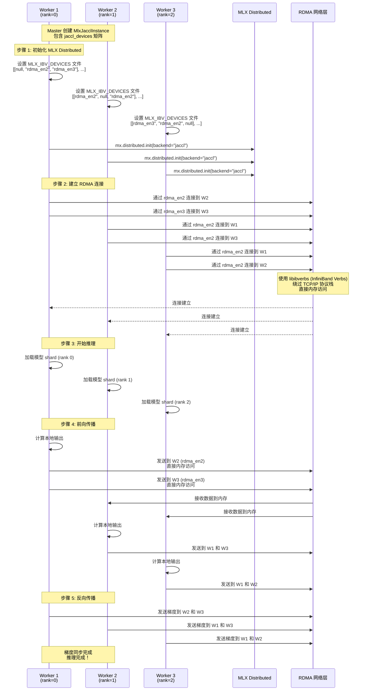

##### 技术底层：MLX Distributed JACCL 实现

**MLX JACCL 是如何建立 RDMA 连接的**

MLX distributed 框架通过 JACCL（Collective Communications Library）后端实现 RDMA 通信。以下是实际的代码实现路径：

**1. 动态加载 RDMA 库**
```cpp
// /home/wanger/codes/mlx/mlx/distributed/jaccl/utils.cpp:36-67

IBVWrapper::IBVWrapper() {
  // macOS 上动态加载 librdma.dylib
  librdma_handle_ = dlopen("librdma.dylib", RTLD_NOW | RTLD_GLOBAL);

  // 加载 libibverbs 符号
  LOAD_SYMBOL(ibv_get_device_list, get_device_list);
  LOAD_SYMBOL(ibv_open_device, open_device);
  LOAD_SYMBOL(ibv_alloc_pd, alloc_pd);
  LOAD_SYMBOL(ibv_create_cq, create_cq);
  LOAD_SYMBOL(ibv_create_qp, create_qp);
  LOAD_SYMBOL(ibv_modify_qp, modify_qp);
  LOAD_SYMBOL(ibv_reg_mr, reg_mr);
  // ... 更多符号
}
```

**2. Connection 类：管理单个 RDMA 连接**
```cpp
// /home/wanger/codes/mlx/mlx/distributed/jaccl/utils.cpp:110-255

class Connection {
  ibv_context* ctx;                  // RDMA 设备上下文
  ibv_pd* protection_domain;         // 保护域
  ibv_cq* completion_queue;          // 完成队列
  ibv_qp* queue_pair;                // 队列对
  Destination src;                   // 本地连接信息

  // 分配保护域
  void allocate_protection_domain();

  // 创建完成队列
  void create_completion_queue(int num_entries);

  // 创建队列对（Queue Pair）
  void create_queue_pair();

  // 将 QP 转换为 INIT 状态
  void queue_pair_init();

  // 将 QP 转换为 RTR（Ready to Receive）状态
  void queue_pair_rtr(const Destination& dst);

  // 将 QP 转换为 RTS（Ready to Send）状态
  void queue_pair_rts();
};
```

**3. RingGroup 类：环形拓扑的分布式组**
```cpp
// /home/wanger/codes/mlx/mlx/distributed/jaccl/ring.cpp:10-37

RingGroup::RingGroup(
    int rank,
    int size,
    const std::vector<std::string>& left_devices,
    const std::vector<std::string>& right_devices,
    const char* coordinator_addr)
    : rank_(rank),
      size_(size),
      n_conns_(left_devices.size()),
      side_channel_(rank_, size_, coordinator_addr),  // TCP 侧信道
      left_(create_connections(left_devices)),        // 左侧连接
      right_(create_connections(right_devices)) {     // 右侧连接

  // 初始化所有连接
  initialize();

  // 同步屏障：确保所有节点都已初始化
  side_channel_.all_gather<int>(0);

  // 创建环形实现
  ring_ = RingImpl(rank_, size_, left_, right_, send_buffers_, recv_buffers_);
}
```

**4. 初始化流程：从环境变量到 RDMA 连接**
```cpp
// /home/wanger/codes/mlx/mlx/distributed/jaccl/jaccl.cpp:130-176

std::shared_ptr<GroupImpl> init(bool strict) {
  // 1. 读取环境变量
  const char* dev_file = std::getenv("MLX_IBV_DEVICES");      // ← exo 设置
  const char* coordinator = std::getenv("MLX_JACCL_COORDINATOR"); // ← exo 设置
  const char* rank_str = std::getenv("MLX_RANK");             // ← exo 设置

  // 2. 解析设备矩阵 JSON 文件
  DeviceFile devices(dev_file);
  // JSON 格式：
  // [
  //   [null, "rdma_en2", "rdma_en3"],  // rank 0 的连接
  //   ["rdma_en3", null, "rdma_en2"],  // rank 1 的连接
  //   ["rdma_en2", "rdma_en3", null]   // rank 2 的连接
  // ]

  // 3. 提取当前节点的连接信息
  auto [left, right] = devices.extract_ring_connectivity(rank);
  // left = ["rdma_en3"]  // 连接到左侧节点的设备
  // right = ["rdma_en2"] // 连接到右侧节点的设备

  // 4. 创建 RingGroup（触发 RDMA 连接建立）
  return std::make_shared<RingGroup>(
      rank, devices.size(), left, right, coordinator);
}
```

**5. 完整的 RDMA 连接建立流程**
```cpp
// /home/wanger/codes/mlx/mlx/distributed/jaccl/ring.cpp:39-90

void RingGroup::initialize() {
  // 步骤 1: 创建队列对
  for (auto& conn : left_) {
    conn.allocate_protection_domain();    // ibv_alloc_pd
    conn.create_completion_queue(...);    // ibv_create_cq
    conn.create_queue_pair();             // ibv_create_qp
  }
  // 对右侧连接执行相同操作...

  // 步骤 2: 分配并注册内存缓冲区
  allocate_buffers();
  // 内部调用 ibv_reg_mr 注册内存到保护域

  // 步骤 3: 初始化队列对状态为 INIT
  for (auto& conn : left_) {
    conn.queue_pair_init();  // ibv_modify_qp → IBV_QPS_INIT
  }
  // 对右侧连接执行相同操作...

  // 步骤 4: 通过 TCP 侧信道交换连接信息
  std::vector<Destination> left_info;
  for (auto& conn : left_) {
    left_info.emplace_back(conn.info());
  }
  // Destination 包含：
  // - local_id: 本地 LID（Local Identifier）
  // - queue_pair_number: QP 编号
  // - global_identifier: GID（Global Identifier）
  // - packet_sequence_number: PSN

  // 通过 TCP all-gather 交换所有节点的连接信息
  auto all_left_infos = side_channel_.all_gather(left_info);
  auto all_right_infos = side_channel_.all_gather(right_info);

  // 步骤 5: 转换队列对状态为 RTR 和 RTS
  int left_peer = (rank_ + size_ - 1) % size_;
  for (int i = 0; i < left_.size(); i++) {
    auto peer_info = all_right_infos[left_peer][i];
    left_[i].queue_pair_rtr(peer_info);  // ibv_modify_qp → IBV_QPS_RTR
    left_[i].queue_pair_rts();            // ibv_modify_qp → IBV_QPS_RTS
  }
  // 对右侧连接执行相同操作...

  // 现在 RDMA 连接已建立，可以进行零拷贝数据传输！
}
```

**6. SideChannel：TCP 侧信道**
```cpp
// /home/wanger/codes/mlx/mlx/distributed/jaccl/utils.cpp:288-321

class SideChannel {
  // 使用 TCP 连接交换 RDMA 连接元数据
  // 为什么需要 TCP？
  // - RDMA 连接需要远程节点的 QPN、LID、GID 信息
  // - 但这些信息只有连接建立后才能获得
  // - 因此使用 TCP 作为控制通道来交换这些元数据

  SideChannel(int rank, int size, const char* addr)
      : rank_(rank), size_(size) {
    if (rank_ == 0) {
      // Rank 0 作为服务器，接受所有其他节点的连接
      detail::TCPSocket server;
      server.listen(IBV_TAG, address);
      for (int i = 0; i < size - 1; i++) {
        sockets_.push_back(server.accept(IBV_TAG));
      }
    } else {
      // 其他节点作为客户端，连接到 rank 0
      sockets_.push_back(
          detail::TCPSocket::connect(IBV_TAG, address, 4, 1000));
    }
  }

  // All-gather 实现
  template <typename T>
  std::vector<T> all_gather(const T& v) {
    // Rank 0 收集所有数据并广播
    // 其他节点发送数据并接收广播结果
  }
};
```

**7. 数据发送和接收**
```cpp
// /home/wanger/codes/mlx/mlx/distributed/jaccl/utils.h:178-218

struct Connection {
  // 发送数据（RDMA SEND 操作）
  void post_send(const SharedBuffer& buff, uint64_t work_request_id) {
    ibv_send_wr work_request;
    work_request.wr_id = work_request_id;
    work_request.sg_list = &entry;      // Scatter-Gather 列表
    work_request.num_sge = 1;
    work_request.opcode = IBV_WR_SEND;  // RDMA SEND 操作
    work_request.send_flags = IBV_SEND_SIGNALED;

    ibv_post_send(queue_pair, &work_request, &bad_work_request);
  }

  // 接收数据（RDMA RECV 操作）
  void post_recv(const SharedBuffer& buff, uint64_t work_request_id) {
    ibv_recv_wr work_request;
    work_request.wr_id = work_request_id;
    work_request.sg_list = &entry;
    work_request.num_sge = 1;

    ibv_post_recv(queue_pair, &work_request, &bad_work_request);
  }

  // 轮询完成队列
  int poll(int num_completions, ibv_wc* work_completions) {
    return ibv_poll_cq(completion_queue, num_completions, work_completions);
  }
};
```

**8. 实际推理时的数据流**
```cpp
// /home/wanger/codes/mlx/mlx/distributed/jaccl/ring.cpp:150-160

void RingGroup::all_gather(const array& input, array& output, Stream stream) {
  auto in_ptr = input.data<char>();
  auto out_ptr = output.data<char>();
  int64_t n_bytes = input.nbytes();

  // 调度到 CPU 流
  auto& encoder = cpu::get_command_encoder(stream);
  encoder.set_input_array(input);
  encoder.set_output_array(output);

  // 执行 RDMA 通信
  encoder.dispatch([in_ptr, out_ptr, n_bytes, this]() {
    ring_.all_gather(in_ptr, out_ptr, n_bytes, n_conns_);
    // 内部使用 ibv_post_send/ibv_post_recv 进行零拷贝传输
  });
}
```

**关键技术点总结**：

| 技术 | 作用 | 代码位置 |
|------|------|----------|
| **librdma.dylib** | macOS 上的 RDMA 库 | `dlopen("librdma.dylib")` |
| **libibverbs** | InfiniBand Verbs API | 动态符号绑定 |
| **保护域 (PD)** | 内存管理区域 | `ibv_alloc_pd()` |
| **完成队列 (CQ)** | 异步操作完成通知 | `ibv_create_cq()` |
| **队列对 (QP)** | 发送/接收工作队列 | `ibv_create_qp()` |
| **内存注册** | 注册内存用于 RDMA | `ibv_reg_mr()` |
| **QP 状态机** | INIT → RTR → RTS | `ibv_modify_qp()` |
| **TCP 侧信道** | 交换 RDMA 元数据 | `SideChannel` 类 |

**exo 与 MLX distributed 的完整调用链**：

```
exo (Python)
  ↓ 设置环境变量
MLX_IBV_DEVICES = "/tmp/jaccl_devices.json"
MLX_RANK = "0"
MLX_JACCL_COORDINATOR = "192.168.1.100:12345"
  ↓
mx.distributed.init(backend="jaccl")
  ↓
MLX JACCL C++ 代码
  ↓
IBVWrapper::IBVWrapper()
  ↓ 动态加载
librdma.dylib
  ↓
libibverbs API
  ↓ 直接访问
RDMA 硬件 (Thunderbolt 5)
```

#### 环境变量与配置文件详解

##### RDMA Queue Pair 状态机

理解 RDMA 连接建立的关键是 Queue Pair (QP) 的状态转换：

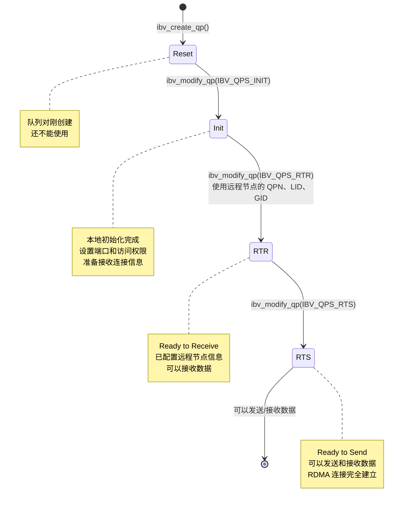

**状态转换详解**：

```cpp
// 1. RESET → INIT
void Connection::queue_pair_init() {
  ibv_qp_attr attr = {};
  attr.qp_state = IBV_QPS_INIT;
  attr.port_num = 1;
  attr.pkey_index = 0;
  attr.qp_access_flags =
      IBV_ACCESS_LOCAL_WRITE |
      IBV_ACCESS_REMOTE_READ |
      IBV_ACCESS_REMOTE_WRITE;

  int mask = IBV_QP_STATE | IBV_QP_PKEY_INDEX |
              IBV_QP_PORT | IBV_QP_ACCESS_FLAGS;

  ibv().modify_qp(queue_pair, &attr, mask);
}

// 2. INIT → RTR (需要远程节点信息)
void Connection::queue_pair_rtr(const Destination& dst) {
  ibv_qp_attr attr = {};
  attr.qp_state = IBV_QPS_RTR;
  attr.path_mtu = IBV_MTU_1024;
  attr.rq_psn = dst.packet_sequence_number;
  attr.dest_qp_num = dst.queue_pair_number;  // 远程 QPN
  attr.ah_attr.dlid = dst.local_id;          // 远程 LID
  attr.ah_attr.port_num = 1;

  if (dst.global_identifier.global.interface_id) {
    attr.ah_attr.is_global = 1;
    attr.ah_attr.grh.dgid = dst.global_identifier;  // 远程 GID
    attr.ah_attr.grh.sgid_index = 1;
  }

  int mask = IBV_QP_STATE | IBV_QP_AV | IBV_QP_PATH_MTU |
              IBV_QP_DEST_QPN | IBV_QP_RQ_PSN;

  ibv().modify_qp(queue_pair, &attr, mask);
}

// 3. RTR → RTS
void Connection::queue_pair_rts() {
  ibv_qp_attr attr = {};
  attr.qp_state = IBV_QPS_RTS;
  attr.sq_psn = src.packet_sequence_number;

  int mask = IBV_QP_STATE | IBV_QP_SQ_PSN;

  ibv().modify_qp(queue_pair, &attr, mask);
}
```

**为什么需要 TCP 侧信道**：

```
问题流程：
1. 节点 A 创建 QP，获得 QPN_A
2. 节点 B 创建 QP，获得 QPN_B
3. 节点 A 需要知道 QPN_B 才能连接到 B
4. 节点 B 需要知道 QPN_A 才能连接到 A

但是：
- QPN 只有在创建 QP 后才知道
- 无法提前配置（不像是 IP 地址）

解决方案：
- 使用 TCP 连接
- 每个节点通过 TCP 发送自己的 QPN、LID、GID
- 通过 TCP all-gather 收集所有节点的信息
- 使用这些信息将 QP 转换为 RTR 和 RTS
```

##### MLX JACCL 需要的环境变量（exo 自动设置）

| 环境变量 | 值示例 | 说明 |
|---------|--------|------|
| `MLX_IBV_DEVICES` | `/tmp/jaccl_devices_abc123.json` | RDMA 设备矩阵 JSON 文件路径 |
| `MLX_RANK` | `0`, `1`, `2` | 当前节点的 rank（0-based） |
| `MLX_JACCL_COORDINATOR` | `192.168.1.100:12345` | Rank 0 的 IP:port（用于 TCP 侧信道） |

**设备矩阵 JSON 文件格式**：

```json
[
  [
    null,
    "rdma_en2",
    "rdma_en3"
  ],
  [
    "rdma_en3",
    null,
    "rdma_en2"
  ],
  [
    "rdma_en2",
    "rdma_en3",
    null
  ]
]
```

**矩阵说明**：
- `devices[i][j]` = 节点 i 连接到节点 j 的 RDMA 设备名列表
- `devices[i][i]` = `null`（节点不连接自己）
- 设备名列表可包含多个设备（多路径）
  - 单路径：`"rdma_en2"`
  - 多路径：`["rdma_en2", "rdma_en3"]`
  - 无连接：`null`

**exo 如何生成设备矩阵**：

```python
# src/exo/master/placement_utils.py:296-325

def get_mlx_jaccl_devices_matrix(
    selected_cycle: list[NodeId],
    cycle_digraph: Topology,
) -> list[list[str | None]]:
    """
    构建设备连接矩阵
    matrix[i][j] = 设备 i 连接到设备 j 的 RDMA 接口名
    """
    matrix = [[None for _ in range(num_nodes)] for _ in range(num_nodes)]

    for i, node_i in enumerate(selected_cycle):
        for j, node_j in enumerate(selected_cycle):
            if i == j:
                continue  # 对角线为 None

            # 查询拓扑中的 RDMA 连接
            for conn in cycle_digraph.get_all_connections_between(node_i, node_j):
                if isinstance(conn, RDMAConnection):
                    # 使用源节点的 RDMA 接口
                    matrix[i][j] = conn.source_rdma_iface  # "rdma_en2"
                    break

    return matrix

# 生成临时文件
import tempfile
import json

coordination_file = tempfile.mktemp(suffix=".json")
with open(coordination_file, "w") as f:
    json.dump(jaccl_devices, f)  # 写入矩阵

# 设置环境变量
os.environ["MLX_IBV_DEVICES"] = coordination_file
os.environ["MLX_RANK"] = str(rank)
os.environ["MLX_JACCL_COORDINATOR"] = f"{coordinator_ip}:{coordinator_port}"
```

**TCP 侧信道的作用**：

```
问题：RDMA 连接需要远程节点的元数据才能建立
- QPN (Queue Pair Number)：队列对的唯一标识符
- LID (Local Identifier)：本地端口标识符
- GID (Global Identifier)：全局标识符（类似 IP 地址）
- PSN (Packet Sequence Number)：包序列号

但：这些信息只有在 RDMA 连接建立后才能获得

解决：使用 TCP 作为控制通道交换这些元数据

流程：
1. 每个节点创建 RDMA Queue Pair（INIT 状态）
2. 查询自己的 QPN、LID、GID
3. 通过 TCP all-gather 交换所有节点的元数据
4. 使用远程节点的元数据将 QP 转换为 RTR 和 RTS 状态
5. RDMA 连接建立完成！
```

**Coordinator IP 和 Port 的选择**：

```python
# exo 自动选择一个可用端口
# Coordinator 通常是 rank 0 节点的 libp2p 地址

# 示例：
# - 节点 A (rank 0): libp2p 地址包含 IP 192.168.1.100
# - Coordinator = "192.168.1.100:12345"
# - 节点 B、C 通过 TCP 连接到 192.168.1.100:12345
# - 进行 all-gather 交换 RDMA 元数据
```

**性能对比**：

| 操作 | TCP/IP | RDMA |
|------|--------|------|
| 数据拷贝 | 2-3 次 | **0 次** |
| 内核参与 | 需要 | **不需要** |
| 延迟 | 基线 | **99% 降低** |

### 完整数据流示例

**场景**：3 个 Mac Studio 通过 Thunderbolt 5 线缆连接

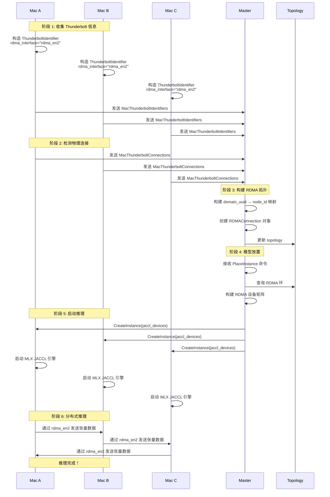

## 3.5 网络配置脚本

`tmp/set_rdma_network_config.sh` 脚本用于配置 Thunderbolt RDMA 网络。

### 问题背景

macOS 默认将所有 Thunderbolt 接口聚合到一个 "Thunderbolt Bridge" 网桥中，导致：
- 🌪️ **网络风暴**：所有接口共享同一个 MAC 地址
- 🔀 **无法独立控制**：无法为每个 RDMA 接口单独配置
- 📉 **性能下降**：RDMA 无法正常工作

### 解决方案

```bash
# 1. 删除 Thunderbolt Bridge 网桥
ifconfig bridge0 destroy

# 2. 创建 exo 网络位置
networksetup -createlocation exo
networksetup -switchtolocation exo

# 3. 为每个 Thunderbolt 接口创建独立网络服务
networksetup -createnetworkservice "EXO Thunderbolt 1" "Thunderbolt 1"
networksetup -setdhcp "EXO Thunderbolt 1"

# 4. 禁用 Thunderbolt Bridge
networksetup -setnetworkserviceenabled "Thunderbolt Bridge" off
```

---

# 第四部分：消息路由与事件传播

## 4.1 事件溯源架构

**核心概念**：所有状态变更是不可变事件。

| 事件类型 | 说明 |
|----------|------|
| NodeGatheredInfo | 节点信息收集（包括 Thunderbolt 信息） |
| InstanceCreated | 实例创建 |
| InstanceDeleted | 实例删除 |
| TaskCreated | 任务创建 |
| TopologyEdgeCreated | 拓扑边创建 |
| TopologyEdgeDeleted | 拓扑边删除 |

## 4.2 消息路由

### 主题系统

| 主题 | 用途 | 发布策略 |
|------|------|----------|
| `GLOBAL_EVENTS` | Master 广播事件 | Always |
| `LOCAL_EVENTS` | Worker 发送事件 | Always |
| `COMMANDS` | 命令消息 | Always |
| `ELECTION_MESSAGES` | 选举消息 | Always |
| `DOWNLOAD_COMMANDS` | 下载命令 | Always |

### 消息流向

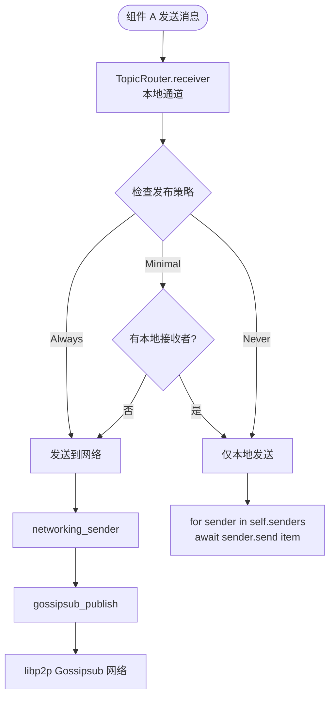

---

# 第五部分：完整启动流程

## 节点启动时序图

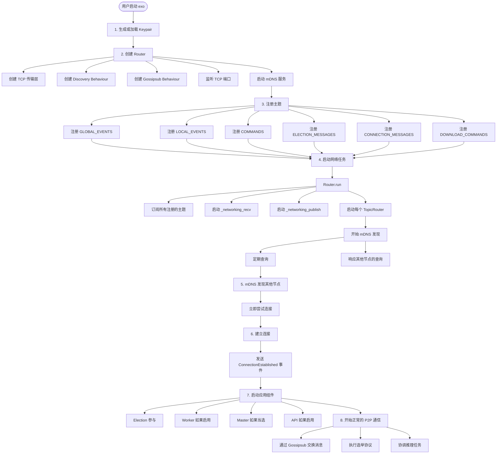

---

# 第六部分：故障恢复与高可用

## 6.1 连接断开处理

```rust
// Ping 机制检测连接健康
const PING_TIMEOUT: Duration = Duration::from_millis(2_500);
const PING_INTERVAL: Duration = Duration::from_millis(2_500);

// 如果 Ping 失败，立即关闭连接
if let Err(_) = e.result {
    self.close_connection(e.peer, e.connection.clone())
}
```

## 6.2 自动重连

```rust
// 每 5 秒重试所有发现的节点
for (p, mas) in self.mdns_discovered.clone() {
    for ma in mas {
        self.dial(p, ma)  // 如果已连接，此操作无效果
    }
}
```

## 6.3 高可用性保证

### 故障检测

- Ping 超时检测（2.5 秒）
- 连接断开立即触发
- 自动重新选举

### 脑裂预防

- 所有节点使用相同的 Bully 算法
- 比较函数确定性的
- Clock 机制确保所有节点在同一轮选举
- Seniority 机制减少频繁切换

---

# 第七部分：性能优化

## 7.1 已实现优化

| 优化 | 效果 |
|------|------|
| **零 RTT 连接** | 减少握手延迟 |
| **TCP_NODELAY** | 禁用 Nagle 算法 |
| **RDMA 通信** | 99% 延迟降低 |
| **张量并行** | 2 设备 1.8x，4 设备 3.2x |
| **KV Cache** | 减少重复计算 |
| **模型缓存** | 避免重复加载 |

## 7.2 性能数据

| 连接类型 | 延迟 | 带宽 | CPU 开销 |
|---------|------|------|----------|
| TCP/IP (Ethernet) | 基线 | 1-10 Gbps | 高 |
| TCP/IP (Thunderbolt) | ~50% 降低 | 40 Gbps | 中 |
| **RDMA (Thunderbolt 5)** | **99% 降低** | **80 Gbps** | **极低** |

---

# 第八部分：监控与调试

## 8.1 日志级别

```bash
# 调试网络连接
uv run exo -v

# 更详细的网络日志
uv run exo -vv
```

## 8.2 关键日志消息

### 选举相关

```python
logger.info("Starting Election")
logger.debug("Starting initial campaign")
logger.info("Node elected Master - promoting self")
logger.info(f"Node XXX elected master - demoting self")
```

### Thunderbolt 相关

```python
logger.info("Starting Worker")
logger.debug("Starting new campaign")
logger.debug("Gathering Thunderbolt data")
logger.warning("Error gathering Thunderbolt data")
```

---

# 第九部分：配置与扩展

## 9.1 命令行参数

| 参数 | 说明 |
|------|------|
| `--no-worker` | 不运行 Worker（仅协调器模式） |
| `--force-master` | 强制成为 Master |
| `--spawn-api` | 启动 API 服务 |
| `--no-downloads` | 禁用下载协调器 |
| `--api-port` | API 端口（默认 52415） |
| `--offline` | 离线模式 |
| `--bootstrap-peers` | Bootstrap peers 地址 |
| `-v, -vv` | 日志级别 |

## 9.2 环境变量

| 变量 | 说明 | 默认值 |
|------|------|--------|
| `EXO_DEFAULT_MODELS_DIR` | 模型目录 | `~/.local/share/exo/models/` |
| `EXO_MODELS_DIRS` | 额外模型目录 | 无 |
| `EXO_OFFLINE` | 离线模式 | `false` |
| `EXO_ENABLE_IMAGE_MODELS` | 启用图像模型 | `false` |
| `EXO_LIBP2P_NAMESPACE` | 网络命名空间 | 无 |
| `EXO_TRACING_ENABLED` | 启用追踪 | `false` |

---

# 总结

exo 的设备发现和连接建立机制具有以下特点：

1. **分层发现机制**
   - **mDNS（必需）**：发现网络上的节点，建立基本连接和身份映射
   - **Thunderbolt（优化）**：**在已发现的节点间**检测物理加速连接
   - **依赖关系**：Thunderbolt **依赖** mDNS 先发现节点并提供 domain_uuid → node_id 映射

2. **高可用性**
   - Bully 算法选举
   - 自动故障恢复
   - Master 角色动态切换
   - Bootstrap peers 备选方案

3. **安全性**
   - Noise 协议加密
   - 私有网络隔离
   - 消息签名验证

4. **高性能**
   - 零 RTT 连接、TCP_NODELAY
   - **RDMA over Thunderbolt 5** 支持（99% 延迟降低）
   - 张量并行（2 设备 1.8x，4 设备 3.2x）

5. **智能拓扑识别**
   - 合并 mDNS 发现和 Thunderbolt 物理检测
   - 在拓扑图中区分 RDMAConnection 和 SocketConnection
   - 推理时自动选择最优路径

**核心设计理念**：exo 通过分层发现实现灵活的网络优化：
- **mDNS 负责"能否通信"** - 通过标准 IP 网络发现节点并建立身份映射
- **Thunderbolt 负责"能否更快"** - 在已发现的节点间检测硬件加速机会
- **关键依赖**：Thunderbolt 无法独立工作，需要 mDNS 提供的节点信息才能建立逻辑连接

这种设计使 exo 能够在本地网络中自动形成集群，无需手动配置，同时保证了网络的稳定性和性能。对于配备 Thunderbolt 5 的 Mac 设备，exo 还能利用 RDMA 技术实现接近本地的超低延迟通信性能。
