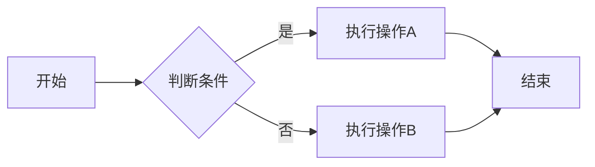
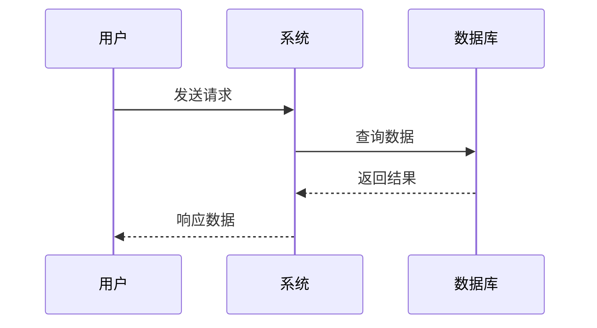
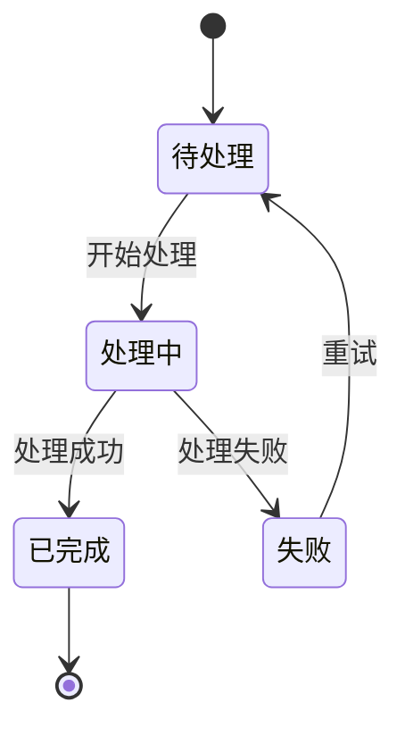
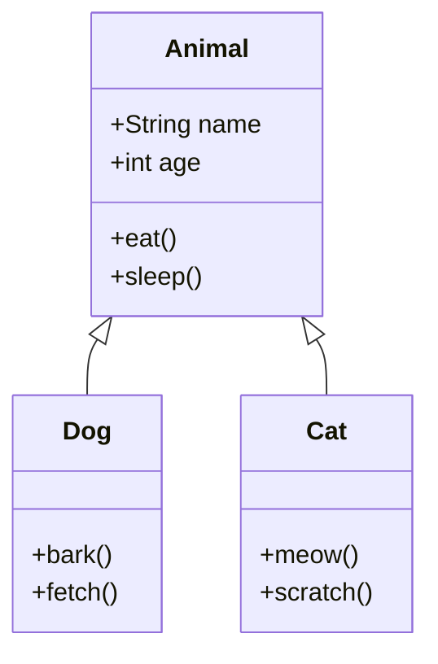
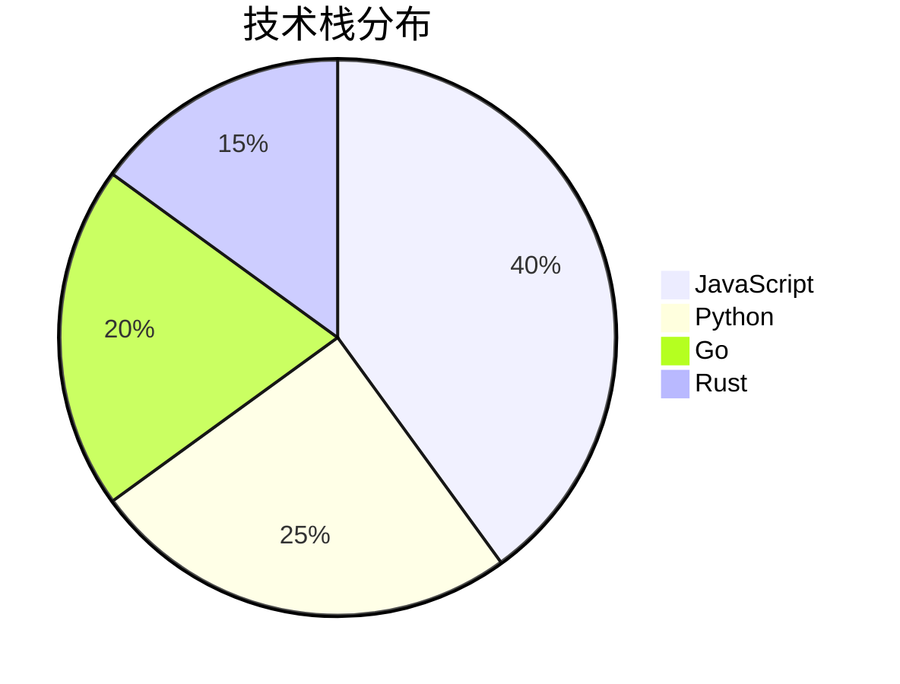
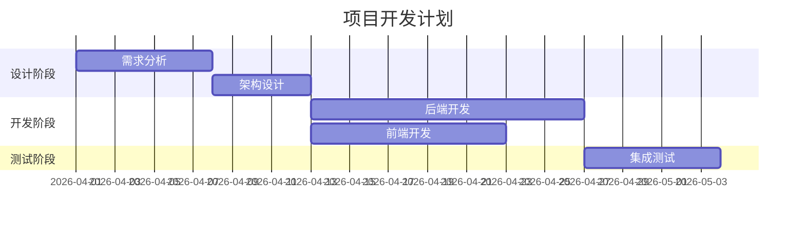
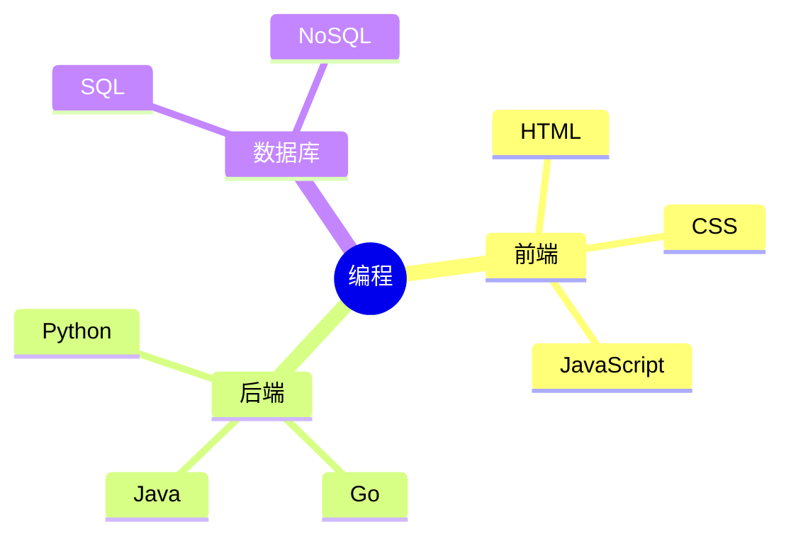
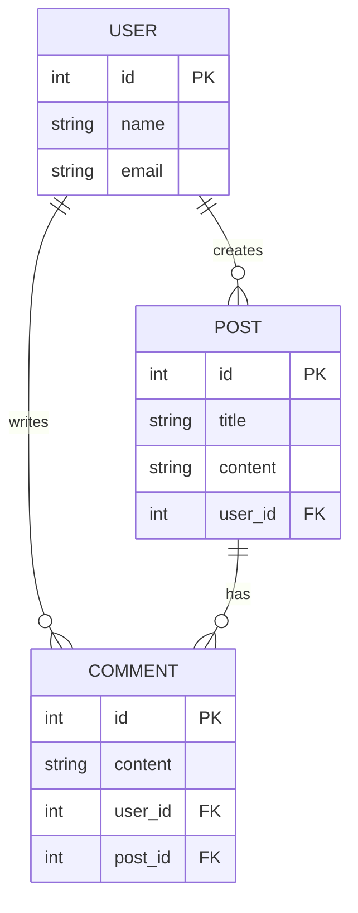

本文用于测试 Mermaid 图表渲染功能。

## 流程图

基础流程图示例：

## 时序图

展示交互顺序：

## 状态图

状态转换示例：

## 类图

UML 类图示例：

## 饼图

数据分布示例：

## 甘特图

项目时间线示例：

## 思维导图

层次结构示例：

## ER图

实体关系图示例：

## 总结

以上展示了 Mermaid 支持的主要图表类型。如果所有图表都能正常渲染，说明 Mermaid 配置成功！
