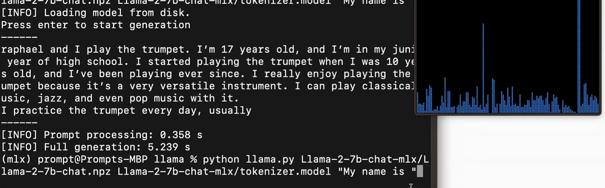
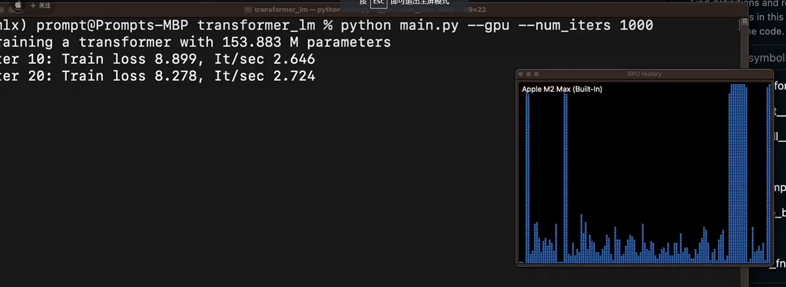

最近Apple 新发布了一个MLX的DL框架，这是继 ML Compute 可用于在 Mac 上进行 TensorFlow 模型的训练，PyTorch 在 M1芯片后可使用 Metal Performance Shaders (MPS) 作为GPU 加速的 PyTorch 机器学习模型训练之后，进一步的尝试。

与MLX同时开源的还有数据读取的框架MLX-data，以及最近大模型相关的一些Example代码，MLX-examples

## MLX特性

- **Familiar APIs**: MLX的python API 设计基本上与numpy和Pytorch对齐，基础的数据结构array设置可以隐式的转换为numpy的 Array。高层次的API mlx.nn 和mlx.optimizers则基本与pytorch对齐，使用方式也基本一致。C++ 的API与python基本一致。 这对算法开发人员来说上手的成本较低，历史代码也比较好迁移和继承。
```python
import mlx.nn as nn
import mlx.core as np
```


- **Composable function transformations**:  JAX 
- MLX has composable function transformations for automatic differentiation, automatic vectorization, and computation graph optimization.
    
- **Lazy computation**: 延迟计算，每部分的计算结果都是按需求值，也包括内存申请。
    
- **Dynamic graph construction**: 动态图构建，函数输入shape发生变化时，并不会触发编译，debug也很简单符合直觉。

- **Multi-device**: 多IP计算支持。当前支持CPU、GPU。因为ANE在Apple内部处于闭源的工具链，在这一现状没变化时，不会支持ANE。ref：[link](https://github.com/ml-explore/mlx/issues/18#issuecomment-1846492294)
    
- **Unified memory**: 最大的特点在于统一的内存模型，MLX 中的在共享内存上分配，跨IP计算时无需拷贝移动数据。

##  为什么还需要一个MLX

-  Apple silicon first
-  Alternative Design and API
-  Simple, Flexible, Baggage-Free
-  More Exploration, More Diversity

https://github.com/ml-explore/mlx/issues/12

## 缺少哪些部分

1. 图优化几近于无
2. 序列化、反序列化功能
3. JIT 编译
4. INT量化


## 性能以及现状

M2 Max

FP16 10 token/s




## 可能的 Roadmap
1. 有微调模型诉求的非算法人员。 比如lora、大模型的
2. 基础模型开源、lora微调以后，通过core ml导出