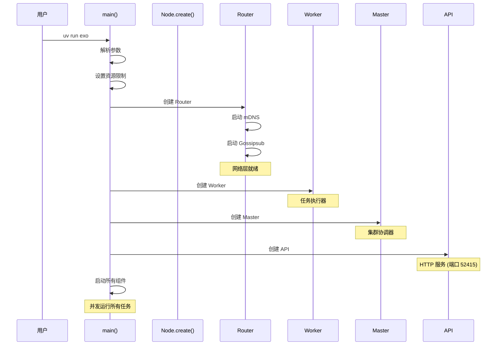
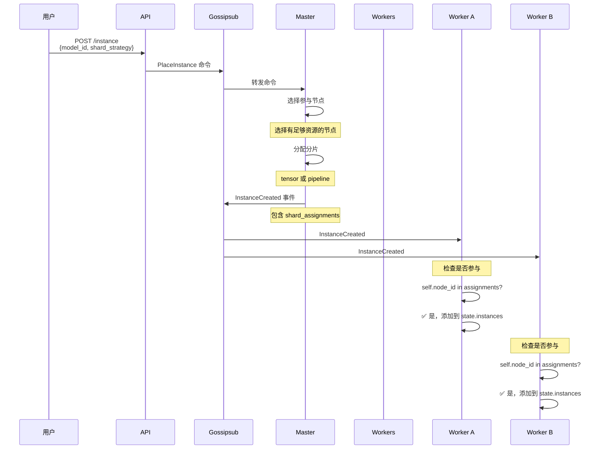
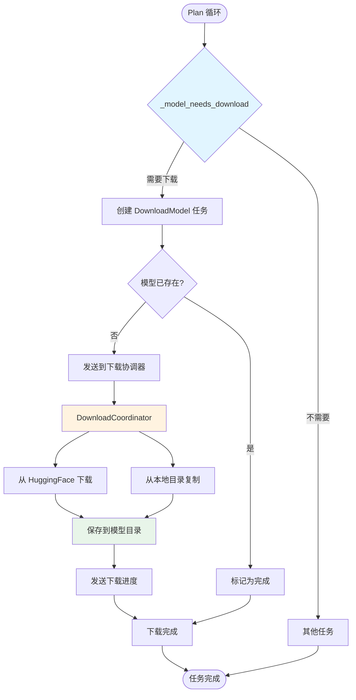
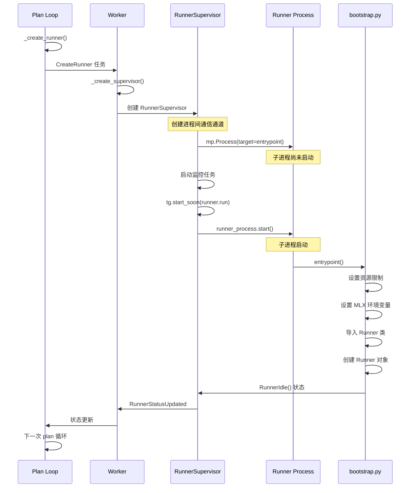
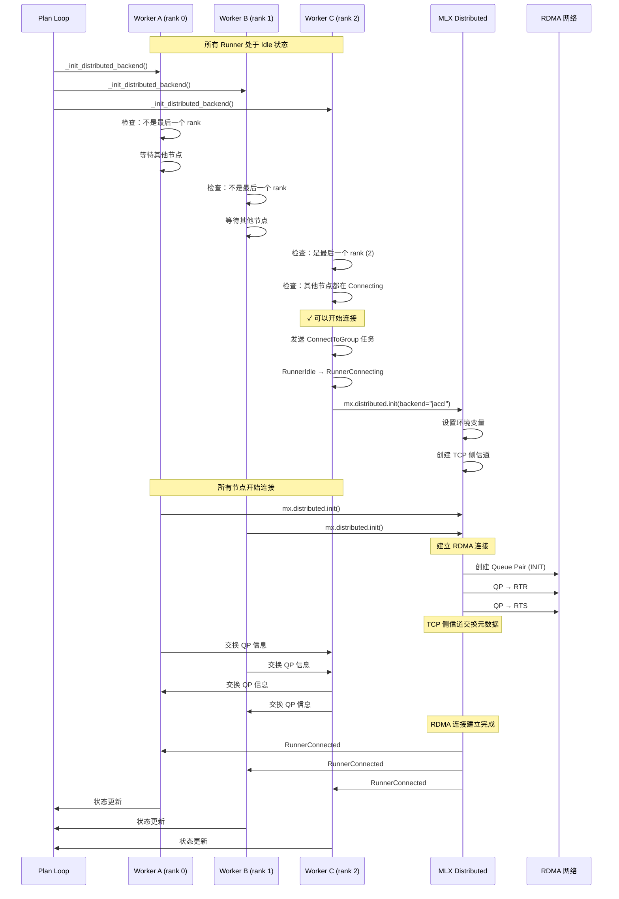
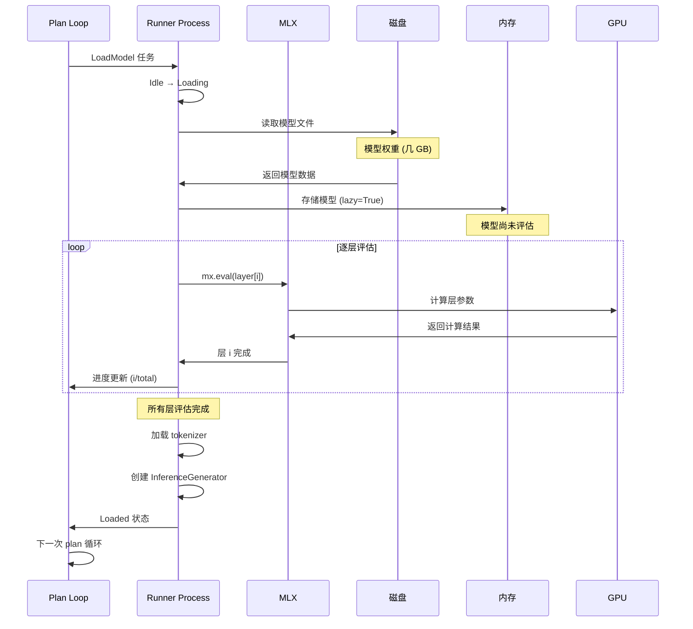
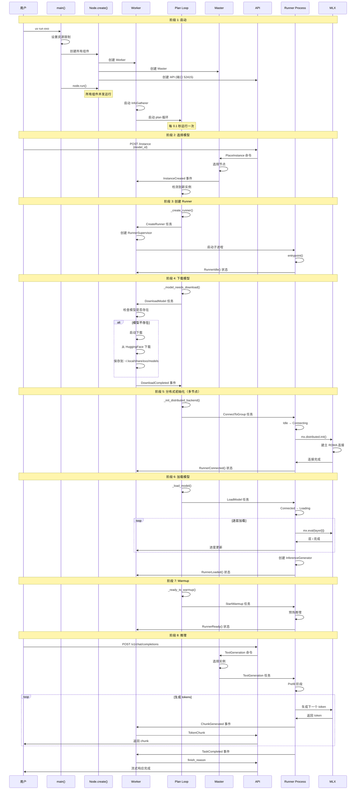

# exo 模型加载与推理流程详解

## 📋 目录

1. [概述](#概述)
2. [启动流程](#启动流程)
3. [模型选择与实例创建](#模型选择与实例创建)
4. [模型下载](#模型下载)
5. [Runner 创建](#runner-创建)
6. [分布式初始化](#分布式初始化)
7. [模型加载](#模型加载)
8. [推理执行](#推理执行)
9. [完整时序图](#完整时序图)
10. [故障处理](#故障处理)

---

## 概述

exo 的模型加载和推理流程是一个复杂的多阶段过程，涉及多个组件的协作。本文档详细描述从启动 exo 到完成首次推理的完整流程。

### 核心组件

| 组件 | 职责 | 语言 |
|------|------|------|
| **Node** | 主进程，管理所有组件 | Python |
| **Worker** | 任务规划和执行协调 | Python |
| **Runner** | 独立进程，实际加载模型和执行推理 | Python |
| **Master** | 集群协调和任务分配 | Python |
| **API** | 接收用户请求 | Python |
| **Router** | libp2p 网络路由 | Rust |

### 关键特性

- **进程隔离**：每个模型实例在独立的 Runner 进程中运行
- **状态机驱动**：所有组件通过状态机管理生命周期
- **计划循环**：Worker 定期评估状态并决定下一步行动
- **超时保护**：所有长时间操作都有超时机制

---

## 启动流程

### 主进程启动

```python
# src/exo/main.py:262-305
def main():
    # 1. 解析命令行参数
    args = Args.parse()

    # 2. 提高文件描述符限制
    soft, hard = resource.getrlimit(resource.RLIMIT_NOFILE)
    target = min(max(soft, 65535), hard)
    resource.setrlimit(resource.RLIMIT_NOFILE, (target, hard))
    # 为什么需要这个？
    # - libp2p 需要大量网络连接
    # - 模型文件和并行操作需要很多文件句柄
    # - 默认限制 (1024) 不够用

    # 3. 设置多进程启动方式
    mp.set_start_method("spawn", force=True)
    # 使用 spawn 而不是 fork：
    # - 更好的跨平台兼容性
    # - 避免共享内存状态
    # - 每个子进程有干净的 Python 解释器

    # 4. 设置日志
    logger_setup(EXO_LOG, args.verbosity)
    logger.info(f"Starting EXO | pid={os.getpid()}")

    # 5. 创建并运行节点
    node = anyio.run(Node.create, args)
    try:
        anyio.run(node.run)
    except BaseException as exception:
        logger.opt(exception=exception).critical("EXO terminated")
        raise
    finally:
        logger.info("EXO Shutdown complete")
```

### 节点创建



### 组件初始化顺序

```python
# src/exo/main.py:46-141
async def create(cls, args: "Args") -> Self:
    # 1. 生成节点身份
    keypair = get_node_id_keypair()
    node_id = NodeId(keypair.to_node_id())

    # 2. 创建 libp2p Router
    router = Router.create(
        keypair,
        bootstrap_peers=args.bootstrap_peers,
        listen_port=args.libp2p_port,
    )
    await router.register_topic(topics.GLOBAL_EVENTS)
    await router.register_topic(topics.LOCAL_EVENTS)
    await router.register_topic(topics.COMMANDS)
    await router.register_topic(topics.ELECTION_MESSAGES)

    # 3. 创建事件路由器
    event_router = EventRouter(
        session_id,
        command_sender=router.sender(topics.COMMANDS),
        external_outbound=router.sender(topics.LOCAL_EVENTS),
        external_inbound=router.receiver(topics.GLOBAL_EVENTS),
    )

    # 4. 创建下载协调器
    download_coordinator = DownloadCoordinator(...)

    # 5. 创建 API 服务
    api = API(
        node_id,
        port=args.api_port,
        event_receiver=event_router.receiver(),
        command_sender=router.sender(topics.COMMANDS),
        download_command_sender=router.sender(topics.DOWNLOAD_COMMANDS),
        election_receiver=router.receiver(topics.ELECTION_MESSAGES),
    )

    # 6. 创建 Worker
    worker = Worker(
        node_id,
        event_receiver=event_router.receiver(),
        event_sender=event_router.sender(),
        command_sender=router.sender(topics.COMMANDS),
        download_command_sender=router.sender(topics.DOWNLOAD_COMMANDS),
    )

    # 7. 创建 Master（每个节点都有）
    master = Master(
        node_id,
        session_id,
        event_sender=event_router.sender(),
        global_event_sender=router.sender(topics.GLOBAL_EVENTS),
        local_event_receiver=router.receiver(topics.LOCAL_EVENTS),
        command_receiver=router.receiver(topics.COMMANDS),
        download_command_sender=router.sender(topics.DOWNLOAD_COMMANDS),
    )

    # 8. 创建选举组件
    election = Election(
        node_id,
        seniority=1_000_000 if args.force_master else 0,
        election_message_sender=router.sender(topics.ELECTION_MESSAGES),
        election_message_receiver=router.receiver(topics.ELECTION_MESSAGES),
        connection_message_receiver=router.receiver(topics.CONNECTION_MESSAGES),
        command_receiver=router.receiver(topics.COMMANDS),
        election_result_sender=er_send,
    )

    return cls(router, event_router, download_coordinator,
               worker, election, er_recv, master, api, ...)
```

---

## 模型选择与实例创建

### 通过 API 选择模型

```bash
# 用户通过 API 选择模型
curl -X POST http://localhost:52415/instance \
  -H "Content-Type: application/json" \
  -d '{
    "model_id": "mlx-community/Llama-3.2-1B-Instruct-4bit",
    "placement_settings": {
      "shard_strategy": "tensor"
    }
  }'
```

### Master 的实例创建逻辑

```python
# src/exo/master/main.py:_command_processor
case PlaceInstance():
    """处理实例放置请求"""

    # 1. 查找模型卡片
    model_card = get_card(command.model_id)
    if model_card is None:
        raise ValueError(f"Model {command.model_id} not found")

    # 2. 确定分片策略
    shard_strategy = command.placement_settings.shard_strategy

    # 3. 选择参与节点
    available_nodes = [
        node_id
        for node_id, info in state.node_info.items()
        if is_node_suitable(node_id, model_card)
    ]

    # 4. 根据策略分配分片
    if shard_strategy == "tensor":
        # 张量并行：每个节点运行模型的完整分片
        assignments = distribute_tensor_shards(
            model_card, available_nodes
        )
    elif shard_strategy == "pipeline":
        # 流水线并行：模型层分布在不同节点
        assignments = distribute_pipeline_shards(
            model_card, available_nodes
        )

    # 5. 创建实例
    instance_id = InstanceId()
    instance = MlxJacclInstance(
        instance_id=instance_id,
        shard_assignments=ShardAssignments(
            model_id=model_card.model_id,
            assignments=assignments,
        ),
    )

    # 6. 广播实例创建事件
    await self.global_event_sender.send(
        InstanceCreated(
            instance_id=instance_id,
            instance=instance,
        )
    )
```

### 实例创建事件流



---

## 模型下载

### 下载触发条件

```python
# src/exo/worker/plan.py:124-153
def _model_needs_download(
    node_id: NodeId,
    runners: Mapping[RunnerId, RunnerSupervisor],
    global_download_status: Mapping[NodeId, Sequence[DownloadProgress]],
    download_backoff: KeyedBackoff[ModelId],
) -> DownloadModel | None:
    """检查模型是否需要下载"""

    local_downloads = global_download_status.get(node_id, [])
    download_status = {
        dp.shard_metadata.model_card.model_id: dp
        for dp in local_downloads
    }

    for runner in runners.values():
        model_id = runner.bound_instance.bound_shard.model_card.model_id

        # 检查条件：
        # 1. Runner 处于空闲状态
        # 2. 模型不在下载状态中
        # 3. 没有超过重试限制
        if (
            isinstance(runner.status, RunnerIdle)
            and (
                model_id not in download_status
                or not isinstance(
                    download_status[model_id],
                    (DownloadOngoing, DownloadCompleted, DownloadFailed),
                )
            )
            and download_backoff.should_proceed(model_id)
        ):
            return DownloadModel(
                instance_id=runner.bound_instance.instance.instance_id,
                shard_metadata=runner.bound_instance.bound_shard,
            )
```

### 下载流程



### 模型路径解析

```python
# src/exo/shared/models/model_paths.py
def resolve_existing_model(model_id: ModelId) -> Path | None:
    """
    查找已下载的模型

    搜索顺序：
    1. EXO_MODELS_READ_ONLY_DIRS（只读目录，优先级最高）
    2. EXO_MODELS_DIRS（可写目录）
    3. 默认模型目录（~/.local/share/exo/models 或 ~/.exo/models）
    """
    search_paths = []

    # 1. 只读目录（预下载的模型）
    if read_only_dirs := os.getenv("EXO_MODELS_READ_ONLY_DIRS"):
        search_paths.extend(
            Path(d) for d in read_only_dirs.split(":")
        )

    # 2. 可写目录
    if models_dirs := os.getenv("EXO_MODELS_DIRS"):
        search_paths.extend(
            Path(d) for d in models_dirs.split(":")
        )

    # 3. 默认目录
    default_dir = get_default_models_dir()
    search_paths.append(default_dir)

    # 在所有路径中查找
    for search_path in search_paths:
        model_path = search_path / model_id
        if model_path.exists():
            return model_path

    return None
```

---

## Runner 创建

### Runner 创建触发

```python
# src/exo/worker/plan.py:96-122
def _create_runner(
    node_id: NodeId,
    runners: Mapping[RunnerId, RunnerSupervisor],
    instances: Mapping[InstanceId, Instance],
    instance_backoff: KeyedBackoff[InstanceId],
) -> CreateRunner | None:
    """检查是否需要创建新的 Runner"""

    for instance in instances.values():
        # 1. 检查是否在退避期
        if not instance_backoff.should_proceed(instance.instance_id):
            continue

        # 2. 检查本节点是否参与此实例
        runner_id = instance.shard_assignments.node_to_runner.get(node_id, None)
        if runner_id is None:
            continue

        # 3. 检查 Runner 是否已存在
        if runner_id in runners:
            continue

        # 4. 创建 Runner
        shard = instance.shard(runner_id)
        return CreateRunner(
            instance_id=instance.instance_id,
            bound_instance=BoundInstance(
                instance=instance,
                bound_runner_id=runner_id,
                bound_node_id=node_id
            ),
        )
```

### Runner 进程创建

```python
# src/exo/worker/runner/runner_supervisor.py:72-109
@classmethod
def create(
    cls,
    *,
    bound_instance: BoundInstance,
    event_sender: Sender[Event],
    initialize_timeout: float = 400,
) -> Self:
    """创建 Runner 进程"""

    # 1. 创建进程间通信通道
    ev_send, ev_recv = mp_channel[Event]()  # 事件通道
    task_sender, task_recv = mp_channel[Task]()  # 任务通道
    cancel_sender, cancel_recv = mp_channel[TaskId]()  # 取消通道

    # 2. 创建子进程
    runner_process = mp.Process(
        target=entrypoint,
        args=(
            bound_instance,
            ev_send,
            task_recv,
            cancel_recv,
            logger,
        ),
        daemon=True,  # 守护进程，主进程退出时自动终止
    )

    # 3. 创建 Supervisor 对象
    self = cls(
        bound_instance=bound_instance,
        shard_metadata=bound_instance.bound_shard,
        runner_process=runner_process,
        initialize_timeout=initialize_timeout,
        _ev_recv=ev_recv,
        _task_sender=task_sender,
        _cancel_sender=cancel_sender,
        _event_sender=event_sender,
    )

    return self
```

### Runner 启动流程



---

## 分布式初始化

### 初始化触发条件

```python
# src/exo/worker/plan.py:155-203
def _init_distributed_backend(
    runners: Mapping[RunnerId, RunnerSupervisor],
    all_runners: Mapping[RunnerId, RunnerStatus],
):
    """检查是否需要初始化分布式后端"""

    for runner in runners.values():
        instance = runner.bound_instance.instance
        shard_assignments = instance.shard_assignments

        # 1. 跳过单节点实例
        is_single_node = len(shard_assignments.runner_to_shard) == 1
        if is_single_node_instance:
            continue

        # 2. 检查本地 Runner 状态
        runner_is_idle = isinstance(runner.status, RunnerIdle)

        # 3. 检查所有 Runner 是否就绪
        all_runners_connecting = all(
            isinstance(
                all_runners.get(global_runner_id),
                (RunnerConnecting, RunnerIdle),
            )
            for global_runner_id in shard_assignments.runner_to_shard
        )

        if not (runner_is_idle and all_runners_connecting):
            continue

        # 4. 检查是否是最后一个节点
        runner_id = runner.bound_instance.bound_runner_id
        shard = runner.bound_instance.bound_shard
        device_rank = shard.device_rank
        world_size = shard.world_size

        # 只有 rank n-1 才会触发连接
        if device_rank == world_size - 1:
            # 检查其他节点是否都在 Connecting 状态
            connecting_rank_ready = all(
                isinstance(
                    all_runners.get(global_runner_id, None),
                    RunnerConnecting
                )
                for global_runner_id in shard_assignments.runner_to_shard
                if global_runner_id != runner_id
            )

            if connecting_rank_ready:
                return ConnectToGroup(instance_id=instance.instance_id)

    return None
```

### MLX Distributed 初始化

```python
# src/exo/worker/engines/mlx/utils_mlx.py:119-166
def initialize_mlx(bound_instance: BoundInstance) -> Group:
    """初始化 MLX Distributed"""

    instance = bound_instance.instance
    shard = bound_instance.bound_shard

    # 1. 检查实例类型
    match instance:
        case MlxJacclInstance():
            # JACCL：基于 RDMA 的分布式后端
            return mlx_distributed_init(bound_instance)
        case MlxPipelineInstance():
            # Pipeline：流水线并行
            return None  # Pipeline 不需要分布式初始化
        case _:
            raise ValueError(f"Unknown instance type: {type(instance)}")


def mlx_distributed_init(bound_instance: BoundInstance) -> Group:
    """初始化 MLX JACCL（RDMA）分布式后端"""

    # 1. 生成设备矩阵
    # jaccl_devices[i][j] = 节点 i 连接到节点 j 的 RDMA 接口
    instance = bound_instance.instance
    jaccl_devices = instance.jaccl_devices
    jaccl_coordinators = instance.jaccl_coordinators

    # 2. 确定当前节点的 rank
    shard = bound_instance.bound_shard
    rank = shard.device_rank

    # 3. 创建临时配置文件
    coordination_file = tempfile.mktemp(suffix=".json")
    jaccl_devices_json = json.dumps(jaccl_devices)
    with open(coordination_file, "w") as f:
        f.write(jaccl_devices_json)

    # 4. 设置环境变量
    os.environ["MLX_IBV_DEVICES"] = coordination_file
    os.environ["MLX_RANK"] = str(rank)
    os.environ["MLX_JACCL_COORDINATOR"] = jaccl_coordinators

    # 5. 初始化 MLX Distributed
    # 从这里开始，RDMA 连接建立由 MLX distributed 接管
    group = mx.distributed.init(backend="jaccl", strict=True)

    logger.info(f"Initialized MLX distributed: rank={rank}, size={group.size()}")

    return group
```

### 分布式初始化时序



---

## 模型加载

### 加载触发条件

```python
# src/exo/worker/plan.py:205-243
def _load_model(
    runners: Mapping[RunnerId, RunnerSupervisor],
    all_runners: Mapping[RunnerId, RunnerStatus],
    global_download_status: Mapping[NodeId, Sequence[DownloadProgress]],
) -> LoadModel | None:
    """检查是否可以加载模型"""

    for runner in runners.values():
        instance = runner.bound_instance.instance
        shard_assignments = instance.shard_assignments

        # 1. 检查所有分片是否下载完成
        all_local_downloads_complete = all(
            nid in global_download_status
            and any(
                isinstance(dp, DownloadCompleted)
                and dp.shard_metadata.model_card.model_id == shard_assignments.model_id
                for dp in global_download_status[nid]
            )
            for nid in shard_assignments.node_to_runner
        )
        if not all_local_downloads_complete:
            continue

        # 2. 单节点实例
        is_single_node = len(instance.shard_assignments.runner_to_shard) == 1
        if is_single_node and isinstance(runner.status, RunnerIdle):
            return LoadModel(instance_id=instance.instance_id)

        # 3. 多节点实例
        is_runner_waiting = isinstance(runner.status, RunnerConnected)

        all_ready_for_model = all(
            isinstance(
                all_runners.get(global_runner_id, None),
                (RunnerConnected, RunnerLoading, RunnerLoaded),
            )
            for global_runner_id in shard_assignments.runner_to_shard
        )

        if is_runner_waiting and all_ready_for_model:
            return LoadModel(instance_id=instance.instance_id)

    return None
```

### 模型加载流程

```python
# src/exo/worker/runner/llm_inference/runner.py:167-216
case LoadModel() if isinstance(self.generator, Builder):
    """处理模型加载任务"""

    # 1. 计算总层数（用于进度报告）
    total_layers = (
        self.shard_metadata.end_layer
        - self.shard_metadata.start_layer
    )

    logger.info("runner loading")
    self.update_status(
        RunnerLoading(layers_loaded=0, total_layers=total_layers)
    )
    self.acknowledge_task(task)

    # 2. 定义回调函数
    def on_model_load_timeout() -> None:
        """超时处理"""
        self.update_status(
            RunnerFailed(error_message="Model loading timed out")
        )
        time.sleep(0.5)

    def on_layer_loaded(layers_loaded: int, total: int) -> None:
        """层加载进度"""
        self.update_status(
            RunnerLoading(layers_loaded=layers_loaded, total_layers=total)
        )

    # 3. 加载模型
    (
        self.generator.inference_model,
        self.generator.tokenizer,
        self.generator.vision_processor,
    ) = load_mlx_items(
        self.bound_instance,
        self.generator.group,
        on_timeout=on_model_load_timeout,
        on_layer_loaded=on_layer_loaded,
    )

    # 4. 转换生成器
    self.generator = self.generator.build()

    # 5. 更新状态
    self.send_task_status(task.task_id, TaskStatus.Complete)
    self.update_status(RunnerLoaded())
    logger.info("runner loaded")
```

### 单节点模型加载

```python
# src/exo/worker/engines/mlx/utils_mlx.py:175-196
if group is None:
    # 单节点模型加载
    logger.info(f"Single device used for {bound_instance.instance}")

    # 1. 构建模型路径
    model_path = build_model_path(
        bound_instance.bound_shard.model_card.model_id
    )

    # 2. 懒加载模型（不立即计算）
    start_time = time.perf_counter()
    model, _ = load_model(model_path, lazy=True, strict=False)

    # 3. 逐层评估（用于进度报告）
    try:
        inner = get_inner_model(model)
        layers = get_layers(inner)
        total = len(layers)

        for i, layer in enumerate(layers):
            mx.eval(layer)  # 实际计算这一层
            if on_layer_loaded is not None:
                on_layer_loaded(i, total)
    except ValueError as e:
        # 有些模型架构不支持逐层评估
        logger.opt(exception=e).debug(
            "Model architecture doesn't support layer-by-layer progress tracking"
        )

    # 4. 最后评估整个模型
    mx.eval(model)
    end_time = time.perf_counter()
    logger.info(f"Time taken to load model: {(end_time - start_time):.2f}s")

    # 5. 加载 tokenizer
    tokenizer = get_tokenizer(model_path, bound_instance.bound_shard)
```

### 分布式模型加载（张量并行）

```python
# src/exo/worker/engines/mlx/utils_mlx.py:230-299
def shard_and_load(
    shard_metadata: ShardMetadata,
    group: Group,
    on_timeout: TimeoutCallback | None,
    on_layer_loaded: LayerLoadedCallback | None,
) -> tuple[nn.Module, TokenizerWrapper]:
    """分布式模型加载"""

    model_path = build_model_path(shard_metadata.model_card.model_id)

    # 1. 懒加载完整模型
    model, _ = load_model(model_path, lazy=True, strict=False)

    # 2. 加载 tokenizer
    tokenizer = get_tokenizer(model_path, shard_metadata)

    logger.info(f"Group size: {group.size()}, group rank: {group.rank()}")

    # 3. 计算超时时间
    base_timeout = float(os.environ.get("EXO_MODEL_LOAD_TIMEOUT", "300"))
    model_size = get_weights_size(shard_metadata)
    timeout_seconds = base_timeout + model_size.in_gb
    logger.info(
        f"Evaluating model parameters with timeout of {timeout_seconds:.0f}s "
        f"(model size: {model_size.in_gb:.1f}GB)"
    )

    # 4. 根据分片策略加载
    match shard_metadata:
        case TensorShardMetadata():
            # 张量并行：将每层的张量分片到不同设备
            logger.info("loading model with tensor parallelism")
            model = tensor_auto_parallel(
                model, group, timeout_seconds, on_timeout, on_layer_loaded
            )

        case PipelineShardMetadata():
            # 流水线并行：将不同的层分布到不同设备
            logger.info("loading model with pipeline parallelism")
            model = pipeline_auto_parallel(
                model, group, shard_metadata, on_layer_loaded=on_layer_loaded
            )
            eval_with_timeout(model.parameters(), timeout_seconds, on_timeout)

    # 5. 评估模型
    mx.eval(model)

    # 6. 同步所有进程
    mx_barrier(group)

    return model, tokenizer
```

### 模型加载时序



---

## 推理执行

### Warmup 阶段

```python
# src/exo/worker/runner/llm_inference/runner.py:218-233
case StartWarmup() if isinstance(self.current_status, RunnerLoaded):
    """预热模型（首次推理前准备）"""

    assert isinstance(self.generator, InferenceGenerator)
    logger.info("runner warming up")

    self.update_status(RunnerWarmingUp())
    self.acknowledge_task(task)

    # 执行预热推理
    self.generator.warmup()

    logger.info(
        f"runner initialized in {time.time() - self.setup_start_time} seconds"
    )

    self.send_task_status(task.task_id, TaskStatus.Complete)
    self.update_status(RunnerReady())
    logger.info("runner ready")
```

### 推理任务执行

```python
# src/exo/worker/runner/llm_inference/runner.py:235-238
case TextGeneration() if isinstance(self.current_status, RunnerReady):
    """处理文本生成任务"""
    return_code = self.handle_generation_tasks(starting_task=task)
    if return_code == ExitCode.Shutdown:
        return
```

### 生成任务处理

```python
# src/exo/worker/runner/llm_inference/runner.py
def handle_generation_tasks(
    self,
    starting_task: TextGeneration,
) -> ExitCode:
    """处理推理任务"""

    # 1. 设置生成器
    if isinstance(self.generator, Builder):
        self.generator = self.generator.build()

    # 2. 添加任务到活跃列表
    self.active_tasks[starting_task.task_id] = starting_task

    # 3. 批量处理任务
    if not self.generator.could_add_more:
        # 连续批处理
        self.generator = BatchGenerator(self.generator)
    else:
        # 顺序处理
        self.generator = SequentialGenerator(self.generator)

    # 4. 执行推理
    exit_code = self.run_inference_loop()

    return exit_code


def run_inference_loop(self) -> ExitCode:
    """推理主循环"""

    try:
        # 1. 预热阶段（处理所有输入）
        for task in self.active_tasks.values():
            self.acknowledge_task(task)
            self.generator.add_to_prefill(task)

        while self.generator.has_more_prefill():
            task_id, chunk = self.generator.next_prefill()
            self.event_sender.send(
                ChunkGenerated(
                    runner_id=self.runner_id,
                    task_id=task_id,
                    chunk=chunk,
                )
            )

        # 2. 生成阶段（产生 tokens）
        while self.generator.has_more():
            task_id, chunk = self.generator.next()
            self.event_sender.send(
                ChunkGenerated(
                    runner_id=self.runner_id,
                    task_id=task_id,
                    chunk=chunk,
                )
            )

            if chunk.finish_reason is not None:
                # 任务完成
                self.active_tasks.pop(task_id, None)
                self.completed.add(task_id)

                if not self.active_tasks:
                    # 所有任务完成
                    return ExitCode.AllTasksComplete

    except Cancelled:
        # 任务被取消
        logger.info("Generation cancelled")
        return ExitCode.AllTasksComplete

    return ExitCode.AllTasksComplete
```

---

## 完整时序图

### 从启动到首次推理



---

## 故障处理

### 超时保护

```python
# 模型加载超时
base_timeout = float(os.environ.get("EXO_MODEL_LOAD_TIMEOUT", "300"))
model_size = get_weights_size(shard_metadata)
timeout_seconds = base_timeout + model_size.in_gb

# Prefill 超时
PREFILL_TIMEOUT_SECONDS = 60

# Decode 超时
DECODE_TIMEOUT_SECONDS = 5
```

### 重试机制

```python
# 实例创建重试
EXO_MAX_INSTANCE_RETRIES = 10

# 下载退避
download_backoff: KeyedBackoff[ModelId] = KeyedBackoff(base=0.5, cap=10.0)

# 实例退避
instance_backoff: KeyedBackoff[InstanceId] = KeyedBackoff(base=0.5, cap=10.0)
```

### 失败处理

```python
# Runner 进程失败
except Exception as e:
    logger.opt(exception=e).warning(
        f"Runner {bound_instance.bound_runner_id} crashed: {e}"
    )
    event_sender.send(
        RunnerStatusUpdated(
            runner_id=bound_instance.bound_runner_id,
            runner_status=RunnerFailed(error_message=str(e)),
        )
    )

# 模型加载超时
def on_model_load_timeout() -> None:
    self.update_status(
        RunnerFailed(error_message="Model loading timed out")
    )
```

---

## 总结

### 关键要点

1. **进程隔离**
   - 每个 Runner 在独立进程中运行
   - 避免内存泄漏和状态污染
   - 支持同时运行多个模型

2. **状态机驱动**
   - Idle → Connecting → Connected → Loading → Loaded → WarmingUp → Ready
   - 每个状态转换都有明确的触发条件
   - 状态更新通过事件传播

3. **计划循环**
   - Worker 每 0.1 秒运行一次 plan()
   - 评估当前状态并决定下一步行动
   - 优先级：取消 > 关闭 > 创建 > 下载 > 连接 > 加载 > warmup > 任务

4. **超时保护**
   - 模型加载超时：默认 300s + 模型大小
   - Prefill 超时：60s
   - 进程初始化超时：400s

5. **容错机制**
   - 自动重试（最多 10 次）
   - 退避策略（指数退避）
   - 优雅降级（多节点 → 单节点）

### 性能优化

1. **懒加载**：模型先加载到内存，按需评估
2. **进度报告**：逐层评估提供实时反馈
3. **并行下载**：多个模型可以同时下载
4. **连续批处理**：多个请求可以并行处理
5. **RDMA 加速**：多节点推理使用 RDMA 零拷贝传输

### 环境变量

| 变量 | 默认值 | 说明 |
|------|--------|------|
| `EXO_MODEL_LOAD_TIMEOUT` | 300 | 模型加载基础超时（秒） |
| `MLX_METAL_FAST_SYNCH` | 1 | MLX 快速同步开关 |
| `EXO_MODELS_DIRS` | - | 额外的模型目录（冒号分隔） |
| `EXO_MODELS_READ_ONLY_DIRS` | - | 只读模型目录 |
| `EXO_NO_BATCH` | false | 禁用连续批处理 |

### 下一步

- 了解 [推理请求流程](inference_request_flow.md)
- 查看 [Thunderbolt 拓扑建立](thunderbolt_topology_establishment.md)
- 阅读 [设备发现和连接机制](networking_discovery.md)
