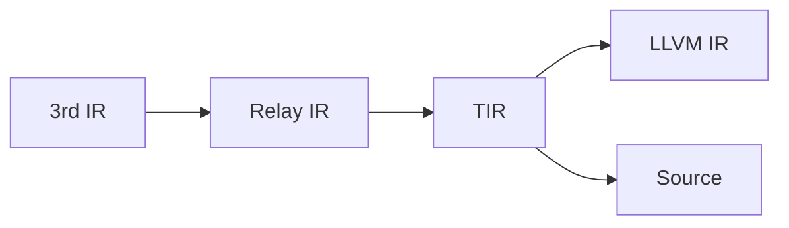

TVM在编译过程中，经历了

这一系列的过程。其中在生成cpu、rocm、nvptx、hexagon等平台的相关代码的时候，会先由TVM的`TIR`转换为`LLVM IR`,在后续由LLVM生成相关的机器码。

这一步是由`tvm::codegen::Build`调用转换的。
```cpp
runtime::Module Build(IRModule mod, Target target) {
if (transform::PassContext::Current()
          ->GetConfig<Bool>("tir.disable_assert", Bool(false))
          .value()) {
    mod = tir::transform::SkipAssert()(mod);
  }
  auto target_attr_map = tvm::TargetKind::GetAttrMap<FTVMTIRToRuntime>("TIRToRuntime");
  if (target_attr_map.count(target->kind)) {
    return target_attr_map[target->kind](mod, target);
  }

  // the build function.
  std::string build_f_name = "target.build." + target->kind->name;
  const PackedFunc* bf = runtime::Registry::Get(build_f_name);
  ICHECK(bf != nullptr) << build_f_name << " is not enabled";
  return (*bf)(mod, target);
}
```
在LLVM相关的target时候，这里的`build_f_name`就是`target.build.llvm`

这时候会走到
```cpp
TVM_REGISTER_GLOBAL("target.build.llvm")
    .set_body_typed([](IRModule mod, Target target) -> runtime::Module {
      auto n = make_object<LLVMModuleNode>();
      n->Init(mod, target);
      return runtime::Module(n);
    });
```
在`Init`函数中创建codegen的具体类：
```cpp

void LLVMModuleNode::Init(const IRModule& mod, const Target& target) {
  llvm_instance_ = std::make_unique<LLVMInstance>();
  With<LLVMTarget> llvm_target(*llvm_instance_, target);
  llvm::TargetMachine* tm = llvm_target->GetOrCreateTargetMachine();
  // 这里会根据target得到不同的codegen的实现类
  std::unique_ptr<CodeGenLLVM> cg = CodeGenLLVM::Create(llvm_target.get());

  std::string entry_func;
  /*
  skip crt/cpp systemlib options
  */
  for (auto kv : mod->functions) {
    if (!kv.second->IsInstance<PrimFuncNode>()) {
      // (@jroesch): we relax constraints here, Relay functions will just be ignored.
      DLOG(INFO) << "Can only lower IR Module with PrimFuncs, but got " << kv.second->GetTypeKey();
      continue;
    }
    auto f = Downcast<PrimFunc>(kv.second);
    auto global_symbol = f->GetAttr<String>(tvm::attr::kGlobalSymbol);
    bool is_entry_func = f->HasNonzeroAttr(tir::attr::kIsEntryFunc);

    if (global_symbol) {
      function_names_.push_back(global_symbol.value());
      if (is_entry_func) {
        entry_func = global_symbol.value();
      }
    }
  }
// 初始化CodeGenLLVM, 会产生builder_, module_等llvm 中codegen需要的基础数据结构
  cg->Init("TVMMod", llvm_target.get(), system_lib_prefix, 
             system_lib_prefix.defined(),
           target_c_runtime);
  cg->SetFastMathFlags(llvm_target->GetFastMathFlags());
    // 核心功能,tir 转化为llvm ir就在此
  cg->AddFunctionsOrdered(mod->functions.begin(), mod->functions.end());
  if (entry_func.length() != 0) {
    cg->AddMainFunction(entry_func);
  }

  module_owning_ptr_ = cg->Finish();
  module_ = module_owning_ptr_.get();
  llvm_target->SetTargetMetadata(module_);
  module_->addModuleFlag(llvm::Module::Override, "Debug Info Version",
                         llvm::DEBUG_METADATA_VERSION);

}

```